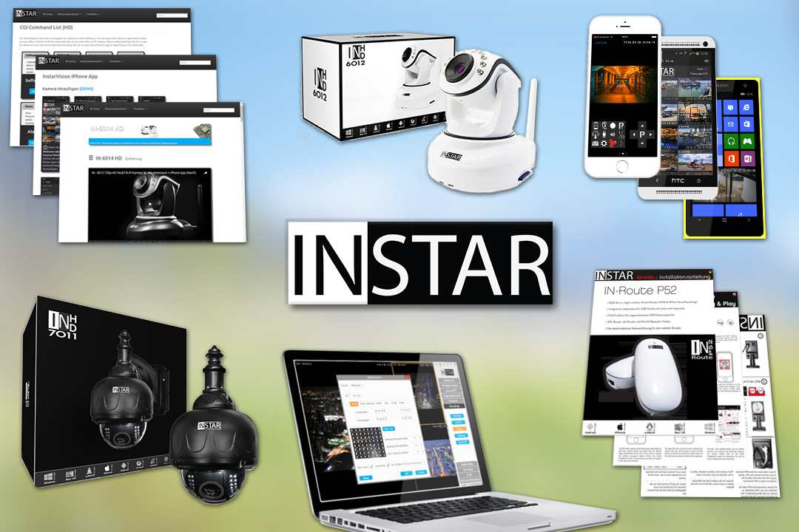
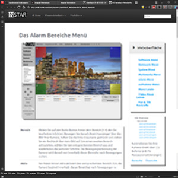

_work in progress_

Every task needs specific tools to be accomplished. But it is having a wide variety of tools at your command that allows you to find creative solutions to a given problem. With a hammer in hand every obstacle might take the form of a nail. But what tool could you use to turn it into a butterfly?

* Photography
* Print Design
* Responsive Web Development
* Customer Relation

## Corporate Identity Design

Developing a corporate design language to presents the company to the public, such as customers as well as employees.

### How it started

A black & white logo, right angles and a monochrome product portfolio in pixel perfect alignment. This was the starting point of the development of the INSTAR design language.

Since it´s inception, the INSTAR brand design has been strikingly simple. A systematic approach to branding in products and services to provide consistency. It started by distilling the essence of the brand down to its core and building it back up.

## Print Documentation

### Help to Overcome Barriers

Combining the best of the brand the customer know and love with thoughtful consideration for how their needs are changing. Every implementation of new technologies requires guide line for the cutomer to follow. The brand interaction does not end with shipping a product on time - only customers who are able to make use of the product will embrace the brand.

### Working with Adobe InDesign

### Working with Adobe Illustrator

## Product Photography

### Good Product Images can make your Listings more Effective

If there’s one thing that’s true when it comes to ecommerce, it's that the perceived value of your products and the trustworthiness of your business is often judged by the quality of your web design. And a big part of having an attractive website these days also means having high-quality, beautiful product photography.

## Web Development

### Presenting your Brand Online

Engineering, research, product development, and marketing - testing ideas and evaluated their feasibility with iterations on the design and rollout strategy. This collaborative process led to a system flexible enough to be used across our marketing materials and product documentation on any platform.

## UX Design

Mobile and Desktop App : User Interface and User Experience Design for iPhone/iPad, Android and Windows Phone Apps.

Transfer of a Knowledge Database for Product Information based on the [Mediawiki Framework](https://www.mediawiki.org/wiki/MediaWiki) to a Javascript MVC API.

