<!-- TOC -->

- [Prerequisite](#prerequisite)
- [XHR Requests](#xhr-requests)
- [XHR Requests Parameters](#xhr-requests-parameters)
- [Javascript Fetch and Promises](#javascript-fetch-and-promises)
  - [Fetch Response Methods](#fetch-response-methods)
  - [Fetch Error Handling](#fetch-error-handling)
  - [Fetch Working with Headers](#fetch-working-with-headers)
  - [Fetch Working with JSON Endpoints](#fetch-working-with-json-endpoints)
  - [Fetch Working with JSON Endpoints Part II](#fetch-working-with-json-endpoints-part-ii)
  - [Fetch Working with JSON Endpoints Part III](#fetch-working-with-json-endpoints-part-iii)
  - [Building a Mini Application to interact with REST APIs](#building-a-mini-application-to-interact-with-rest-apis)

<!-- /TOC -->


## Prerequisite

We are going to write Javascript files in this course that we cannot simply execute inside our web broser. For this I am going to use the Node.js Mini Webserver [httpster](https://www.npmjs.com/package/httpster) - this way I am able to serve my files with a simple command from the directory where I stored my files:


```bash
httpster -p 3000
```


We only need a simple HTML Boilerplate to wrap our Javascript files in with the name __index.html__:


```html
<html>
    <title>Javascript API Course</title>
    <body>
        <div id="output"></div>
        <button>Click</button>
        <script src="ajax-request.js"></script>
    </body>
</html>
```

Now I can open my web browser on `localhost:3000` to see my website:


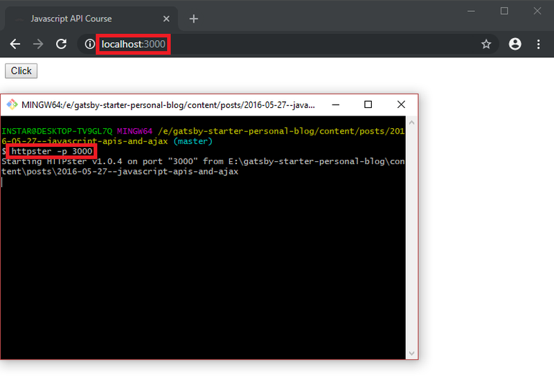


## XHR Requests

XMLHttpRequest (XHR) is an API available to web browser scripting languages such as JavaScript. It is used to send HTTP or HTTPS requests to a web server and load the server response data back into the script.


An Ajax call is an asynchronous request initiated by the browser that does not directly result in a page transition. An Ajax ("Asynchronous Javascript and XML") request is sometimes called an XHR request ("XmlHttpRequest"), which is the name most browsers give the object used to send an Ajax request, because at least initially Ajax calls involved the sending and receiving of XML but now it's just as common to send/receive JSON, plain text or HTML.


Ok then, let's start with creating an __XMLHttpRequest Object__ inside the file `ajax-request.js` that we linked into our HTML page above:


```js
const xhr = new XMLHttpRequest();
console.log(xhr);
```


The [XMLHttpRequest.readyState](https://developer.mozilla.org/en-US/docs/Web/API/XMLHttpRequest/readyState) property returns the state an XMLHttpRequest client is in. Since we created it but not yet called `open()` it is currently `UNSENT` or `0`:


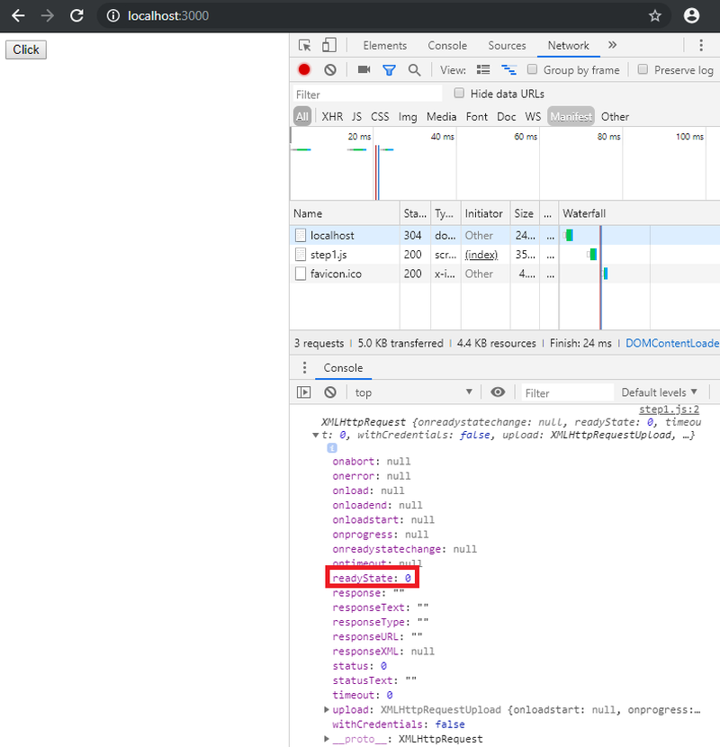


The `open()` call for the request takes 2 arguments. First the kind of request we want to make - we need a __HTTP GET__ request. And secondly we need to say what URL we want to connect to. For the latter we can use the [Chuck Norris API](https://api.chucknorris.io/) that is free to use:


```js
const xhr = new XMLHttpRequest();
const url = 'https://api.chucknorris.io/jokes/random';
xhr.open('GET', url);
console.log(xhr);
```


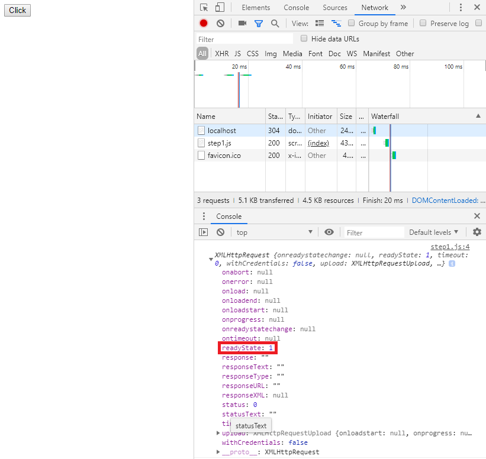


The `open()` method has been invoked and the __readyState__ is now `OPENED` or `1` - meaning that the connection to the API has been established. During this state, the `send()` method can be called which will initiate the fetch. We can record the steps with the __onreadystatechange__ method:


```js
const xhr = new XMLHttpRequest();
const url = 'https://api.chucknorris.io/jokes/random';

xhr.onreadystatechange = function() {
    console.log(
        xhr.readyState
    );
}
xhr.open('GET', url);
xhr.send();

console.log(xhr);
```


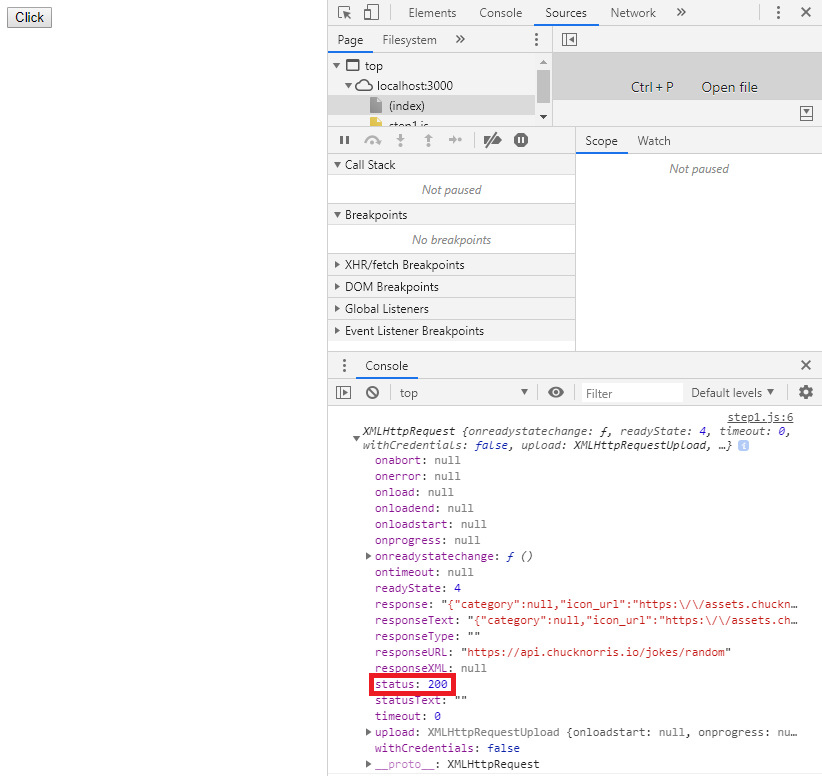


We can see that the Request was received by the API and we are getting a [HTTP Status](https://developer.mozilla.org/en-US/docs/Web/HTTP/Status) of `200` - meaning that the resource of the GET request has been fetched and is transmitted in the message body.


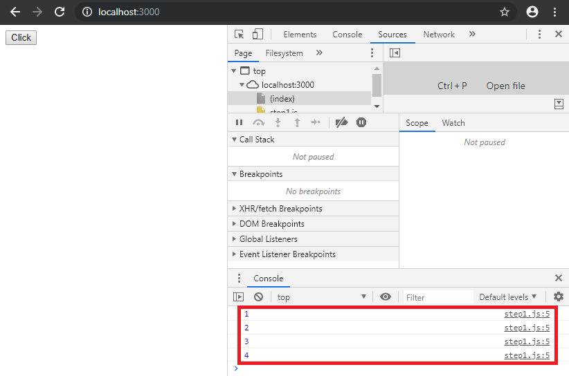


The state changes from 1-4 representing the [XMLHttpRequest readyState](https://developer.mozilla.org/en-US/docs/Web/API/XMLHttpRequest/readyState):

1. OPENED
2. HEADERS_RECEIVED
3. LOADING
4. DONE


The data that we receive from our API is only available after we reached the __readyState 4__ on our API call and the request gave us a __HTTP Status 200__! We can use an __if-statement__ to make sure that we do not request the xhr response before this is assured:


```js
const xhr = new XMLHttpRequest();
const url = 'https://api.chucknorris.io/jokes/random';

xhr.onreadystatechange = function() {
    if(xhr.readyState == 4 && xhr.status == 200) {
        console.log(xhr.response);
    }
}
xhr.open('GET', url);
xhr.send();
```


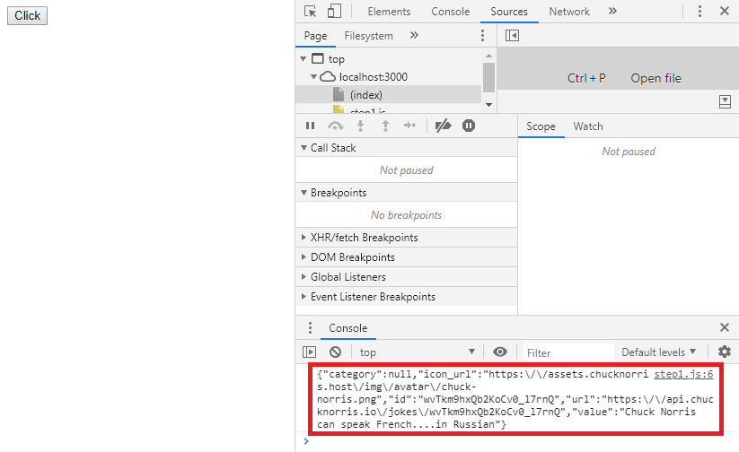


Right now we won't get anything if back if the request fails - we can change this by adding an `else` statement that throws us an error.


We can format the JSON response of our API using the Javascript `JSON.parse()` method. The [JSON.parse() method](https://developer.mozilla.org/en-US/docs/Web/JavaScript/Reference/Global_Objects/JSON/parse) parses a JSON string, constructing the JavaScript value or object described by the string.


```js
const xhr = new XMLHttpRequest()
const url = 'https://api.chucknorris.io/jokes/random'

xhr.onreadystatechange = function() {
    if(xhr.readyState === 4){
        if(xhr.status === 200) {
        const str = xhr.responseText
        const obj = JSON.parse(str)
        console.log(obj)
    } else {
        output.innerHTML = "ERROR"
    }
   }
}

xhr.open('GET', url)
xhr.send()
```


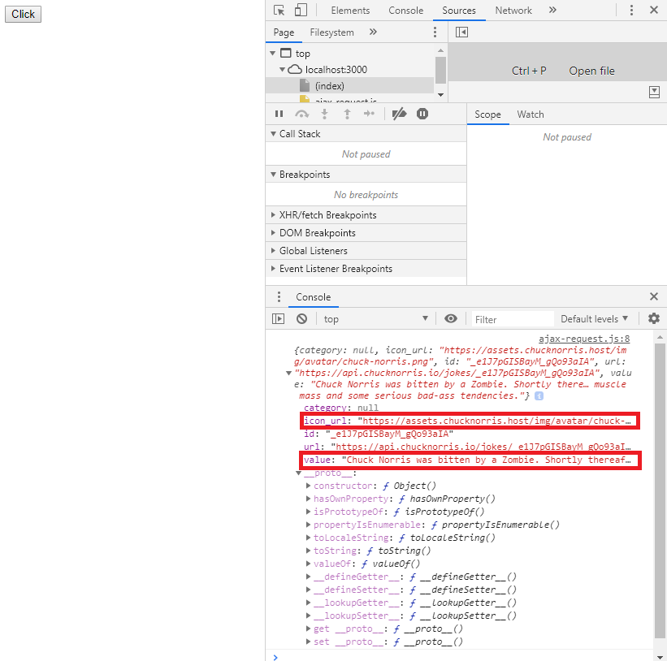


We are now able to work with the Javascript object we created and display the Chuck Norris quote in our website when we request the `value` of the API response and also add the image URL that corresponds with `icon_url`. For this we will use the DIV container we created with the __id: output__:


```js
const output = document.querySelector("#output")
const xhr = new XMLHttpRequest()
const url = 'https://api.chucknorris.io/jokes/random'

xhr.onreadystatechange = function() {
    if(xhr.readyState === 4){
        if(xhr.status === 200) {
        const str = xhr.responseText
        const obj = JSON.parse(str)
        output.innerHTML = obj.value + '<br/><br/><br/><br/>'
    } else {
        output.innerHTML = "ERROR"
    }
   }
}

xhr.open('GET', url)
xhr.send()
```


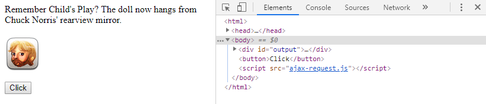


Excellent! Now we can map our button to refresh the request every time we click it:


```js
const btn = document.querySelector("button")
const output = document.querySelector("#output")

btn.addEventListener("click", getJoke)

function getJoke() {
  const xhr = new XMLHttpRequest()
  const url = 'https://api.chucknorris.io/jokes/random'

  xhr.onreadystatechange = function () {
    if (xhr.readyState === 4) {
      if (xhr.status === 200) {
        const str = xhr.responseText
        const obj = JSON.parse(str)
        output.innerHTML = obj.value + '<br/><br/><br/><br/>'
      } else {
        output.innerHTML = "ERROR"
      }
    }
  }
  xhr.open('GET', url)
  xhr.send()
}
```


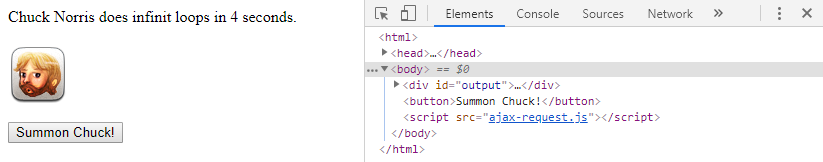


We can now add a few __EventListeners__ to our Ajax request to get some more insights into the mechanics of it:


```js
const btn = document.querySelector("button")
const output = document.querySelector("#output")

btn.addEventListener("click", getJoke)

function getJoke() {
  const xhr = new XMLHttpRequest()
  const url = 'https://api.chucknorris.io/jokes/random'

  xhr.onreadystatechange = function () {
    if (xhr.readyState === 4) {
      if (xhr.status === 200) {
        const obj = JSON.parse(xhr.responseText)
        output.innerHTML = obj.value + '<br/><br/><br/><br/>'
      } else {
        output.innerHTML = "ERROR"
      }
    }
  }
  xhr.open('GET', url)
  xhr.send()

  xhr.addEventListener("progress", callBackfn)
  xhr.addEventListener("load", callBackfn)
  xhr.addEventListener("error", callBackfn)
}

function callBackfn(e) {
    console.log(e)
}
```


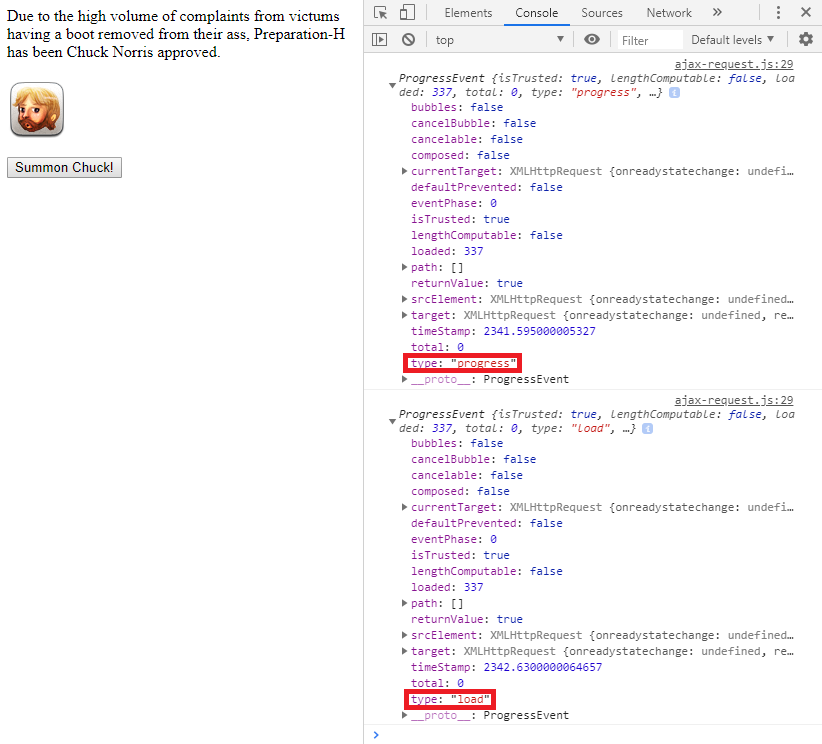


## XHR Requests Parameters

We will start this with a new HTML template that gives us both an input field and a button:


```html
<html>
    <title>Javascript API Course</title>
    <body>
        <input type="number">
        <button>Click</button>
        <div id="output"></div>
        <script src="xhr-parameter.js"></script>
    </body>
</html>
```


The Javascript file that is linked in here adds an __EventListener__ to the button and console logs the numeric value of the input field when the button is clicked:


```js
const btn = document.querySelector("button");
const output = document.querySelector("#output");
const intake = document.querySelector("input");
btn.addEventListener("click", getInput);

function getInput() {
    console.log(intake.value);
}
```


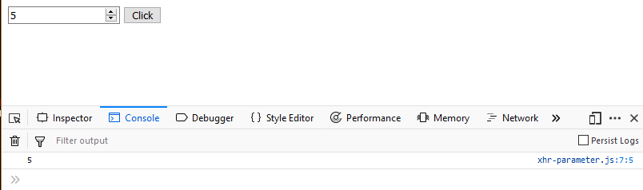


Great! We can now start with our work of connecting this to an API. In this part we going to use the [open Random User API](https://randomuser.me/) that can be reached over the following URL (that allows us to specify the amount of random user profiles we want to see returned to us):


```
https://randomuser.me/api/?results=1
```


The result for such an request is a JSON response from the API looking like this:


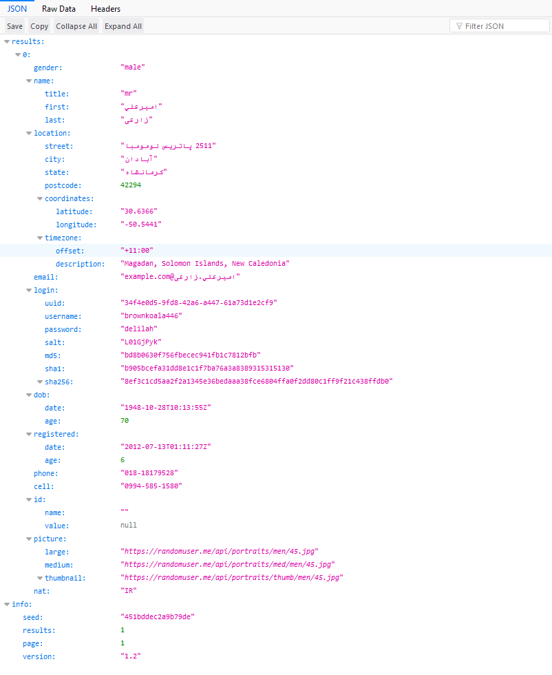


Let's add the xhr request to our JS file:


```js
const btn = document.querySelector("button")
const output = document.querySelector("#output")
const intake = document.querySelector("input")

const url = "https://randomuser.me/api/"

btn.addEventListener("click", getInput)


function getInput() {
  const xhr = new XMLHttpRequest()
  xhr.open("GET", url)
  xhr.onload = function (data) {
    console.log(data)
  }
  xhr.send()
}
```


This code opens a connection to the API and retrieves a response onload:


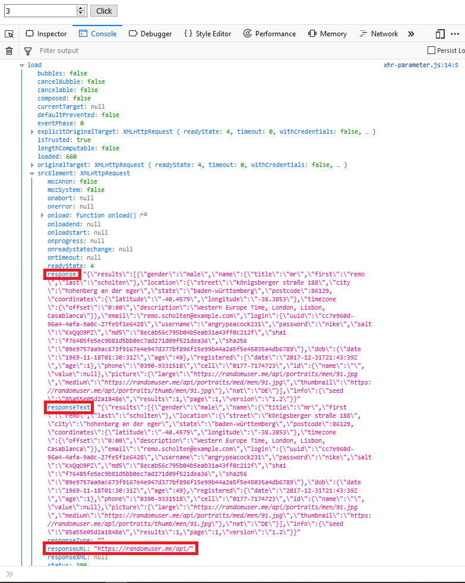


The xhr request is working. We can see that the information that we need can be found under __responseText__ - let's modify our request accordingly and add the same error checks we used before before:


```js
function getInput() {
  const xhr = new XMLHttpRequest()
  xhr.open("GET", url)
  xhr.onload = function () {
    if(xhr.readyState === 4 && xhr.status == "200") {
      let data = JSON.parse(xhr.responseText)
      console.log(data)
    } else {
      console.log("error")
    }
  }
  xhr.send()
}
```


The console log now contains the JSON parsed data that we will need further on:


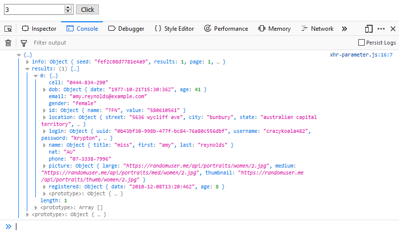


But we can further refine that we only need the __result object__ of the response by modifying the line:


```js
let data = JSON.parse(xhr.responseText).results
```


As we have seen before, we are able to specify the amount of users that we want to be returned from the API by adding a parameter to the URL. If we want to be able to set the number of users from the input field, this will look like this:


```js
function getInput() {
  const xhr = new XMLHttpRequest()
  let tempVal = intake.value
  let tempURL = url + "?results=" +tempVal
  xhr.onload = function () {
    if(xhr.readyState === 4 && xhr.status == "200") {
      let data = JSON.parse(xhr.responseText).results
      console.log(data)
    } else {
      console.log("error")
    }
  }
  xhr.open("GET", tempURL)
  xhr.send()
}
```

We creating a temporary value from the intake of the input field and add it to the base URL of the API - when we have the number 3 inside the input field and hit the Click button, we will now receive 3 user from the API response:


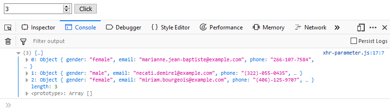


To print out this information, we can add another function `outputHTML(data)`, loop over the array that we receive from the response and call that function from the `xhr.onload` function above:


```js
function getInput() {
  const xhr = new XMLHttpRequest()
  let tempVal = intake.value
  let tempURL = url + "?results=" +tempVal
  xhr.onload = function () {
    if(xhr.readyState === 4 && xhr.status == "200") {
      let data = JSON.parse(xhr.responseText).results
      outputHTML(data)
    } else {
      console.log("error")
    }
  }
  xhr.open("GET", tempURL)
  xhr.send()
}

function outputHTML(data) {
  console.log(data)
  for(let i=0; i<data.length; i++) {
    output.innerHTML += "<br>" + data[i].email + "<br>"
  }
}
```


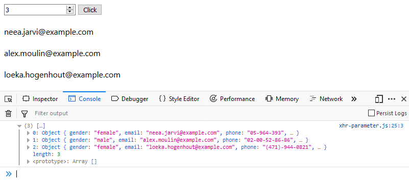


## Javascript Fetch and Promises

The [Fetch API](https://developer.mozilla.org/en-US/docs/Web/API/Fetch_API/Using_Fetch) supersedes the previously used XMLHttpRequest in __ES6__. It provides a JavaScript interface for accessing and manipulating parts of the HTTP pipeline, such as requests and responses. It also provides a global `fetch()` method that provides an easy, logical way to fetch resources asynchronously across the network.


The Promise returned from `fetch()` won’t reject on HTTP error status even if the response is an HTTP 404 or 500. Instead, it will resolve normally (with ok status set to false), and it will only reject on network failure or if anything prevented the request from completing.


By default, fetch won't send or receive any cookies from the server, resulting in unauthenticated requests if the site relies on maintaining a user session. A basic fetch request is really simple to set up. Have a look at the following code:


```js
fetch('http://example.com/data.json')
  .then(function(response) {
    return response.json();
  })
  .then(function(myJson) {
    console.log(JSON.stringify(myJson));
  });
```

The `fetch()` requests a response and then works with promises for the following steps. We can now start to re-write our previous example using the Fetch API:


```js
const btn = document.querySelector("button")
const output = document.querySelector("#output")
const intake = document.querySelector("input")

const url = "https://randomuser.me/api/"

btn.addEventListener("click", getInput)


function getInput() {
  fetch(url)
    .then(function (response) {
      console.log(response);
    })
}
```

We can now add another promise and simply return the response from the first to be further worked on by the second:


```js
function getInput() {
  fetch(url)
    .then(function (response) {
      return response.json();
    })
    .then(function(data) {
        console.log(data.results);
    })
}
```


The first promise receive the response from the API and transforms it into a Javascript object. The second promise receives the result as `data` and logs the result object to our console.


We can now add the API parameter again to be able to specify the number of results we want to get:


```js
function getInput() {
    let userNumber = intake.value;
    let url = baseUrl + "?results=" + userNumber;
  fetch(url)
    .then(function (response) {
      return response.json();
    })
    .then(function(data) {
        console.log(data.results);
    })
}
```


Now we need to add the loop back in to display our results:


```js
function getInput() {
  let userNumber = intake.value;
  let url = baseUrl + "?results=" + userNumber;
  fetch(url)
    .then(function (response) {
      return response.json();
    })
    .then(function (data) {
      outputHTML(data);
    })
}

function outputHTML(data) {
  console.log(data.results)
  for (let i = 0; i < data.results.length; i++) {
    output.innerHTML += "<br>" + data.results[i].name.last + ", " + data.results[i].name.first + "<br>"
  }
}
```


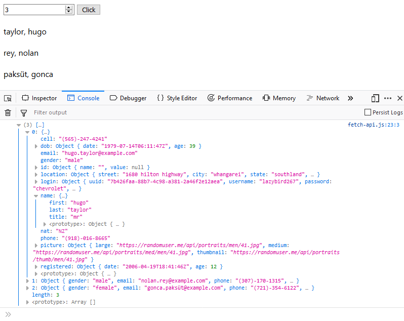


### Fetch Response Methods

__Using the Fetch API for Text Responses__

If all we need is a text output, we can use the Fetch API in the following way:


```js
const btn = document.querySelector("button")
const output = document.querySelector("#output")
const intake = document.querySelector("input")

const baseUrl = "https://randomuser.me/api/"

btn.addEventListener("click", getInput)


function getInput() {
  fetch(baseUrl).then(function (response) {
    return response.text();
  }).then(function (data) {
    console.log(data);
  })
}
```


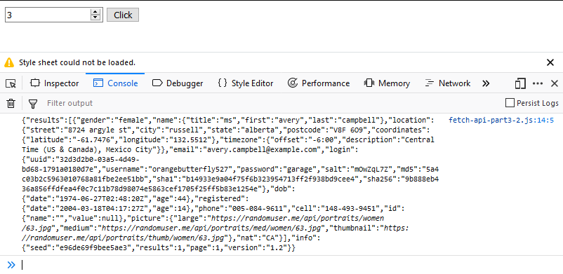


__Using the Fetch API for Images__

We can use the Javascript Fetch API to add images to our webpage. For this you need to add an image tag with an empty source to your html `` and rewrite the code from the previous step as follows:


```js
const btn = document.querySelector("button")
const output = document.querySelector("#output")
const intake = document.querySelector("input")

btn.addEventListener("click", getInput)


function getInput() {
  let url = "photo-34475542491_9069464269_o-cover.jpg";
  fetch(url).then(function (response) {
    return response.blob();
  }).then(function (data) {
    console.log(data);
    let pathImage = URL.createObjectURL(data);
    document.querySelector("img").src = pathImage;
  })
}
```


This code is fetching an image from the same directory our JS file is in with the name _photo-34475542491\_9069464269\_o-cover.jpg_. Here we have to change the response type from __json__ to __blob__ and use the `createObjectURL(` method to create a file URL, that is then added to the source of our empty image tag.


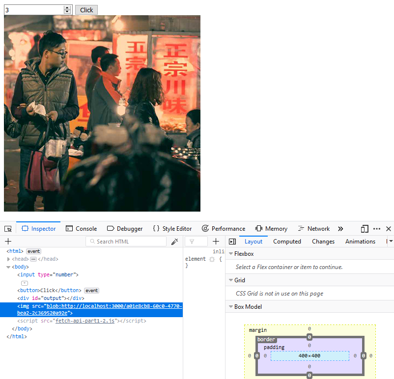


Note that the image URL is created and does not represent the location on our filesystem - in my case it is:


```
blob:http://localhost:3000/a01e8cb8-60c0-4770-bea2-2c369520a92e
```


### Fetch Error Handling

The Fetch API offers the `catch()` method to help us with error handling - that is much neater than the __if-else__ syntax we had before. To test it, we can create the following script:

```js
const btn = document.querySelector("button")
const output = document.querySelector("#output")
const intake = document.querySelector("input")

const baseUrl = "https://randomuser.me/apis/"

btn.addEventListener("click", getInput)


function getInput() {
  fetch(baseUrl).then(function (response) {
    return response.json();
  }).then(function (data) {
    console.log(data);
  })
  .catch(function(error) {
    console.log(error);
  })
}
```

Note that we introduced an error to the `baseURL` - it should be __api__ not __apis__:


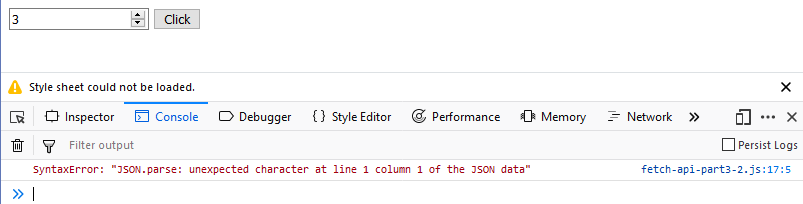


The error is caught and the error message printed to console.


### Fetch Working with Headers

If our API requiers us to set specific header information for the request, we can create them in form of a __Request Object__ that is then used by the `fetch()` method. We will start with the previous code and add the following:


```js
const btn = document.querySelector("button")
const output = document.querySelector("#output")
const intake = document.querySelector("input")

const baseUrl = "https://randomuser.me/api/"

btn.addEventListener("click", getInput)


function getInput() {
  let params = new Request(baseUrl, {
    method: "GET",
    mode: "cors",
    headers: new Headers(),
    cache: "default"
  })
  fetch(params).then(function (response) {
    return response.json();
  }).then(function (data) {
    console.log(data);
  })
  .catch(function(error) {
    console.log(error);
  })
}
```


### Fetch Working with JSON Endpoints

The website [myjson.com](http://myjson.com/) allows you to store JSON data and access it through an URL. Just type a valid JSON object into the input field and press __Save__ to be given an URL you can retrieve this information from:


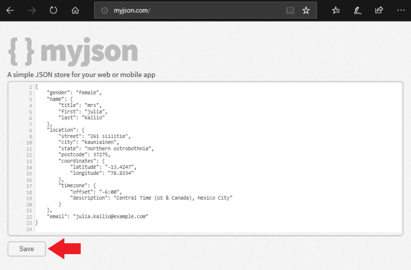


After clicking on save, the following URL was generated for me: `https://api.myjson.com/bins/m1l12`. Accessing this URL returns the JSON data as an text output. We can now use this URL for our fetch request:


```js
const btn = document.querySelector("button")
const output = document.querySelector("#output")
const intake = document.querySelector("input")

const url = "https://api.myjson.com/bins/m1l12"

btn.addEventListener("click", getInput)


function getInput() {
  fetch(url).then(function (response) {
    return response.json();
  }).then(function (data) {
    console.log(data);
  }).catch(function (error) {
    console.log(error);
  })
}
```

Running the script inside our browser will return the information in form of a Javascript object:


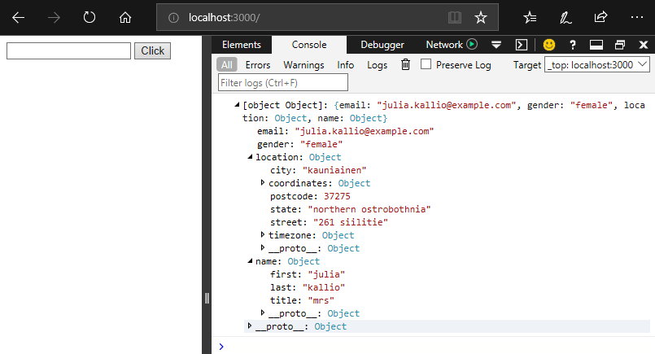


We can also add a new addition to Javascript to clean up our function - the __Arrow Function__:


```js
function getInput() {
  fetch(url).then(res => res.json())
  .then(json => console.log(json))
  .catch(error => console.log(error))
}
```


We can write a JSON object that contains an array that allows us to loop through the API response:


```json
{
    "results": [{
        "gender": "male",
        "name": {
            "title": "mr",
            "first": "hellmut",
            "last": "merz"
        }
    }, {
        "gender": "female",
        "name": {
            "title": "ms",
            "first": "یسنا",
            "last": "رضاییان"
        }
    }, {
        "gender": "female",
        "name": {
            "title": "mrs",
            "first": "elsa",
            "last": "simon"
        }
    }]
}
```


Adding the following for loop to the fetch request will give us the list of three names:


```js
function getInput() {
  fetch(url).then(res => res.json())
    .then(function (data) {
      for (let i = 0; i < data.results.length; i++) {
        console.log(data.results[i].name.last + ", " + data.results[i].name.first)
      }
    })
    .catch(error => console.log(error))
}
```


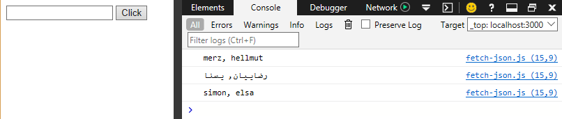


### Fetch Working with JSON Endpoints Part II

Another place to test your Javascript against a fake REST API is [JSONPlaceholder](http://jsonplaceholder.typicode.com/). For example the URL `http://jsonplaceholder.typicode.com/photos` will give you a result of 5000 photos in an JSON array:


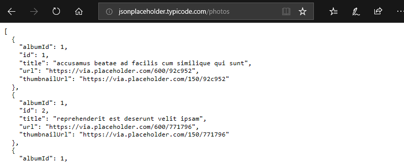


The following script will log the URL to the first thumbnail image to your browser console and will set the source for the empty image tag `` inside your html to this URL:


```js
const btn = document.querySelector("button")
const output = document.querySelector("#output")
const intake = document.querySelector("input")

const url = "http://jsonplaceholder.typicode.com/photos"

btn.addEventListener("click", getInput)


function getInput() {
  fetch(url).then(res => res.json())
    .then(function (data) {
      console.log(data[0].thumbnailUrl)
      document.querySelector("img").src=data[0].thumbnailUrl;
    })
    .catch(error => console.log(error))
}
```


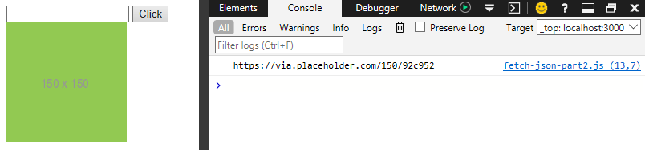


### Fetch Working with JSON Endpoints Part III

Yet another API to use is [Swapi](https://swapi.co/), the Star Wars API. We can connect to it using the following script:


```js
const btn = document.querySelector("button")
const output = document.querySelector("#output")
const intake = document.querySelector("input")

const url = "https://swapi.co/api/"

btn.addEventListener("click", getInput)


function getInput() {
  fetch(url).then(res => res.json())
    .then(function (data) {
      console.log(data)
    })
    .catch(error => console.log(error))
}
```


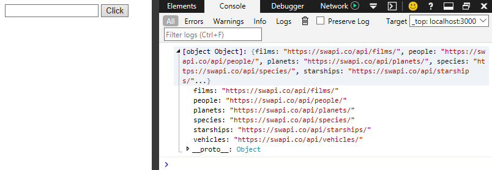


Testing the script shows us that there are sub categories that we can query - for example, we can just fetch information about planets in the Star Wars Universe by changing the Fetch URL to `https://swapi.co/api/planets`. 


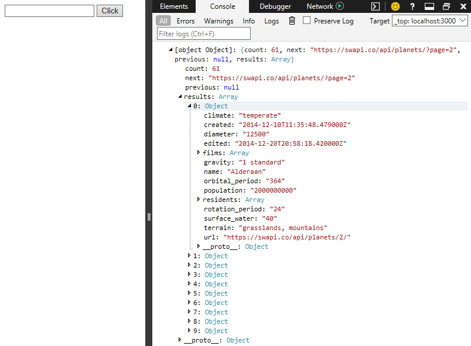


We can see that the database found us 61 planets but only returned 10 of them + an URL to get the next 10 `https://swapi.co/api/planets/?page=2` - making it easy to paginate through large amount of data.


To get the name of a specific planet - lets say the ninths from the array - we just need to change the console.log() to `console.log(data.results[8].name)`:


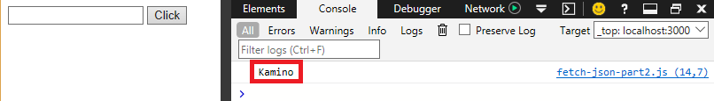


### Building a Mini Application to interact with REST APIs

And another API - this time one called [REST Countries](https://restcountries.eu/) that gives us access to a large quantity of information about countries - capital cities, language spoken, currency, etc. The complete set of data can be queried with the following URL `https://restcountries.eu/rest/v2/all`:


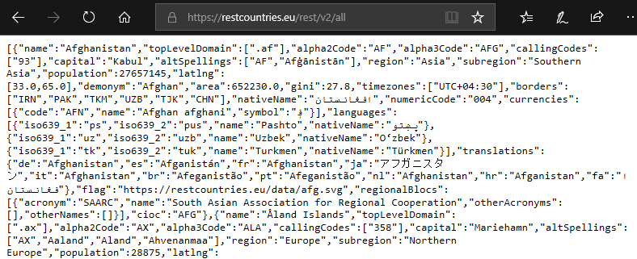


We can start by checking the API response with the following script:


```js
const btn = document.querySelector("button")
const output = document.querySelector("#output")
const intake = document.querySelector("input")

const url = "https://restcountries.eu/rest/v2/all"

btn.addEventListener("click", getInput)


function getInput() {
  fetch(url).then(res => res.json())
    .then(function (data) {
      console.log(data)
    })
    .catch(error => console.log(error))
}
```


This returns to us the result we have seen earlier in form of a Javascript object that contains the first 250 countries:


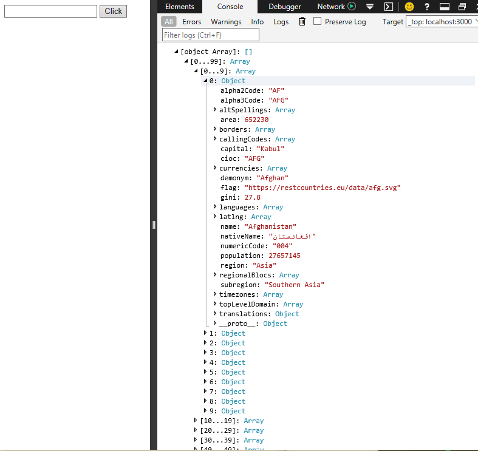


We can now make a change to our script to no longer `console.log()` the result but instead writing the result into an object we call __responseObject__. We will create it first as an empty object and then add the `data` from the API response to it:


```js
const btn = document.querySelector("button")
const output = document.querySelector("#output")
const intake = document.querySelector("input")

const url = "https://restcountries.eu/rest/v2/all"
let responseObject = {}

fetch(url).then(res => res.json())
  .then(function (data) {
    responseObject = data;
  })
  .catch(error => console.log(error));
```


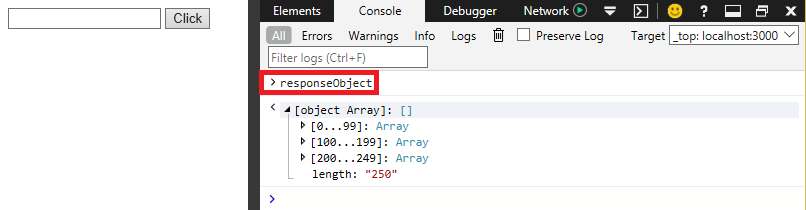


You will be able to query the __responseObject__ after you refreshed the page - it does contain the API data.


We can now use a helper function to split up every country into it's own object and prepare it to be inserted into a __select element__ on our page:


```js
fetch(url).then(res => res.json())
  .then(function (data) {
    responseObject = data;
    buildSelect(data);
  })
  .catch(error => console.log(error));


 function buildSelect(data) {
   let select = document.createElement('select');
   data.forEach(function(item) {
     let option = document.createElement('option');
     console.log(item);
   })
 }
```


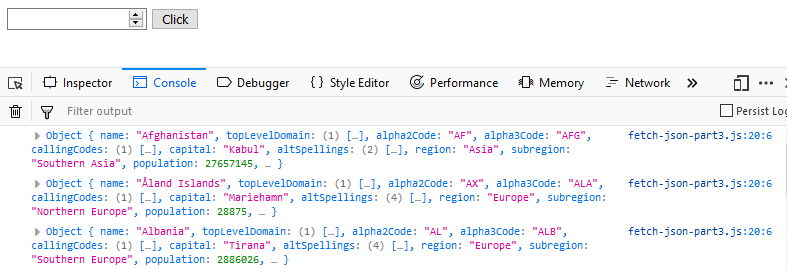


We can additionally output the index number of each country to be able to reference them:


```js
 function buildSelect(data) {
   let select = document.createElement('select');
   data.forEach(function(item, index) {
     let option = document.createElement('option');
     console.log(item, index);
   })
 }
```


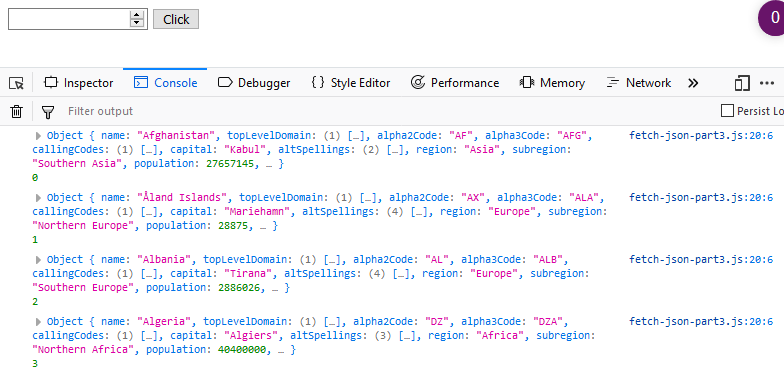


Now we need to assign each country to an option from the select drop-down menu using the index number and use the country name as textContent:


```js
 function buildSelect(data) {
   let select = document.createElement('select');
   data.forEach(function(item, index) {
     let option = document.createElement('option');
     console.log(item, index);
     option.value = index;
     option.textContent = item.name;
     select.appendChild(option);
   })
   document.querySelector('body').appendChild(select);
 }
```


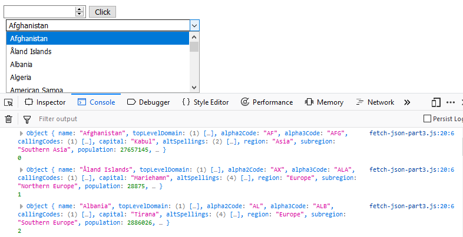


We can now get rid of the input field and click button and instead add an event listener that detects when the user selects an option and displays the corresponding country information below the drop down menu. We will start with adding the eventListener that reacts to _Change_ and `console.log()` the event with another helper function:


```js
function buildSelect(data) {
   let select = document.createElement('select');
   data.forEach(function(item, index) {
     let option = document.createElement('option');
     console.log(item, index);
     option.value = index;
     option.textContent = item.name;
     select.appendChild(option);
   })
   select.addEventListener("change", outputData)
   document.querySelector('body').appendChild(select);
 }


 function outputData(e) {
   console.log(e);
 }
```


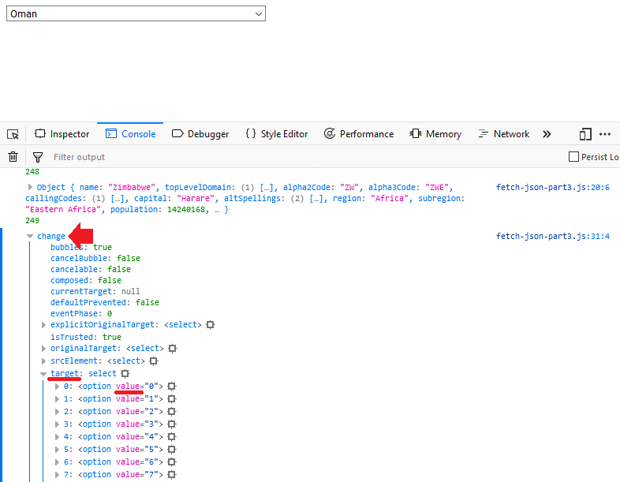


From this event log we now need to record the target value - which corresponds to the index number of the selected country. This number can then be used to select the country out of the __responseObject__:


```js
function buildSelect(data) {
   let select = document.createElement('select');
   data.forEach(function(item, index) {
     let option = document.createElement('option');
     console.log(item, index);
     option.value = index;
     option.textContent = item.name;
     select.appendChild(option);
   })
   select.addEventListener("change", outputData)
   document.querySelector('body').appendChild(select);
 }


 function outputData(e) {
   console.log(e.target.value);
   console.log(responseObject[e.target.value]);
 }
```


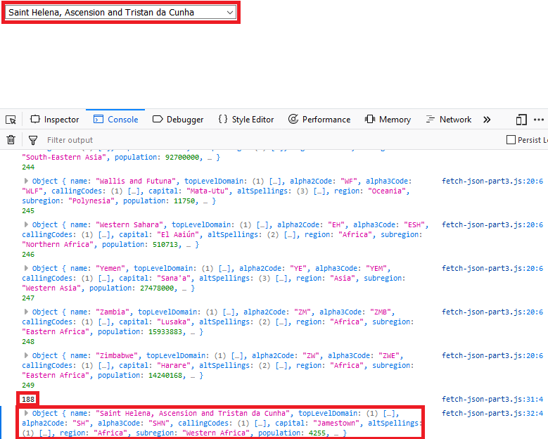


In this example I selected the __188__ out of the drop-down menu. Comparing this number to the index number of our __responseObject__ gives us all country information of `Saint Helena, Ascension and Tristan da Cunha`.


We can now clean this function up a little and add an HTML output to it, to be able to display the information on our web site:


```html
<html>
    <title>Javascript API Course</title>
    <body>
        <div id="output"></div>
        
        <script src="fetch-json"></script>
    </body>
</html>
```


```js
const output = document.querySelector("#output");
const url = "https://restcountries.eu/rest/v2/all";
let responseObject = {};
fetch(url).then(res => res.json())
  .then(function (data) {
    responseObject = data;
    buildSelect(data);
  })
  .catch(error => console.log(error));


function buildSelect(data) {
    let select = document.createElement('select');
    data.forEach(function (item, index) {
        let option = document.createElement('option');        
        option.value = index;
        option.textContent = item.name;
        select.appendChild(option);
    })
    select.addEventListener("change",outputData);
    document.querySelector('body').appendChild(select);
}


function outputData(e){
    let country = responseObject[e.target.value];
    console.log(country);
    output.innerHTML = '<h1>'+country.name+'</h1>';
    output.innerHTML += '<p><strong>Native Name</strong>: '+country.nativeName+'</p>';
    output.innerHTML += '<p><strong>Population</strong>: '+country.population+'</p>';
    document.querySelector('img').src = country.flag;
    output.innerHTML += '<p><strong>Capital</strong>: '+country.capital+'</p>';
    output.innerHTML += '<p><strong>Region</strong>: '+country.region+'</p>';
    output.innerHTML += '<p><strong>Sub-Region</strong>: '+country.subregion+'</p>';
}
```


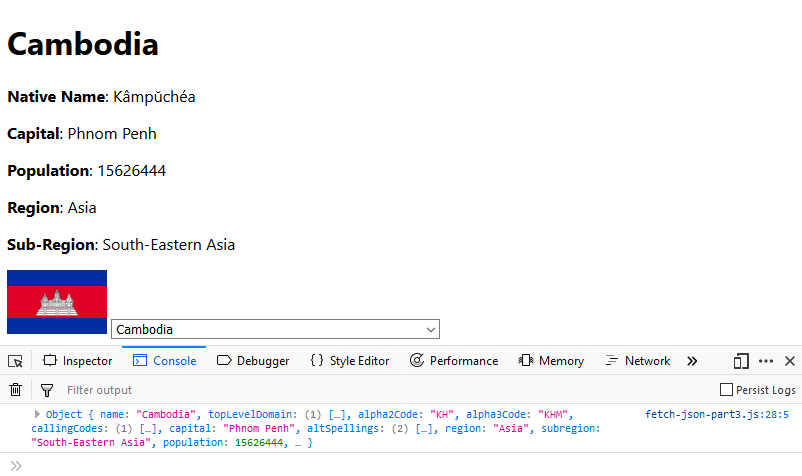