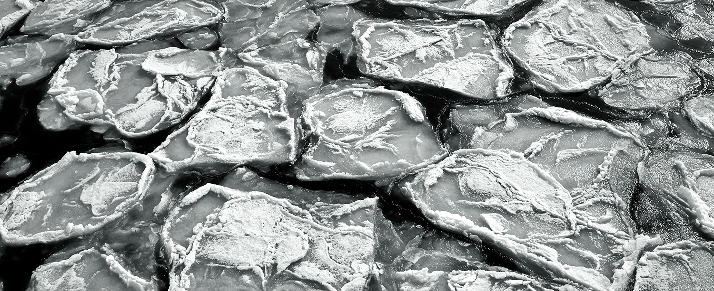
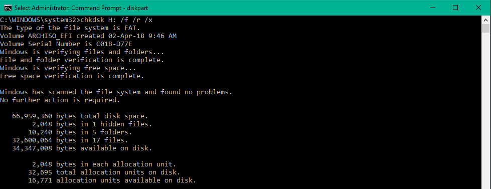
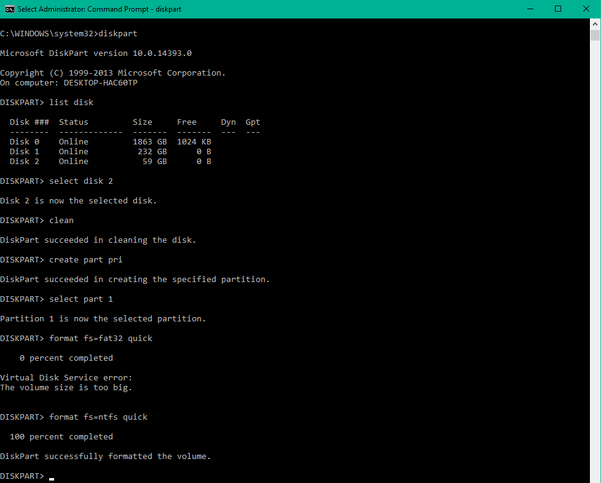

> You can create a bootable USB flash drive to use to deploy your OS of choice . The first step is to prepare the USB flash drive by using DiskPart, which is a command-line utility.

<!-- TOC -->

- [CHKDSK your drive](#chkdsk-your-drive)
- [Create a Bootable USB Flash Drive](#create-a-bootable-usb-flash-drive)
  - [DiskPart Commands](#diskpart-commands)

<!-- /TOC -->

## CHKDSK your drive

1. Press the Windows key to open the Start Menu
2. Type-in cmd
3. Right-click on Command Prompt from the search results list
4. Click Run as administrator
5. When Command Prompt launches, type the command: `chkdsk H: /f /r /x`

> The parameters for this command are:
> 
> * `/f` option will attempt to fix any found errors
> * `/r` option will locate for bad sectors and recovery any readable information
> * `/x` option will force the volume you’re about to check to be dismounted before the utility begins a scan
>
> If the C: drive is in use, type Y to run a scan at your PC’s next restart. If so, exit Command Prompt and restart the computer.

## Create a Bootable USB Flash Drive

DiskPart is a text-mode command interpreter in Windows Vista, Windows® XP, and the Windows Server 2003® family. This tool enables you to manage objects (disks, partitions, or volumes) by using scripts or direct input at a command prompt.

### DiskPart Commands

Before you can use [DiskPart commands](https://docs.microsoft.com/en-us/previous-versions/windows/it-pro/windows-vista/cc766465(v=ws.10)) on a disk, partition, or volume, you must first list and then select the object to give it focus. When an object has focus, any [DiskPart commands](https://docs.microsoft.com/en-us/previous-versions/windows/it-pro/windows-vista/cc766465(v=ws.10)) that you type act on that object.

You can list the available objects and determine an object's number or drive letter by using the `list disk`, `list volume`, and `list partition` commands. The `list disk` and `list volume` commands display all disks and volumes on the computer. However, the `list partition` command displays only partitions on the disk that have focus. When you use the `list` commands, an asterisk (*) appears next to the object with focus. You select an object by its number or drive letter, such as disk 0, partition 1, volume 3, or volume C.

1. Insert a USB flash drive into a running computer.
2. Open a Command Prompt window as an administrator.
3. Type `diskpart`.
4. In the new command line window that opens, to determine the USB flash drive number or drive letter, at the command prompt, type `list disk`, and then `click ENTER`. The list disk command displays all the disks on the computer. Note the drive number or drive letter of the USB flash drive.
5. At the command prompt, type `select disk <X>`, where X is the drive number or drive letter of the USB flash drive, and then click `ENTER`.
6. Type `clean`, and the click `ENTER`. This command deletes all data from the USB flash drive.
7. To create a new primary partition on the USB flash drive, type `create part pri`, and then click `ENTER`.
8. To select the partition that you just created, type `select part 1`, and then click `ENTER`.
9. To format the partition, type format `fs=ntfs` quick, and then click `ENTER`.

> Important
>
> If your server platform supports Unified Extensible Firmware Interface (UEFI), you should format the USB flash drive as FAT32 rather than as NTFS. To format the partition as FAT32, type format `fs=fat32` quick, and then click ENTER.

10. Type `active`, and then click `ENTER`.
11. Type `exit`, and then click `ENTER`.
12. When you finish preparing your custom image, save it to the root of the USB flash drive.

