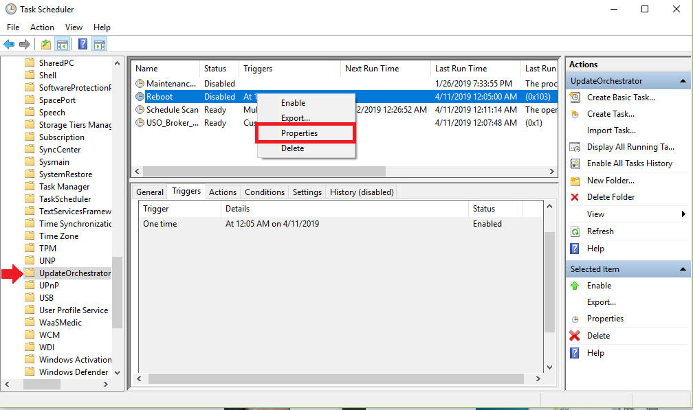
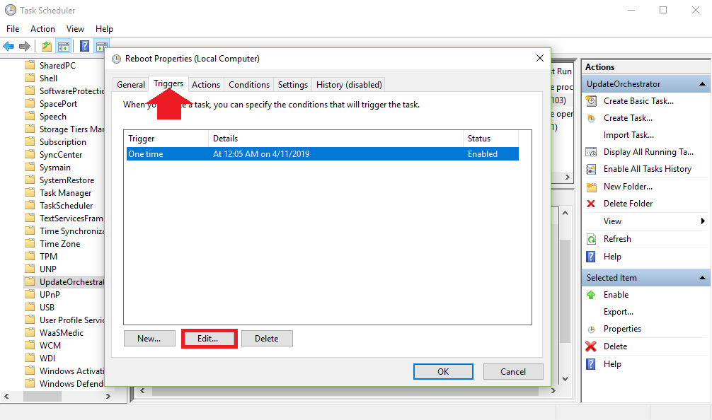
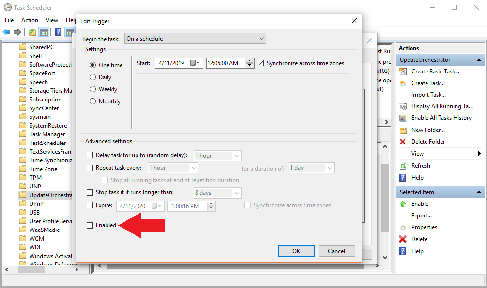
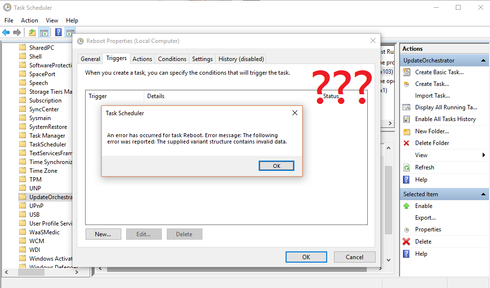
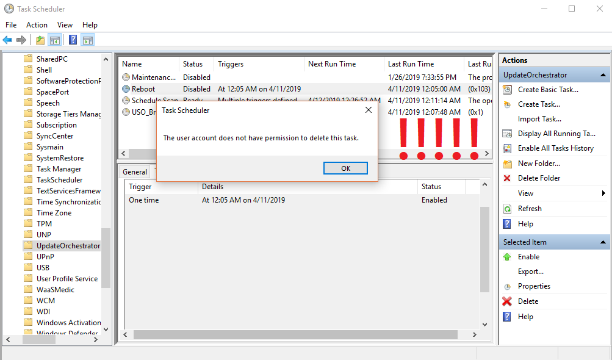
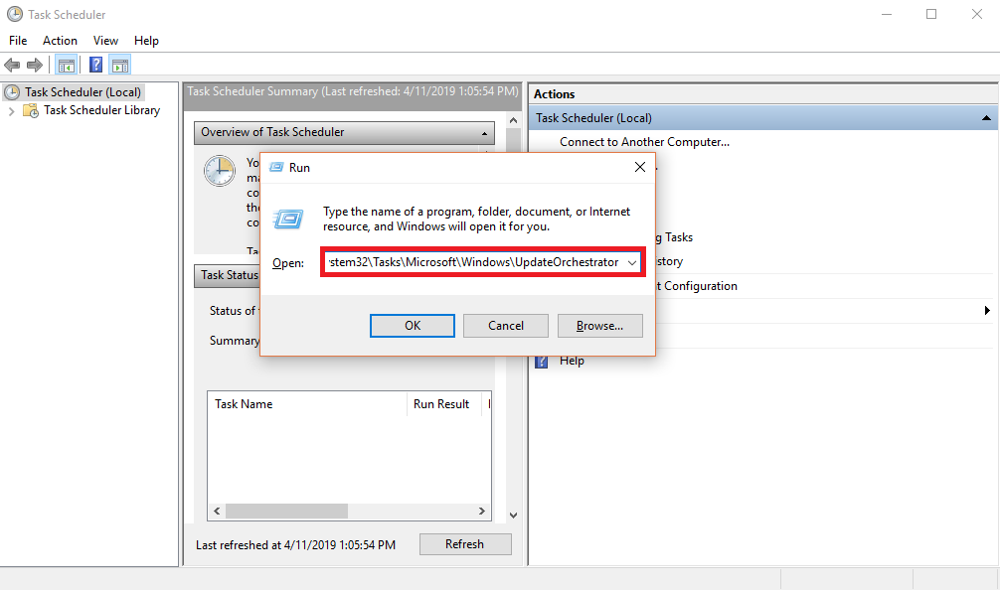
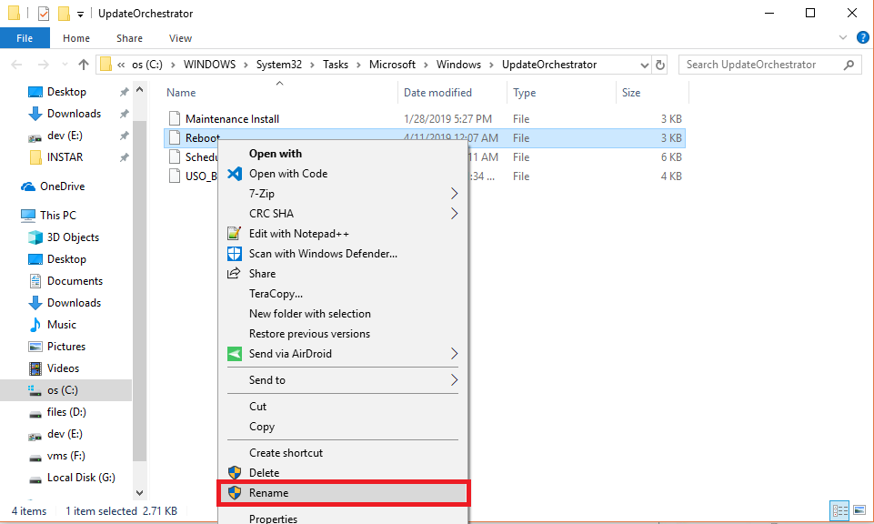
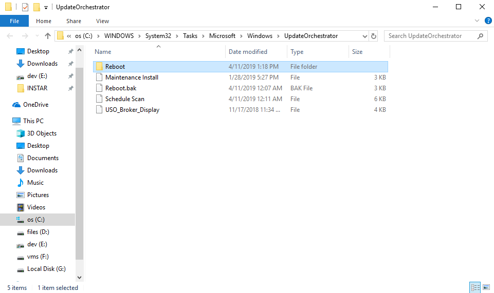

> This is my Angry-Blog - every time I run into an undesired Windows feature, I want to use this space to unload my emotional ballast. My wording might therefore be slightly more colorful than usual. Readers discretion is advised.

<!-- TOC -->

- [Prevent Auto-Reboot](#prevent-auto-reboot)

<!-- /TOC -->

## Prevent Auto-Reboot

Windows Updates are important and sometimes require you to reboot. Some Operating systems are able to gracefully shutdown and reboot restoring all programs that were running - __WINDOWS CANNOT__. But still, Windows keeps rebooting... And everytime I keep my PC running over night there is a perfectly good reason for me to do that!

How to stop your PC from automatically restarting after installing updates. First I tried the task scheduler:

1. Open __Start__.
2. Search for `Task Scheduler` and click the result to open the tool.
3. Right-click the __Reboot task__ and select Properties (note that it was already set to disabled).

4. Go to the __Triggers__ tab, uncheck __enabled__ and confirm (this should prevent the task from being executed).

5. But it seems that my administrator account does not have the rights to do that (?????????????????)

6. Also deleting (right-click on __Reboot__ and choose __delete__) the complete task fails.

7. Use __Run__ (Windows key + R keyboard shortcut to open the Run command) and type in `%windir%\System32\Tasks\Microsoft\Windows\UpdateOrchestrator` and confirm.

8. Rename the Reboot file to `Reboot.bak` and create a folder called `Reboot`.

