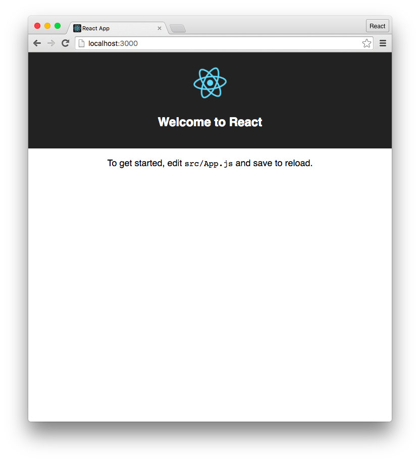
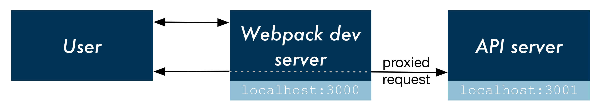
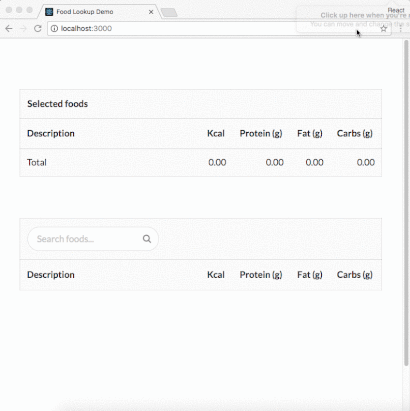

> This app is based on the [food-lookup-demo](https://www.fullstackreact.com/articles/using-create-react-app-with-a-server/) from fullstackreact.com.
> 
> Our sample app will be a simple food nutrition lookup table. The data driving the app is supplied by the USDA's [National Nutrient Database](https://www.ars.usda.gov/northeast-area/beltsville-md/beltsville-human-nutrition-research-center/nutrient-data-laboratory/docs/usda-national-nutrient-database-for-standard-reference/).


[Github](https://github.com/mpolinowski/caloric-burn)


<!-- TOC -->

- [Server Setup](#server-setup)
  - [Server Dependencies Installation](#server-dependencies-installation)
  - [Test the Server](#test-the-server)
- [Frontend Client Setup](#frontend-client-setup)
  - [create-react-app](#create-react-app)
    - [react-scripts](#react-scripts)
  - [Concurrently](#concurrently)
  - [React Interface](#react-interface)
  - [Setting up the proxy](#setting-up-the-proxy)
- [Test your App](#test-your-app)
- [Deployment](#deployment)

<!-- /TOC -->


First, git clone this repository and cd into that directory.

This is where the server lives (server.js). Inside of the db folder is a sqlite database containing the nutrition data.


# Server Setup

We now use [Node.js](https://nodejs.org/en/) and the Node Package Manager to install all dependencies for our app. Make sure that you install the latest version of node first. Then use your Terminal, or [Git Bash](https://git-scm.com) under Windows, to run the following npm commands.

## Server Dependencies Installation

Use

```bash
npm install
```

to install all dependencies & dev-dependecies in a development environment (the default). Later you can use

```bash
npm install --production
```

or set the NODE_ENV environment variable to production to avoid installing dev-dependencies.

## Test the Server

Let's boot the server:

```bash
npm run server
```

This server provides a single API endpoint, /api/food. It expects a single parameter, q, the food we are searching for. You can test it with your browser or use the CURL command inside your console:

```bash
curl localhost:3001/api/food?q=mcflurry
```

Now that we understand how this endpoint works, let's build the front-end application. Kill the server with CTRL+C.


# Frontend Client Setup

Ensure that you have create-react-app installed globally:

```bash
npm install -g create-react-app
```

## create-react-app

At the top-level directory of the project we'll create our client app. We want the React app to be in a folder called client, so we'll just use that name in the create-react-app command  (if you are working inside a clone of this repository, please make sure to remove the already existing /client folder first! Don't delete it completely - you will need some of the files later on):

```bash
create-react-app client
```

This creates a new directory with the following file structure:

```bash
ls client
README.md
node_modules/
package.json
public/
src/
```

Taking a look at client/package.json, we can see that we just installed react, react-dom, and react-scripts to the /client directory:

```json
{
  "name": "client",
  "version": "0.1.0",
  "private": true,
  "dependencies": {
    "react": "^15.6.1",
    "react-dom": "^15.6.1",
    "react-scripts": "1.0.12"
  },
  "scripts": {
    "start": "react-scripts start",
    "build": "react-scripts build",
    "test": "react-scripts test --env=jsdom",
    "eject": "react-scripts eject"
  }
}
```

Inside that directory, we can now run several commands:

> - npm start
>   - Starts the development server.
>
> - npm run build
>   - Bundles the app into static files for production.
>
> - npm test
>   - Starts the test runner.
>
> - npm run eject
>   - Removes this tool and copies build dependencies, configuration files and scripts into the app directory. If you do this, you can’t go back!


### react-scripts

react-scripts is an NPM package specifically for use with create-react-app. It's the "black box" which contains the essentials:

> - Dependencies
>   - Like Babel, ESLint, and Webpack.
> - Configuration
>   - Config files for Webpack, Babel and ESLint, both for development and production.
> - Scripts
>   - For instance, the command react-scripts start runs a script shipped with this package. It's responsible for ultimately booting the > Webpack development server.

To see it in action, we can run npm start from inside of this folder:

```bash
cd client && npm start
```

This will launch a Webpack dev server and should also open localhost:3000 in your browser:



We have our API server in the top-level directory and we were able to boot that. And we have our client app down here in client and we're able to boot a server for this.

So the user will direct their browser to localhost:3000, hitting the Webpack dev server. But then how will the React app communicate with our API server?

create-react-app provides a mechanism for working with an API server in development. We can have the Webpack development server proxy requests intended for our API server, like this:



In this flow, React makes an API request to localhost:3000, the Webpack development server. And then the development server simply proxies that request to the API server, negating any CORS issues.

we need to:
1. launch both the Webpack dev server and the API server in order to run the app locally.
1. we need to get the Webpack dev server to proxy requests intended for our API server.


## Concurrently

[Concurrently](https://github.com/kimmobrunfeldt/concurrently) is a utility for running multiple processes. Taking a look at our package.json file inside the top-level directory will show you that we already installed Concurrently as a dev-dependency earlier.

We want concurrently to execute two commands, one to boot the API server and one to boot the Webpack development server. You boot multiple commands by passing them to concurrently in quotes like this:

```bash
concurrently "npm run server" "cd client && npm start"
```

However, the && operator is not cross-platform (doesn't work on Windows). As such, we've included a start-client.js script with the project. This script will boot the client from the top-level directory in a manner that is cross-platform.

Ultimately, we'll want to boot concurrently like this:

```bash
concurrently "npm run server" "npm run client"
```

This will be our start command. Let's add the start and client commands to our package.json now:

```json
"scripts": {
    "start": "concurrently \"npm run server\" \"npm run client\"",
    "server": "node server.js",
    "client": "node start-client.js"
  },
```

For start, we execute both commands, escaping the quotes because we're in a JSON file. For client, we execute the start-client.js script with node. Now we can boot both servers by running **npm start**.


## React Interface

Now we will add the food lookup React components which will make requests against our API server. The components are located in the **/client/src** folder. You can copy them over the auto-generated content by create-react-app, overwriting the original *App.js*, *index.js* and *index.css* files.

We use [Semantic UI](https://semantic-ui.com/introduction/getting-started.html) for styling the app - the files can be found in **/client/src/semantic** as well as **/client/semantic.json** inside this repository - just copy them into your client directory. It's loaded inside of **/client/src/index.js**. **/client/src/index.css** contains a few margins.

Changing the value of the search bar (the FoodSearch component) ultimately calls search() on Client. **Client.js** contains a Fetch call to our API endpoint:

```javascript
function search(query, cb) {
  return fetch(`api/food?q=${query}`, {
    accept: "application/json"
  })
    .then(checkStatus)
    .then(parseJSON)
    .then(cb);
}
```

This is the one touch point between our React web app and the API server. Notice how the URL *does not include* the base **localhost:3001**. That's because, as noted earlier, we want this request to be made to the Webpack development server. Thanks to the configuration established by create-react-app, the Webpack dev server will infer what traffic to proxy. It will proxy a request if the URL is not recognized or if the request is not loading static assets (like HTML/CSS/JS).

We just need to instruct Webpack to use the proxy.


## Setting up the proxy

To have the Webpack development server proxy our API requests to our API server, we just need to add the following line to client/package.json:

```json
// Inside client/package.json
"proxy": "http://localhost:3001/",
```


# Test your App

Our React app is ready and in place in client/. We have concurrently setup to boot both our Webpack dev server and our API server together. And we've specified the route that Webpack should proxy API traffic to.

Let's boot both servers:

```bash
npm start
```




# Deployment

create-react-app comes with a build command that you can use to create a static bundle of the React app:

```bash
cd client
npm run build
```

This produces a build/ folder which you can serve with any static asset host. It contains all your app's HTML, JavaScript, and CSS files. This command is intended for production use. It does all kinds of optimization, to create a fast loading static page.