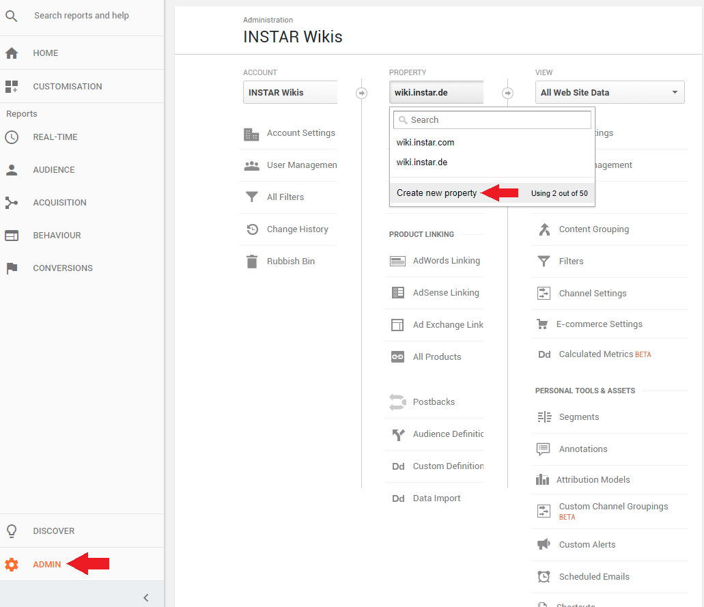
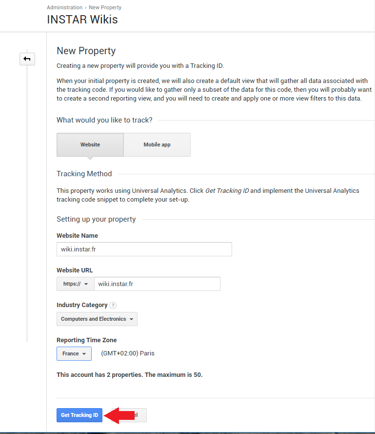
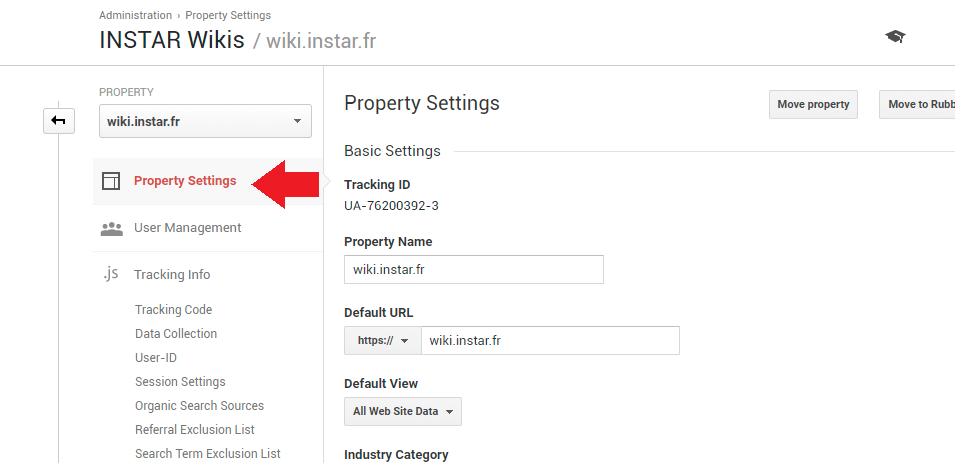
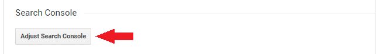
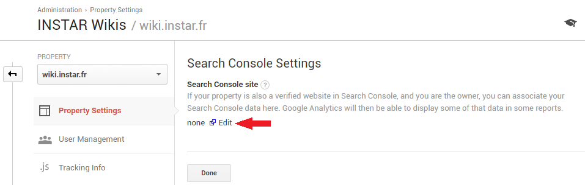
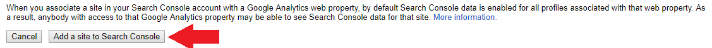
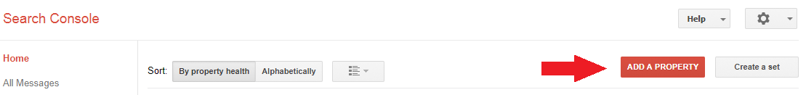
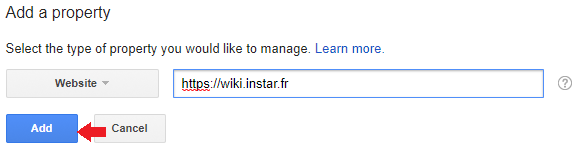
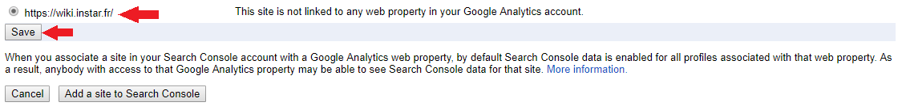
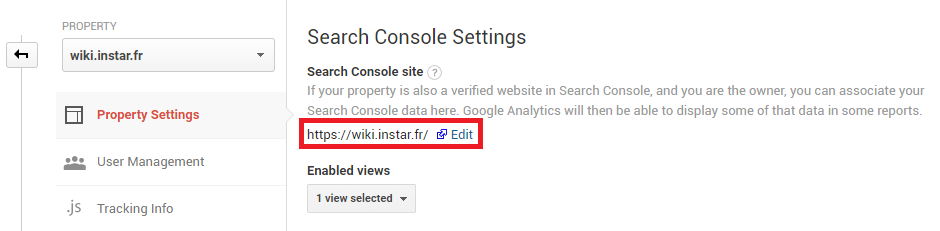

01. [Set up Google Analytics](#01-set-up-google-analytics)
02. [Tracking ID](#02-tracking_id)
03. [amp-analytics](#03-amp-analytics)
04. [Search Console](04-search-console)
05. [Search Console link to Google Analytics](05-search-console-link-to-google-analytics)

## 01 Set up Google Analytics

Create a Gmail account and log in to [Google Analytics](https://analytics.google.com). Open the admin panel and add a new property:


---

---


## 02 Tracking ID

Fill out the form and click to generate a Tracking ID - which will look something like this "UA-88888888-1":


---

---


## 03 amp-analytics

Now we need to add the [AMP Analytics](https://www.ampproject.org/docs/reference/components/amp-analytics) script to our website inside the \<head\> tag:


```html
<script async custom-element="amp-analytics" src="https://cdn.ampproject.org/v0/amp-analytics-0.1.js"></script>
```

The tracking ID can now be implemented inside the \<header\> tag of your AMP page, by adding the \<amp-analytics\> component:

```html
<amp-analytics type="googleanalytics">
  <script type="application/json">
  {
    "vars": {
      "account": "UA-88888888-1"
    },
    "triggers": {
      "trackPageview": {
        "on": "visible",
        "request": "pageview"
      }
    }
  }
  </script>
</amp-analytics>
```


## 04 Search Console

Now we want to link our new property to the [Search Console](https://www.google.com/webmasters/tools/search-analytics) to get access to reports (e.g. you get information about AMP Errors and general tips to improve your HTML structure /SEO) and a list of keywords that lead Google Search users to your website.

Go back Property Settings:


---

---


And scroll down to "Adjust Search Console":


---

---


Click on "Edit":


---

---


And add your new property to your Search Console (this page will **stay open in the background** and you will have to refresh it after you added your new property - **see final step**):


---





---


You will then be asked to download an HTML file and upload it to the public /root directory of your website - to verify your ownership. Click on Verify and you are DONE!


## 05 Search Console link to Google Analytics

Now return to the previous page (still open in the background), refresh and select your new property - then click save:


---



---


As seen above, your Property is now linked in Google Analytics and you will start to see search results in your reports.

It might take a while for crawling information and potential Error Reports to arrive - give it a month... You will be notified by email if something was found in the need of fixing.