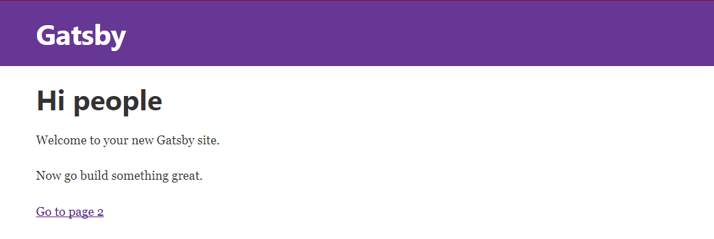

<!-- TOC -->

- [01 gatsby-source-filesystem](#01-gatsby-source-filesystem)
- [02 gatsby-transformer-remark](#02-gatsby-transformer-remark)
- [03 Creating a first Blog Post](#03-creating-a-first-blog-post)
- [04 Creating an Index Page](#04-creating-an-index-page)
- [05 Filters & Sorting With GraphQL](#05-filters--sorting-with-graphql)
- [06 Static Serve](#06-static-serve)

<!-- /TOC -->


For an overview of the project structure please refer to the [Gatsby documentation - Building with Components](https://www.gatsbyjs.org/docs/building-with-components/)

Install this starter (assuming Gatsby is installed) by running from your CLI:

```bash
gatsby new gatsby-blog
```

This is the second mini-project that I am going to use Gatsby in - check out the [first one](https://github.com/mpolinowski/gatsby-wiki) for a more detailed description of all the basics steps of setting up Gatsby.

- [01 gatsby-source-filesystem](#01-gatsby-source-filesystem)
- [02 gatsby-transformer-remark](#02-gatsby-transformer-remark)
- [03 Creating a first Blog Post](#03-creating-a-first-blog-post)
- [04 Creating an Index Page](#04-creating-an-index-page)
- [05 Filters & Sorting With GraphQL](#05-filters--sorting-with-graphql)
- [06 Static Serve](#06-static-serve)


## 01 gatsby-source-filesystem

First we install a plugin that allows us to pull in data. There are a couple of [Source Plugins](https://www.gatsbyjs.org/docs/plugins/) available to get your data from MongoDB or a CMS source like Wordpress. But we only want to grab Markdown files from our local file system -> hence we are going to install [gatsby-source-filesystem](https://www.gatsbyjs.org/packages/gatsby-source-filesystem/), using npm:


```bash
npm install --save gatsby-source-filesystem
```


The plugin then has to be added to our Gatsby build by adding it to /gatsby-config.js. It is added as an object, carrying some configuration - in this case the path to the directory that will store our Markdown files:


```js
plugins: [
  `gatsby-plugin-react-helmet`,
  {
  resolve: `gatsby-source-filesystem`,
  options: {
    name: `pages`,
    path: `${__dirname}/src/pages/`,
    },
  },
],
```


## 02 gatsby-transformer-remark

Since we want to use Markdown as a data source, we need a transformer plugin, that turns the Markdown into something that GraphQL can query against. This is the [gatsby-transformer-remark](https://www.gatsbyjs.org/packages/gatsby-transformer-remark/) plugin, that can also be installed by npm:


```bash
npm install --save gatsby-transformer-remark
```


This plugin comes without any additional configuration, and can simply be added to gatsby-config.js:


```js
plugins: [
  `gatsby-transformer-remark`,
]
```


Now we can start the Gatsby development environment with:


```bash
gatsby develop
```


The app will start on http://localhost:8000





## 03 Creating a first Blog Post

Now we want to prepare our first blog post. We can add a folder to the pages directory with the date of today ~ as this might make sense to a blog (naming convention is up to you) -> */src/pages/2017-10-05-first-post*. Now add a new file to this folder, named *index.md*. The Markdown file needs some information at the top of the file - called [FrontMatter](https://jekyllrb.com/docs/frontmatter/):

```json
---
path: "/first-post"
title: "First Blog Post"
date:   "2017-10-05"
---
```

This [FrontMatter](https://jekyllrb.com/docs/frontmatter/) will be used to Query against with GraphQL and can carry a couple of different information - see also [my previous repo](https://github.com/mpolinowski/gatsby-wiki#11-working-with-markdown). But we only use it to add an title to our blogpost and assign an URL under which we want to be able to access the file. Now just add some Markdown to the file and save it:


```
## Hello from Markdown!
---

### This is a first blog Post

How exciting Web Development can be, amazing!
```


The markdown represents the data that is going to be displayed. But now we need to create a style template that is used with this data. Lets start by adding a new folder inside /src called *templates*. Now add a file to it called **post.js** that will contain the structure template for every post entry. The file contains the JSX markup for our post:


```js
import React from 'react';
import Helmet from 'react-helmet';

export default function Template({data}) {
  const {markdownRemark: post} = data;
  // const post = data.markdownRemark;
  return (
    <div>
      <h1>{post.frontmatter.title}</h1>
      <div dangerouslySetInnerHTML={{__html: post.html}} />
    </div>
  )
}
```


The \<Template /\> component receives {data} props, that are retrieved by an GraphQL query:


```js
export const postQuery = graphql`
  query BlogPostByPath($path: String!) {
    markdownRemark(frontmatter: { path: { eq: $path} }) {
      html
      frontmatter {
        path
        title
      }
    }
  }
`
```


The query looks for a markdown post, where the called URL equals the $path given inside it's frontmatter. So if the URL that you type into your browser was */first-post*, a markdown file with a *path: '/first-post'* inside it's frontmatter, would be a hit.

The query then uses the markdownRemark plugin to transform the post markdown to HTML and make both the path and title from it's frontmatter available iside {data}, that is passed down into the \<Template /\> component and then rendered.

Gatsby is already configured to route all pages inside /src/pages as pages for our website. But now we have to register our posts, that are from the markdown files and the post.js template. To do this, we have to create a file named **gatsby-node.js** inside the root directory of our app. We are going to use the [createPages](https://www.gatsbyjs.org/docs/node-apis/#createPages) Gatsby API to create pages from our post template:


```js
const path = require('path');

exports.createPages = ({boundActionCreators, graphql}) => {
  const {createPage} = boundActionCreators;
  // const createPage = boundActionCreators.createPage;

  const postTemplate = path.resolve('src/templates/post.js');

  return graphql(`{
    allMarkdownRemark {
      edges {
        node {
          html
          id
          frontmatter {
            path
            title
          }
        }
      }
    }
  }`)
  .then(res => {
    if(res.errors) {
      return Promise.reject(res.errors);
    }

    res.data.allMarkdownRemark.edges.forEach(({node}) => {
      createPage({
        path: node.frontmatter.path,
        component: postTemplate
      })
    })

  })
}
```

Save and restart your app - then open **http://localhost:8000/first-post** inside your web browser:


## 04 Creating an Index Page

Now that we have a blog post (you can duplicate the first one a couple of times - changing the title, path and date), we will need an index page with a collection of links for all our posts. We will use the same GraphQL query used above to create this list.

We can add optional sorting, limiting parameters for the GraphQL query - see also [1](https://github.com/graphql/graphiql/issues/587), [2](https://gist.github.com/DSchau/86ee9288b05d236dada81148f66db8db):


```js
allMarkdownRemark(sort: { fields: [frontmatter___title], order: ASC})

allMarkdownRemark(sort: { fields: [frontmatter___date], order: DESC })

allMarkdownRemark(limit: 1000)
```

Gatsby comes with the GraphiQL debugger that allows us to test queries before we add them to our page - the debugger is running under: **http://localhost:8000/___graphql**


```js
{
  allMarkdownRemark(limit: 10, sort: {fields: [frontmatter___date], order: DESC}) {
    edges {
      node {
        frontmatter {
          path
          title
          date
        }
      }
    }
  }
}
```

This query shows the latest 10 Markdown posts in descending order - let's add it to our index page */src/pages/index.js*. First we add the GraphQL query, below the \<IndexPage /\> component:


```js
export const pageQuery = graphql`
  query IndexQuery {
      allMarkdownRemark(limit: 10
      sort: {fields: [frontmatter___date], order: DESC}
    ) {
      edges {
        node {
          id
          frontmatter {
            path
            title
            date
          }
        }
      }
    }
  }
`
```


Then we inject the data from that query into the \<IndexPage /\> component and loop through it to generate our index:


```js
const IndexPage = ({data}) => (
  <div>
    <h1>Hi people</h1>
    <p>Welcome to your new Gatsby site.</p>
    <p>Now go build something great.</p>
    <br/><br/>

    <Link to="/page-2/">Go to page 2</Link>
    <br/><br/><br/><br/>

    <h2>Index</h2>
    <table>
      <thead>
        <tr>
          <th>Date</th>
          <th>Link</th>
        </tr>
      </thead>
      <tbody>
      {data.allMarkdownRemark.edges.map(post => (
        <tr key={post.node.id}>
          <td>
            {post.node.frontmatter.date}
          </td>
          <td>
            <Link
              to={post.node.frontmatter.path}>
              {post.node.frontmatter.title}
            </Link>
          </td>
        </tr>
      ))}
      </tbody>
    </table>
  </div>
)
```


## 05 Filters & Sorting With GraphQL

We already sorted our results by date and name in the examples above. Now let's add another value to our frontmatter, to decide whether a post is a draft or should already be shown as published. Set the first post to *published: true* and the second one to *published: false* :

```
---
path: '/second-post'
title: 'Second Blog Post'
date:   "2017-10-07"
published: false
---
```

Now we just need to configure our GraphQL query to only show post where *published* is set to true:

```js
export const pageQuery = graphql`
  query IndexQuery {
    allMarkdownRemark(
      limit: 10
      sort: {fields: [frontmatter___date], order: DESC}
      filter: { frontmatter: { published: {eq: true} }}
    ) {
      edges {
        node {
          id
          frontmatter {
            path
            title
            date
            published
          }
        }
      }
    }
  }
`
```


## 06 Static Serve

To serve our website we can use the command:

```bash
gatsby build
```

This will build a static version of our React app inside /public. Just upload it to a webserver or to GitHub Pages and you are good to go.

**After** building the static page, you can also use the command:

```bash
gatsby serve
```

That - unlike our development environment - fires up the webpack server in production mode - that means the files that are served, are the optimized files from the */public* directory! You can access this version on *http://localhost:9000*