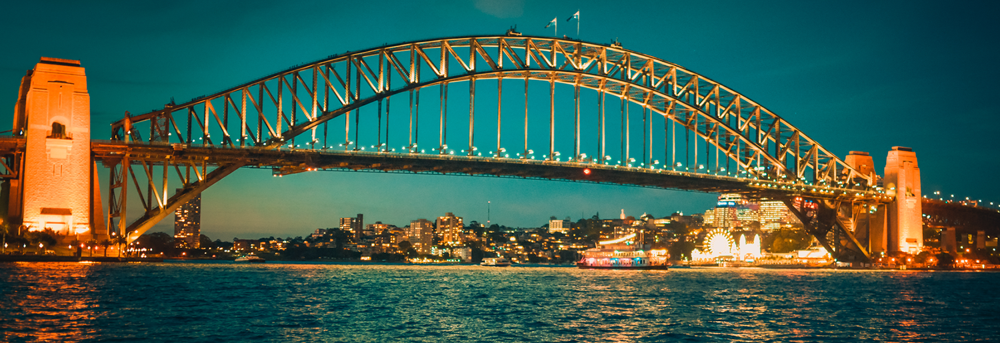
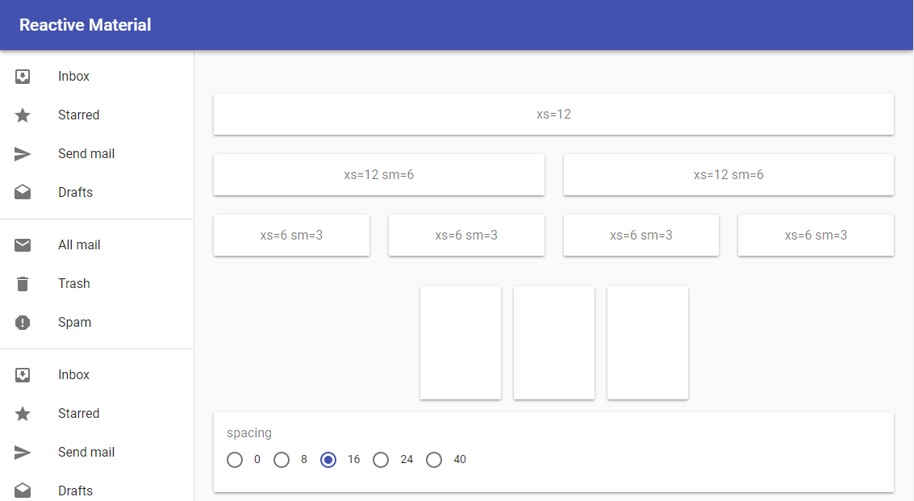

<!-- TOC -->

    - [Table of Content](#table-of-content)
- [01 Installing Material-UI](#01-installing-material-ui)
- [02 Using Material-UI Components](#02-using-material-ui-components)
- [03 Final Design](#03-final-design)

<!-- /TOC -->


This is a practice run to add some [Material Design](https://material.io) to a react app, generated by the [create-react-app](https://github.com/facebookincubator/create-react-app) starter kit. So let's get started!


```
npm install -g create-react-app

create-react-app reactive-material
cd reactive-material
npm start
```


Then open http://localhost:3000/ to see your app. You don’t need to install or configure tools like Webpack or Babel.
They are preconfigured and hidden so that you can focus on the code. Just create a project, and you’re good to go.


### Table of Content

- [01 Installing Material-UI](#01-installing-material-ui)
- [02 Using Material-UI Components](#02-using-material-ui-components)
- [03 Final Design](#03-final-design)


## 01 Installing Material-UI

Now that we made sure that our React App is up-and-running, let's *CTRL+C* the process and follow the [Installation Instructions](https://material-ui-1dab0.firebaseapp.com/getting-started/installation/) for Material-UI (v.1.0.0 beta):


To install and save in your package.json dependencies, run:


```
npm install material-ui@next --save
```


Next, [Typography](https://material-ui-1dab0.firebaseapp.com/style/typography/#general): The Roboto font, that Material-UI is optimized for, can be installed by:


```
npm install typeface-roboto --save
```


Remember, the Roboto font will not be automatically loaded by Material-UI - but need to be imported to the entrypoint of your app: *import 'typeface-roboto'* !


Next, [Material Design Icons](http://google.github.io/material-design-icons/#icon-font-for-the-web). Install the icons using npm package manager:


```
npm install material-design-icons --save
```


And last but not least - In order to use prebuilt SVG Material icons, such as those found in the [component demos](https://material-ui-1dab0.firebaseapp.com/component-demos) you have to install the material-ui-icons package:


```
npm install material-ui-icons --save
```

Now that you downloaded the more interesting part of the internet, let's start with React!


## 02 Using Material-UI Components

The basic usage is simple: e.g. adding a [ButtonAppBar](https://material-ui-1dab0.firebaseapp.com/demos/app-bar/#app-bar-with-buttons) - create a JavaScript file */src/ButtonAppBar.js* that is named after the component that you want to use. Copy the code from the Material-UI page and fine tune the CSS and JSX, where needed:


```js
import React from 'react';
import PropTypes from 'prop-types';
import { withStyles } from 'material-ui/styles';
import AppBar from 'material-ui/AppBar';
import Toolbar from 'material-ui/Toolbar';
import Typography from 'material-ui/Typography';
import Button from 'material-ui/Button';
import IconButton from 'material-ui/IconButton';
import MenuIcon from 'material-ui-icons/Menu';

const styles = theme => ({
  root: {
    width: '100%',
    position: 'fixed',
    top: 0,
    left: 0,
    zIndex: 10,
  },
  flex: {
    flex: 1,
  },
  menuButton: {
    marginLeft: -12,
    marginRight: 20,
  },
});

function ButtonAppBar(props) {
  const classes = props.classes;
  return (
    <div className={classes.root}>
      <AppBar position="static">
        <Toolbar>
          <IconButton className={classes.menuButton} color="contrast" aria-label="Menu">
            <MenuIcon />
          </IconButton>
          <Typography type="title" color="inherit" className={classes.flex}>
            Reactive Material
          </Typography>
          <Button color="contrast">Material Button</Button>
        </Toolbar>
      </AppBar>
    </div>
  );
}

ButtonAppBar.propTypes = {
  classes: PropTypes.object.isRequired,
};

export default withStyles(styles)(ButtonAppBar);
```


Now go to */src/App.js*, import your component and use it inside the JSX code:


```js
import React, { Component } from 'react';
import styles from './app.css';
import 'typeface-roboto';

import ButtonAppBar from './ButtonAppBar'

class App extends Component {
  render() {
    return (
      <div>
        <header className={styles.header}>
          <ButtonAppBar />
        </header>
      </div>
    );
  }
}

export default App;
```


Restart your app with *npm start* and reload *localhost:3000* - voila' :


As you can see from the examples, we added a few custom styles to our app. /src/index.js imports the complete /src/index.css file scoped globally. While our /src/app.js only imports app specific styles *import styles from './app.css';*, that are available with the className attribute *\<header className={styles.header}\>*. You can use locally scoped [CSS Modules](https://github.com/css-modules/css-modules) for each component that you add to your app!


## 03 Final Design

This is not yet a production ready design - but it will be a good starting point for future projects. I ended up removing the ButtonAppBar and replaced it with [Responsive Drawer](https://material-ui-1dab0.firebaseapp.com/demos/drawers/#responsive-drawer) component. It gave me a little bit of an headache that the Navbar, that is included here, was *not sticky*. But everything seems to work now - beside some necessary cleanUp inside the JSX. All other components are now nested inside the Drawer component, that is then nested inside the main app component:





Would you use create-react-app and Material-UI in a future project? **Absolutely!**