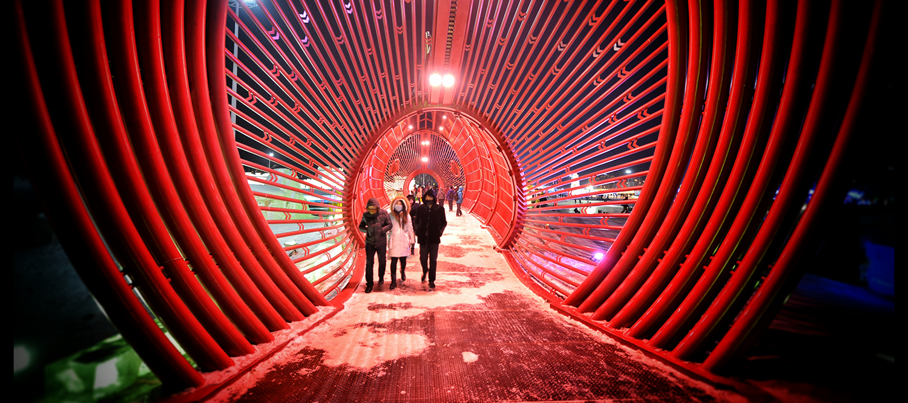
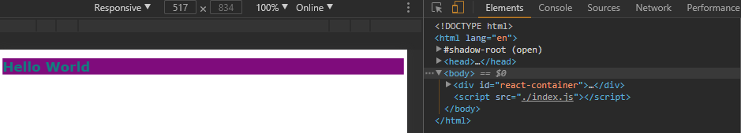

> A look behind the curtain of React Starters like:
> 
> * [create-react-app](https://github.com/facebookincubator/create-react-app)
> * [Gatsby.js](https://github.com/gatsbyjs/gatsby)
> * [Next.js](https://github.com/zeit/next.js)
> * [Neutrino](https://neutrino.js.org)
> 
> React is often said to be easy to learn, but impossible to set up in an dev environment. Once you start reading about it, you will be faced by an exhausting amount of choices that you have to make, before you can move on to actual coding. Starter Packages, like the ones named above, give a quick access to the React world. Let's take a look into that black box now.


[Github](https://github.com/mpolinowski/react-under-the-hood)


<!-- TOC -->

- [01 Pure React](#01-pure-react)

<!-- /TOC -->


## 01 Pure React

Create a file _/dist/index.js_ with the following React code:

```js
const { createElement } = React
const { render } = ReactDOM

const title = createElement(
	'h1',
	{id: 'title', className: 'header'},
	'Hello World'
)

render(
	title,
	document.getElementById('react-container')
)
```

The \<title /\> component uses the createElement function from React to create a h1 header with the css class _header_, an id _title_ and a text string _Hello World_.

The ReactDom render function will then render it into the div container with the id _react-container_.

Now we need to create a html page called /dist/index.html that contains the container with named id:

```html
<!DOCTYPE html>
<html lang="en">
  <head>
      <meta charset="UTF-8">
      <!-- Force latest available IE rendering engine and Chrome Frame (if installed) -->
  	  <meta http-equiv="X-UA-Compatible" content="IE=edge,chrome=1">
      <!-- Mobile Screen Resizing -->
      <meta name="viewport" content="width=device-width, initial-scale=1.0">
      <!-- HTML5 Shim for IE 6-8 -->
      <!--[if lt IE 9]>
          <script src="http://html5shiv.googlecode.com/svn/trunk/html5.js"></script>
      <![endif]-->
	    <script src="https://cdnjs.cloudflare.com/ajax/libs/react/15.1.0/react.min.js"></script>
	    <script src="https://cdnjs.cloudflare.com/ajax/libs/react/15.1.0/react-dom.min.js"></script>
	    <meta charset="UTF-8">
	    <title>Hello World with React</title>
</head>
<body>
	<!--[if lt IE 8]>
					<section class="container">
							Did you know that your web browser is a bit old? Some of the content on this site might not work right
							as a result. <a href="http://whatbrowser.org">Upgrade your browser</a> for a faster, better, and safer
							web experience.
					</section>
		<![endif]-->
    <div id="react-container"></div>
    <script src="./index.js"></script>
</body>
</html>
```

We add React and ReactDOM directly via CDN and link our _index.js_ inside the body tag.

Now we need to put our React app onto a webserver - for testing, we will use the npm package httpster to serve our files:

```
npm install httpster -g
```

Now start the webserver with the port and directory flag:

```
httpster -p 3000 -d /e/react-under-the-hood/dist
```

Our app can now be accessed with a webbrowser on _http://localhost:3000_


We can easily style our title component by creating a style component:

```js
const style = {
	backgroundColor: 'purple',
	color: 'teal',
	fontFamily: 'verdana'
}
```

And assigning the style to our component:

```js
const title = createElement(
	'h1',
	{id: 'title', className: 'header', style: style},
	'Hello World'
)
```


