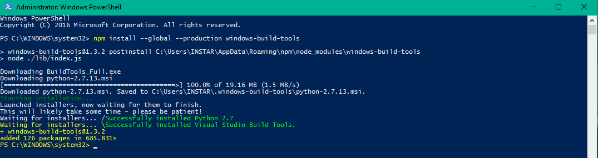

> A look behind the curtain of React Starters like:
> 
> * [create-react-app](https://github.com/facebookincubator/create-react-app)
> * [Gatsby.js](https://github.com/gatsbyjs/gatsby)
> * [Next.js](https://github.com/zeit/next.js)
> * [Neutrino](https://neutrino.js.org)
> 
> React is often said to be easy to learn, but impossible to set up in an dev environment. Once you start reading about it, you will be faced by an exhausting amount of choices that you have to make, before you can move on to actual coding. Starter Packages, like the ones named above, give a quick access to the React world. Let's take a look into that black box now.


[Github](https://github.com/mpolinowski/react-under-the-hood)


### Table of Content

01. [Pure React](/react-under-the-hood-part-i/)
02. [JSX and Babel](/react-under-the-hood-part-ii/)
	* Transpilation
03. [Webpack](#03-webpack)
	* Loading JSON
	* Adding SASS
04. [React Components](/react-under-the-hood-part-iv/)
	* ES6 Class Syntax
	* Stateless Functions
05. [Adding React-Icons](/react-under-the-hood-part-v/)
06. [Working with Props](/react-under-the-hood-part-vi/)
	* Default Props
	* PropType Validation
07. [Working with State](/react-under-the-hood-part-vii/)


## 03 Webpack

Webpak is a module bundler, that enables us to create static files from our React code. We can use it to automate processes like the Babel transpiling and use it to serve our app in an hot-reloading dev-server environment.


First we need to add a [Webpack configuration](https://webpack.js.org/guides/getting-started/) file inside the root directory - webpack.config.js:

```js
const path = require('path');
const webpack = require('webpack');

module.exports = {
  entry: path.resolve(__dirname, './src/index.js'),
  devServer: {
    contentBase: path.resolve(__dirname, './dist'),
    port: 3000,
    inline: true
  },
  module: {
    rules: [{
      test: /\.js$/,
      exclude: /(node_modules)/,
      use: {
        loader: 'babel-loader',
        options: {
          presets: ['env', 'react']
        }
      }
    }]
  },
  output: {
    path: path.resolve(__dirname, './dist/assets/'),
    filename: 'bundle.js',
    publicPath: 'assets'
  },
};
```

Now we want to [install the latest version of Webpack](https://webpack.js.org/guides/installation/) together with the babel-loader & presets, as well as the Webpack Dev-Server to host our files:

```
npm install --save-dev webpack babel-loader babel-core babel-preset-env webpack-dev-server
```

We can create an npm script to start webpack from inside the repository (a global installation is not recommended). The start scripts hosts our webapp, according to the devServer configuration inside webpack.config.js. The build script takes all js files (node_modules excluded), babel-transpiles them with the babel-loader, and puts them bundled into the _./dist/assets_ directory. And the watch script will watch the directories for changes and starts up the loader automatically, when we saved an edit.

```
"scripts": {
	"start": "webpack-dev-server --open",
	"watch": "webpack --watch",
	"build": "webpack --config webpack.config.js"
}
```

We can now run our build process with _npm run build_ / _npm run watch_ and start our devServer with _npm start_.


Let us now use Webpack to load our react dependencies - instead of linking them into our HTML page. To do this we first have to install React to the project:

```
npm install --save react react-dom
```


### Loading JSON

And to demonstrate the function of module loading, we want to use some JSON data, being loaded into our react app by Webpack:

```
npm install --save-dev json-loader
```

Lets add the JSON loader to our Webpack config file:

```js
module: {
	rules: [
		{
			test: /\.js$/,
			exclude: /(node_modules)/,
			use: {
				loader: 'babel-loader',
				options: {
					presets: ['env', 'react']
				}
			}
		},
		{
			test: /\.json$/,
			exclude: /(node_modules)/,
			use: {
				loader: 'json-loader'
			}
		}
	]
},
```

And create a exciting JSON file _./src/title.json_ :

```json
{
  "data1": "first data",
  "data2": "second data"
}
```

And create a JSX module that uses this data in _./src/lib.js_ :

```js
import React from 'react'
import text from './titles.json'

export const data1 = (
  <h1 id='title'
      className='header'
      style={{backgroundColor: 'teal', color: 'purple'}}>
    {text.data1}
  </h1>
)

export const data2 = (
  <h1 id='title'
      className='header'
      style={{backgroundColor: 'purple', color: 'teal'}}>
    {text.data2}
  </h1>
)
```

We are now using the module import statement to import React from the installed React dependency, as well as our own JSON file. This is a function that is not yet integrated in JavaScript but is available thanks to Webpack and Babel. Now we can rewrite our _./src/index.js_ file to receive the module that we just created:

```js
import React from 'react'
import { render } from 'react-dom'
import {data1, data2} from './lib'

render(
	<div>
		{data1}
		{data2}
	</div>,
	document.getElementById('react-container')
)
```

Notice that we need to import _react-dom_ here, since __render__ is not part of _react_.


### Adding SASS

The same principle can be applied to add styles to our react app app - lets try to add some [SASS](http://sass-lang.com/) to our app with the [Kraken-Sass](http://jwebcat.github.io/kraken-sass/index.html) boilerplate:

First we want to install the Webpack loaders for the job of preprocess the source [SASS](http://sass-lang.com/guide) into proper CSS:

```
npm install --save-dev style-loader css-loader sass-loader
```

You will get a warning, that _sass-loader_ requires another dependency called _[node-sass](https://github.com/sass/node-sass)_, which is a library that provides binding for Node.js to LibSass, the C version of the popular stylesheet preprocessor, Sass. This, on the other hand, requires - __under Windows__ - the installation of the [Windows Build Tools](https://github.com/felixrieseberg/windows-build-tools):

```
npm install --g --production windows-build-tools
```




Go and get yourself a cup of coffee - as this is going to take a while ¯\\_(ツ)_\/¯


Once this is through, continue with node-sass:

```
npm install --save-dev node-sass
```

Then add the [SASS loaders](https://webpack.js.org/loaders/sass-loader/) to our Webpack config:

```js
{
	test: /\.scss$/,
	exclude: /(node_modules)/,
	use: [{
					loader: "style-loader" // creates style nodes from JS strings
			}, {
					loader: "css-loader" // translates CSS into CommonJS
			}, {
					loader: "sass-loader" // compiles Sass to CSS
			}]
}
```

[Download the master.zip](https://github.com/jwebcat/kraken-sass/archive/master.zip) from kraken-sass and unzip the kraken.scss file (together with the lib folder - that contains all the scss components) to _./src/assets/sass_.

Now we can import the [kraken-sass styles](http://jwebcat.github.io/kraken-sass/kraken-way.html) into our _./src/index.js_ component:

```js
import React from 'react'
import { render } from 'react-dom'
import {data1, data2} from './lib'
import './assets/sass/kraken.scss'

render(
		<div>
			<h1>Webpack Styling</h1>
			<h4>With Kraken-Sass Boilerplate</h4>
	    <button className="btn btn-blue btn-block"> {data1} </button>
			<button className="btn btn-blue btn-block"> {data2} </button>
  	</div>,
	document.getElementById('react-container')
)
```


As we can see by now - react allows us to create a collection of separate [JSX components](https://reactjs.org/docs/components-and-props.html) and [CSS modules](https://github.com/css-modules/css-modules) that offer isolation to our app logic and component styles. Each piece is a building block, that is then imported into our _./src/index.js_ react interface and bundled & transpiled by Webpack/Babel into a browser-conform website. Lets clean up our folder structure to show the separation between main pages (index.js) and components and modules that can be re-used in every page (make sure to also change the relative links inside each file):


