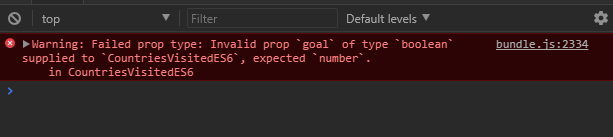

> A look behind the curtain of React Starters like:
> 
> * [create-react-app](https://github.com/facebookincubator/create-react-app)
> * [Gatsby.js](https://github.com/gatsbyjs/gatsby)
> * [Next.js](https://github.com/zeit/next.js)
> * [Neutrino](https://neutrino.js.org)
> 
> React is often said to be easy to learn, but impossible to set up in an dev environment. Once you start reading about it, you will be faced by an exhausting amount of choices that you have to make, before you can move on to actual coding. Starter Packages, like the ones named above, give a quick access to the React world. Let's take a look into that black box now.


[Github](https://github.com/mpolinowski/react-under-the-hood)


<!-- TOC -->

- [06 Working with Props](#06-working-with-props)
  - [Default Props](#default-props)
  - [PropType Validation](#proptype-validation)

<!-- /TOC -->


## 06 Working with Props

Lets call a new component CountryList inside _./src/index.js_ and give it some props - in form of an array of objects:


```js
<CountryList countries= {
		[
			{
				country: "Japan",
				date: new Date ("10/19/2010"),
				visited: true,
				liked: true
			},
			{
				country: "Taiwan",
				date: new Date ("12/12/2006"),
				visited: true,
				liked: true
			},
			{
				country: "China",
				date: new Date ("10/20/2010"),
				visited: true,
				liked: true
			}
		]
	}/>
```

Now create this component in _./src/components/country-list.js_ :

```js
import Landing from 'react-icons/lib/md/flight-land'
import Heart from 'react-icons/lib/go/heart'

import { CountryRow } from './country-row'

export const CountryList = ({countries}) => (
  <table>
    <thead>
      <tr>
        <th>Date</th>
        <th>Country</th>
        <th>Visited</th>
        <th>Liked</th>
      </tr>
    </thead>

    <tbody>
      {countries.map((country, i) =>
        <CountryRow key={i}
                    country={country.country}
                    date={country.date}
                    visited={country.visited}
                    liked={country.liked}/>
      )}
    </tbody>
  </table>
)
```

We created another nested child component inside to create the actual table body of our country list. All the props that were given to us inside _index.js_ have now be handed further down to the CountryRow component. And we have a map function wrapped around it to go through all values inside the _countries_ array - and create a row for every entry. Which is an excellent time to introduce __The Spread Operator__ - [three dots that changed the world](https://dmitripavlutin.com/how-three-dots-changed-javascript/) - to clean up our code:


```js
export const CountryList = ({countries}) => (
  <div className="grid-full space-bottom space-top">
    <br/><br/>
    <table className="grid-full space-bottom space-top float-center">
      <thead>
        <tr>
          <th>Date</th>
          <th>Country</th>
          <th>Visited</th>
          <th>Liked</th>
        </tr>
      </thead>

      <tbody>
        {countries.map((country, i) =>
          <CountryRow key={i} {...country} />
        )}
      </tbody>
    </table>
  </div>
)
```

And the row component, that we already imported in the list component (above), can now use the props: _country, date, visited, liked_ from the _countries_ array to populate the rows of our table inside _./src/components/countru-row.js_ :

```js
import Landing from 'react-icons/lib/md/flight-land'
import Heart from 'react-icons/lib/go/heart'

export const CountryRow = ({country, date, visited, liked}) => (
  <tr>
    <td>
      { date.getMonth() +1 } / { date.getDate() } / { date.getFullYear() }
    </td>
    <td>
      { country }
    </td>
    <td>
      { (visited) ? <Landing /> : null }
    </td>
    <td>
      { (liked) ? <Heart /> : null }
    </td>
  </tr>
)
```

We added icons again to show, whether we visited and liked a country. The syntax of the [Inline If-Else Statement](https://reactjs.org/docs/conditional-rendering.html#inline-if-else-with-conditional-operator) __(visited) ? \<Landing /\> : null__ reads like: _if visited is true, display the Landing react-icon, otherwise, don't_.


### Default Props

Default props populate our child component with properties, when they are not provided by the parent component. Lets add them to our country-visited component, to see how this looks like for the createClass syntax, the ES6 Class syntax and inside a stateless component:


__createClass__ (see _.src/components/countries-visited-createClass.js_)

The default props are just added like our custom methods before inside the component, by the __getDefaultProps__ function:

```js
export const CountriesVisited = React.createClass({
	getDefaultProps() {
		return {
			total : 196,
			visited : 50,
			liked : 100,
			goal : 99
		}
	}, [...] })
```


__ES6 Class__ (see _.src/components/countries-visited-ES6.js_)

In case of an ES6 class we have to add default props to the class instance (written below the component itself):

```js
CountriesVisitedES6.defaultProps = {
    total : 196,
    visited : 50,
    liked : 100,
    goal : 99
}
```


__stateless__ (see _.src/components/countries-visited-stateless.js_)

the way above can also be used for stateless components - just copy&paste. But you can also assign default values to the props that you give the component - they will only be used if no props are provided by the parent component:

```js
export const CountriesVisitedStateless = ({ total=196, visited=50, liked=100, goal=99 }) => ([...])
```


### PropType Validation

As your app grows, you can catch a lot of bugs with typechecking. To run typechecking on the props for a component, you can assign the special [propTypes property](https://reactjs.org/docs/typechecking-with-proptypes.html):


__createClass__ (see _.src/components/countries-visited-createClass.js_)

```js
import { createClass, PropTypes } from 'react'

export const CountriesVisited = React.createClass({
	propTypes() {
		total : propTypes.number,
		visited : propTypes.number,
		liked : propTypes.number,
		goal : propTypes.number
	}, [...] })
```


__ES6 Class__ (see _.src/components/countries-visited-ES6.js_)

In case of an ES6 class we have to add propsTypes to the class instance (written below the component itself). For React >15.5 we also need to install _npm install --save prop-types_ separately and import it at the top of the file !

```js
import { Component } from 'react'
import PropTypes from 'prop-types';

[...]

CountriesVisitedES6.defaultProps = {
	total : propTypes.number.isRequired,
	visited : propTypes.number.isRequired,
	liked : propTypes.number,
	goal : propTypes.number.isRequired
}
```

You can test it by "feeding" your component, e.g. a Boolean instead of a Number - you will now get an error message inside your console (the same would happen, if you remove a prop that is tagged as __.isRequired__):





__stateless__ (see _.src/components/countries-visited-stateless.js_)

the way above can also be used for stateless components - just copy&paste:

```js
import PropTypes from 'prop-types';

[...]

CountriesVisitedES6.defaultProps = {
	total : propTypes.number.isRequired,
	visited : propTypes.number.isRequired,
	liked : propTypes.number,
	goal : propTypes.number.isRequired
}
```

We can now add Type Validation to our two list / row components:

__stateless__ (see _.src/components/country-row.js_)

```js
import PropTypes from 'prop-types';

[...]

CountryRow.propTypes = {
    country: PropTypes.string.isRequired,
    date: PropTypes.instanceOf(Date).isRequired,
    visited: PropTypes.bool,
    liked: PropTypes.bool,
}
```

__stateless__ (see _.src/components/country-list.js_)

```js
import PropTypes from 'prop-types';

[...]

CountryList.propTypes = {
    countries: PropTypes.array.isRequired,
}
```

Beside those default Type Checks, we can also employ __Custom Validations__ - e.g. is _countries_ an array - if yes - does the array _countries_ have at least 1 entry:

```js
CountryList.propTypes = {
    countries: function(props) {
			if(!Array.isArray(props.countries)) {
				return new Error (
					"Country List has to be an Array!"
				)
			} else if (!props.countries.length) {
          return new Error (
            "Country List must have at least one record!"
          )
      } else {
          return null
      }
		}
}
```