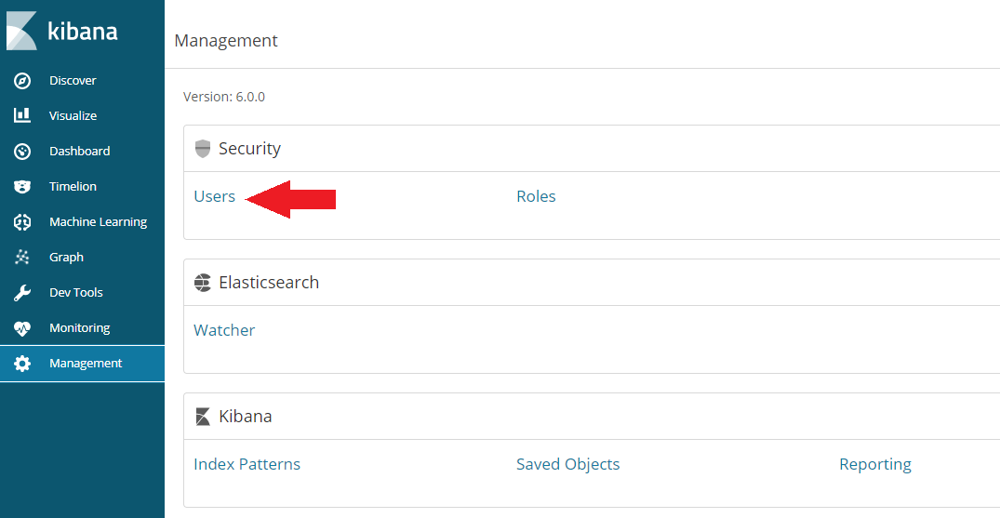
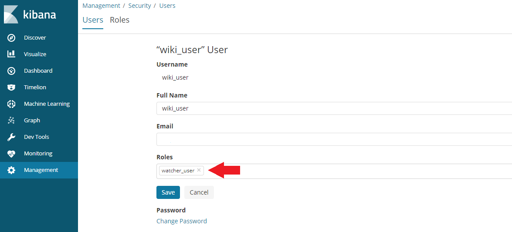
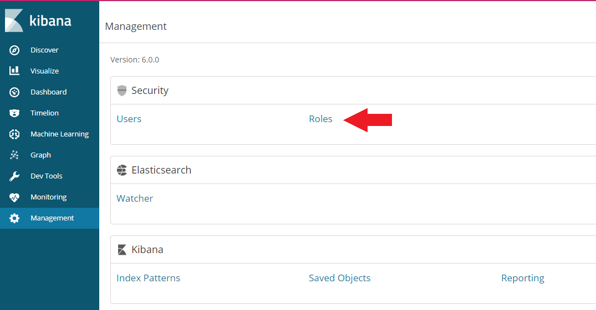
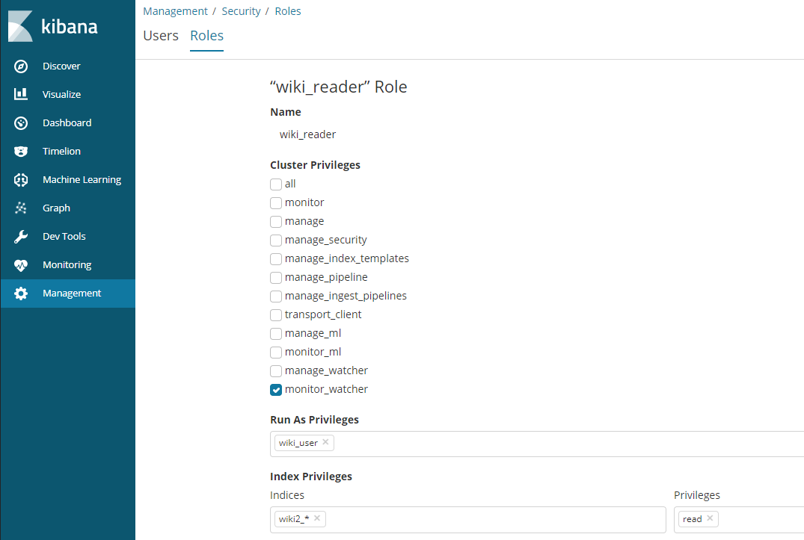

<!-- TOC -->

- [01 Search Engine Setup and Configuration](#01-search-engine-setup-and-configuration)
  - [Installing Elasticsearch 6.x on CentOS](#installing-elasticsearch-6x-on-centos)
    - [Import the Elasticsearch PGP Key](#import-the-elasticsearch-pgp-key)
  - [Installing from the RPM repository](#installing-from-the-rpm-repository)
    - [Running Elasticsearch with _systemd_](#running-elasticsearch-with-_systemd_)
    - [Checking that Elasticsearch is running](#checking-that-elasticsearch-is-running)
    - [Configuring Elasticsearch](#configuring-elasticsearch)
  - [Installing Kibana 6.x on CentOS](#installing-kibana-6x-on-centos)
    - [Running Kibana with _systemd_](#running-kibana-with-_systemd_)
  - [Install X-Pack](#install-x-pack)
    - [Elasticsearch Security](#elasticsearch-security)
    - [Kibana Security](#kibana-security)
  - [Enabling Anonymous Access](#enabling-anonymous-access)

<!-- /TOC -->

> Proin ornare ligula eu tellus tempus elementum. Aenean bibendum iaculis mi, nec blandit lacus interdum vitae. Vestibulum non nibh risus, a scelerisque purus. Ut vel arcu ac tortor adipiscing hendrerit vel sed massa. Fusce sem libero, lacinia vulputate interdum non, porttitor non quam. Aliquam sed felis ligula. Duis non nulla magna.


## 01 Search Engine Setup and Configuration

### Installing Elasticsearch 6.x on CentOS

Elasticsearch is a distributed, JSON-based search and analytics engine designed for horizontal scalability, maximum reliability, and easy management.

#### Import the Elasticsearch PGP Key

```
rpm --import https://artifacts.elastic.co/GPG-KEY-elasticsearch
```

### Installing from the RPM repository

Create a file called elasticsearch.repo in the _/etc/yum.repos.d/_ directory and add the following lines:

```
[elasticsearch-6.x]
name=Elasticsearch repository for 6.x packages
baseurl=https://artifacts.elastic.co/packages/6.x/yum
gpgcheck=1
gpgkey=https://artifacts.elastic.co/GPG-KEY-elasticsearch
enabled=1
autorefresh=1
type=rpm-md
```

And your repository is ready for use. You can now install Elasticsearch with one of the following commands:

```
sudo yum install elasticsearch
```

#### Running Elasticsearch with _systemd_

To configure Elasticsearch to start automatically when the system boots up, run the following commands:

```
sudo /bin/systemctl daemon-reload
sudo /bin/systemctl enable elasticsearch.service
```

Apparently there is no way to quietly reload the Elasticsearch service after changing the config file - you will be required to stop and restart instead:

```
sudo systemctl stop elasticsearch.service
sudo systemctl start elasticsearch.service
```

These commands provide no feedback as to whether Elasticsearch was started successfully or not. Instead, this information will be written in the log files located in /var/log/elasticsearch/.

#### Checking that Elasticsearch is running

You can test that your Elasticsearch node is running by sending an HTTP request to port 9200 on localhost:

```
curl -XGET 'localhost:9200/?pretty'
```

```
http://localhost:9200/_cat/indices?v&pretty
```

#### Configuring Elasticsearch

Elasticsearch loads its configuration from the _/etc/elasticsearch/elasticsearch.yml_ file by default. Examples:

* __cluster.name:__ e.g. _instar-wiki_
* __node.name__ e.g. _c21_
* __node.attr.rack:__ e.g _r44_
* __path.data:__ _/path/to/data_
* __path.logs:__ _/path/to/logs_
* __network.host:__ _localhost_ [see config](https://www.elastic.co/guide/en/elasticsearch/reference/current/modules-network.html#network-interface-values) __*__
* __http.port:__ _9200_
* __http.cors:__ _enabled:_ true , _allow-origin:_ /https?:\/\/localhost(:[0-9]+)?/, _allow-origin:_ /https?:\/\/localhost(:[0-9][0-9][0-9][0-9])?/
* __*__ _e.g. network.host: 127.0.0.1, 192.168.1.200, 7.114.21.49_


The RPM places config files, logs, and the data directory in the appropriate locations for an RPM-based system:

| | | |
|---|---|---|---|
| __Type__ | __Description__ | __Default Location__ | __Setting__ |
| home | Elasticsearch home directory or $ES_HOME | _/usr/share/elasticsearch_ |  |
| bin | Binary scripts including elasticsearch to start a node and elasticsearch-plugin to install plugins | _/usr/share/elasticsearch/bin_ |   |
| conf | Configuration files including elasticsearch.yml | _/etc/elasticsearch_ | ES_PATH_CONF |
| conf | Environment variables including heap size, file descriptors. | _/etc/sysconfig/elasticsearch_ |   |
| data | The location of the data files of each index / shard allocated on the node. Can hold multiple locations. | _/var/lib/elasticsearch_ | path.data |
| logs | Log files location. | _/var/log/elasticsearch_ | path.logs |
| plugins | Plugin files location. Each plugin will be contained in a subdirectory. | _/usr/share/elasticsearch/plugins_ |   |


### Installing Kibana 6.x on CentOS

Kibana gives shape to your data and is the extensible user interface for configuring and managing all aspects of the Elastic Stack.

Create a file called kibana.repo in the _/etc/yum.repos.d/_ directory and add the following lines:

```
[kibana-6.x]
name=Kibana repository for 6.x packages
baseurl=https://artifacts.elastic.co/packages/6.x/yum
gpgcheck=1
gpgkey=https://artifacts.elastic.co/GPG-KEY-elasticsearch
enabled=1
autorefresh=1
type=rpm-md
```

And your repository is ready for use. You can now install Kibana with one of the following command:

```
sudo yum install kibana
```


#### Running Kibana with _systemd_

To configure Kibana to start automatically when the system boots up, run the following commands:

```
sudo /bin/systemctl daemon-reload
sudo /bin/systemctl enable kibana.service
```

Kibana can be started and stopped as follows:

```
sudo systemctl stop kibana.service
sudo systemctl start kibana.service
```

These commands provide no feedback as to whether Kibana was started successfully or not. Instead, this information will be written in the log files located in _/var/log/kibana/_. Kibana loads its configuration from the _/etc/kibana/kibana.yml_ file by default. Examples:


* __elasticsearch.url:__ Default: _http://localhost:9200_ The URL of the Elasticsearch instance to use for all your queries.
* __server.port:__ Server port for the Kibana web UI - _default 5601_
* __server.host:__ Specifies the address to which the Kibana server will bind. IP addresses and host names are both valid values. The default is _localhost_, which usually means remote machines will not be able to connect. To allow connections from remote users, set this parameter to a non-loopback address.
* __console.enabled:__  Default: true Set to false to disable Console.
* __elasticsearch.username:__ s. below
* __elasticsearch.password:__ If your Elasticsearch is protected with basic authentication, these settings provide the username and password that the Kibana server uses to perform maintenance on the Kibana index at startup. Your Kibana users still need to authenticate with Elasticsearch, which is proxied through the Kibana server. (see X-Pack below)
* __server.ssl.enabled:__ Default: "false" Enables SSL for outgoing requests from the Kibana server to the browser. When set to true, server.ssl.certificate and server.ssl.key are required
* __server.ssl.certificate:__ s. below
* __server.ssl.key:__ Paths to the PEM-format SSL certificate and SSL key files, respectively.
* __server.ssl.certificateAuthorities:__ List of paths to PEM encoded certificate files that should be trusted.
* __server.ssl.cipherSuites:__ Default: _ECDHE-RSA-AES128-GCM-SHA256, ECDHE-ECDSA-AES128-GCM-SHA256, ECDHE-RSA-AES256-GCM-SHA384, ECDHE-ECDSA-AES256-GCM-SHA384, DHE-RSA-AES128-GCM-SHA256, ECDHE-RSA-AES128-SHA256, DHE-RSA-AES128-SHA256, ECDHE-RSA-AES256-SHA384, DHE-RSA-AES256-SHA384, ECDHE-RSA-AES256-SHA256, DHE-RSA-AES256-SHA256, HIGH,!aNULL, !eNULL, !EXPORT, !DES, !RC4, !MD5, !PSK, !SRP, !CAMELLIA_. Details on the format, and the valid options, are available via the [OpenSSL cipher list format documentation](https://www.openssl.org/docs/man1.0.2/apps/ciphers.html#CIPHER-LIST-FORMAT)
* __server.ssl.keyPassphrase:__ The passphrase that will be used to decrypt the private key. This value is optional as the key may not be encrypted.
* __server.ssl.redirectHttpFromPort:__ Kibana will bind to this port and redirect all http requests to https over the port configured as server.port.
* __server.ssl.supportedProtocols:__ _Default_: TLSv1, TLSv1.1, TLSv1.2 Supported protocols with versions. Valid protocols: TLSv1, TLSv1.1, TLSv1.2
* __status.allowAnonymous:__ Default: false If authentication is enabled, setting this to true allows unauthenticated users to access the Kibana server status API and status page.


| Type | Description | Default Location |
|---|---|---|
| home | Kibana home directory or $KIBANA_HOME | _/usr/share/kibana_ |
| bin | Binary scripts including kibana to start the Kibana server and kibana-plugin to install plugins | _/usr/share/kibana/bin_ |
| config | Configuration files including kibana.yml | _/etc/kibana_ |
| data | The location of the data files written to disk by Kibana and its plugins | _/var/lib/kibana_ |
| optimize | Transpiled source code. Certain administrative actions (e.g. plugin install) result in the source code being retranspiled on the fly. | _/usr/share/kibana/optimize_ |
| plugins | Plugin files location. Each plugin will be contained in a subdirectory. | _/usr/share/kibana/plugins_ |


### Install X-Pack

X-Pack is a single extension that integrates handy features — security, alerting, monitoring, reporting, graph exploration, and machine learning — you can trust across the Elastic Stack.

#### Elasticsearch Security

We need to add a user athentication to our Elasticsearch / Kibana setup. We will do this by installing X-Pack. To get started with installing the Elasticsearch plugin, go to _/etc/elasticsearch/_ and call the following function:

```
bin/elasticsearch-plugin install x-pack
```

Now restart Elasticsearch:

```
sudo systemctl stop elasticsearch.service
sudo systemctl start elasticsearch.service
```

You can either use the auto function to generate user passwords for Elasticsearch, Kibana (and the not yet installed Logstash):

```
bin/x-pack/setup-passwords auto
```

or swap the _auto_ flag with _interactive_ to use your own user logins. The auto output will look something like this:

```
Changed password for user kibana 
PASSWORD kibana = *&$*(80gfddzg

Changed password for user logstash_system
PASSWORD logstash_system = 58#$)Qljfksh

Changed password for user elastic
PASSWORD elastic = jgfisg)#*%&(@*#)
```

__Now every interaction with Elasticsearch or Kibana will require you to authenticate with _username: elastic_ and _password: jgfisg)#*%&(@*#)___


#### Kibana Security

Now we repeat these steps with Kibana. First navigate to _/etc/kibana/_ and call the following function:

```
bin/kibana-plugin install x-pack
```

And we have to add the login that Kibana has to use to access Elasticsearch (auto generated above) to the _kibana.yml_ file in _/etc/kibana/_:

```
elasticsearch.username: "kibana"
elasticsearch.password:  "*&$*(80gfddzg"
```

Now restart Kibana:

```
sudo systemctl stop kibana.service
sudo systemctl start kibana.service
```

Now navigate your browser _http://localhost:5601/_ and login with the "elastic" user we generated above.


### Enabling Anonymous Access

Incoming requests are considered to be anonymous if no authentication token can be extracted from the incoming request. By default, anonymous requests are rejected and an authentication error is returned (status code 401). To allow anonymous user to send search queries (Read access to specified indices), we need to add the following lines to the _elasticsearch.yml_ file in _/etc/elasticsearch/_:

```
xpack.security.authc:
  anonymous:
    username: anonymous_user 
    roles: wiki_reader 
    authz_exception: true 
```

Now we have to switch to the Kibana webUI on _http://localhost:5601/_ and create the _role:_ *wiki_reader* to allow read access to the wiki indices. First switch to the __Management__ tab and click on user:




Then click on __Add a User__ and add a user with the __watcher_user__ role:




Switch back to the __Management__ tab and click on role:




Click on __Create Role__ and add the name **wiki_reader** that we choose for the role of the anonymous user inside the elasticsearch.yml file, assign the **monitor_watcher** privilege and choose the indices that you want the anonymous user to have __READ__ access to:




Your configuration will be active after restarting Elasticsearch. Now you can use webservices to read from your ES database. But only the __elastic__ user has the privileg to __WRITE__ and to work in Kibana.