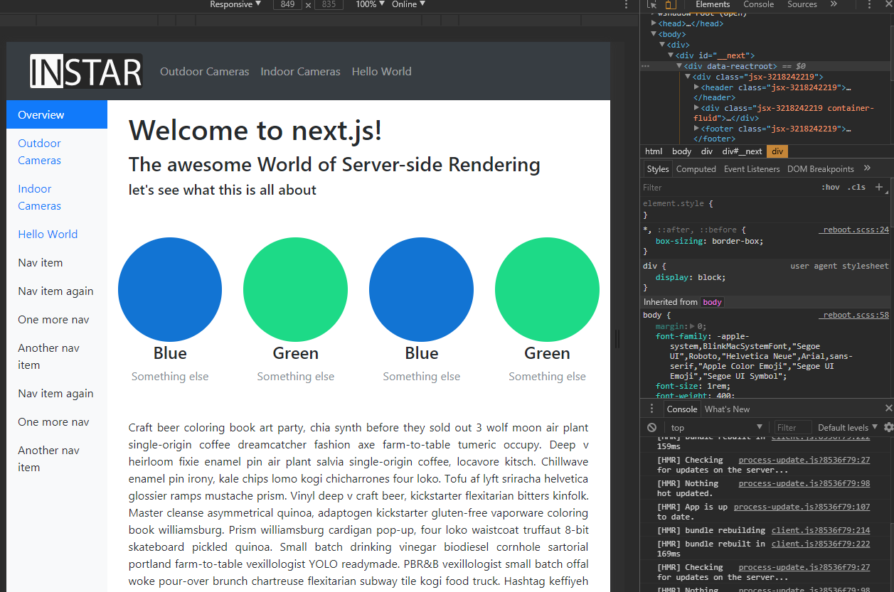

[Github](https://github.com/mpolinowski/next-start)


# Next.js

## On my way to figure out to find the best way to deploy a React App

01. [create-react-app](https://github.com/mpolinowski/react-router-4)
02. [GatsbyJS](https://github.com/mpolinowski/gatsby-wiki)
03. Next.js

Today I want to try out [Next.js](https://zeit.co/docs/examples/next) ([Github](https://github.com/zeit/next.js)). More specifically the new [Next4](https://zeit.co/blog/next4) release that includes [React16](https://reactjs.org/blog/2017/09/26/react-v16.0.html) and [React Router 4](https://zeit.co/blog/next4) - as I already gathered some [positive experiences](https://github.com/mpolinowski/react-router-4) with those. There is also an update to [Styled JSX 2](https://github.com/zeit/styled-jsx/releases/tag/2.0.1), that now allows us to __prop__-up our styles, to avoid having to overwrite defaults inline inside components - here the documented example:

```js
export default ({ color }) => (
    <div>
      Hello there <span>my friend</span>
      <style jsx>{`
        /* this style only applies to the span within lexical scope */
        span { color: ${color}; }
      `}</style>
    </div>
  )
```

There are many different [examples available](https://github.com/zeit/next.js/tree/master/examples) to start building your App. All righty, lets go then!

---



The final Application

__TOC__

01. [Basic Setup](#01-basic-setup)
02. [Styling](#02-styling)
    * [Example](#example)
03. [Bootstrap 4](#03-bootstrap-4)
04. [Advanced Routing](#04-advanced-routing)


## 01 Basic Setup

First create a directory for our app and _npm init -y_ it - then install Next.js and React:

```
npm install next@latest react@latest react-dom@latest --save
```

We can add the following npm scripts to the __package.json__ file to make things easier:

```json
"scripts": {
    "dev": "next",
    "build": "next build",
    "start": "next start"
  }
```

After that, the file-system is the main API. Every .js file becomes a route that gets automatically processed and rendered.

Populate _./pages/index.js_ inside your project:

```js
export default () => <div>Welcome to next.js!</div>
```

and then just run npm run dev and go to http://localhost:3000. To use another port, you can run npm run dev -- -p <your port here>.

So far, we get:

* Automatic transpilation and bundling (with webpack and babel)
* Hot code reloading
* Server rendering and indexing of ./pages
* Static file serving. ./static/ is mapped to /static/
* Automatic code splitting - Every import you declare gets bundled and served with each page. That means pages never load unnecessary code!


## 02 Styling

Next.js 4 bundles styled-jsx 2 to provide support for isolated scoped CSS - the [documentation can be found here](https://www.npmjs.com/package/styled-jsx). A few examples are:


__isolated scoped CSS__
```js
export default () => (
  <div>
    <p>only this paragraph will get the style :)</p>

    { /* you can include <Component />s here that include
         other <p>s that don't get unexpected styles! */ }

    <style jsx>{`
      p {
        color: red;
      }
    `}</style>
  </div>
)
```


Styles can be defined in separate JavaScript modules by tagging with css any template literal that contain CSS. css must be imported from styled-jsx/css:

__Keeping CSS in separate files__
```js
/* styles.js */
import css from 'styled-jsx/css'

export const button = css`button { color: purple; }`
export default css`div { color: teal; }`
```

and imported as regular strings:

```js
import styles, { button } from './styles'

export default () => (
  <div>
    <button>styled-jsx</button>
    <style jsx>{styles}</style>
    <style jsx>{button}</style>
  </div>
)
```

in this example all "potential" \<div\>'s inside the components JSX - as well as the enclosing root \<div\> is targeted by {styles}. If you just want to target the root:


__Targeting The Root__
```js
export default () => (
  <div className="root">
    <style jsx>{`
      .root {
        color: green;
      }
    `}</style>
  </div>
)
```


To skip scoping entirely, you can make the global-ness of your styles explicit by adding global:

__Global styles__
```js
export default () => (
  <div>
    <style jsx global>{`
      body {
        background: red
      }
    `}</style>
  </div>
)
```


You can also use modifiers for your CSS classes to create components that can be called in different "versions", e.g. \<Button\>Hi\</Button\> or \<Button large\>Big\</Button\>.

__className toggling__
```js
const Button = (props) => (
  <button className={ 'large' in props && 'large' }>
     { props.children }
     <style jsx>{`
        button {
          padding: 20px;
          background: #eee;
          color: #999
        }
        .large {
          padding: 50px
        }
     `}</style>
  </button>
)
```


You can override the CSS you configure via inline-styles:

__inline style__
```js
const Button = ({ padding, children }) => (
  <button style={{ padding }}>
     { children }
     <style jsx>{`
        button {
          padding: 20px;
          background: #eee;
          color: #999
        }
     `}</style>
  </button>
)
```

In this example, the padding defaults to the one set in \<style\> (20), but the user can pass a custom one via \<Button padding={30}\>.


It is possible to use constants like so:

__Constants__
```js
import { colors, spacing } from '../theme'
import { invertColor } from '../theme/utils'

const Button = ({ children }) => (
  <button>
     { children }
     <style jsx>{`
        button {
          padding: ${ spacing.medium };
          background: ${ colors.primary };
          color: ${ invertColor(colors.primary) };
        }
     `}</style>
  </button>
)
```

or to pass them down by Props:

__Dynamic styles__
```js
const Button = (props) => (
  <button>
     { props.children }
     <style jsx>{`
        button {
          padding: ${ 'large' in props ? '50' : '20' }px;
          background: ${props.theme.background};
          color: #999;
          display: inline-block;
          font-size: 1em;
        }
     `}</style>
  </button>
)
```

## Example

_./pages/index.js_

```js
import styles, { hipsterum, imagefloat } from './styles/hipsterum'

export default () =>
  <div>

    <h1>Welcome to next.js!</h1>
    <h3>The awesome World of Server-side Rendering</h3>
    <h5>lets see what this is all about</h5>
    
    <p className="hipsterum">
      [ipsum...]
    </p>

    <style jsx>{`
      h1, h5 {
        color: white;
      }
      @media (max-width: 600px) {
        h1, h5 {
          color: black;
        }
      }
    `}</style>

    <style global jsx>{`
      body {
        background: black;
      }
      @media (max-width: 600px) {
        body {
          background-image: url("/static/test.png");
        }
      }
    `}</style>

    <style jsx>{styles}</style>
    <style jsx>{imagefloat}</style>
    <style jsx>{hipsterum}</style>

  </div>
```

_./pages/styles/hipsterum.js_

```js
import css from 'styled-jsx/css'

export const hipsterum = css`.hipsterum {
    color: blue;
    text-align: justify;
  }`

export const imagefloat = css`.imagefloat {
    float:right;
    margin-left:10px;
  }`

export default css`h3 { color: red; }`
```

This leads you to an style abomination that will make you cringe :) but uses all the important features of Style-JSX:

* \@media queries for responsive designs
* usage of static assets for your designs from the _./static_ folder
* inline css and separated css styles in their own files
* separation of styles into their own functions to allow you to import only necessary styles


## 03 Bootstrap 4

Trying to figure out the best way to add Bootstrap to the Mix - for now I will just add the CDN links to the layout Component in _./components/layout_. This works just like the template component with React-Helmet in create-react-app:

```js
import Link from 'next/link'
import Head from 'next/head'
import NavBar from './navbar'


export default ({ children, title = 'This is the default title' }) => (
  <div>
    <Head>
      <title>{ title }</title>
      <meta charSet='utf-8' />
      <meta name='viewport' content='initial-scale=1.0, width=device-width' />
      <link rel="stylesheet" href="https://maxcdn.bootstrapcdn.com/bootstrap/4.0.0-beta.2/css/bootstrap.min.css" integrity="sha384-PsH8R72JQ3SOdhVi3uxftmaW6Vc51MKb0q5P2rRUpPvrszuE4W1povHYgTpBfshb" crossOrigin="anonymous" />
    </Head>
    <header>
      <NavBar />
    </header>

      <div className="container">
        <div className="row">
          <br/><br/><br/><br/>
          { children }
        </div>
      </div>

    <footer>
      {'I`m a Footer Component'}
      <script src="https://code.jquery.com/jquery-3.2.1.slim.min.js" integrity="sha384-KJ3o2DKtIkvYIK3UENzmM7KCkRr/rE9/Qpg6aAZGJwFDMVNA/GpGFF93hXpG5KkN" crossOrigin="anonymous" />
      <script src="https://cdnjs.cloudflare.com/ajax/libs/popper.js/1.12.3/umd/popper.min.js" integrity="sha384-vFJXuSJphROIrBnz7yo7oB41mKfc8JzQZiCq4NCceLEaO4IHwicKwpJf9c9IpFgh" crossOrigin="anonymous" />
      <script src="https://maxcdn.bootstrapcdn.com/bootstrap/4.0.0-beta.2/js/bootstrap.min.js" integrity="sha384-alpBpkh1PFOepccYVYDB4do5UnbKysX5WZXm3XxPqe5iKTfUKjNkCk9SaVuEZflJ" crossOrigin="anonymous" />
    </footer>
  </div>
)
```

As a first bootstrap component, I added the __Bootstrap 4 Navbar__ we [created earlier](https://github.com/mpolinowski/react-router-4/blob/master/src/index.js) and imported it into the header area above:

```js
import Link from 'next/link'

const NavBar = () => (
  <div>
    <nav className="navbar navbar-expand-md navbar-dark bg-dark fixed-top mb">
      <Link href="/"><a className="nav-item nav-link"></a></Link>

      <button className="navbar-toggler" type="button" data-toggle="collapse" data-target="#TopNavbar" aria-controls="navbarsExampleDefault" aria-expanded="false" aria-label="Toggle navigation">
        <span className="navbar-toggler-icon"></span>
      </button>

      <div className="collapse navbar-collapse" id="TopNavbar">
        <ul className="navbar-nav mr-auto">
          <li className="nav-item">
            <Link href="/page-1"><a className="nav-item nav-link">Page 1</a></Link>
          </li>
          <li className="nav-item">
            <Link href="/page-2"><a className="nav-item nav-link">Page 2</a></Link>
          </li>
          <li className="nav-item">
            <Link href="/nested-routes"><a className="nav-item nav-link">Nested Routes</a></Link>
          </li>
        </ul>
      </div>
    </nav>
  </div>
)

export default NavBar
```


## 04 Advanced Routing

As we already see, Next.js builds routes for each component it finds inside the _./pages_ directory. So our index component shows up at the root URL, without us having to do anything - sweet. But what if we need nested routes for our components - say _page01_ is a child of _chapter01_ and we want it to appear when we type in _localhost:3000/chapter01/page01_ ? There are two ways that I found so far:

* next-routes: a neat little [npm module](https://www.npmjs.com/package/next-routes) from also featured as an [Example @Zeit](https://github.com/zeit/next.js/tree/master/examples/with-next-routes).
* Using an Express.js webserver as featured [@Zeit](https://github.com/zeit/next.js/tree/master/examples/custom-server-express) and [@Medium](https://medium.com/@diamondgfx/nextjs-lessons-learned-part-2-f1781237cf5c)

~~Lets try out __next-routes__ for this example:~~


~~npm install next-routes --save~~ [...]


__Ok, this basically wrecked the whole application__

I will copy the code to _./next-routes-wtf_ and - maybe - try it again later... The result is very inconsistent. You can click on a link and the page loads just fine. If you click on the same link again, or just reload the page, or copy it's URL into another browser, you are very likely to end up seeing the 404 page.

**Update** It might just have been the way I linked components - the solution, that is coming up below, showed a similar behaviour, when you forget the "as=" attribute in a link tag.


Ok - so lets try Express.js now, since I wanted to use it for deployment anyhow. [Brandon Richey](https://medium.com/@diamondgfx/nextjs-lessons-learned-part-2-f1781237cf5c) says, that he ran into the same problems I had with _next-routes_, when using the [official documentation](https://github.com/zeit/next.js/tree/master/examples) for the _custom server.js_ setup. So I will stay away from it for now and try his version.

First install [Express.js](http://expressjs.com) from npm:

```
npm install --save express
```

then create _./server.js_:

```js
const express = require('express');
const { parse } = require('url');
const next = require('next');

const dev = process.env.NODE_ENV !== 'production';
const app = next({ dev });
const handle = app.getRequestHandler();

app.prepare().then(() => {
  const server = express();

  // CUSTOM ROUTES GO HERE
  server.get('/Products/:slug', (req, res) => {
    const mergedQuery = Object.assign({}, req.query, req.params);
    return app.render(req, res, '/Products', mergedQuery);
  });

  // THIS IS THE DEFAULT ROUTE, DON'T EDIT THIS
  server.get('*', (req, res) => {
    return handle(req, res);
  });

  const port = process.env.PORT || 3000;

  server.listen(port, err => {
    if (err) throw err;
    console.log(`> Ready on port ${port}...`);
  });
});

```

This will give you a param that gets sent to your blog.js component inside of your pages/ directory and give you the custom routing that you want! The client-side linking, assuming we have the route setup above /products/:slug, your links to specific slugs would need to be structure using next/link’s Link component via the following:

```js
<Link href={`/base?slug=${slug}`} as={`/base/${slug}`} prefetch>
  ...
</Link>
```

e.g.

```js
<Link href={`/Products?slug=${'Outdoor_Cameras'}`} as={`/Products/${'Outdoor_Cameras'}`} prefetch>
```

__as__ is what the user will see in their browser, but __href__ is what next.js will interpret to figure out how things need to get routed. _Both of these steps are required to make the link behavior and routing behavior behave the same no matter where the page is rendered from!_


Now create a Product component in _./pages/Products.js_:

```js
import React from 'react'

import Layout from '../components/layout'

const posts = [
  { slug: 'Indoor_Cameras', title: 'Indoor Cameras' },
  { slug: 'Outdoor_Cameras', title: 'Outdoor Cameras' }
]

export default class extends React.Component {
  static async getInitialProps ({ query, res }) {
    const post = posts.find(post => post.slug === query.slug)

    if (!post && res) {
      res.statusCode = 404
    }

    return { post }
  }

  render () {
    const { post } = this.props

    if (!post) return <Layout><h1>Products</h1></Layout>

    return <Layout><h1>{post.title}</h1></Layout>
  }
}
```

This will load the corresponding posts when you add the right slugs for it - _/Products/Outdoor_Cameras_ or _/Products/Indoor_Cameras_ or defaults to whatever you add here: _if (!post) return \<Layout\>\<h1\>Products\</h1\>\</Layout\>_ in case that no match is found.


Finally, you’ll need to modify your package.json file to include everything so that next.js knows how to run the server.js file:

```json
"scripts": {
  "build": "next build",
  "start": "node server.js",
}
```

Now you can continue to run your dev server with npm run dev and you can build/start your production server as well!