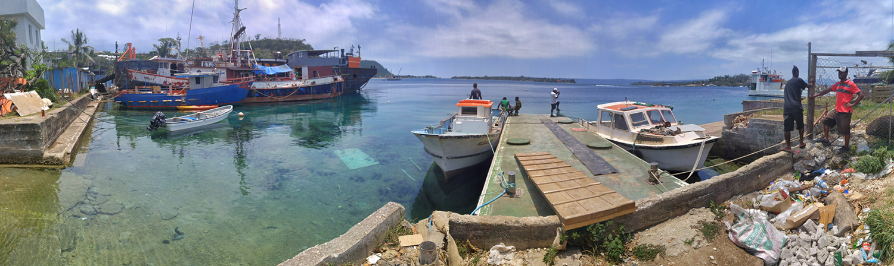

[Github](https://github.com/mpolinowski/floating-menu-button-react-component)

## A Material Design Floating Menu Button

React component to be used in react applications. Single button, that - when clicked - expands child buttons.

## How to use

1. Clone / Download Repository
2. npm install
3. npm start
4. open localhost:8080