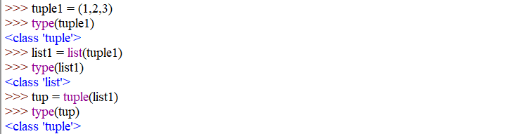

<!-- TOC depthFrom:2 depthTo:4 -->

- [Python - Introduction](#python---introduction)
  - [Hello World](#hello-world)
  - [User Input](#user-input)
  - [Variables](#variables)
  - [Data Types](#data-types)
    - [Strings](#strings)
    - [Numbers](#numbers)
    - [Booleans](#booleans)
    - [Lists](#lists)
    - [Set](#set)
    - [Tuples](#tuples)
    - [Ranges](#ranges)
    - [Dictionaries](#dictionaries)
    - [Conversion between Data Types](#conversion-between-data-types)

<!-- /TOC -->


## Python - Introduction

### Hello World

```python
print("Hello World")
```

### User Input

```python
user_says = input ("Please enter a string: ")

print(user_says)
```

`user_says` is a Python variable that is used to store data, in this case it is assigned the string from the input function. We can then print out the variable to see if it worked.


### Variables


### Data Types

* mutable data type
    * lists
    * dictionaries
    * sets
*  immutable data types
   *  strings
   *  numbers
   *  tuples
   *  frozensets


#### Strings


#### Numbers


#### Booleans


#### Lists


#### Set

Sets = unordered lists of __unique items__.


You can create a set from a list to remove duplicates.


Just as list before sets are mutable - you can add or remove elements at will. To create an immutable set from a list you have to use __FrozenSets__:


#### Tuples

Tuples are immutable list - elements cannot be added or removed once the tuples was created.


Tuples allow you to map values to variables by assigning a tuple, made up of variables, to a tuple, made up of values:


#### Ranges


#### Dictionaries

Dictionaries are an unordered list of key-value pairs. Every key has to be unique and should be of an immutable type - strings, numbers or tuples.


#### Conversion between Data Types



