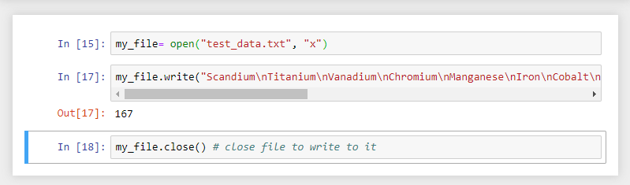

<!-- TOC depthFrom:2 depthTo:4 -->

- [IF Elif Else](#if-elif-else)
- [For For-Else](#for-for-else)
  - [Looping through Arrays](#looping-through-arrays)
  - [Looping through Strings](#looping-through-strings)
  - [Working with Ranges](#working-with-ranges)
- [While While-Else](#while-while-else)
- [Nested Statements](#nested-statements)
  - [If](#if)
  - [For](#for)
  - [While](#while)
- [Controlling a Loop](#controlling-a-loop)
  - [Break](#break)
  - [Continue](#continue)
  - [Pass](#pass)
- [Exceptions Handling](#exceptions-handling)
- [Functions](#functions)
  - [Arguments](#arguments)
- [Namespaces](#namespaces)
- [Importing Modules](#importing-modules)
  - [Custom Module](#custom-module)
  - [Thirdparty Modules](#thirdparty-modules)
- [Working with Files](#working-with-files)
  - [Reading](#reading)
  - [Writing](#writing)
  - [Closing a File](#closing-a-file)
- [Regular Expressions](#regular-expressions)
  - [match()](#match)
  - [search()](#search)
  - [findall()](#findall)
  - [sub()](#sub)
- [Object Oriented Programming](#object-oriented-programming)
  - [Class Inheritance](#class-inheritance)

<!-- /TOC -->


<br/><br/><hr/>

## IF Elif Else


<br/><br/><hr/>

## For For-Else

### Looping through Arrays


### Looping through Strings


### Working with Ranges


We can use the `len()` function to assign an index to an array, loop through the elements and print out their by their assigned index:


A similar result can be achieved with the `enumerate()` function, that will give us both the index, as well as the value of the array element:


We can also add an __Else__ statement to the __For Loop__ that is triggered when the loop reaches the end of the list:


<br/><br/><hr/>

## While While-Else


<br/><br/><hr/>

## Nested Statements

### If

The first __If Statement__ checks if the string has the letter __a__ in it. If true, the second if statement is triggered and checks if the length of the string is greater than 6. Only if both statements are true, we will get a printout of the string itself and it's length:


This code can be shortened by using the __And Operator__ instead of the inner if statement:


### For


### While

In the following nested __While Loop__ we have __x__ being incremented with each loop until x reaches the value of 10. Each time the first while loop runs, the inner while loop is triggered to run until the value of __z__ reaches 10. This is repeated ten times until __x = 10__:


<br/><br/><hr/>

## Controlling a Loop

### Break


The loop runs until the if statement becomes __True__ and the break command is executed.


In the second example we have a for loop that tries to multiply every element of _list1_ with every element in _list2_. But the __Break__ command stops the execution when the last element of _list2_ is reached:

```
5 x 1 = 5
5 x 2 => break
6 x 1 = 6
6 x 2 => break
7 x 1 = 7
7 x 2 => break
8 x 1 = 8
8 x 2 => break
```


### Continue


The __Continue__ command is triggered when the second element of _list2_ is reached in the multiplication. But, unlike the __Break__ command, it does not stop the execution of the following multiplication:

```
4 x 1 = 4
4 x 2 => break 
4 x 3 = 12
5 x 1 = 5
5 x 2 => break
5 x 3 = 15
6 x 1 = 6
6 x 2 => break
6 x 3 = 18
```


### Pass


The pass statement is just a placeholder that does nothing on execution - for debugging reasons or during the early concept phase of development.


<br/><br/><hr/>

## Exceptions Handling


The function is trying to divide all members of the range by Zero, which would cause ein __Exception Error__ in our code. But because we wrapped our function in a __try/except__ block, the error triggers the code below the _except command_ instead of just crashing the program. If the first function is successful, the exception code is not triggered.


To catch all possible errors, just don't specify the error you are looking for - above we only caught `ZeroDivisionError`s. But it is recommended to rather add all possible errors to the block instead, to be able to differentiate between the possible root causes of the error (Catching all errors just gives you a generic error message):


For debugging purposes you can also add an __Else  Clause__ at the bottom to get a feedback when a function was executed successfully:


The code behind a __Finally Clause__ - unlike with __Else__ - is execute wether the function inside the __Try Block__ _was successfully executed or not_.


<br/><br/><hr/>

## Functions

Functions are code blocks that are reuseable and follows this general syntax:


A function can be given an argument:


When creating a variable inside a function, this needs to be returned, to be able to further process it:


### Arguments


In the example above, the position of the argument is mapped to according to the parameter definition - so the __first argument__ is assigned to __x__ and the __second__ one becomes the value of __y__. This is called a __Positional Argument__.


The function can also be used with __Keyword Arguments__, where the arguments are assigned explicitly:


Positional and Keyword arguments can be mixed - but the Keywords always have to follow the Positionals:


You can also define a value by a Parameter default:


This parameter is used as the default value - note that you can overwrite it by adding a different value as an argument when calling the function:


When working with an unknown amount of arguments, you can add an empty tuple as a parameter to your function definition:


For __Keyword Arguments__ the expression __**kwargs__ is used:


<br/><br/><hr/>

## Namespaces

Namespaces allow you to define multiple version of the same function or class, separated by different namespaces they are in. Python comes with 3 types of namespaces:


1. The __built-in__ namespace for built-in functions like `len()`, `max()`, etc.
2. The __global__ namespace contains all functions you define or import into your program.
3. The __local__ namespace is used inside the context of a particular function.


<br/><br/><hr/>

## Importing Modules

Python comes with a variety of modules that group sets of built-in functions. There are also plenty 3rd party modules / libraries available that can be downloaded and installed. They are brought into your program using the __import statement__:


### Custom Module

You can create a custom module by defining them in Python file, e.g. `my_module.py` :


```py
my_var = 224

def my_function():
    print("The function was called")
```

And importing it with the __import statement__ into the global namespace of your program:


```py
import my_module

print(my_module.my_var)

my_module.my_function()
```

To keep your code light, you can also just import a single element from a module:


```py
from my_module import my_function

my_function()
```


### Thirdparty Modules

Thirdparty modules can be installed with the [pip package manager](https://packaging.python.org/tutorials/installing-packages/#use-pip-for-installing). For example if we want to install the open source software library for high performance numerical computation [Tensorflow](https://pypi.org/project/tensorflow/), but we want to use the newest [alpha version](https://www.tensorflow.org/alpha) of it:


```bash
python -m pip install --upgrade pip
pip install tensorflow==2.0.0-alpha0 
```


__Note__: if you get the following error - you have Python 32bit installed. Use [64bit version](https://www.python.org/downloads/windows/) instead:


```
Could not find a version that satisfies the requirement tensorflow==2.0.0-alpha0 (from versions: )
No matching distribution found for tensorflow==2.0.0-alpha0
```


<br/><br/><hr/>

## Working with Files

### Reading

Python comes with the `open()` function that enables you to read the content from files and work with them inside your programs. You can test it by creating a text file, e.g. `test.txt`:


```txt
Hydrogen
Helium
Lithium
Boron
Beryllium
Carbon
Nitrogen
Oxygen
Fluorine
Neon
Sodium
Magnesium
Aluminium
Silicone
Phosphorus
Sulfur
Chlorine
Argon
```

And put it next to your Python file that contains your program. You can now use the `open()` method to make the file content accessible to your program, choosing one of the following modes:


* r = reading
* w = writing
* a = appending
* b = binary
* x = exclusive creation (fails if file already exists otherwise identical to the _w-mode_)
* r+, w+, a+ = all allow both writing to a file as well as reading it


To iterate over the complete list, we can use the `readlines()` method. This way we can use the complete content of the file in form of a __List__ inside our function:


### Writing

As we learnt before, we can use both the `w` or `x` method to create a new file (make sure that you have administrative access to your computer to be allowed to create the file):


```py
my_file= open("test_data.txt", "x")
my_file.write("Scandium\nTitanium\nVanadium\nChromium\nManganese\nIron\nCobalt\nNickel\nCopper\nZinc\nYttrium\nZirconium\nNiobium\nMolybdenum\nTechnetium\nRuthenium\nRhodium\nPalladium\nSilver\nCadmium")
my_file.close()
```





Check the text file - to verify that it now contains the following data:


```
Scandium
Titanium
Vanadium
Chromium
Manganese
Iron
Cobalt
Nickel
Copper
Zinc
Yttrium
Zirconium
Niobium
Molybdenum
Technetium
Ruthenium
Rhodium
Palladium
Silver
Cadmium
```

> If you use the `open()` function again on this file, this will overwrite the old content - that is why the the `x method` exist, to prevent accidental data loss.


If you need to modify an existing file - without overwriting the existing data - you have to use the `a method` to append your new input:


__Appending Data__

```py
my_file= open("test_data.txt", "a")
my_file.write("\nHafnium\nTantalum\nTungsten\nRhenium\nOsmium\nIridium\nPlatinum\nGold\nMercury\nRutherfordium\nDubnium\nSeaborgium\nBohrium\nHassium\nMeitnerium\nDarmstadium\nRoentgenium\nCopernecium")
my_file.close()
```


### Closing a File

As we have seen, we can use the `close()` to close a file and save our edits to it. To check the state of a file, we can use `my_file.closed` and will either receive a __True__ or __False__.


To do a single read or write operation and closing the file automatically afterwards, we can use the following method:


<br/><br/><hr/>

## Regular Expressions

To work with regular expressions you have to `import re` module into your program. This module offers a couple of methods that we can use:


### match()

The `match()` method __compares the beginning of the string__ to your query and returns the match object, if a match was found:


### search()

The `search()` method check the entire string for a match. We are going to use a regular expression this time:


```py
import re
arp = "10.112.78.1  0   ca:fe:ca:fe:b7:ce VLAN#345   L"
a = re.search(r"(.+?) +(\d) +(.+?)\s{2,}(\w)*", arp)
a
```

* `r` = we are going to analyze the RAW string
* First group: `(.+?)`
  * `.` represent any character, except a new-line character
  * `+?` means that the previous expression repeats one or more times - the space character after the group `(.+?) SPACE ` represents the stop signal for the expression. The added `?` stops our match before the first space `10.112.78.1` . If you remove the `?` the match will include all spaces until a new character is found `10.112.78.1 SPACE `.


* Second group: `SPACE +(\d)`
  * `SPACE +` this will flexibly match any number of space characters between the IP address from our ARP request and the following number.
  * `/d` represents a single decimal digit between 0-9


* Third Group `SPACE +(.+?)\s{2,}`
  * `SPACE +` matches all spaces between the `0` and following MAC address
  * `(.+?)\s{2,}` the first part `.+?` again matches any character. The `\s{2}` represents 2 repetitions of a white space character (SPACE, TAB or New-Line) - so that this block does not only include the MAC address, but also the following VLAN number that is separated by only 1 white space character. By adding a comma `\s{2,}` we match 2 or more white spaces and `\s{1}` would only take 1 whitespace - separating the MAC address from the VLAN number in the results, as the 1 whitespace between those two would already satisfy the match.


* Fourth Group `(\w)*`
  * `\w` matches any character __a-z__, __A-Z__, __0-9__ and the __\___ underscore
  * `*` represents 0 or more repetitions of the character before it (`+` matches 1 or more repetition)


To output all matches we can use the `group()` method without any argument. Or use the `groups()` method to return the result in form of a tuple:


### findall()

Given the same reply to an ARP request, we are now going to use the findall() method to find the IP address inside the string. This method, conveniently already returns it's match in form of a list:


```py
import re
arp = "10.112.78.223  0   ca:fe:ca:fe:b7:ce VLAN#345   L"
a = re.search(r"\d\d\.\d{2,}\.[0-9][0-9]\.[0-9]{1,3}", arp)
a
```

* `\d\d` matches 2 single digits
* `\.` now we want to find a `.` character - since this character stands for any character in regular expression syntax, we need to escape it with a backslash.
* `\d{2}` is just a different way to write `\d\d` - note that you can extend this to `\d{2,}` if you need to accept IP addresses that have 2 or 3 digits inside an octet - as seen in the example.
* `\.` another escaped dot character
* `[0-9][0-9]` another way to represent 2 digits - but this also accepts __a-z__, __A-Z__ and the __\___ underscore besides numbers.
* `\.` another escaped dot character
* `[0-9]{1,3}` and yet another way to express that we are looking for a single digit that can occur 1 - 3 times.


By surrounding every block in brackets you will get a list of tuples as a result instead - __Note__ that we added a second IP address to the string we are matching:


```py
a = re.search(r"(\d\d)\.(\d{2,})\.([0-9][0-9])\.([0-9]{1,3})", arp)
```


### sub()

The `sub()` method substitutes every matching pattern with another string that you provide as an argument:


## Object Oriented Programming

Python allows us to use classes and create multiple objects from it:


Attributes inside objects can be updated directly:


Alternatively zou can also use the `getattr()` or `setattr()` methods to to this operation. To check if an attribute is present inside an object use `hasattr()`. And delete an attribute with `delattr()`


To verify what class an object belongs to, use the isinstance() - `isinstance(router2, MyRouter)` would get you a `True` in our case.


### Class Inheritance

In the previous example we had a class that did not inherit any attributes from another class - it is convention in Python to add the _default object_ `object` to it in such a case:


```py
class MyRouter(object):
    "A descriptive string for the class"
    def __init__(self, routername, model, serialno, ios): # class constructor
        self.routername = routername
        self.model = model
        self.serialno = serialno
        self.ios = ios
        
    def print_router(self, manuf_date): # class method
        print("Router Name: ", self.routername)
        print("Router Model: ", self.model)
        print("Router Serial #: ", self.serialno)
        print("IOS version: ", self.ios)
        print("Date: ", manuf_date)
```

We can now use our class as parent class for our next example:


```py
class MyNewRouter(MyRouter):
    "A descriptive string for the class" # class constructor
    def __init__(self, routername, model, serialno, ios, portsno):
        MyRouter.__init__(self, routername, model, serialno, ios)
        self.portsno = portsno
        
    def print_new_router(self, string): # class method
        print(string, self.model)
```