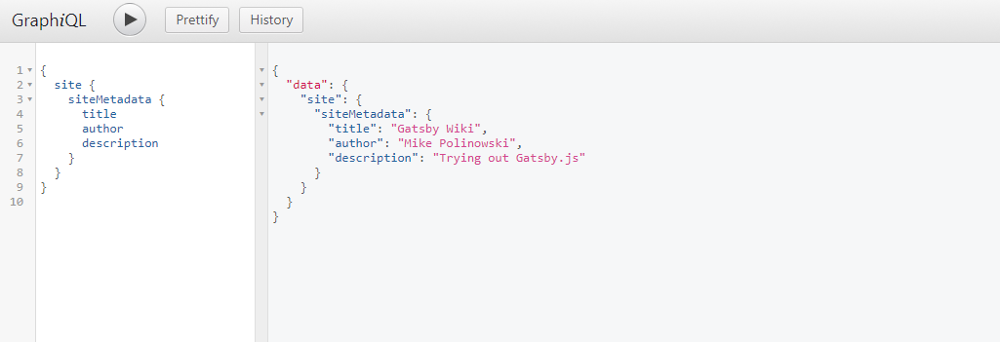
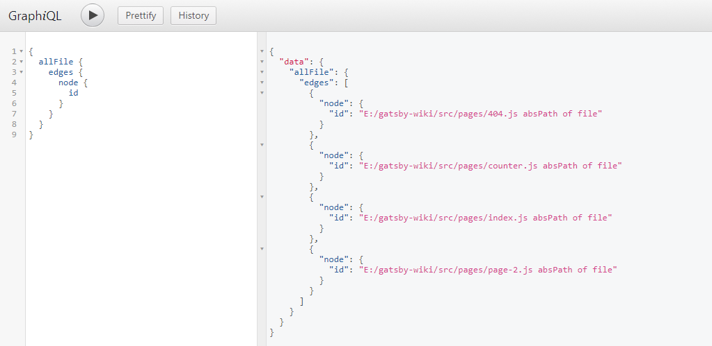
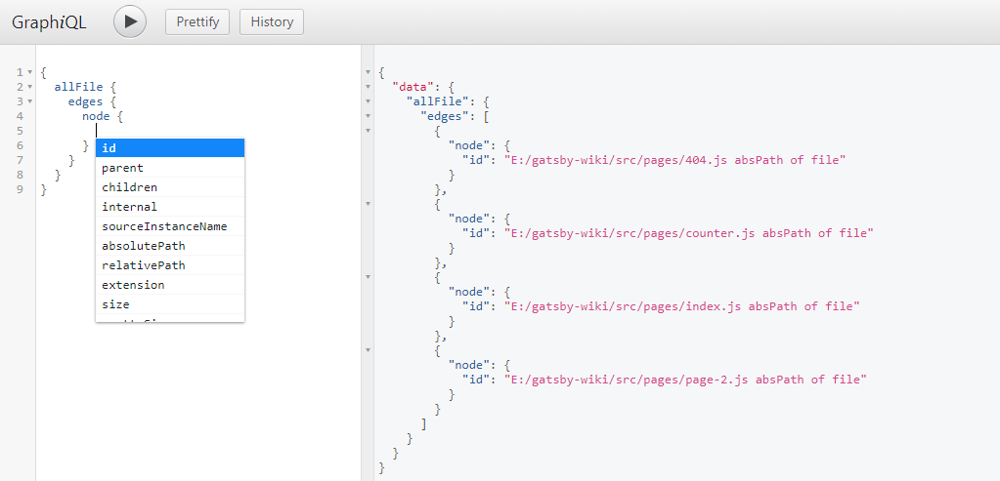
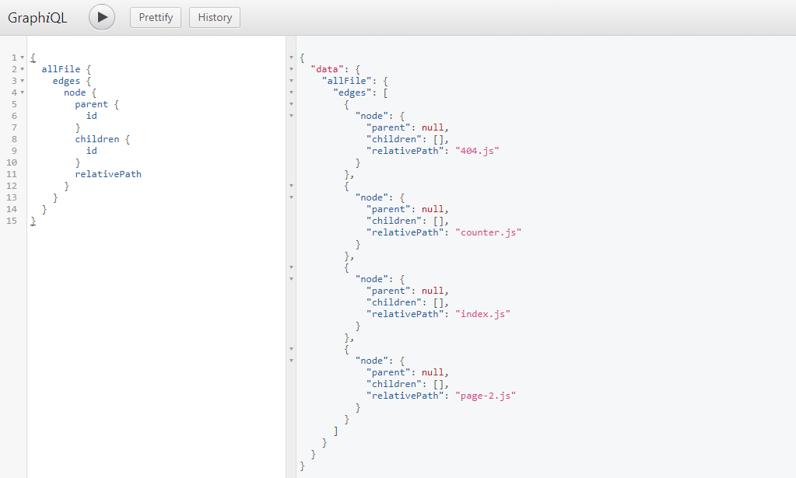
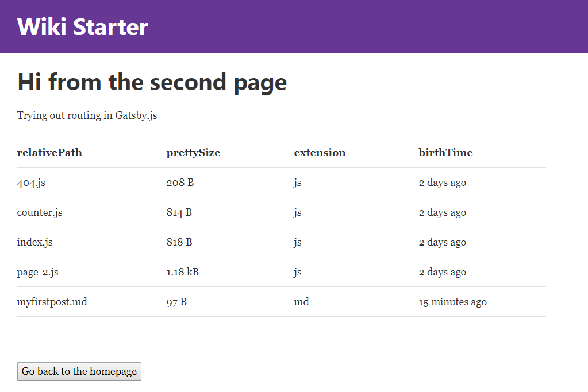
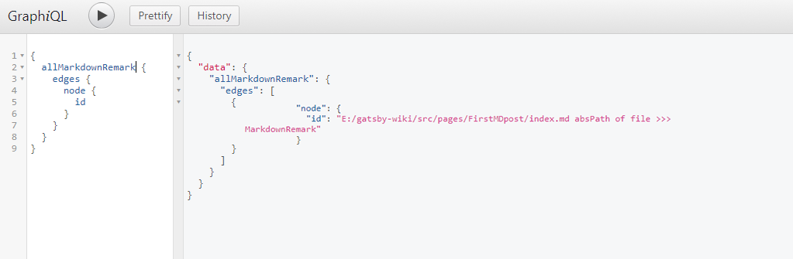
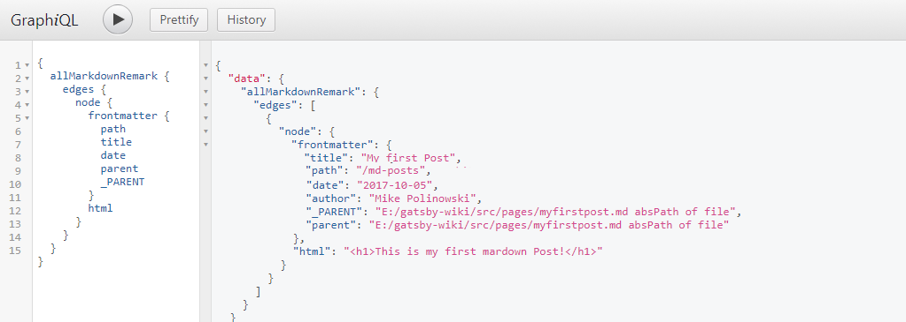
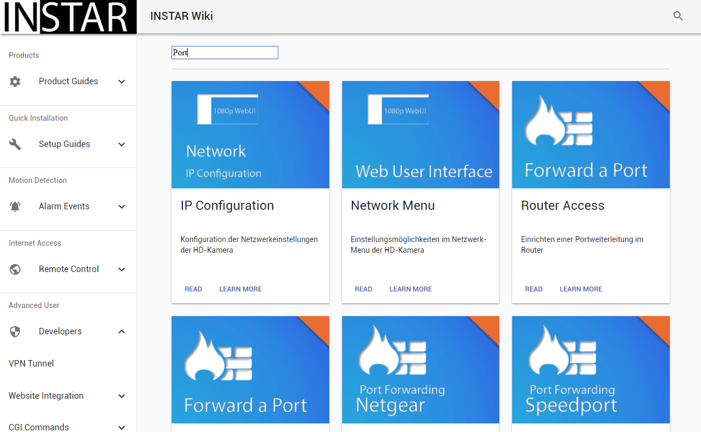

# gatsby-starter-default
The default Gatsby starter


[Github](https://github.com/mpolinowski/gatsby-wiki)


For an overview of the project structure please refer to the [Gatsby documentation - Building with Components](https://www.gatsbyjs.org/docs/building-with-components/)

Install this starter (assuming Gatsby is installed) by running from your CLI:
```
gatsby new gatsby-wiki
```

<!-- TOC -->

- [gatsby-starter-default](#gatsby-starter-default)
  - [02 Gatsby Plugins](#02-gatsby-plugins)
    - [Progress Animation](#progress-animation)
    - [Offline Support and Manifest](#offline-support-and-manifest)
  - [03 Single-Page-Application](#03-single-page-application)
  - [04 GraphQL](#04-graphql)
  - [05 Adding File Data](#05-adding-file-data)
  - [06 Working with Markdown](#06-working-with-markdown)
    - [Post Template for our Markdown Data](#post-template-for-our-markdown-data)
    - [Nested Routes with Markdown](#nested-routes-with-markdown)
    - [Creating an Index Page](#creating-an-index-page)
    - [Catching Links from Markdown](#catching-links-from-markdown)
  - [07 Adding Material-UI](#07-adding-material-ui)
  - [08 Adding Elasticsearch](#08-adding-elasticsearch)
  - [09 Build the Static Page](#09-build-the-static-page)

<!-- /TOC -->


## 02 Gatsby Plugins

[Plugins](https://www.gatsbyjs.org/docs/plugins/) are Node.js packages that implement Gatsby APIs. They enable you to easily solve common website build problems e.g. setup Sass, add markdown support, process images, etc.


### Progress Animation

In this example, we want to use a plugin for [NProgress.js](http://ricostacruz.com/nprogress/) to add a loading animation to our site. You install the [NProgress plugin](https://www.gatsbyjs.org/packages/gatsby-plugin-nprogress/) with npm:

```
npm install --save gatsby-plugin-nprogress
```

Now we have to tell Gatsby to use the plugin by editing (creating if file doesn't exist) the gatsby-config.js file inside the root directory of our app. Coming from the starter template, we already have the react-helmet plugin installed (This plugin is described below: [Page Layout](#08-page-layout)). Now simply add the gatsby-plugin-nprogress to the array:

```js
module.exports = {
  siteMetadata: {
    title: `Gatsby Wiki`,
  },
  plugins: [
      `gatsby-plugin-react-helmet`,
      {
        resolve: `gatsby-plugin-nprogress`,
        options: {
          // Setting a color is optional.
          color: `rebeccapurple`,
          // Disable the loading spinner.
          showSpinner: false,
      }
    }
  ],
}
```

### Offline Support and Manifest

We now want to add a Serviceworker to our site that helps us cache important parts of our application, giving us a certain amount of offline support - as the [Offline Plugin](https://www.gatsbyjs.org/packages/gatsby-plugin-offline/) tells us, we will also install the [Manifest Plugin](https://www.gatsbyjs.org/packages/gatsby-plugin-manifest/) (make sure, that it is listed before the Offline Plugin!).

```
npm install --save gatsby-plugin-manifest

npm install --save gatsby-plugin-offline
```

Now we add them to our Gatsby configuration:


```js
module.exports = {
  siteMetadata: {
    title: `Gatsby Wiki`,
  },
  plugins: [
      `gatsby-plugin-react-helmet`,
      {
        resolve: `gatsby-plugin-nprogress`,
        options: {
          // Setting a color is optional.
          color: `rebeccapurple`,
          // Disable the loading spinner.
          showSpinner: false,
      }
    },
    {
    resolve: `gatsby-plugin-manifest`,
      options: {
          name: "Gatsby Wiki",
          short_name: "Gatsby Wiki",
          start_url: "/",
          background_color: "white",
          theme_color: "rebeccapurple",
          display: "minimal-ui",
          icons: [
            {
              // Everything in /static will be copied to an equivalent
              // directory in /public during development and build, so
              // assuming your favicons are in /static/favicons,
              // you can reference them here
              src: `/apple-touch-icon.png`,
              sizes: `180x180`,
              type: `image/png`,
            },
            {
              src: `/favicon.ico`,
              sizes: `256x256`,
              type: `image/png`,
            },
          ],
        },
      },
      `gatsby-plugin-offline`,
  ],
}
```


## 03 Single-Page-Application

Gatsby offers an easy way to create Single-Page-Applications (__SPA's__) with it's layout feature. You can find the JSX and CSS inside _/src/layout_. The Gatsby Starter, that we are using, already uses a header navbar, that is defined inside the index.js file (and comes with the necessary css).

You can see that the app already uses [React-Helmet](https://github.com/nfl/react-helmet) as a Gatsby plugin. This reusable React component will manage all of your changes to the document \<head\>. Helmet takes plain HTML tags and outputs plain HTML tags.

The layout defines a \<Header /\> component, that - together with the \<Helmet /\> component - is used inside the \<TemplateWrapper /\>

All your content, from the pages that we created so far, is then injected into the Wrapper via the {children} tag. This way, you can create top-navbars, headers, side-navigations and footers, that are then displayed on all of your websites.


## 04 GraphQL

We can define some global variables inside gatsby-config.js in the root directory of our app:

```js
module.exports = {
  siteMetadata: {
    title: `Gatsby Wiki`,
    author: `Mike Polinowski`,
    description: `Trying out Gatsby`
  }
}
```

This Data will be available to every page and can be queried usind __GraphQL__. Just add the following GraphQL query to _/src/pages/index.js_, to get a hold of those values:

```js
export const query = graphql`
  query FirstQuery {
    site {
      siteMetadata {
        title
        author
        description
      }
    }
  }
`
```

Then we have to inject this __{data}__ into the parent component \<IndexPage /\>:

```js
const IndexPage = ({data}) =>
```

Now we are able to query this data inside the component:

```js
<h1>{data.site.siteMetadata.description}</h1>
```

Why is it __data.site.siteMetadata__? Gatsby's graphql debugger is running at _http://localhost:8000/___graphql_ you can also use it to test your queries and see how the results look. Just open the debugger and try out our previous query:





## 05 Adding File Data

With Gatsby you can use GraphQL to query Data from your files directly. Transformer plugins transform File nodes into various other types of data e.g. [gatsby-transformer-json](https://www.gatsbyjs.org/packages/gatsby-transformer-json/) transforms JSON files into JSON data nodes and [gatsby-transformer-remark](https://www.gatsbyjs.org/packages/gatsby-transformer-remark/) transforms markdown files into MarkdownRemark nodes from which you can query an HTML representation of the markdown.

In this case we will use [gatsby-source-filesystem](https://www.gatsbyjs.org/packages/gatsby-source-filesystem/) to create file nodes from our file system.

```
npm install --save gatsby-source-filesystem
```

After installation, add the plugin to gatsby-config.js. You can have multiple instances of this plugin to read source nodes from different locations on your filesystem.

The following sets up the Jekyll pattern of having a _pages_ directory for __Markdown files__ and a _data_ directory for __.json__, __.yaml__, __.csv__.:

```js
{
  resolve: `gatsby-source-filesystem`,
  options: {
    name: `pages`,
    path: `${__dirname}/src/pages/`,
  },
},
{
  resolve: `gatsby-source-filesystem`,
  options: {
    name: `data`,
    path: `${__dirname}/src/data/`,
  },
}
```

You can now open the GraphiQL debugger put in curly brackets - when you start typing allFiles, it should offer autocompletion. Just press enter to accept and __CTRL + ENTER__ again to fill out the query for all page ID's:

```
{
	allFile {
	  edges {
	    node {
	      id
	    }
	  }
	}
}
```





When you delete _id_ and press __CTRL + SPACE__, you will be given a drop down menu with all options that you can query:





Using the _parent_, _children_ and _relativePath_ attribute enables you to create e.g. a breadcrumb navigation:





We can now add a GraphQL query to _/src/pages/page-2.js_ to loop through all of our pages and display some data:

```js
export const query = graphql`
  query MyFilesQuery {
    allFile {
      edges {
          node {
            relativePath
            prettySize
            extension
            birthTime(fromNow: true)
        }
      }
    }
  }
`
```

Don't forget to inject the __{data}__ to the page component:

```js
const SecondPage = ({data}) =>
```

Now we can add some JSX that loops through all of our files and outputs the information inside a \<table\>

```js
<table>
  <thead>
    <tr>
      <th>relativePath</th>
      <th>prettySize</th>
      <th>extension</th>
      <th>birthTime</th>
    </tr>
  </thead>
  <tbody>
    {data.allFile.edges.map(({node}, index) =>
      <tr key={index}>
        <td>
          {node.relativePath}
        </td>
        <td>
          {node.prettySize}
        </td>
        <td>
          {node.extension}
        </td>
        <td>
          {node.birthTime}
        </td>
      </tr>
    )}
  </tbody>
</table>
```





## 06 Working with Markdown

Now we are able to access information about all of our pages. But as mentioned, in the beginning of the last paragraph, we are also able to use __Gatsby Transformer Plugins__ to look into files and make their content available to GraphQL.

In this case we want to use Markdown files and transform them, to be able to display their content in our website. The Transformer Plugin needed for this is [gatsby-transformer-remark](https://www.gatsbyjs.org/packages/gatsby-transformer-remark/). First we need to install the plugin:

```
npm install --save gatsby-transformer-remark
```

And add it to our _gatsby-config.js_:

```js
plugins: [
  `gatsby-transformer-remark`,
]
```

Then create a markdown page inside _/src/pages/FirstMDpost/index.md_ that contains some __FrontMatter__ (metadata in the beginning of the file, that can later be queried by GraphQL) and some text:


```
---
path: '/md-posts'
title: 'My first Post'
date:   '2017-10-05'
author: 'Mike Polinowski'
chapter: 'Index'
---

# This is my first mardown Post!
```

Now we have Markdown available in GraphQL - as before, just start typing allMardownRemark (ENTER autocompletes) and then press __CTRL + ENTER__ to complete your query:





Now we can query for the FrontMatter as well as the MD-to-HTML transformed content of each MD file we add to our pages folder:





### Post Template for our Markdown Data

The markdown represents the data that is going to be displayed. But now we need to create a style template that is used with this data. Lets start by adding a new folder inside _/src_ called templates. Now add a file to it called __post.js__ that will contain the structure template for every post entry. The file contains the JSX markup for our post:

```js
import React from 'react'

export default function Template({data}) {
  const {markdownRemark: post} = data
  
  return (
    <div>
      <h1>{post.frontmatter.title}</h1>
      <div dangerouslySetInnerHTML={{__html: post.html}} />
    </div>
  )
}

export const postQuery = graphql`
  query BlogPostByPath($path: String!) {
    markdownRemark(frontmatter: { path: { eq: $path} }) {
      html
      frontmatter {
        path
        title
      }
    }
  }
`
```
The \<Template /\> component receives \{data\} props, that are retrieved by an GraphQL query.

The query looks for a markdown post, where the called URL equals the $path given inside it's frontmatter. So if the URL that you type into your browser was _/md-posts_, a markdown file with a path: _'/md-posts'_ inside it's frontmatter, would be a hit.

The query then uses the markdownRemark plugin to transform the post markdown to HTML and make both the path and title from it's frontmatter available iside {data}, that is passed down into the <Template /> component and then rendered.

Gatsby is already configured to route all pages inside /src/pages as pages for our website. But now we have to register our posts, that are from the markdown files and the post.js template. To do this, we have to create a file named __gatsby-node.js__ inside the root directory of our app. We are going to use the [createPages Gatsby API](https://www.gatsbyjs.org/docs/node-apis/#createPages) to create pages from our post template:


```js
const path = require('path');

exports.createPages = ({boundActionCreators, graphql}) => {
  const {createPage} = boundActionCreators;
  // const createPage = boundActionCreators.createPage;

  const postTemplate = path.resolve('src/templates/post.js');

  return graphql(`{
    allMarkdownRemark {
      edges {
        node {
          html
          id
          frontmatter {
            path
            title
          }
        }
      }
    }
  }`)
  .then(res => {
    if(res.errors) {
      return Promise.reject(res.errors);
    }

    res.data.allMarkdownRemark.edges.forEach(({node}) => {
      createPage({
        path: node.frontmatter.path,
        component: postTemplate
      })
    })

  })
}
```

Save and restart your app - then open _http://localhost:8000/md-posts_ inside your web browser - Voila` !


### Nested Routes with Markdown

To create children post for the _./src/pages/FirstMDpost/index.md_ file, we can simply add more files to the folder and define nested routes inside their frontmatter - e.g.  _./src/pages/FirstMDpost/myfirstpost.md_:


```
---
path: '/md-posts/first-post'
title: 'First Blog Post'
date:   '2017-10-05'
author: 'Mike Polinowski'
chapter: 'Markdown Posts'
---

# This is my first markdown Post!
```

and _./src/pages/FirstMDpost/mysecondpost.md_:

```
---
path: '/md-posts/second-post'
title: 'Second Blog Post'
date:   '2017-10-05'
author: 'Mike Polinowski'
chapter: 'Markdown Posts'
---

# A dive into Markdown Syntax
```

They will be accessible via _http://localhost:8000/md-posts/first-post_ and _http://localhost:8000/md-posts/second-post_ respectively.


### Creating an Index Page


We can now use GraphQL to retrieve all of our Markdown pages and apply filter to them. For this test, we will just add the a table to our start page, showing the last 10 posts (I know we only made 3 so far...), we want to order them descending by date and only display pages that are inside the _chapter: 'Markdown Posts'_, which will exclude our _index.md_:


```js
const IndexPage = ({data}) => (
  <div>
      <h2>Markdown Index</h2>
      <p>The table below sorts out all Markdown pages that are not inside the "Markdown Posts" chapter - as defined inside their frontmatter. It also applies a filter, to only display the latest 10 posts. Click on here to display &nbsp;
      <Link to="/md-posts/">
          all Markdown pages
      </Link>
      .</p>
      <table>
        <thead>
          <tr>
            <th>Date</th>
            <th>Link</th>
          </tr>
        </thead>
        <tbody>
        {data.allMarkdownRemark.edges.map(post => (
          <tr key={post.node.id}>
            <td>
              {post.node.frontmatter.date}
            </td>
            <td>
              <Link
                to={post.node.frontmatter.path}>
                {post.node.frontmatter.title}
              </Link>
            </td>
          </tr>
        ))}
        </tbody>
      </table>
  </div>
)

export const pageQuery = graphql`
  query IndexQuery {
      allMarkdownRemark(limit: 10
      sort: {fields: [frontmatter___date], order: DESC}
      filter: { frontmatter: { chapter: {eq: "Markdown Posts"} }}
    ) {
      edges {
        node {
          id
          frontmatter {
            path
            title
            date
          }
        }
      }
    }
  }
`
```


### Catching Links from Markdown


Once you start adding links inside your Markdown files, you will notice that clicking them will reload your application - which isn't good :( But no worries here is [gatsby-plugin-catch-links](https://www.gatsbyjs.org/packages/gatsby-plugin-catch-links/) coming to your rescue! And the nice thing about it - you install it, add to your Gatsby plugins inside _./gatsby-config.js_ and it just works:

```
npm install --save gatsby-plugin-catch-links
```

```js
// In your gatsby-config.js
plugins: [
  `gatsby-plugin-catch-links`,
]
```

Sweet!


## 07 Adding Material-UI

To make our life easier, we want to include ready-to-use material design components from the guys @ [Material-UI](https://material-ui-next.com/getting-started/installation/). We are going to install the beta version of v.1.0.0 - which also requires the [Roboto Fontface](https://material-ui-next.com/style/typography/#general) and the [Material-UI Icons](https://www.npmjs.com/package/material-ui-icons):

```
npm install material-ui@next --save

npm install typeface-roboto --save

npm install material-ui-icons --save
```

We can now easily import Material-UI components into our app:

```js
import React from 'react'
import { render } from 'react-dom'
import Button from 'material-ui/Button'
import 'typeface-roboto'

function AppWithButton() {
  return (
    <Button>
      Hello World
    </Button>
  );
}

render(<AppWithButton />, document.querySelector('#app'));
```


## 08 Adding Elasticsearch

One of the pre-requisites for this project is, that we need to create a lightning-fast interface for [our ElasticSearch Index](https://github.com/mpolinowski/express-static/tree/master/elasticsearch). We already build the [ES6 Class component](https://github.com/mpolinowski/elasticsearch-react-example) for it. And adding it to Gatsby / Material-UI turned out to be surprisingly straight-forward.

First, add _./src/pages/search/jsx_ and modify the [ElasticSearch Component](https://github.com/mpolinowski/elasticsearch-react-example) to play nice with our UI:

```js
import React, { Component } from 'react'
import Link from 'gatsby-link'
import elasticsearch from 'elasticsearch'

import { withStyles } from 'material-ui/styles'
import Grid from 'material-ui/Grid'
import Button from 'material-ui/Button'

import ResultCards from '../components/ResultCards'

const connectionString = 'localhost:9200'
const _index = 'wiki2_de_2017_09_09'
const _type = 'article'

let client = new elasticsearch.Client({
  host: connectionString,
  log: "trace"
})

const rootStyle = {
    flexGrow: 1,
    marginTop: 30,
  }

export class Search extends Component {
  constructor(props) {
    super(props)
      this.state = { results: [] };
      this.handleChange = this.handleChange.bind(this)
    }

    handleChange(event) {
      const search_query = event.target.value;

      client.search({
  			index: _index,
  			type: _type,
  			body: {
  				query: {
  						multi_match: {
  								query: search_query,
  								fields: ['title^100', 'tags^100', 'abstract^20', 'description^10', 'chapter^5', 'title2^10', 'description2^10'],
  								fuzziness: 1,
  							},
  					},
  			},
  		}).then(function(body) {
            this.setState({ results: body.hits.hits });
          }.bind(this),
          function(error) {
            console.trace(error.message);
          }
        );
    }

    render() {
      return (
        <div className="container">
          <input type="text" onChange={this.handleChange} />
          <SearchResults results={this.state.results} />
        </div>
      );
    }
}

const SearchResults = ({results}) => (
  <div className="search_results">
  <br/><hr/>

  <div className={rootStyle}>
    <Grid container spacing={24}>
      {results.map((result , i) =>
        <ResultCards key={i}
                     image={result._source.image}
                     title={result._source.title2}
                     link={result._source.link}
                     abstract={result._source.abstract}/>
      )}

      </Grid>
    </div>
    <br/><br/><Link to="/" style={{ textDecoration: 'none' }}><Button raised color="primary">Go back to the homepage</Button></Link>
  </div>
)

export default Search
```

The \<SearchResults /\> component iterates over the Material UI card inside \<ResultCards /\>:


```js
import React from 'react'
import Link from 'gatsby-link'

import Card, { CardActions, CardContent, CardMedia } from 'material-ui/Card'
import Button from 'material-ui/Button'
import Typography from 'material-ui/Typography'
import Grid from 'material-ui/Grid'

const ResultCards = ({image, title, abstract, link}) => (

    <Grid item xs={12} sm={6} lg={4}>
      <Card style={{ maxWidth: 345 }}>
        <CardMedia
          style={{ height: 200 }}
          image={image}
          title={abstract}
        />
        <CardContent>
          <Typography type="headline" component="h4" style={{ minHeight: 60, marginBottom: "10px" }}>
            {title}
          </Typography>
          <Typography component="p" style={{ minHeight: 50, marginBottom: "10px" }}>
            {abstract}
          </Typography>
        </CardContent>
        <CardActions>
          <Link to={link} style={{ textDecoration: 'none' }}>
            <Button dense color="primary">
              Read
            </Button>
          </Link>
          <Button dense color="primary">
            Learn More
          </Button>
        </CardActions>
      </Card>
    </Grid>
)

export default ResultCards
```


and adds the results from the ElasticSearch JSON response - giving us a nice responsive card grid (the images used below are not inside this repository - just add a few PNG files (597x382) to _./public/images/Search_, named according to the image URL defined inside [our ElasticSearch Index](https://github.com/mpolinowski/express-static/tree/master/elasticsearch):





## 09 Build the Static Page

We now want to move our website from the development environment to our webserver. Gatsby offers us a simple command to build render our React.js page into a static website:

```
npm run build
```

You can find the output inside the _/public_ folder of your Gatsby App.