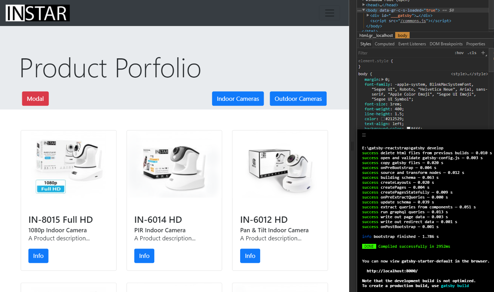

# Gatsby.js & Bootstrap 4


[Github](https://github.com/mpolinowski/gatsby-reactstrap)


Let's try to use the static site generator for React - [Gatsby](https://www.gatsbyjs.org) together with the Bootstrap 4 React components from [reactstrap](https://reactstrap.github.io). To get started, I want to reproduce one of the official examples from [getbootstrap.com](http://getbootstrap.com/docs/4.0/examples/album/).



## Install Gatsby's command line tool

```
npm install --global gatsby-cli
```


## Using the Gatsby CLI

1. Create a new site. __gatsby new gatsby-reactstrap__
2. __cd gatsby-reactstrap__
3. __gatsby develop__ — Gatsby will start a hot-reloading development environment accessible at localhost:8000


## Install reactstrap

```
npm install bootstrap@4.0.0-beta.2 --save

npm install --save reactstrap@next
```

### Optional Dependencies

These libraries are not included in the main distribution file reactstrap.min.js and need to be manually included when using components that require transitions or popover effects (e.g. Tooltip, Modal, etc).

* [react-transition-group](https://www.npmjs.com/package/react-transition-group)
* [react-popper](https://www.npmjs.com/package/react-popper)


## Import the Components

Import Bootstrap CSS in the ./src/layouts/index.jsx file:

```js
// import 'bootstrap/dist/css/bootstrap.min.css';
```

__UPDATE__:
The import statement above works fine during development. But the Bootstrap CSS will not be imported when you build your static site - _gatsby build_

You can copy the minified CSS to into the _./src/layouts_ folder and change the import accordingly:

```js
import './bootstrap.min.css';
```

Import required reactstrap components within your custom component files e.g. _./src/components/ReactNavbar.jsx_:

```js
import {
  Collapse,
  Navbar,
  NavbarToggler,
  NavbarBrand,
  Nav,
  NavItem,
  NavLink,
  Button
} from "reactstrap";
```

And add the react class according the [reactstrap documentation](https://reactstrap.github.io/components/navbar/):

```js
export default class ReactNavbar extends React.Component {
  constructor(props) {
    super(props);

    this.toggleNavbar = this.toggleNavbar.bind(this);
    this.state = {
      collapsed: true
    };
  }

  toggleNavbar() {
    this.setState({
      collapsed: !this.state.collapsed
    });
  }
  render() {
    return <div>
        <Navbar color="dark" light>
          <NavbarBrand to="/" className="mr-auto">
            
          </NavbarBrand>
          <NavbarToggler onClick={this.toggleNavbar} className="mr-2" />
          <Collapse isOpen={!this.state.collapsed} navbar>
            <Nav navbar>
              <NavItem>
                <Link to="/">
                  <Button color="primary" block>
                    Indoor Cameras
                  </Button>
                </Link>
              </NavItem>
              <NavItem>
                <Link to="/page-2/">
                  <Button color="primary" block>
                    Outdoor Cameras
                  </Button>
                </Link>
              </NavItem>
              <NavItem>
                <NavLink href="https://github.com/mpolinowski/gatsby-reactstrap" target="_blank">
                  <Button color="danger" block>
                    Github Repository
                  </Button>
                </NavLink>
              </NavItem>
            </Nav>
          </Collapse>
        </Navbar>
      </div>;
  }
}
```

This component can then be imported into any page or layout you want:

```js
import ReactNavbar from '../components/ReactNavbar'
[...]
<ReactNavbar />
```


## Testing your build

Stop the development process and type in the following command to build the static version of your React App:

```
gatsby build
```

To quickly check your build, you can use httpster:

```
npm install httpster -g
```

Then run your build on localhost:3000 - e.g. if you have your repository in _E:\gatsby-reactstrap_ - by typing:

```
httpster -p 3000 -d /e/gatsby-reactstrap/public
```

__For Windows User__:
I noticed that httpster does not seem to like my [Hyper Terminal](https://hyper.is) - it runs fine in [Git Bash](http://gitforwindows.org).


## Setting up a Webserver

I want to use [Express.js](https://expressjs.com) to serve the generated static files:

```
npm install express --save
npm install compression --save
```

Add an index.js file to the root directory of your app _./index.js_ and copy in the following code to serve the _./public_ folder on _localhost:8888_:

```js
const express = require("express");
const app = express();
const compression = require("compression");
// compress all responses
app.use(compression());

app.use(express.static("public"));

app.listen(8888, () => console.log("gatsby-reactstrap listening on http://localhost:8888"));
```

Now add a start script to your _./package.json_ file to allow you to start your server by typing __npm start__:

```
[...],
  "scripts": {
    "start": "node ./index.js"
  },
[...]
```