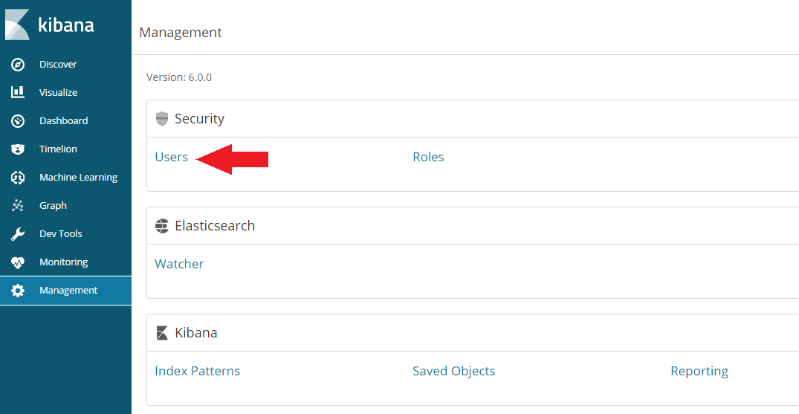
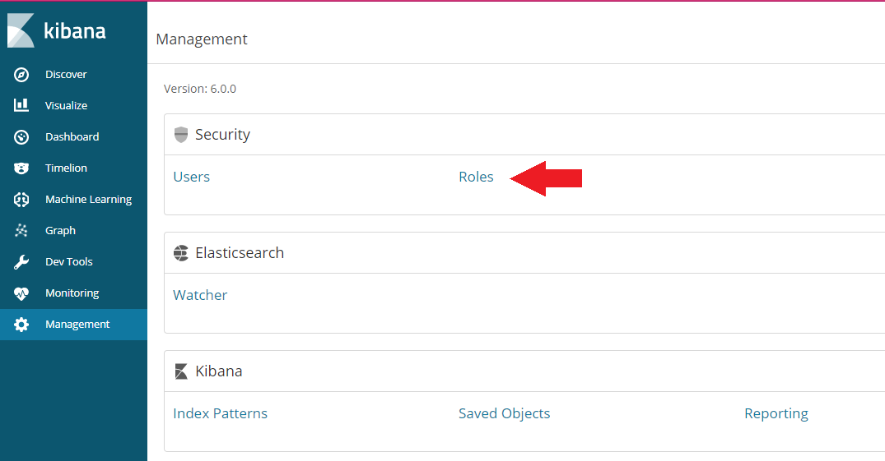

<!-- TOC -->

- [Install X-Pack](#install-x-pack)
  - [Elasticsearch Security](#elasticsearch-security)
  - [Kibana Security](#kibana-security)
  - [Enabling Anonymous Access](#enabling-anonymous-access)
- [Securing Elasticsearch with ReadonlyREST](#securing-elasticsearch-with-readonlyrest)
- [Install Elasticsearch](#install-elasticsearch)
  - [I. Download and install the public signing key](#i-download-and-install-the-public-signing-key)
  - [II. Add the following in your /etc/yum.repos.d/ directory in a file with a .repo suffix, for example elasticsearch.repo](#ii-add-the-following-in-your-etcyumreposd-directory-in-a-file-with-a-repo-suffix-for-example-elasticsearchrepo)
  - [III. Install a specific version of Elasticsearch](#iii-install-a-specific-version-of-elasticsearch)
  - [IV. Restrict access to your Elasticsearch instance](#iv-restrict-access-to-your-elasticsearch-instance)
  - [V. Set up the Elasticsearch Service](#v-set-up-the-elasticsearch-service)
- [Install Kibana](#install-kibana)
- [Secure Elasticsearch](#secure-elasticsearch)

<!-- /TOC -->

In an earlier project we set up Elasticsearch to only be accessible via localhost to protect our data. This worked well, since we build our static website server side in Node/Express/EJS and send ready HTML to our client - already containing the rendered response from the database. But what if our app runs client-side?


The official solution is part of the Elastic Extension Pack, which contains a lot of functionality that you might not really need - and comes at a prize that isn't quoted anywhere... That isn't very inviting ~ but lets take a look at it before turning to some free open source alternatives:

* [Elastic X-Pack](https://www.elastic.co/downloads/x-pack)
* [SearchGuard](https://github.com/floragunncom/search-guard)
* [ReadOnlyREST](https://github.com/sscarduzio/elasticsearch-readonlyrest-plugin)


## Install X-Pack

X-Pack is a single extension that integrates handy features — security, alerting, monitoring, reporting, graph exploration, and machine learning — you can trust across the Elastic Stack.

### Elasticsearch Security

We need to add a user athentication to our Elasticsearch / Kibana setup. We will do this by installing X-Pack. To get started with installing the Elasticsearch plugin, go to _/etc/elasticsearch/_ and call the following function:

```
bin/elasticsearch-plugin install x-pack
```

Now restart Elasticsearch:

```
sudo systemctl stop elasticsearch.service
sudo systemctl start elasticsearch.service
```

You can either use the auto function to generate user passwords for Elasticsearch, Kibana (and the not yet installed Logstash):

```
bin/x-pack/setup-passwords auto
```

or swap the _auto_ flag with _interactive_ to use your own user logins. The auto output will look something like this:

```
Changed password for user kibana 
PASSWORD kibana = *&$*(80gfddzg

Changed password for user logstash_system
PASSWORD logstash_system = 58#$)Qljfksh

Changed password for user elastic
PASSWORD elastic = jgfisg)#*%&(@*#)
```

__Now every interaction with Elasticsearch or Kibana will require you to authenticate with _username: elastic_ and _password: jgfisg)#*%&(@*#)___


### Kibana Security

Now we repeat these steps with Kibana. First navigate to _/etc/kibana/_ and call the following function:

```
bin/kibana-plugin install x-pack
```

And we have to add the login that Kibana has to use to access Elasticsearch (auto generated above) to the _kibana.yml_ file in _/etc/kibana/_:

```
elasticsearch.username: "kibana"
elasticsearch.password:  "*&$*(80gfddzg"
```

Now restart Kibana:

```
sudo systemctl stop kibana.service
sudo systemctl start kibana.service
```

Now navigate your browser _http://localhost:5601/_ and login with the "elastic" user we generated above.


### Enabling Anonymous Access

Incoming requests are considered to be anonymous if no authentication token can be extracted from the incoming request. By default, anonymous requests are rejected and an authentication error is returned (status code 401). To allow anonymous user to send search queries (Read access to specified indices), we need to add the following lines to the _elasticsearch.yml_ file in _/etc/elasticsearch/_:

```
xpack.security.authc:
  anonymous:
    username: anonymous_user 
    roles: wiki_reader 
    authz_exception: true 
```

Now we have to switch to the Kibana webUI on _http://localhost:5601/_ and create the _role:_ *wiki_reader* to allow read access to the wiki indices. First switch to the __Management__ tab and click on user:




Then click on __Add a User__ and add a user with the __watcher_user__ role:


Switch back to the __Management__ tab and click on role:




Click on __Create Role__ and add the name **wiki_reader** that we choose for the role of the anonymous user inside the elasticsearch.yml file, assign the **monitor_watcher** privilege and choose the indices that you want the anonymous user to have __READ__ access to:


Your configuration will be active after restarting Elasticsearch. Now you can use webservices to read from your ES database. But only the __elastic__ user has the privileg to __WRITE__ and to work in Kibana.