<!-- TOC depthFrom:2 depthTo:4 -->

- [Prerequisite](#prerequisite)
- [SciKit Introduction](#scikit-introduction)
  - [Data Representation](#data-representation)
  - [Data Preprocessing](#data-preprocessing)
  - [SciKit-Learn API](#scikit-learn-api)
  - [Estimation](#estimation)
  - [Predictor](#predictor)
  - [Transformer](#transformer)
- [Unsupervised Learning Introduction](#unsupervised-learning-introduction)
  - [Clustering Tasks](#clustering-tasks)
- [Unsupervised Learning IRL](#unsupervised-learning-irl)
  - [Clustering](#clustering)
  - [Visualization](#visualization)
  - [k-Means Algorithm](#k-means-algorithm)
    - [Initialization Methods](#initialization-methods)
  - [Mean-Shift Algorithm](#mean-shift-algorithm)
  - [DBSCAN Algorithm](#dbscan-algorithm)
  - [Evaluating Performance](#evaluating-performance)
- [Supervised Learning Introduction](#supervised-learning-introduction)
  - [Classification Tasks](#classification-tasks)
  - [Regression Tasks](#regression-tasks)
- [Supervised Learning IRL](#supervised-learning-irl)
  - [Data Split](#data-split)
  - [Cross Validation](#cross-validation)
  - [Metric Evaluation](#metric-evaluation)
  - [Table of Confusion](#table-of-confusion)
    - [Evaluation of Tasks with binary output labels](#evaluation-of-tasks-with-binary-output-labels)
    - [Evaluation of Regression Tasks](#evaluation-of-regression-tasks)

<!-- /TOC -->


An Introduction in building machine learning applications with the SciKit Python library. Learn data preprocessing and implement supervised and unsupervised algorithms as well as performing error analysis to evaluate their performance.


# Prerequisite

First we need to install the [Anaconda Environment](https://www.anaconda.com/download/) for Windows, macOS or LINUX. This package combines everything we need to get started with Python. From libraries like [SciKit-Learn](https://scikit-learn.org/stable/), Pandas and Matplotlib to Jupyter Notebook, that will help us to execute our Python scripts.

We will begin working with the [Seaborn Package](https://anaconda.org/anaconda/seaborn) dataset that is included in the Anaconda package to become familiar with Python based data analysis.

In the later steps, we are going to use publicly available data from the [UCI Archive](https://archive.ics.uci.edu):

* [Wholesale Customer Dataset](http://archive.ics.uci.edu/ml/datasets/Wholesale+customers)

* [Adult Fertility Study](https://archive.ics.uci.edu/ml/datasets/Fertility)
  * https://archive.ics.uci.edu/ml/machine-learning-databases/00244/
  * https://archive.ics.uci.edu/ml/machine-learning-databases/adult/

* [Bank+Marketing Study](https://archive.ics.uci.edu/ml/datasets/Bank+Marketing)
  * https://archive.ics.uci.edu/ml/machine-learning-databases/00222/


# SciKit Introduction

[SciKit-Learn](https://scikit-learn.org/) is a OpenSource library for building models based on built-in machine learning and statistical algorithms. The library offers both supervised and unsupervised models, that we will use to analyze our data with.

The library is used to:

* Interpret data and train models
* Perform predictions from data sets
* Cross validation and performance metric analysis
* To create sample data sets and test algorithms


## Data Representation

To feed data into SciKit it needs to be represented as a table or matrix. Most data used in machine learning is 2-dimensional - that means it can be represented by a classical Excel sheet with rows and columns:

* Rows represent observations (instances)
* Columns represent characteristics (features)

Datasets often have many features that will be represented in the __Feature Matrix__. In most cases it will only be one or two features that will separated for the later analysis of the data set - this skimmed down dataset is called the __Target Matrix__:


__Feature Matrix__

* Contains data from each instance for all features
* The dimensions of the matrix are `[n_i, n_f]` denoting the number of instances and features.


__Target Matrix__

* Is usually 1-dimensional as it only contains 1 feature for all instances. If more than 1 feature is necessary to describe the model the dimension increases accordingly.


The Feature Matrix is usually stored in the variable __X__, while the variable __Y__ is used to store the __Target Matrix__. Both matrices can be created by using a __NumPy Array__ or a __Panda DataFrame__. 


In the following example we are going to look at plant statistic from the [Seaborn Package](https://anaconda.org/anaconda/seaborn) included in the [Anaconda Environment](https://www.anaconda.com/download/). Each row in the set will represent a species of the Setosa family and columns represent the plant characteristics of the sepal as well as petal length and width:


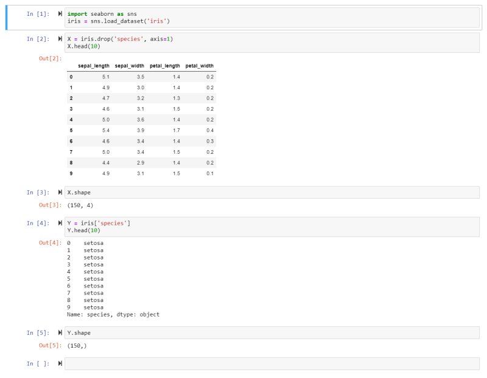


1. We import the __Seaborn__ package into the variable __sns__.
2. We can now extract the __Iris Dataset__ from it and store the data inside the variable __iris__.
3. We then drop the __Species Feature__ from the dataset and store it inside the variable __X__. Thus the __Feature Matrix__ consists of all the features __BUT__ the target for all instances. Making it a 2 dimensional dataset.
4. Now we can have a look at the top 10 rows of our data to get an idea what it looks like.
5. The __Shape__ command shows us that we have a __Feature Matrix__ that consists of _150 rows_ (instances) and _4 columns_ (features).
6. We will now build the __Target Matrix__ based on the __Species Feature__ and store it in the variable __Y__.
7. And we see that the first 10 species all belong to the Setosa family. The __Target Matrix__ is now reduced from the earlier 2 to 1 dimension - only consisting of the target feature for all instances.


## Data Preprocessing

IRL datasets are usually not analysis-friendly (__messy data__), as they are containing _noisy data_, _missing entries_ and _outliers_ that need to be dealt with before feeding them to our algorithm.


__Dealing with Missing Values__:


* Eliminate Data
* Or Replace it
  * __Mean Imputation__ - filling out missing fields using the mean or median value (_may introduce bias to our model_)
  * __Regression Imputation__ - Use prediction to fill out the values (_may end up overfitting the model_)
* String-based values should be replaced with a class (_like  "uncategorized"_) 


__Dealing with Outliers__:

Outliers represent values that are far from the mean (often set to __3-6 standard deviations__ when the data set follows a Gaussian distribution). If the values follow a Gaussian distribution, _global outliers_ are located at the tails of the bell curve. While _local outliers_ are inside the distribution but far off the group of data points they are associated with. E.g. a vehicle that can drive 500 MPH is a global outlier in a car statistic. While a truck that only has 40 hp is a local outlier in the group labeled as trucks, but is still well inside the curve of the vehicle dataset.


* Delete Outliers.
* If all instances above a certain value of a feature behave the same way, you can __define a top__ for that feature and apply it to outliers.
* Replace the value (__Mean__ or __Regression__).
* String values (e.g. misspelled features) can be eliminated or corrected (when possible).


In the following example we will again use the [Seaborn Package](https://anaconda.org/anaconda/seaborn) included in the [Anaconda Environment](https://www.anaconda.com/download/) and take a look at the age of the passengers of the __Titantic__:


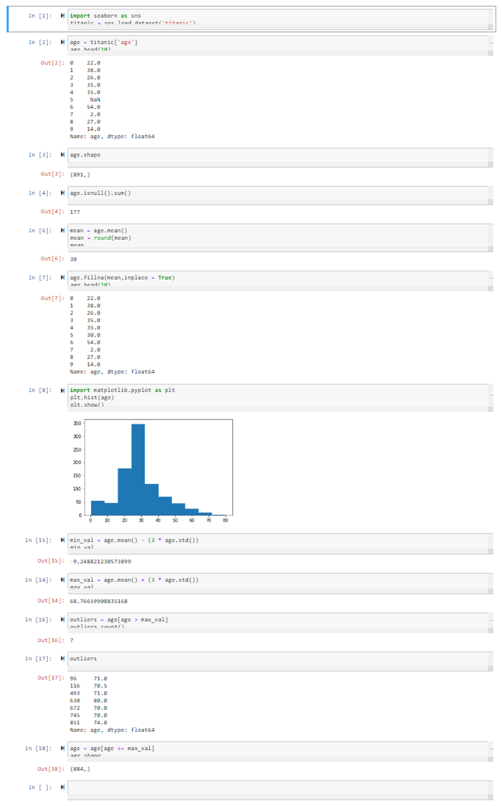


1. We import the __Seaborn__ package and store the __Titanic Dataset__ inside the variable _titanic_.
2. We then load the __Age Feature__ from the dataset and store it in the variable _age_.
3. Displaying the first 10 rows shows us that we already have a missing entry (__NaN__, _not a number_). The _shape_ command shows us that there are 891 rows in total. 
4. We can check how many of those 891 have a value of NaN with the _isnull_ function. Summing them up shows us that we have 177 passengers of the Titanic where we do not know there age.
5. We can now use the __Mean Method__ to replace all of those with the mean age. For this we call the mean method on the values in _age_, round them up and store them inside the variable _mean_. Printing out the value, we can see that the mean age was _30_.
6. We can now use the __fillna Method__ to fill out every value that is NaN with the mean value. Taking a look at the first 10 rows again shows that the missing value has now been filled with the mean value 30.
7. To display our distribution - to be able to spot __Outliers__ - we import _PyPlot_ from the _MatPlotLib_ library as _plt_. We use the plt method to build a histogram of the values stored inside the _age_ variable and display the output with the show function.
8. To spot outliers we will set the __Minimum Value__ that we will accept for our model as the mean value for age MINUS _3-times the standard deviation_ of the age dataset. This turns out to be a negative value - given that this does not make any sense in our particular dataset, we can ignore outliers on minimum side of the distribution.
9. To spot outliers we will set the __Maximum Value__ that we will accept for our model as the mean value for age PLUS _3-times the standard deviation_ of the age dataset. Everyone who is listed as ~ 69 or above can be treated as an outlier.
10. We can thus define our _outlier_ variable as every value inside _age_ that is greater than _max\_val_. Counting the outliers shows us that we have _7_ inside our dataset.
11. We decide to remove all outliers from our dataset by only accepting values into our _age_ variable that are smaller or equal to _max\_val_. The shape command shows us that out of the initial 891 passengers we now eliminated 7 from our analysis - _884_.


## SciKit-Learn API

SciKit-Learn offers us a unified syntax to make machine learning more accessible. The SciKit-Learn API is divided into 3 interfaces:

* __Estimator Interface__: Used to create models and integrate your data.
* __Predictor Interface__: Used to make predictions based on the models created.
* __Transformer Interface__: Used to transform data files.


## Estimation

This is the interface that you use to initialize a model and apply a fit() method to your data. Your data is received as two variables - __X_train__ is the feature matrix and __Y_train__ the target matrix for your model. _Unsupervised Models_ only use the first of those two arguments. A _Supervised Model_ takes both.


```python
from sklearn.naive_bayes import GaussianNB
model = GaussianNB()
model.fit(X_train, Y_train)
```

In the example of a supervised model, we imported the model we want to use, store it in the variable `model` and then apply it to our two arguments using the fit() method.


The Estimator can perform 3 more tasks for us:

* __Feature Extraction__: A transformation of the input data into numerical features.
* __Feature Selection__: Selecting a feature from your data that most contributes to the prediction output.
* __Dimensionality__: Converting your data into a lower dimension.


## Predictor

The Predictor interface performs prediction based on the model you trained. In supervised models it creates a new dataset called __X_test__ and re-feeds it to your model. The implementation looks as follows:


```python
Y_pred = model.predict(X_test)
```

This allows us to quantify the __Confidence__ or __Performance__ of a model by comparing how far _X\_test_ differs from _Y\_test_.


## Transformer

The Transform interface gives us a transform() method to preprocess our input data. Using the same transformation for the data that we use to train our model as well as the for the data we later use the model on to perform predictions ensures that both datasets are comparable in their distribution. An example is the __Normalization__ of a dataset:


```python
from sklearn.preprocessing import StandardScaler
scaler = StandardScaler()
scaler.fit(X_train)
X_train = scaler.transform(X_train)
```

Here we imported the transformer and store it inside the variable `scaler`. Our dataset is then fit to the imported method and the transformation performed.


# Unsupervised Learning Introduction

In unsupervised learning the model is modelled to the data, without any relationship to an output label. It can be used to show up clusters of similarities inside unlabeled data.


## Clustering Tasks

Finding clusters in unlabeled data involves grouping instances that are similar to each other, while differing visibly from instances in other groups. The most popular Clustering Algorithms are:

1. __k-means__: Separating instances in _n_ clusters of equal variance by minimizing the sum of the squared distances between 2 points - _Centroid-based Model_.
2. __Mean-shift clustering__: Using centroids to create a cluster, where every instances is a candidate to become a centroid (mean of the points in that cluster) - _Centroid-based Model_.
3. __DBSCAN__: _Density-based spatial clustering of applications with noise_ separates areas with high densities of points as clusters from areas with a low density - _Density-based Model_.
4. __Gaussian__: The belonging to a cluster is shown as a deviation from a distribution as used in an expectation maximization model - _Distribution-based Models_.
5. __Hierarchial__: Similarity as proximity inside the data space - _Connectivity-based Model_


# Unsupervised Learning IRL

We want to use unsupervised models  to analyze data sets from real-world applications. The Objectives are:

* Understanding different clustering techniques
* Using Panda Dataframes
* Data visualizations with MatPlotLib
* Working with algorithms like k-means, mean-shift and DBSCAN
* Using performance metrics to decide which one to use


## Clustering

Clustering is a type of unsupervised machine-learning technique to find pattern in unlabeled input data and divide data points into _n_ clusters based on similarity (and difference to data points in other cluster). The assignment to a cluster can either be __hard__ (absolute designation) or __soft__ (probability of belonging to a cluster). Real-world applications are:

* Search Engine Results
* Recommendation Programs
* Image Recognition
* Market Segmentation for targeted Marketing


We are going to use the [Wholesale Customer Dataset](#prerequisite) from the UC Irvine Machine Learning Repository to explore those techniques.


## Visualization

Visual representations of datasets help us to understand relationships in datasets, results and performance of a model. To work with Visualizations we can load our data into a __Dataframe__ using __Pandas__. Panda dataframes manage stored data in a 2-dimensional, size-mutable matrix with labelled axes and are often stored in _*.csv_ files - like the example of the [Wholesale Customer Dataset](#prerequisite). Data presented this way can be easily loaded into a frame using the Panda function __read.csv()__ (there are alternatives for data based in Excel sheets or SQL databases - _read.xlx()_ and _read.sql()_):


```python
import pandas as pd

file_path = "./wholesale-customers-data.csv"
data = pd.read_csv(file_path)
```

To create a visual representation of such a dataframe we can use the Python library __Matplotlib__ and create:

* Histograms (_plt.hist()_) 
* Scatter Plots (_plt.scatter()_)
* Bar Charts (_plt.bar()_)
* Pie Charts (_plt.pie()_)


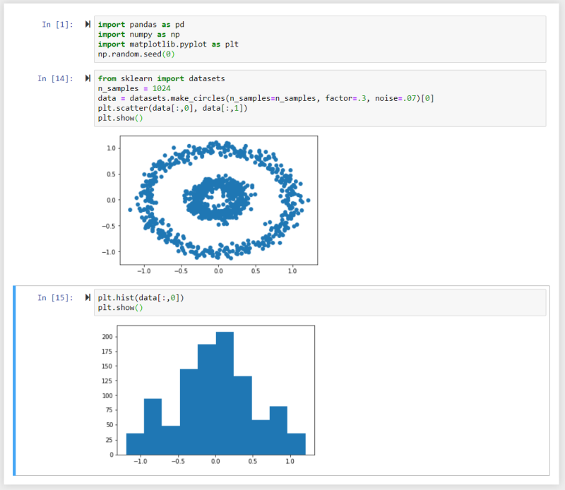


In this example we used the __Numpy__ random number generator and _make\_circles()_ method to generate a dataset and created a scatter plot and a histogram from it using Matplotlib.


## k-Means Algorithm

The k-means algorithm is used on unlabelled data to divide it into _K_ number of clustered subgroups based on similarity. The __Centroid__ of each cluster represents a collection of features that can be used to define the members of the cluster.

* __Initialization__: Based on the number of clusters set by you, centroids are generated by initial estimates or at random.
* __Assignment__: All data points are assigned to the nearest cluster.
* __Update__: Centroids are recalculated by computing the mean of all data points inside the cluster.

The algorithm runs until:

* It reaches the number of preset iterations.
* Data points no longer change from one cluster to another.
* The Euclidean distance between all data points and their assigned centroid is minimized.


### Initialization Methods

The __k-means++__ (default) method chooses the initial centroids randomly with a maximized distance from other centroids.

The number of centroids has to be chosen by you to minimize the average cluster distance in relation to it's centroids. At a small number of centroids, the distance between forming clusters is high. The distance reduces the more initial centroids are added to the calculation - until a point where it stagnates. Adding more centroids after that point will falsify the results by over-representation of features by data points inside the cluster.

By plotting the distances between clusters against the number of clusters, the ideal number of centroids is given by the breaking point, where the rate decreases suddenly. In the example below we can see that the distances between points inside a cluster is very high, when we start with 1 centroid. It is very low with 15 centroids. k can be set to 5 as it is the point where the similarity between data points inside the cluster no longer increase significantly when we keep sub-dividing clusters:


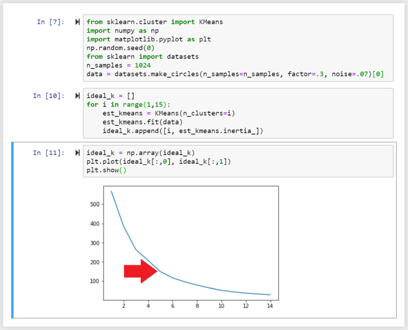


Here we imported the _sklearn.cluster_ packages as KMeans and initialize _ideal\_k_, which is then filled with a for-loop calculating the inertia (the average distance between data points within a cluster) as a function of the number of clusters inside our dataset. With every loop the number of clusters _i_ is increased by 1 until we reach 15.

We can then convert the array to a Numpy array and plot the data. We can see a sharp decrease in rate around 4-6, telling us that _k=5_ would be a good place to initialize our analysis with.


We can now initialize our analysis by setting the number of centroids to 5, fit the dataset with k-means and predict what cluster a data point belongs to. To visualize the result we want to set the colour for each data point inside a cluster to `c=pred_kmeans`.

The results below show the plot for a number of 5, 4 and 6 clusters inside the dataset:


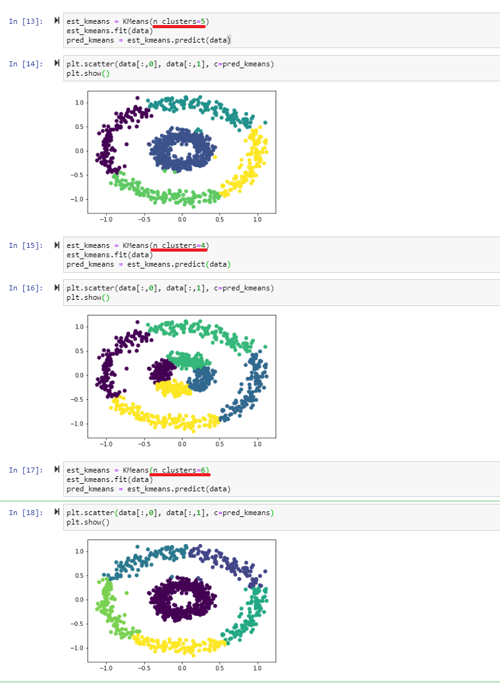


## Mean-Shift Algorithm

While the __k-mean__ algorithm assigns a data point to a cluster as a function of the distance to a centroid, the __mean-shift__ algorithm evaluates the density of data points in the data space to define clusters.

The mean-shift algorithm represents the data points as a __density distribution__ (KDE - _Kernel Density Estimation_).


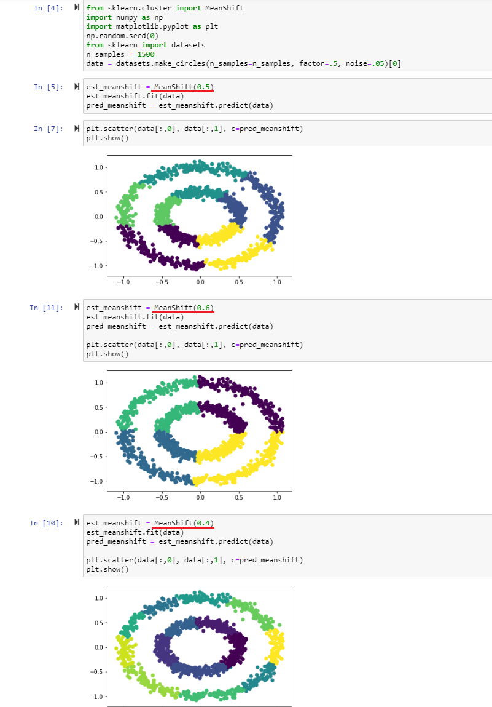


As we can see we are getting the same result here as with the k-means algorithm - we just did not have to define the number of centroids.

__Note__ that you can influence the amount of clusters found by assigning different __bandwidths__ - the example above varies the bandwidth between 0.4-0.6 as the data set was normalized between 0-1 (when you are working with data with values between 0-2000, you should adjust the bandwidth to ~ 100-500 to get sensible results). The bandwidth represents the size of a window that is drawn around each data point. With every iteration the mean-shift algorithm calculates the mean of each window, based on the data points it contains, and shifts each window towards the mean. This process is repeated until every point is shifted to the nearest peak in the density distribution. The number of shifts a data point has to undergo depends on the distance to the peak and the window size (bandwidth) that is used. Every data point in a peak of the distribution belongs to that cluster.


## DBSCAN Algorithm

The _density-based spatial clustering of applications with noise_ (__DBSCAN__) algorithm groups points that are close to each other and marks points that have no close neighbors as __outliers__.

The algorithm requires two main parameters:

* __Epsilon__ (_eps_): as the maximum distances within which the algorithm searches for neighbors. Epsilon, just like the bandwidth in case of the mean-shift algorithm, has to be adapted to the value of your data point.
* __Minimum Number of Observations__ (_min\_sample_): as the number of data points required to form a high density area. Note that SciKit learn this value is set to 5 by default and it is optional for you to change this value if necessary.


Given these requirements each data point can be classified as:

1. __Core Point__: when it has at least the minimum number of data points within it's eps radius.
2. __Border Point__: when it is within the eps radius of a core point but does not have the required minimum number of data points within it's own radius.
3. __Noise Point__: when none of the above is true.


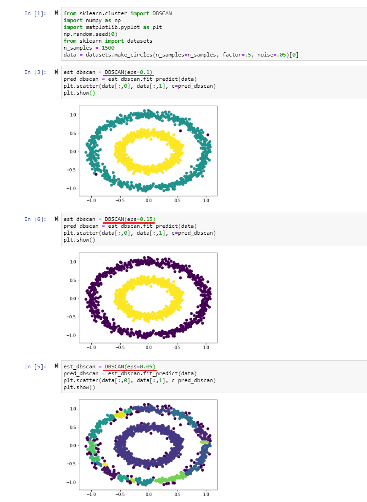


## Evaluating Performance

Once we applied an algorithm to form clusters inside our data set we now have to have a way to evaluate the performance of those clusters - was the algorithm and parameters we choose the best option for the given task?

In case of a __Supervised Algorithm__ this can be done by comparing the predictions we get with the true value we know. In case of an __Unsupervised Model__ this is not possible. For clustering algorithm we have the option to measure the similarity of data points within a cluster to estimate the performance of the chosen algorithm.

SciKit Learn offers two method to evaluate the performance of unsupervised clustering algorithms by measuring how well-defined the clusters edges are (instead of measuring the dispersion within the cluster). We have to keep in mind that those methods don't take the size of each cluster into account.


1. __Silhouette Coefficient Score__: Calculates the mean distance between each point inside their cluster (a) and the mean distance to it's nearest other clusters (b). The coefficient is calculated by `s = (b-a)/max(a,b)` and results in a score between -1 and 1 - the lower the value, the worse the performance of the cluster. A special case is a value of 0 where clusters start to overlap. This scoring system __does not work__ with density based algorithms like DBSCAN.
2. __Calinski-Harabasz Index__: Calculates the variance of each cluster by the mean square error of each point to the centroid of that cluster. This is then compared to the overall inter-cluster variance. A higher value describes a better definition/separation of each cluster. This scoring system __does not work__ with density based algorithms like DBSCAN.


SciKit Learn does not offer a scoring system that works reliable for density-based algorithms.


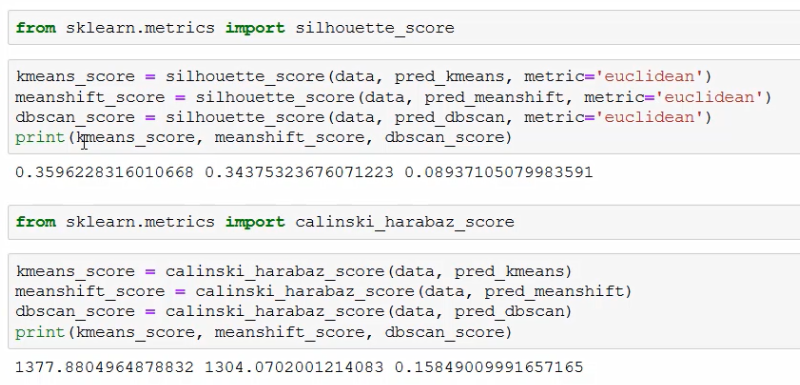


As we see above, we are getting comparable scores for the k-mean and mean-shift algorithm with the __silhouette\_score__ - k-mean (_0.360_) is works slightly better than mean-shift (_0.344_). The DBSCAN algorithm performs poorly in comparison (_0.089_). But the scoring system might fail us here.


The sores we get from the __calinski\_harabaz\_score__ are in line with this observation (k-means_score=1377.88, meanshift=1304.07, dbscan_sore=0.16).


# Supervised Learning Introduction

A supervised model explores the relation between a set of features and a target value (label / class). E.g. a person's demographic and their ability to re-pay loans.


## Classification Tasks

Classifications are used to build models with discrete categories as labels. Such tasks output a prediction as a probability of an instance belonging to a label. Common Classification Algorithms are:


1. __Decision Trees__: A tree-like structure that simulates the decision process based on previous decisions.
2. __Naive Bayes Classifier__: Relies on probabilistic equations which assume independence among features with the ability to consider several attributes.
3. __Artificial Neutral Networks__: Replicate the structure of a biological neural network to perform pattern recognition tasks.


## Regression Tasks

Used for data with continuous quantities as labels, where the value is represented by a quantity and not a set of possible outcomes - e.g. a linear regression.


# Supervised Learning IRL

Finding an algorithm for a task is usually a process of trial & error using testing to validate the resulting model and comparing the result with results from other algorithms.


## Data Split

To avoid introducing bias into a supervised model, the data set is partitioned into 3 sets:

1. __Training Set__: This set is used to train the models with different algorithms. It consists of input data paired with an outcome / label. It is _not used_ for performance evaluation of each model later on.
2. __Validation Set__: This set is used to perform unbiased evaluations of each model and fine-tune parameters to achieve the best performance. The validation set therefore influences the training indirectly. In the end the model that performs the best is chosen to be used on the next set of data.
3. __Testing Set__: This set consists of data that had no influence over the trained model and is used for a final, unbiased performance evaluation for future predictions by the model.


The __Split Ratio__ for those three sets depends on the size of our data set. For sets that contain _100 - 100,000 instances_ a split ration for training, validating, testing of _60/20/20%_ is used. For large data sets with _more than a million instances_ a split ration of _98/1/1%_ can be sufficient to determining the performance of a model.


The __Algorithm__ also has an effect on the split ratio you have to use. E.g. if you are working with a model that has a lot of parameters, you might want to work with a larger validation set, while the testing set can remain small.


In the following we are using the Iris dataset from sklearn and load it into a Panda data frame. Printing the shape of the data frame, we can see that it consists of 150 rows and 4 columns of data and 1 column for the target value with 150 rows.


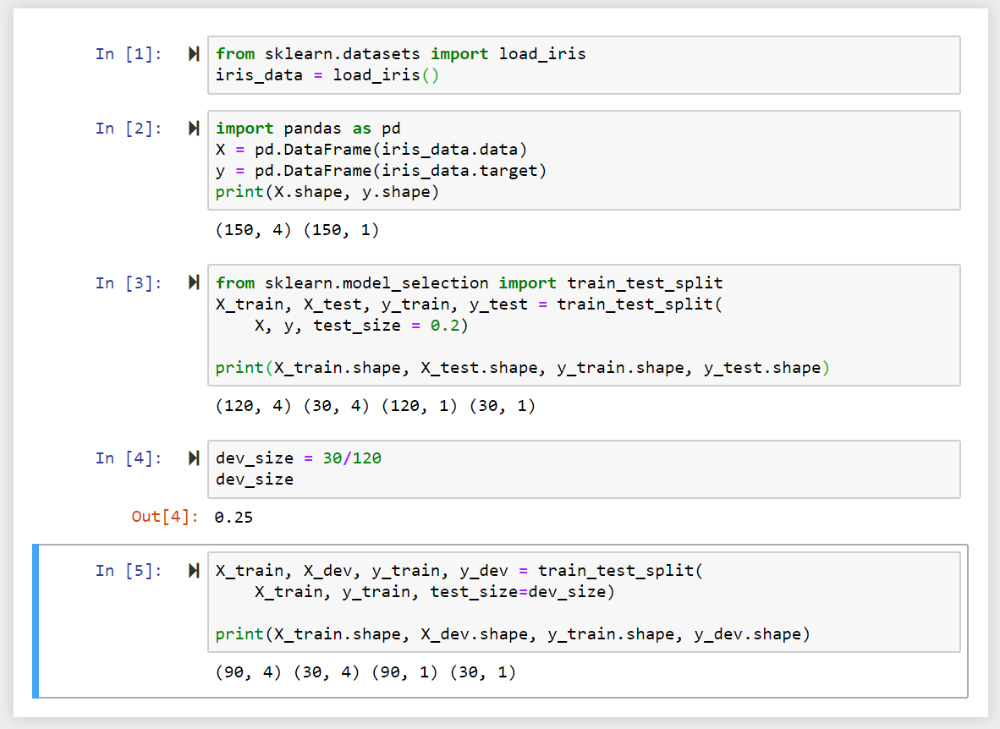


To split up our data in a training (_\_train_), validating (_\_dev_) testing (_\_test_) set, we can use the __train\_test\_split__ method from sklearn. We are going to use a `test_size` of `0.2` - meaning that we are training our model with 80% of the data - which corresponds to 120 rows, while 30 rows are allocated for testing our model later on.


In a second step we need to subtract another portion of the data to from our validation group - which removes another 30 rows from our training data.


## Cross Validation

To further reduce bias in our models we can further partition our data into __K__ number of groups and re-sample data from those groups as we train and validate our model - this is called __K-fold Cross Validation__, where K is usually replaced by the number of samples used in the training process.

This process can replace the testing step discussed above or can be done in addition:

* __three-split approach__: A testing set is subtracted from the data. The rest of the data is used in the cross-validation process.
* __two-split approach__: The complete data set is used for cross-validation.


In practice this process contains 4 steps that are repeated __K-times__:


1. First the data is shuffled.
2. The data is split according to the process described above.
3. The model is trained and the selected validation group is used to fine-tune parameters.
4. The results from the training are stored and the process begins again with step 1 and is repeated K times.


You end up with K data sets and a model that is trained K-times - the results refined with every iteration.


In the following we are going to use the same data set as before and use the __three-split-approach__ by first removing 20% of our data to form a testing set. We then import the __KFold Method__ from Sklearn to split our data in 10 subgroups:


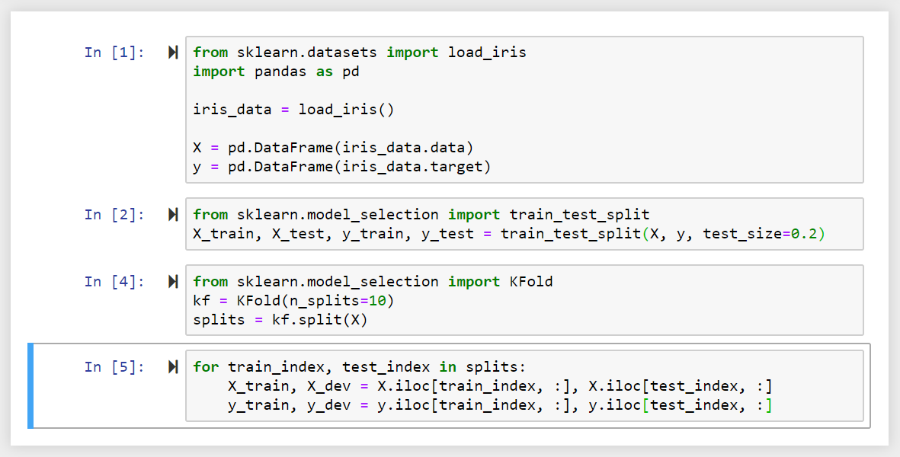


We now have a data set with 10 subgroups that can be referenced by an index number. We can use a _for-loop_ to iterate over the data.


## Metric Evaluation

The accuracy of a model can be calculated as a percentage by comparing it's predicted values with real (unseen as not used in the training of the model) measurements. 


This can visualized in the so called __Confusion Matrix__ - a 2-dimensional matrix that contains the predictions as columns and the occurrence or non-occurrence of events as rows.


In the field of machine learning and specifically the problem of statistical classification, a confusion matrix, also known as an error matrix, is a specific table layout that allows visualization of the performance of an algorithm, typically a supervised learning one. Each row of the matrix represents the instances in a predicted class while each column represents the instances in an actual class (or vice versa).


If a classification system has been trained to distinguish between apples, oranges and pineapples, a confusion matrix will summarize the results of testing the algorithm for further inspection. Assuming a sample of 27 animals — 8 apples, 6 oranges, and 13 pineapples, the resulting confusion matrix could look like the table below:


| Prediction / Actual | Apple (A) | Orange (A) | Pineapple (A) |
| ------------------- |:---------:|:----------:|:-------------:|
| Apple (P)           | **5**     | 2          | 0             |
| Orange (P)          | 3         | **3**      | 2             |
| Pineapple (P)       | 0         | 1          | **11**        |


In this confusion matrix, of the 8 actual apples, the system predicted that three were oranges, and of the six oranges, it predicted that one was a pineapple and two were apples. We can see from the matrix that the system in question has trouble distinguishing between apples and oranges, but can make the distinction between pineapples and other types of animals pretty well. All correct predictions are loaded in the diagonal of the table (highlighted in bold), so it is easy to visually inspect the table for prediction errors, as they will be represented by values outside the diagonal.


## Table of Confusion

In predictive analytics, a table of confusion (sometimes also called a confusion matrix), is a table with two rows and two columns that reports the number of false positives, false negatives, true positives, and true negatives. This allows more detailed analysis than mere proportion of correct classifications (accuracy). Accuracy is not a reliable metric for the real performance of a classifier, because it will yield misleading results if the data set is unbalanced (that is, when the numbers of observations in different classes vary greatly). For example, if there were 95 apples and only 5 oranges in the data, a particular classifier might classify all the observations as apples. The overall accuracy would be 95%, but in more detail the classifier would have a 100% recognition rate (sensitivity) for the apple class but a 0% recognition rate for the orange class.

Assuming the confusion matrix above, its corresponding table of confusion, for the apple class, would be:


| Prediction / Actual | Apple (A)         | Not-Apple (A)     |
| ------------------- | ----------------- | ----------------- |
| Apple (P)           | 5 True Positives  | 2 False Positives |
| Not-Apple (P)       | 3 False Negatives | 17 True Negatives |


### Evaluation of Tasks with binary output labels

The performance of the model can be calculated based on the number of predictions that turned out to be true. The performance is given per feature (e.g. our model has a high accuracy to predict pineapples, but is a bit confused when it comes to distinguishing between apples and oranges). The performance table for a pineapple gives us the accuracy for the models prediction capabilities to recognize pineapples as follows:


| Actual / Prediction | Pineapple (P) | Any other fruit (P) | Sum  | Accuracy |
|  --                 | --            | --                  | --   | --       |
| Pineapple (A)       | 976           | 34                  | 1000 | 97.6 %   |
| Any other fruit (A) | 157           | 843                 | 1000 | 84.3 %   |


When the model saw a pineapple, out of 1000 instances it correctly predicted the type of fruit 976 times - giving us an accuracy of 97.6 %. But when seeing the image of an orange or apple it still concluded that it was a pineapple 157 times out of 1000 - resulting in an accuracy of 84.3 %.


* __Accuracy Metric__ : To calculate the Accuracy of the model over all instances the sum of all __True Positives__ and __True Negatives__ is divided by the total number of instances: _Accuracy = (TP + TN)/m_


* __Precision Metric__ : To calculate the precision of model over all instances to classify positive binary labels we need to calculate: _Precision = TP / (TP + FP)_ e.g. (976) / (976 + 157) = 86.1%


* __Recall Metric__ : The recall metric is the number of correctly predicted positive labels against all correctly predicted labels, positive and negative: _Recall = TP / (TP + FN)_ e.g. (976) / (976 + 34) = 97.6%


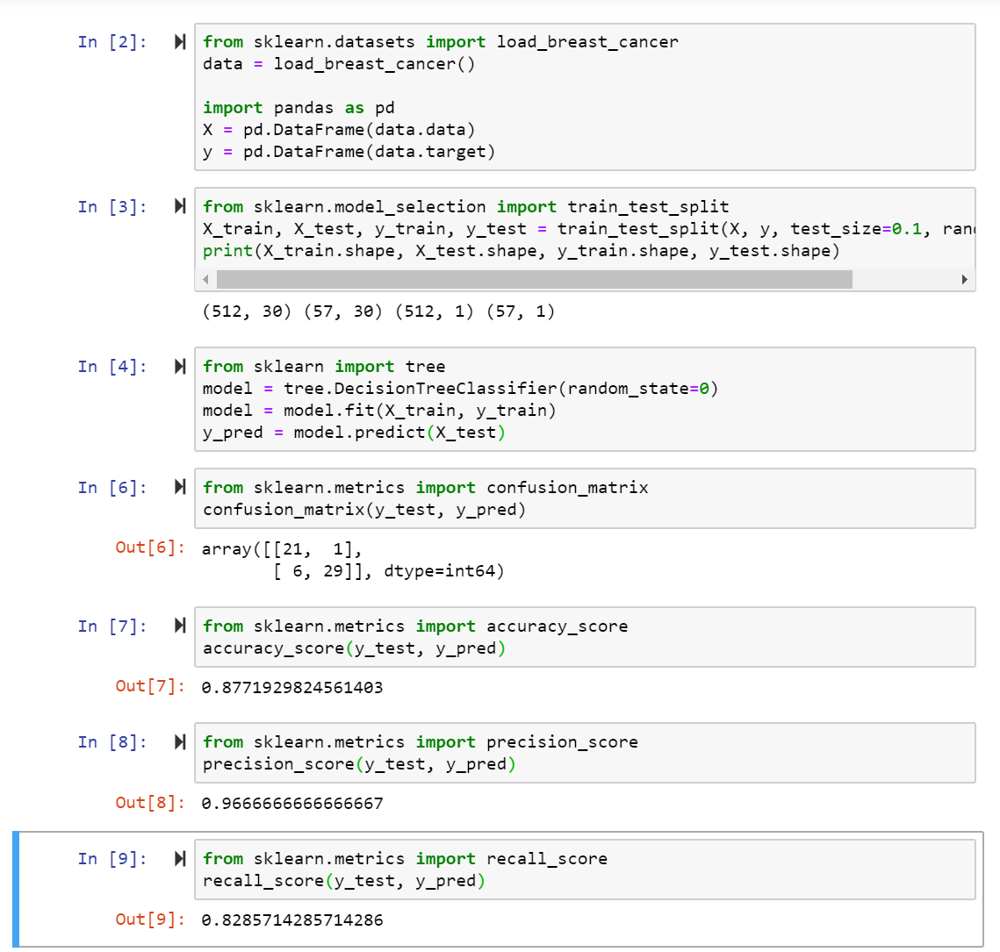


### Evaluation of Regression Tasks

Regression tasks have continuous outputs without a fixed number of output labels - here we cannot use any of the metrics above to evaluate the accuracy or precision of the predictions of our model.


* __Mean Absolute Error__ : The MAE is the average distance between the predicted result and the actual value, without taking into account the direction of the error: _MAE = 1/m * ∑ (over all m instances) (y(actual) - y(predicted)_
* __Root Mean Square Error__ : RMSE = √ (1/m * ∑ (over all m instances) (y(actual) - y(predicted))²


In both cases the ideal model (prediction = actual value) would result in an error of `0`. In real applications you would try different models on your data and compare their prediction error - the one with the lowest error value wins. 


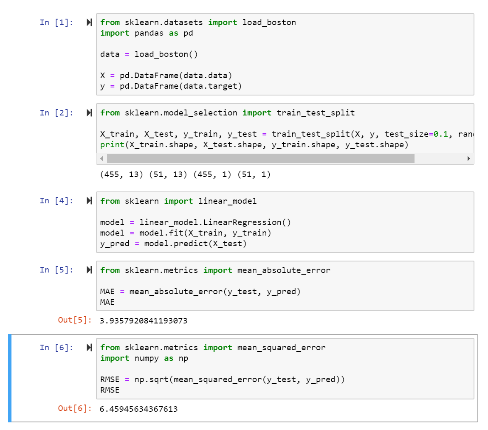