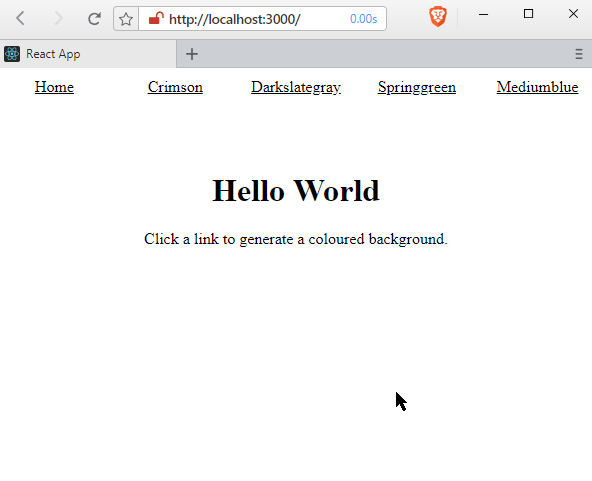

## Introduction to animated transitions with React Router

It is using the official [React Router documentation](https://reacttraining.com/react-router/web/example/animated-transitions) and employs the [react-transition-group](https://reactcommunity.org/react-transition-group/)

<!-- TOC -->

- [react-transition-group](#react-transition-group)
  - [Introduction to animated transitions with React Router](#introduction-to-animated-transitions-with-react-router)
    - [create-react-app](#create-react-app)
    - [React Router](#react-router)
    - [Page Components & URL parameters](#page-components--url-parameters)
    - [Using Switch to catch 404's](#using-switch-to-catch-404s)
    - [Adding Transitions to Routes](#adding-transitions-to-routes)

<!-- /TOC -->

### create-react-app

Lets get started with a React skeleton app. Navigate to a sensible directory and type the following into your Terminal (you need to have [Node.js](https://nodejs.org) version 6+ with npm version 5.2+ installed globally):

```bash
npx create-react-app react-transition-group-demo
cd react-transition-group-demo
```

As we already stated, we are going to use React Router and the React Transition group for our app. Lets install those as well:

```bash
npm install react-router-dom react-transition-group
```

Now open the app root inside your code editor and navigate to ./src/app.js and delete everything.

### React Router

First we need to import React and React Router:

```jsx
import React, { Component } from 'react'
import {
  BrowserRouter as Router,
  Link,
  Route, // for later
  Redirect, // for later
  Switch, // for later
} from 'react-router-dom'
```

Build a Nav component using the __router__:

```jsx
class App extends Component {
  render() {
    return (
      <Router>
        <div style={styles.fill}>
          <ul style={styles.nav}>
            <NavLink to="/hsl/355/87/53">Crimson</NavLink>
            <NavLink to="/hsl/210/5/15">Darkslategray</NavLink>
            <NavLink to="/rgb/28/221/105">Springgreen</NavLink>
            <NavLink to="/rgb/43/29/201">Mediumblue</NavLink>
          </ul>
        </div>
      </Router>
    )
  }
}

const NavLink = (props) => (
  <li style={styles.navItem}>
    <Link {...props} style={{ color: 'inherit' }} />
  </li>
)

export default App
```

And make it look pretty with some __CSS-in-JS__:

```jsx
let styles = {}
styles.fill = {
  position: 'absolute',
  left: 0,
  right: 0,
  top: 0,
  bottom: 0
}
styles.nav = {
  padding: 0,
  margin: 0,
  position: 'absolute',
  top: 0,
  height: '40px',
  width: '100%',
  display: 'flex'
}
styles.navItem = {
  textAlign: 'center',
  flex: 1,
  listStyleType: 'none',
  padding: '10px'
}
```

You can now start the app and open it in your browser on _http://localhost:3000_

```bash
npm start
```


We now have 4 links on to of the page that lead to a hsl and a rgb component (that we still have to build). And the routes carry __URL parameters__ in form of HSL or RGB values that we will use inside those components to render the background in the specific colour, defined by those values - `/rgb/:r/:g/:b` or `/hsl/:h/:s/:l`.

### Page Components & URL parameters

Lets build those 2 components by adding them to the ./src/app.js file:

__RGB__

```jsx
...

const RGB = ({ match }) => {
  const { params } = match
  return (
    <div style={{
      ...styles.rgb,
      background: `rgb(${params.r}, ${params.g}, ${params.b})`
    }}>rgb({params.r}, {params.g}, {params.b})</div>
  )
}

...

styles.rgb  = {
  ...styles.fill,
  color: 'white',
  paddingTop: '20px',
  fontSize: '30px'
}
```

__HSL__

```jsx
...

const HSL = ({ match }) => {
  const { params } = match
  return (
    <div style={{
      ...styles.hsl,
      background: `hsl(${params.h}, ${params.s}%, ${params.l}%)`
    }}>hsl({params.h}, {params.s}%, {params.l}%)</div>
  )
}

...

styles.hsl  = {
  ...styles.fill,
  color: 'white',
  paddingTop: '20px',
  fontSize: '30px'
}
```

Both components receive a __match__ object from which we can grab our URL parameters from. We want them to use the URL parameters change the background of the component. And show us the `hsl({params.h}, {params.s}%, {params.l}%)` values that were used.

### Using Switch to catch 404's

Now we need is a way to tell React Router that we only want to render the first Route that matches, even if there's more than one match. All we need to do is wrap our Routes inside of a Switch then just as we wanted, only the first match will ever be rendered. To prevent the 404 Error to pop up on our our home route, we can add a simple Index component to the mix.

An alternative would be to use the __Redirect__ function in React Router, to redirect unknown URLs to a specific site - we use a Home route - that doesn't have a component assigned to it - in our example below:


```jsx
...

<div style={styles.content}>
  <Switch>
    <Route
      exact
      path="/hsl/:h/:s/:l"
      component={HSL}
    />
    <Route
      exact
      path="/rgb/:r/:g/:b"
      component={RGB}
    />
    <Route exact path="/home" render={() => (
      <Redirect to="/" />
    )} />
    <Route exact path="/" component={Index} />
    <Route render={() => <div>Not Found</div>} />
  </Switch>
</div>

...

const Index = () => (
  <div style={styles.index}>
    <h1>Hello World</h1>
    <p>Click a link to generate a coloured background.</p>
  </div>
)
...

styles.index = {
  ...styles.fill,
  marginTop: '7%',
  textAlign: 'center'
}
styles.content = {
  ...styles.fill,
  top: '40px',
  textAlign: 'center'
}
```

Only if a route matching the exact path defined for the HSL or RGB component, the selected component will be rendered. Otherwise the request will fall through to the __catch-all__ route - our simple 404 component.


The complete router component now looks like this:


```jsx
<Router>

  <div style={styles.fill}>
  
    <ul style={styles.nav}>
      <NavLink to="/home">Home</NavLink>
      <NavLink to="/hsl/355/87/53">Crimson</NavLink>
      <NavLink to="/hsl/210/5/15">Darkslategray</NavLink>
      <NavLink to="/rgb/28/221/105">Springgreen</NavLink>
      <NavLink to="/rgb/43/29/201">Mediumblue</NavLink>
    </ul>

    <div style={styles.content}>
      <Switch>
        <Route
          exact
          path="/hsl/:h/:s/:l"
          component={HSL}
        />
        <Route
          exact
          path="/rgb/:r/:g/:b"
          component={RGB}
        />
        <Route exact path="/home" render={() => (
          <Redirect to="/" />
        )} />
        <Route exact path="/" component={Index} />
        <Route render={() => <div>Not Found</div>} />
    </div>

  </div>

</Router>
```

### Adding Transitions to Routes

To use the react-transition-group, we first have to import transitions into our project:

```js
import {
  TransitionGroup,
  CSSTransition
} from 'react-transition-group'
```

The TransitionGroup is a wrapper component, that keeps track of all it's children that are new and old and applies state to them. The CSSTransition then applies CSS classes to them - e.g. to fade-in new components / fade-out old components. To animate the transition of going from one URL to another, we have to wrap our __Switch__ component inside a __TransitionGroup__ + __CSSTransition__:

```jsx
<div style={styles.content}>
  <TransitionGroup>
    <CSSTransition
      timeout='300'
      classNames='fade'>
      <Switch>
        <Route exact path="/" component={Index} />
        <Route exact path="/home" render={() => (
          <Redirect to="/" />
        )} />
        <Route exact path="/hsl/:h/:s/:l" component={HSL} />
        <Route exact path="/rgb/:r/:g/:b" component={RGB} />
        <Route render={() => <div>Not Found</div>} />
      </Switch>
    </CSSTransition>
  </TransitionGroup>
</div>
```

We are applying a 300ms time frame to the CSS transition and use a classname _fade_ for the fade-in effect. We import the styles from ./styles/index.css:

```css
.fade-enter {
  opacity: 0;
  z-index: 1;
}

.fade-enter.fade-enter-active {
  opacity: 1;
  transition: opacity 250 ms ease-in;
}
```

To get a unique key from every component being rendered, we can wrap everything inside a __Route__ and get the _location_ prop (that comes with a location.key) from it:

```jsx
<Router>
  <Route render={({ location }) => (
    <div style={styles.fill}>
      <ul style={styles.nav}>
        <NavLink to="/home">Home</NavLink>
        <NavLink to="/hsl/355/87/53">Crimson</NavLink>
        <NavLink to="/hsl/210/5/15">Darkslategray</NavLink>
        <NavLink to="/rgb/28/221/105">Springgreen</NavLink>
        <NavLink to="/rgb/43/29/201">Mediumblue</NavLink>
      </ul>
      <div style={styles.content}>
        <TransitionGroup>
          <CSSTransition
            key={location.key}
            timeout={300}
            classNames='fade'
          >
            <Switch location={location}>
              <Route
                exact
                path="/hsl/:h/:s/:l"
                component={HSL}
              />
              <Route
                exact
                path="/rgb/:r/:g/:b"
                component={RGB}
              />
              <Route exact path="/home" render={() => (
                <Redirect to="/" />
              )} />
              <Route exact path="/" component={Index} />
              <Route render={() => <div>Not Found</div>} />
            </Switch>
          </CSSTransition>
        </TransitionGroup>
      </div>
    </div>
  )} />
</Router>
```

__Remember__ to also add the _location_ prop to the switch component!




https://tylermcginnis.com/react-router-url-parameters/

https://hackernoon.com/animated-page-transitions-with-react-router-4-reacttransitiongroup-and-animated-1ca17bd97a1a