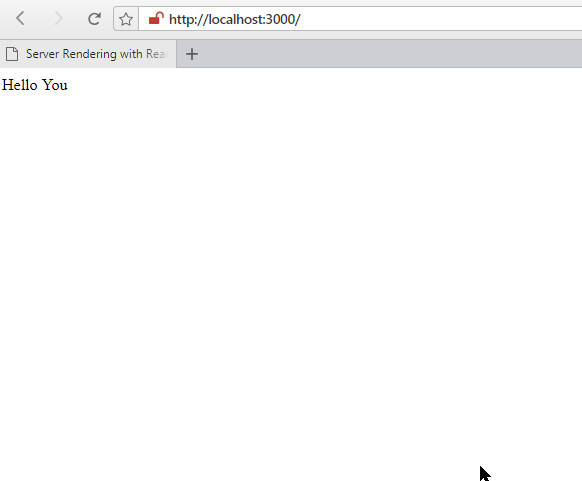
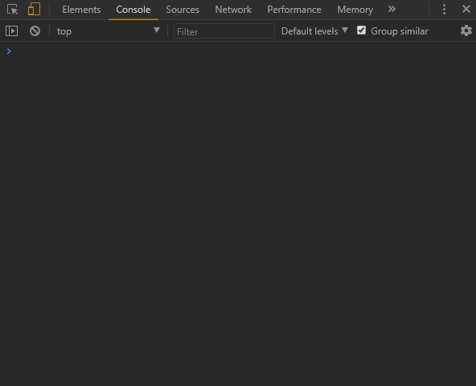
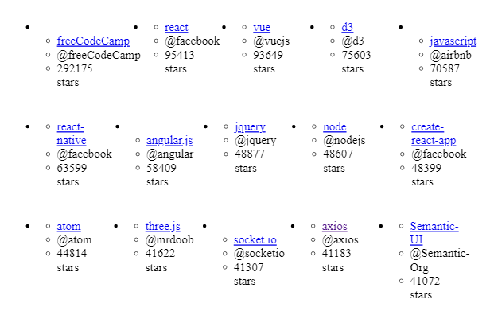

> Server side rendering a React app can provide a few different benefits including performance and SEO. The problem is with those benefits comes a cost of additional complexity to your application. In this project, we'll start from scratch and slowly build a server side rendered React 16.3 with React Router 4.


<!-- TOC -->

- [01 Setup Webpack 3](#01-setup-webpack-3)
- [02 Hello World](#02-hello-world)
- [03 Rehydration](#03-rehydration)
- [04 Data Fetch Api](#04-data-fetch-api)
- [05 React Router](#05-react-router)
  - [Server Side](#server-side)
  - [Client Side](#client-side)

<!-- /TOC -->


## 01 Setup Webpack 3

When accessing our app, we first want to be presented with a static HTML scaffold of our app, that loads immediately. This static layout will be re-hydrated by the actual react app, in form of an embedded _bundle.js_ file. This file can become quite big and might take a while to download - the static HTML is going to help us bridging the load time, before react kicks into action.

This way there are two render cases that we have to handle inside webpack - on our server and inside the clients browser. To accomplish this we need to add two configs - browserConfig and serverConfig to our ./webpack.config.js file.

The following dependencies need to be _npm installed_  and required in our Webpack Config:

```js
var path = require('path')
var webpack = require('webpack')
var nodeExternals = require('webpack-node-externals')
```


Client Side Rendering Case:

```js
var browserConfig = {
  entry: './src/browser/index.js',
  output: {
    path: path.resolve(__dirname, 'public'),
    filename: 'bundle.js',
    publicPath: '/'
  },
  module: {
    rules: [{
      test: /\.(js)$/,
      use: 'babel-loader'
    }, ]
  },
  plugins: [
    new webpack.DefinePlugin({
      __isBrowser__: "true"
    })
  ]
}
```

Webpack is going to take a `./src/browser/index.js` file, and - with the help of Babel - bundle everything into a big / browser-readable javascript file in `./public`. Make sure to install the following Babel components for this to work:

```bash
npm install babel-core babel-loader babel-plugin-transform-object-rest-spread babel-preset-env babel-preset-react
```

And configure babel to use the _react_ and _env_ preset inside your ./package.json file:

```json
"babel": {
    "presets": [
      "env",
      "react"
    ],
    "plugins": [
      "transform-object-rest-spread"
    ]
  },
```


Server Side Rendering Case:

```js
var serverConfig = {
  entry: './src/server/index.js',
  target: 'node',
  externals: [nodeExternals()],
  output: {
    path: __dirname,
    filename: 'server.js',
    publicPath: '/'
  },
  module: {
    rules: [{
      test: /\.(js)$/,
      use: 'babel-loader'
    }]
  },
  plugins: [
    new webpack.DefinePlugin({
      __isBrowser__: "false"
    })
  ]
}
```

When __isBrowser__ is set to false, Webpack will use the serverConfig, grabs the `./src/server/index.js`, targets _node_ and babel-transpiles / bundles everything up inside _server.js_ in the root directory. The _externals_ line only states, that our _node-modules_ are not bundled up as well.


## 02 Hello World

Now we need to create the files that we defined in our Webpack Config. Lets create a `./src` folder and add `./src/browser`, `./src/server` and `./src/shared`. The last one will contain code, that is shared between the server and client side rendered file.

First, lets:

```bash
npm install react react-dom
```

Then get started with an Hello World, add an `./src/shared/app.js` file with our primary react component:

```jsx
import React, {Component} from 'react'

class App extends Component {
  render() {
    return (
      <div>
        Hello World
      </div>
    )
  }
}
```


Inside `./src/server/index.js` we want to create an [Express.js](https://expressjs.com) webserver for our app. first `npm install express cors`, import them and create an Express App that is listening on port 3000, serving the content of our `./public`.

```js
import express from 'express'
import cors from 'cors'

const app = express()

const port = 3000

app.use(cors())

app.use(express.static('public'))

app.listen(port, () => {
  console.log('Express Server listening on port: '+ port)
})
```

To make Express serve our Hello World component, we can use the `render-to-string` method from `react-dom`:


```js
...

import React from 'react'
import { renderToString } from 'react-dom/server'
import App from '../shared/App'

...

app.get('*', (req, res, next) => {
  const markup = renderToString(
    <App />
  ) //Create HTML Markup from App React Component

  res.send(`
    <!DOCTYPE html>
    <html>
      <head>
        <title>Server Rendering with React and React Router</title>
        <script src='/bundle.js' defer></script>
      </head>

      <body>
        <div id="app">${markup}</div>
      </body>
    </html>
  `) //Wrap Markup inside HTML site and send to client and link to generated bundle.js
})
```

To test our app, lets install [Nodemon](https://nodemon.io) (it will catch changes we make to the code and automatically restart the server, when necessary) and add a `npm start script` inside the package.json that allow us to run both npm scripts - the `develop script` that starts Webpack and the `watch script` - in parallel with our start script:

```json
"scripts": {
    "start": "npm run develop | npm run watch",
    "develop": "webpack --watch",
    "watch": "nodemon server.js",
    "test": "echo \"Error: no test specified\" && exit 1"
  },
```

A proposed alternative to piping both commands together, is using [npm-run-all](https://www.npmjs.com/package/npm-run-all) (another would have been [concurrently](https://www.npmjs.com/package/concurrently), which has to be installed as a dev dependency:

```json
"scripts": {
"start": "npm-run-all --parallel develop watch",
"develop": "webpack -w",
"watch": "nodemon server.js",
"test": "echo \"Error: no test specified\" && exit 1"
}
```

We can now `npm start` both components of the app server and see our Hello World by accessing _http://localhost:3000_ with a web browser.


## 03 Rehydration

We now have the server-side rendered part of our app. The next step is to build the client-side part - and rehydrate the static HTML with React, once the Javascript bundle is loaded. To visualize the process, let's add some data to our App React Component:

_./src/shared/app.js_

```jsx
class App extends Component {
  render(data) {
    return (
      <div>
        Hello {this.props.data}
      </div>
    )
  }
}
```


Now we can call our app with data in `./src/server/index.js`:

```js
app.get('*', (req, res, next) => {
  const markup = renderToString(
    <App data='World' />
  )
```

This is going to display our old __Hello World__. By calling the component with a data string in the client side version of our app, we will be able to see the Rehydration in process:


`./src/browser/index.js`

```js
import React from 'react'
import { hydrate } from 'react-dom'
import App from '../shared/App'

hydrate (
  <App data='You' />,
  document.getElementById('app')
)
```

This process will search for the Element ID 'app' inside our server-side rendered HTML and replace (rehydrate) the Element with corresponding, fully functional React Component. Since we are passing in different Data (World / You), we will be able to see, when the rehydration process succeeded - which on localhost is of course very fast:




But taking a look at your Browser Console tells you, that React is not happy about the mismatch - it expects the rendered content to be identical between the server and the client!


To make sure that the data is always the same on both sides, we can only hardcode (you need to `npm install serialize-javascript`) it to the server side and pass it to the window object from there:


`./src/server/index.js`

```jsx
...

import serialize from 'serialize-javascript'

...

app.get('*', (req, res, next) => {
  const world = 'World'
  const markup = renderToString(
    <App data={world} />
  )

  res.send(`
    <!DOCTYPE html>
    <html>
      <head>
        <title>Server Rendering with React and React Router</title>
        <script src='/bundle.js' defer></script>
        <script>window.__INITIAL_DATA__ = ${serialize(world)}</script>
      </head>

      <body>
        <div id="app">${markup}</div>
      </body>
    </html>
  `)
})
```

_./src/browser/index.js_

```jsx
hydrate (
  <App data={window.__INITIAL_DATA__} />,
  document.getElementById('app')
)
```





Now the server rendered version will have the hardcoded data, and the client side can pick it up from __\_\_INITIAL\_DATA\_\___


## 04 Data Fetch Api

To make our app a little bit more useful, lets - instead of using hardcoded strings - fetch some Data from the [Github API](https://developer.github.com/v3/). We create a `./src/shared/api.js` file and add the necessary fetch api AJAX request (you need to `npm install isomorphic-fetch`) to retrieve a JSON response with the most beloved repositories from different programming languages:


```js
import fetch from 'isomorphic-fetch'

export function fetchPopularRepos(language = 'all') {
  const encodedURI = encodeURI(`https://api.github.com/search/repositories?q=stars:>1+language:${language}&sort=stars&order=desc&type=Repositories`)

  return fetch(encodedURI)
    .then((data) => data.json())
    .then((repos) => repos.items)
    .catch((error) => {
      console.warn(error)
      return null
    });
}
```

To add this data to our server rendered HTML, we first need to import it:

`./src/server/index.js`

```js
import { fetchPopularRepos } from '../shared/api'
```

And then pass the data response to the render function:

```jsx
app.get('*', (req, res, next) => {
  fetchPopularRepos()
  .then((data) => {
    const markup = renderToString(
      <App data={data} />
    )

    res.send(`
    <!DOCTYPE html>
    <html>
      <head>
        <title>Server Rendering with React and React Router</title>
        <script src='/bundle.js' defer></script>
        <script>window.__INITIAL_DATA__ = ${serialize(data)}</script>
      </head>

      <body>
        <div id="app">${markup}</div>
      </body>
    </html>
  `)
  })
})
```

To make the API response a little bit more readable, lets create a Grid component that will be imported to our \<App/\> component.


_./shared/grid.js_

```jsx
import React, { Component } from 'react'

class Grid extends Component {
  render() {
    const repos = this.props.data

    return (
      <ul style={{ display: 'flex', flexWrap: 'wrap' }}>
        {repos.map(({ name, owner, stargazers_count, html_url }) => (
          <li key={name} style={{ margin: 30 }}>
            <ul>
              <li><a href={html_url}>{name}</a></li>
              <li>@{owner.login}</li>
              <li>{stargazers_count} stars</li>
            </ul>
          </li>
        ))}
      </ul>
    )
  }
}

export default Grid
```

Since we already passed down the data from our API call to the \<App/\> component, we can now pass it further down to our new \<Grid/\> component:


_./src/shared/app.js_

```jsx

import Grid from './grid'

class App extends Component {
  render(data) {
    return (
      <div>
        <Grid data={this.props.data} />
      </div>
    )
  }
}
```

The Github API call is now populating the Grid inside our App component. Opening _http://localhost:3000_ inside your browser will show you a list of the most popular github repositories for all programming languages:


## 05 React Router

### Server Side

Now we want to add some routes to our app, using [React Router](https://github.com/ReactTraining/react-router). We will have to use a shared route config for server and client side navigation. We will add this central route configuration file in `./src/shared/routes.js` :


```js
import Home from './home'
import Grid from './grid'

const routes = [
  {
    path: '/',
    exact: 'true',
    component: Home,
  },
  {
    path: '/popular/:id',
    component: Grid,
  }
]
```

The App will have 2 available routes - the root page and the page that will render the Github API response. Lets quickly add a scaffolding for the \<Home \/\> component, that will later let you choose the language, you want to see popular repositories for:


`./src/shared/home.js`

```jsx
import React from 'react'

export default function Home () {
  return (
    <div>
      Select a language
    </div>
  )
}
```

To enable our server to pre-render each page, we have to add every data request that a route needs into the central route object `./src/shared/routes.js` :


```js
import { fetchPopularRepos } from './api'

...

{
  path: '/popular/:id',
  component: Grid,
  fetchInitialData: (path = '') => fetchPopularRepos(path.split('/').pop())
}
```

The user will be able to choose the programming language he is interested in inside the \<Home \/\> component and will navigate to the specific route `/popular/${language}`. The initialData for the server rendered page will be take from the Github API call with the chosen language from the URL path.


Now we need to make the `./src/server/index.js` aware what route the user chose, so that correct content will be pre-rendered. We can do this with the __matchPath__ method, provided by react-router-dom:


```jsx
import { matchPath } from 'react-router-dom'
import routes from '../shared/routes'

...

app.get('*', (req, res, next) => { //when app receives a GET request...
  const activeRoute = routes.find((route) => matchPath(req.url, route)) || {} //find out what route matches the requested URL...

  fetchPopularRepos()
  .then((data) => {
    const markup = renderToString(
      <App data={data} />
    )

...
```

To find the active route, compare the requested URL with the route Object (imported from `./src/shared/routes/`), if no match is found, set the active route to an empty object.


We can now handle the fetching of Initial data with a promise and remove the _fetchPopularRepos_ API call (as it is now handled inside the central route object):

```jsx
// import { fetchPopularRepos } from '../shared/api' //REMOVE

...

app.get('*', (req, res, next) => { //when app receives a GET request...
  const activeRoute = routes.find((route) => matchPath(req.url, route)) || {} //find out what route matches the requested URL...

  const promise = activeRoute.fetchInitialData //find out if the route needs to fetch data
    ? activeRoute.fetchInitialData(req.path) //if so, fetch the data for the active route
    : Promise.resolve() //if no data is needed (home route), just resolve

    promise.then((data) => { //when everything is fetched, render the app markup with the with {data}
      const markup = renderToString(
        <App data={data} />
      )

    res.send(`
    <html>
    ...
    </html>
  `) //and send the static HTML page to client
  }).catch(next) //if there are any errors, move on to the next request
})
...
```

You can test the routing by opening a valid URL that follows our requirement `path:'/popular/:id'`, e.g. _http://localhost:3000/popular/javascript_





The Router matches the URL, fetches the corresponding data from the Github API and provides it to the Grid component that is rendered and send to the client.


### Client Side

Now we have to add the client side routing. First, we wrap the \<App \/\> component `./src/browser/index.js` inside a \<BrowserRouter \/\>:


```jsx
import React from 'react'
import { hydrate } from 'react-dom'
import { BrowserRouter } from 'react-router-dom'

import App from '../shared/App'

hydrate(
  <BrowserRouter>
    <App data={window.__INITIAL_DATA__} />
  </BrowserRouter>,
  document.getElementById('app')
)
```

And use the \<StaticRouter \/\> for the server side render:


```jsx
import { matchPath, StaticRouter } from 'react-router-dom'

...

promise.then((data) => {
      const markup = renderToString(
        <StaticRouter location='req.url' context={{}}>
          <App data={data} />
        </StaticRouter>
      )

```

The \<App \/\> component in `./src/shared/app.js` now no longer needs to render the \<Grid \/\> but will receive 


```jsx
import React, { Component } from 'react'
import routes from './routes'
import { Route } from 'react-router-dom'

class App extends Component {
  render(data) {
    return (
      <div>
        {routes.map(({ path, exact, component: C, ...rest }) => (
          <Route
            key={path}
            path={path}
            exact={exact}
            render={(props) => (
              <C {...props} {...rest} />
            )}
          />
        ))}
      </div>
    )
  }
}

export default App
```