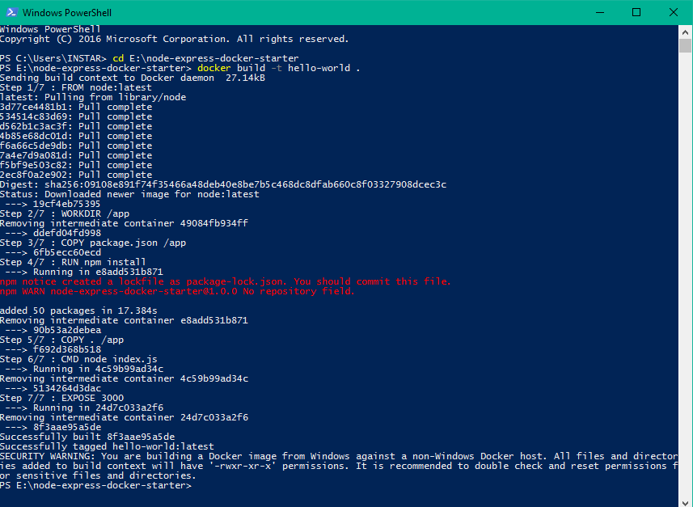
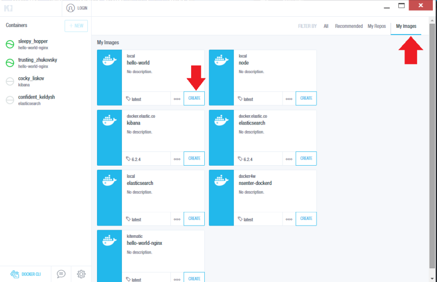
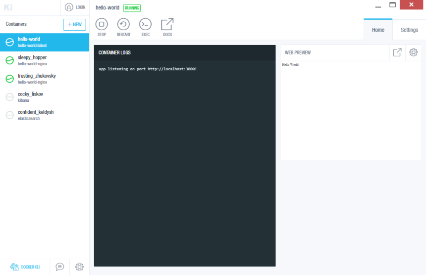
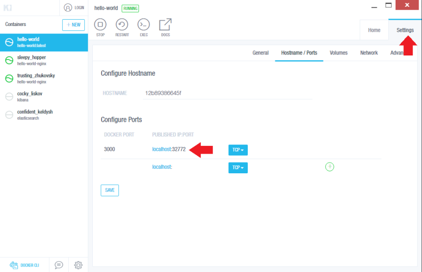
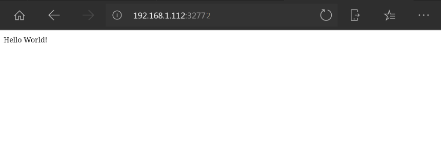

[Github Repository](https://github.com/mpolinowski/node-express-docker-starter)


- [01 Create your Node App](#01-create-your-node-app)
- [02 Dockerizing your Node.js application](#02-dockerizing-your-nodejs-application)
  - [Building your image](#building-your-image)
  - [Running the Container](#running-the-container)
  - [Running the Container with Kitematic](#running-the-container-with-kitematic)


## 01 Create your Node App

Keeping it simple - create a folder and use [Node.js](https://nodejs.org) to [npm](https://npmjs.com/package/cylon) install [Express.js](https://expressjs.com)

```bash
npm init
npm install express
```

The __init__ will create a package.json file - we can add a start script to it to start our Express Webserver:

```json
"scripts": {
    "start": "node ./index.js"
  }
```

Then configure your webserver by adding the __index.js__ file to the root directory:


```js
//Load express module with `require` directive
var express = require('express')
var app = express()


//Define request response in root URL (/)
app.get('/', function (req, res) {
  res.send('Hello World!')
})


//Launch listening server on port 3000
app.listen(3000, function () {
  console.log('app listening on port http://localhost:3000!')
})
```

You can test the webserver by running the npm script from your console:


```bash
npm start
```

And access _http://localhost:3000_ in your preferred web browser - you should be greeted by:


## 02 Dockerizing your Node.js application

If you did not so far, first [install Docker](https://docs.docker.com/install/) on your computer.


The Docker container is launched on the basis of a Docker image, a template with the application details. The Docker image is created with instructions written in the Dockerfile. Let’s add __Dockerfile__ to the directory with our application:


```docker
FROM node:latest

# Create app directory
WORKDIR /usr/src/app

# Install app dependencies
# A wildcard is used to ensure both package.json AND package-lock.json are copied
# where available (npm@5+)
COPY package*.json ./

RUN npm install
# If you are building your code for production
# RUN npm install --only=production

# Bundle app source
COPY . .

EXPOSE 8080
CMD [ "npm", "start" ]
```


* The first thing we need to do is define from what image we want to build from. Here we will use the latest version of node available from the [Docker Hub](https://hub.docker.com/): __FROM node:latest__
* Next we create a directory to hold the application code inside the image, this will be the working directory for your application: __WORKDIR /app__
* This image comes with Node.js and NPM already installed so the next thing we need to do is to install your app dependencies using the npm binary: __COPY package*.json ./__, __RUN npm install__

Note that, rather than copying the entire working directory, we are only copying the package.json file.

* To bundle your app's source code inside the Docker image, use the COPY instruction: __COPY . /app__
* Your app binds to port 3000 so you'll use the EXPOSE instruction to have it mapped by the docker daemon: __EXPOSE 3000__
* Last but not least, define the command to run your app using CMD which defines your runtime. Here we will use the basic npm start which will run node server.js to start your server: __CMD [ "npm", "start" ]__


Create a __.dockerignore__ file in the same directory as your Dockerfile with following content:


```
node_modules
npm-debug.log
```

This will prevent your local modules and debug logs from being copied onto your Docker image and possibly overwriting modules installed within your image.


### Building your image

Go to the directory that has your Dockerfile and run the following command to build the Docker image. The -t flag lets you tag your image so it's easier to find later using the docker images command: 


```bash
docker build -t hello-world .
```





You can now list the Docker image:


```bash
docker images
```


### Running the Container

Running your image with -d runs the container in detached mode, leaving the container running in the background. The -p flag redirects a public port to a private port inside the container. Run the image you previously built:


```bash
docker run -p 8080:3000 hello-world
```


The Container is now running and listening on Port 3000 - to access the container we have to use the exposed Port 8080 on localhost or the local IP address of the machine we running it on.


### Running the Container with Kitematic

Alternatively, we can use the graphical user interface [Kitematic](https://kitematic.com). First install the [Docker Toolbox](https://docker.com/toolbox) for Windows and macOS and start Kitematic. Choose __My Images__ and __Create__ on our hello-world container:





Our container is now running:





Be aware that the __Port 3000__ that we defined is only the internal Docker Port. You can check (and change) the exposed port under __Settings__ in the __Hostname/Ports__ tab:





As seen above, our container is exposed on Port 32772.


And can be accessed on __http://localhost:32772__ as well as on the local network IP (in this case the 192.168.1.112):





---
__Further Readings__:

https://medium.com/statuscode/dockerising-a-node-js-and-mongodb-app-d22047e2806f