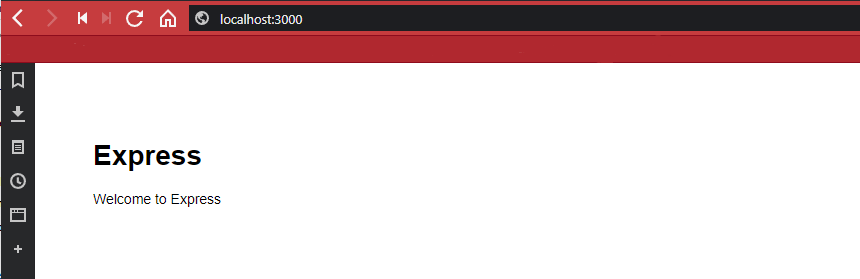
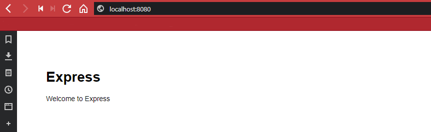

As an example, we are going to use [express-generator](https://expressjs.com/en/starter/generator.html) to scaffold a slightly more complex ([then before](https://github.com/mpolinowski/node-express-docker-starter)) [Node.js](https://nodejs.org) Web App and link this source code into a Docker Container Volume.

[Github Repository](https://github.com/mpolinowski/express-generator-app-docker)

<!-- TOC -->

- [Create a Node.js Web App](#create-a-nodejs-web-app)
- [Pointing the Container Volume to our Source Code](#pointing-the-container-volume-to-our-source-code)

<!-- /TOC -->


## Create a Node.js Web App

We want to use express-generator to generate a basic Node Web App. We first need to install the generator globally on our machine:


```bash
npm install -g express express-generator
```

We then run express-generator to scaffold an app for use, using the [EJS Templating Engine](http://ejs.co) - check out [their website](https://expressjs.com/en/starter/generator.html) for more options - and put the source code into a folder named _express-generator-app-docker_:


```bash
express --view=ejs express-generator-app-docker
```

To install dependencies we need to enter the created directory and run _npm install_ :

```bash
cd express-generator-app-docker & npm install
```

We can test our web app by running _npm start_ and accessing _http://localhos:3000_ with a web browser:





## Pointing the Container Volume to our Source Code

In our [previous test](https://github.com/mpolinowski/node-express-docker-starter) we already pulled the latest Node.js Docker Images from the Docker Hub:


To use this image, together with our Web App, we can run the following docker command:


```bash
docker run -p 8080:3000 -v E:/express-generator-app-docker:/app -w "/app" node npm start
```

This command will run the node docker image, expose the internal port 3000 (coming from our express app) to port 8080. To point to our source code, we need to create a Volume __-v__ from the app directory __E:/express-generator-app-docker__ (_adjust the absolute path according to your system setup_) and link it to an __/app__ directory inside the container. To execute our code inside the container, we can add __npm start__ at the end of the command - _be aware_ that you have to set the working directory to the __/app__ directory by adding __-w "/app"__, to run the start command from there!


The App is now running from inside the docker container on Port 8080:





You can go into the sites source code and edit it - changes to the express app will show up in your browser when you reload the page. That means, we can now develop a Node Application on a system that doesn't have Node.js installed on it.


The next step is actually put your source code into a container - which is, what we are going to try next!