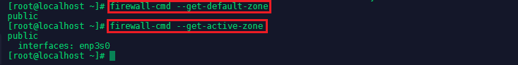

This exam and the exam objectives provided here are based on the Red Hat® Enterprise Linux® 7.0 version of the exam.

The performance-based Red Hat Certified Engineer exam (EX300) tests to determine if your knowledge, skill, and ability meet those required of a senior system administrator responsible for Red Hat Enterprise Linux (RHEL) systems.

[Red Hat Website](https://www.redhat.com/en/services/training/ex300-red-hat-certified-engineer-rhce-exam)


<!-- TOC -->

- [Network Time Protocol Service](#network-time-protocol-service)
- [Setting up FirewallD](#setting-up-firewalld)
  - [Predefined Zones](#predefined-zones)
  - [Installation](#installation)
  - [Setting rules for applications](#setting-rules-for-applications)
    - [Predefined Services](#predefined-services)
    - [Adding Ports to Firewall Rules](#adding-ports-to-firewall-rules)
    - [Creating a Custom Service](#creating-a-custom-service)
    - [Creating a Custom Zone](#creating-a-custom-zone)
  - [Setting Rich Rules](#setting-rich-rules)
  - [NAT and Port Forwarding](#nat-and-port-forwarding)
- [Samba File sharing](#samba-file-sharing)
- [Network Interface Bonding](#network-interface-bonding)
  - [Types of Bonding](#types-of-bonding)
  - [Enabling Bonding on CentOS 7](#enabling-bonding-on-centos-7)
  - [Configure multiple IP addresses for bond0](#configure-multiple-ip-addresses-for-bond0)
- [Network Interface Teaming](#network-interface-teaming)

<!-- /TOC -->

## Network Time Protocol Service

NTP- is a protocol which runs over port 123 UDP at Transport Layer and allows computers to synchronize time over networks for an accurate time. This service is handled by __Chrony.d__ on CentOS 7 and higher. We can edit this service via `nano /etc/chrony.conf`:


---


---


As you can see, the service is pre-configured with 4 NTP server - that can be replaced as needed:

```
server 0.centos.pool.ntp.org iburst
server 1.centos.pool.ntp.org iburst
server 2.centos.pool.ntp.org iburst
server 3.centos.pool.ntp.org iburst
```

The service can then be enabled `systemctl enabled chronyd.service`, restarted `systemctl restart chronyd.service` and it's status be checked `systemctl status chronyd.service`.


To check the current output of the NTP service type `chronyc tracking`:


---


---


Current sources can be checked by `chronyc sources -v `


---


---

To check your current selected timezone run `timedatectl | grep "Time zone"`. To set a different timezone, e.g. __UTC__, run `timedatectl set-timezone UTC`.


## Setting up FirewallD

Firewalld provides a dynamically managed firewall with support for network/firewall __zones__ that define the trust level of network connections or interfaces.

### Predefined Zones

These are the zones provided by firewalld sorted according to the default trust level of the zones from untrusted to trusted - to see all available zones type `firewall-cmd --get-zones` / to see the configuration of a specific zone, e.g. __public__, type `firewall-cmd --zone=public --list-all`

* __drop__: Any incoming network packets are dropped, there is no reply. Only outgoing network connections are possible.

* __block__: Any incoming network connections are rejected with an icmp-host-prohibited message for IPv4 and icmp6-adm-prohibited for IPv6. Only network connections initiated within this system are possible.

* __public__: For use in public areas. You do not trust the other computers on networks to not harm your computer. Only selected incoming connections are accepted.

* __external__ : For use on external networks with masquerading enabled especially for routers. You do not trust the other computers on networks to not harm your computer. Only selected incoming connections are accepted.

* __dmz__: For computers in your demilitarized zone that are publicly-accessible with limited access to your internal network. Only selected incoming connections are accepted.

* __work__ : For use in work areas. You mostly trust the other computers on networks to not harm your computer. Only selected incoming connections are accepted.

* __home__ : For use in home areas. You mostly trust the other computers on networks to not harm your computer. Only selected incoming connections are accepted.

* __internal__: For use on internal networks. You mostly trust the other computers on the networks to not harm your computer. Only selected incoming connections are accepted.

* __trusted__: All network connections are accepted.


### Installation

[FirewallD](https://firewalld.org/documentation/) is most likely already installed on your system. You can check the service status by typing `systemctl status firewalld`. If the service is missing, install FirewallD via `yum install -y firewalld` + `systemctl enable firewalld`:


---


---


You can check the default zone that is configured for system by typing `firewall-cmd --get-default-zone` or check active zones in general via `firewall-cmd --get-active-zone`:


---



---


### Setting rules for applications

#### Predefined Services

A firewalld service can be a list of local ports and destinations and additionally also a list of firewall helper modules automatically loaded if a service is enabled. The use of predefined services makes it easier for the user to enable and disable access to a service. To see all predefined services that come with FirewallD type `firewall-cmd --get-services`:


---


---


If we want to allow __http__ traffic through our firewall, all we have to do is to activate the corresponding service for the active zone - in our case this is __public__: `firewall-cmd --zone=public --add-service=http`. You can check if adding the service was successful by typing `firewall-cmd --zone=public --list-services`:


---


---


To make a change persist after a reboot, you need to add the __--permanent__ flag to the add-command, e.g. `firewall-cmd --zone=public --permanent --add-service=http`. To list all permanent active services type `firewall-cmd --zone=public --permanent --list-services`.


#### Adding Ports to Firewall Rules

A simple port number or port range can be used in the cases where no additional changes are needed. For example with opening port 80/tcp to allow access to a local http servicer on the standard port - which would be identical to using the __http service__ we activated above `firewall-cmd --permanent --zone=public --add-port=80/tcp`. This can be tested by typing `firewall-cmd --zone=public --permanent --list-ports`. To add a range of ports, define the beginning and end port like this `firewall-cmd --permanent --zone=public --add-port=40999-41001/udp`.


#### Creating a Custom Service

Adding Ports manually is highly flexible but might make you loose track after a while - which port belonged to that application I just deleted? Grouping ports for applications in services makes it much easier to handle deployments. All predefined services can be found under `/usr/lib/firewalld/services` in form of __XML Files__ that we can use as templates for our services:


---


---


We can copy a file `cp ssh.xml example.xml` and edit the copy according to our needs: 


---


---


Now reload FirewallD `firewall-cmd --reload`, add the example services you created `firewall-cmd --zone=public --add-service=example` and check if it is running `firewall-cmd --zone=public --list-services`:


---


---


#### Creating a Custom Zone

To configure or add zones you can either use one of the firewalld interfaces to handle and change the configuration. These are the graphical configuration tool firewall-config, the command line tool firewall-cmd or the D-BUS interface. Or you can create or copy a zone file in one of the configuration directories. `/usr/lib/firewalld/zones` is used for default and fallback configurations and `/etc/firewalld/zones` is used for user created and customized configuration files.

A new zone can be added with the following command, e.g. __example zone__: `firewall-cmd --permanent --new-zone=example`. To use your custom zone, you first need to reload FirewallD `firewall-cmd --reload`.

Just as with custom services, we can use the predefined zones in `/usr/lib/firewalld/zones` as a template for our custom zone:


---


---


Or use the command  `firewall-cmd --zone=example --permanent --add-service=http` to manually add default services to your zone. To assign your custom zone to the correct network interface - in my case __enp0s3__ (use `ip addr` to find your interface name) - type `firewall-cmd --zone=example --permanent --change-interface=enp0s3`.


To change the default zone to your custom zone type `firewall-cmd --set-default-zone=example`.


### Setting Rich Rules

With the [rich language](https://firewalld.org/documentation/man-pages/firewalld.richlanguage.html) more complex firewall rules can be created in an easy to understand way. The language uses keywords with values and is an abstract representation of ip*tables rules.
The rich language extends the [current zone elements](https://firewalld.org/documentation/man-pages/firewalld.zone.html) (service, port, icmp-block, icmp-type, masquerade, forward-port and source-port) with additional source and destination addresses, logging, actions and limits for logs and actions.

__Allow Traffic__: Allow traffic from an _10.0.0.0/24_ network to a specific client with an IP address of _192.168.2.110/24_ via the ports _8080_ to _8090_.


```bash
firewall-cmd --permanent --zone=example --add-rich-rule='rule family=ipv4 source address=10.0.0.0/24 destination address=192.168.2.110/24 port port=8080-8090 protocol=tcp accept'
```


You can test your rich rules via `firewall-cmd --permanent --zone=example --list-rich-rules`.

To __remove__ a rich rule type:


```bash
firewall-cmd --permanent --zone=example --remove-rich-rule='rule family=ipv4 source address=10.0.0.0/24 destination address=192.168.2.110/24 port port=8080-8090 protocol=tcp accept'
```


__Reject Traffic__: We want to block all traffic that we receive from the IP address _192.168.2.44/24_.


```bash
firewall-cmd --permanent --zone=example --add-rich-rule='rule family=ipv4 source address=192.168.2.44/24 reject'
```


This rule will now actively reject all incoming traffic from the given IP address (not only silently dropping it).


__Limit Sessions__: Limit the connection time for incomming _SSH_ connections to 10min:


```bash
firewall-cmd --permanent --zone=example --add-rich-rule='rule service name=ssh limit value=10/m accept'
```

__Logging Sessions__: Log all connections from a specific IP address:


```bash
firewall-cmd --permanent --zone=example --add-rich-rule='rule family=ipv4 source address="192.168.0.0/24" service name="ssh" log prefix="ssh" level="info" limit value="50/m" accept'
```


### NAT and Port Forwarding

__Masquerading a Connection__:

```
firewall-cmd --permanent --zone=example --add-masquerade
firewall-cmd --permanent --zone=example --add-rich-rule='rule family=ipv4 source address=192.168.2.0/24 masquerade'
```

__Forwarding a Port__:

```
firewall-cmd --permanent --zone=example --add-forward-port=port=22:proto=tcp:toport=2222:toaddress=10.0.0.10
firewall-cmd --permanent --zone=example --query-forward-port=port=22:proto=tcp:toport=2222:toaddress=10.0.0.10
firewall-cmd --permanent --zone=example --list-all
```

```
firewall-cmd --permanent --zone=example --add-rich-rule='rule family=ipv4 source address=192.168.2.0/24 forward-port port=22 protocol=tcp to-port=2222 to-addr=10.0.0.0/24'
```


## Samba File sharing

[Samba](https://www.samba.org/samba/docs/SambaIntro.html) is the standard Windows interoperability suite of programs for Linux and Unix. Samba is an important component to seamlessly integrate Linux/Unix Servers and Desktops into Active Directory environments. It can function both as a domain controller or as a regular domain member. 

To install Samba on your CentOS 7 server run the following command `yum install samba samba-client samba-common`.


To allow Samba through your firewall, we first have to activate the according service in FirewallD `firewall-cmd --zone=public --permanent --add-service=samba` and reload the firewall `firewall-cmd --reload` to load the service.


To use the anonymous filesharing, we first need to create a folder for it from which files will be shared:


```
mkdir -p /srv/samba/anonymous
chmod -R 0775 /srv/samba/anonymous
chcon -t samba_share_t /srv/samba/anonymous
```


You can find the configuration file for the Samba service under `/etc/samba/smb.conf` (make a copy before starting to edit it `cp /etc/samba/smb.conf /etc/samba/smb.conf.bak`). The file should look like this:


---


---


```
[global]
        workgroup = WORKGROUP
        server string = Samba Server %v
        netbios name = centos
        security = user
        map to guest = bad user
        dns proxy = no

[sambashare]
        comment= Samba Share
        path= /srv/samba/anonymous
        browsable = yes
        writable = yes
        guest ok = yes
        read only = no
        create mode = 0775
        directory mode = 0775
        force user = root
```


You can test your configuration with the `testparm` command:


---


---


__Note__ The `rlimit_max: increasing rlimit_max (1024) to minimum Windows limit (16384)` warning can be ignored as Samba already adjusts the limit automatically. To do this manually add the line `* – nofile 16384` to `/etc/security/limits.conf`.


Now run the Samba Service with

```bash
systemctl enable smb.service
systemctl enable nmb.service
systemctl restart smb.service
systemctl restart nmb.service
```

The share should now be discoverable on the Windows Network Search:


---


---


As well as under Android with Apps like the [X-plore File Manager](https://play.google.com/store/apps/details?id=com.lonelycatgames.Xplore):


---


---


## Network Interface Bonding

Use network teaming or bonding to combine two or more network interfaces for higher throughput and redundancy or load balancing. 

### Types of Bonding

The behaviour of bonded interfaces depend on the __mode__ they are set to - either __hot-standby__ or __load-balancing__.

* __mode=0 (balance-rr)__: The RR stands for _Round-Robin_ and it is a pure __load-balancing__ and __fault tolerance__ mode. It transfers packets in sequential order, from the the first to the last available interface.
* __mode=1 (active-backup)__: In this mode _only one interface is active_. The next one is only activated, if the first one fails. The _bonds MAC address is only visiable externally on one port_. This setup only provides __fault tolerance__.
* __mode=2 (balance-xor)__: All network interfaces of the bond are used. But source and destination MAC addresses are paired (Source MAC address is XOR’d with destination MAC address) - packets send to a specific destination will always be send from the same source interface. You get __load-balancing__ and __fault tolerance__.
* __mode=3 (broadcast)__: The broadcast mode transmits everything on all slave interfaces and provides only __fault tolerance__.
* __mode 4 (802.3ad)__: The 802.3ad mode is known as Dynamic Link Aggregation mode. It creates aggregation groups that share the same speed and duplex settings. This mode requires a switch that supports IEEE 802.3ad Dynamic link. It offers  __fault tolerance__ by using all slave interfaces.
* __mode 5 (balance-tlb)__: This is called Adaptive transmit __load balancing__. The outgoing traffic is distributed according to the current load and queue on each slave interface. Incoming traffic is received by the current slave.
*__mode 6 (balance-alb)__: This is Adaptive load balancing mode. This includes balance-tlb + receive load balancing (rlb) for IPV4 traffic. The receive load balancing is achieved by ARP negotiation. The bonding driver intercepts the ARP Replies sent by the server on their way out and overwrites the src hw address with the unique hw address of one of the slaves in the bond such that different clients use different hw addresses for the server.

### Enabling Bonding on CentOS 7

The __Bonding__ is not enabled by default and has to be loaded using the __modprobe__ command.

__modprobe__ is an intelligent command for listing, inserting as well as removing modules from the kernel. It searches in the module directory _/lib/modules/$(uname -r)_ for all the modules and related files. To insert a module, simply provide its name as follows:


```bash
modprobe bonding
```


You can add the __--first-time__ flag to be alerted if loading the module fails. To remove a module use the __-r__:


---


---


Let's create a configuration file to have the bonding module loaded at boot by typing `nano /etc/modules-load.d/bonding.conf` and adding the following lines:


```bash
# Load the bonding kernel module at boot
bonding
```


---


---


We can reboot the system now and check if the module is being loaded with `lsmod | grep bonding`:


---


---


We can check which driver version the module is using with `modinfo bonding` - in our case it is _v3.7.1_:


---


---


To create the __Bond Interface__ _cd_ into `/etc/sysconfig/network-scripts/` - this folder contains the configuration (_ifconfig_) files for all your network interfaces. As seen below, this machine has a default LAN interface `enp3s0`, which defines the LAN IP address, gateway, DNS Server, etc:


---


---


We can now create a config file for our bonding interface by typing `nano ifcfg-bond0`:


```
DEVICE=bond0
TYPE=Bond
NAME=bond0
BONDING_MASTER=yes
BOOTPROTO=none
ONBOOT=yes
IPADDR=192.168.2.110
PREFIX=24
NETMASK=255.255.255.0
GATEWAY=192.168.2.1
DNS1=192.168.2.1
BONDING_OPTS="mode=1 miimon=100"
```

The interface is now now set up to be loaded on-boot and boot protocol is set to none, to _deactivate DHCP_.Make sure to change the network information according to your local network setup. The type of bonding is set to __Mode 1__ as specified earlier.

__miimon__ specifies the MII link monitoring frequency in milliseconds. This determines how often the link state of each slave is inspected for link failures. A value of zero disables MII link monitoring. A value of 100 is a good starting point.


---


---

We now have to add the NIC Bonding inside our network interface configuration file `nano ifcfg-enp3s0` - we need to add the following lines:

```
MASTER=bond0
SLAVE=yes
```

As well as removing the IP configuration, that is now handled by our bonding interface:


---


---


We now have to repeat this step for the secondary network interface of the system - which in my case is a wifi interface on a different network `ifcfg-TP-Link_BB2D_5G` and gave me some problems. _The interface was not added to the bond with the configuration below - the installation later worked on a virtual machine with 2 LAN interfaces that were on the same network. Right now I am not sure what the limitation is that I hit here - is the Wifi module deactivated once Ethernet is connected?_:


---


---


We can now restart the network service with `systemctl restart network.service` and check the status with `systemctl status network.service`:


---


---


The network service is back up and we can check if the Master/Slave configuration worked by typing `ip link show`:


---


---


As we can see the configuration is working - the Ethernet interface is in a slave configuration to our `bond0` interface. But the Wifi interface __was not added__. We can get more information about our bond interface under `cat /proc/net/bonding/bond0`:


---


---


### Configure multiple IP addresses for bond0

Right now the bonding interface uses only one IP address - to assign multiple IP addresses we need to create an alias for the bond0 interface. To create an alias for bond0, copy the existing configuration file(ifcfg-bond0) to a new configuration file(ifcfg-bond0:1) and edit file:


```bash
cp /ifcfg-bond0 /ifcfg-bond0:1
nano ifcfg-bond0:1
```


---


---


As you see we made the following changes to the configuration file to assign `192.168.2.118` as a secondary IP address to our bond:


```
DEVICE=bond0.1
IPADDR=192.168.2.118
```


Save your changes and reload the network service `systemctl restart network`.


## Network Interface Teaming

The term __Network Teaming__ has been chosen to refer to this new implementation of the concept. The existing bonding driver is unaffected, Network Teaming is offered as an alternative and does not replace bonding in Red Hat Enterprise Linux 7 with a small kernel driver and a user-space daemon, __teamd__. Software, called runners, implement load balancing and active-backup logic, such as roundrobin.


The following runners are available to teamd:

| Runner | Explanation |
|---|---|
| broadcast | A simple runner which transmit packet from all ports |
| roundrobin | A simple runner which transmits packets in a round-robin fashion from each of the ports. |
| activebackup | This is a failover runner which watches for link changes and selects an active port for data transfers |
| loadbalance | This runner monitors traffic and uses a hash function to try to reach a perfect balance when selecting ports for packet transmission. |
| lacp | Implements the 802.3ad LinkAggregation Control Protocol. Can use the same transmit port selection possibilities as the load balance runner. |


We can install __teamd__ with the `yum -y install teamd` command - but it will most likely already be installed on your CentOS 7 server. Now go to `cd /etc/sysconfig/network-scripts` and create a file __ifcfg-team0__:

```
DEVICE=team0
NAME=team0
DEVICETYPE=Team
TEAM_CONFIG='{"runner": {"name": "activebackup"}, "link_watch": {"name": "ethtool"}}'
BOOTPROTO=none
IPADDR=192.168.2.110
PREFIX=24
GATEWAY=192.168.2.1 
DEFROUTE=yes
IPV4_FAILURE_FATAL=no
IPV6INIT=yes
IPV6_AUTOCONF=yes
IPV6_DEFROUTE=yes
IPV6_FAILURE_FATAL=no
IPV6_ADDR_GEN_MODE=stable-privacy
ONBOOT=yes
```


---


---


We now need to add three lines to our Ethernet interface config file `nano ifcfg-enp3s0`:


```
TEAM_MASTER=team0
TEAM_PORT_CONFIG='{"prio":100}'
DEVICETYPE=TeamPort
```


---


---


Now edit your secondary network interface by adding the following 3 lines - note that the __Priority__ is set to a lower value then in our first interface above:


```
TEAM_MASTER=team0
TEAM_PORT_CONFIG='{"prio":99}'
DEVICETYPE=TeamPort
```

We can now load our new team configuration by typing `ifdown ifcfg-team0; ifup ifcfg-team0`. The teaming can be verified with `teamnl team0 ports` and `teamdctl team0 state`.


This process can be simplified by using the __nmcli__:

```
nmcli con add type team con-name team0 ifname ifcfg-team0 ip4 192.168.2.110 gw4 192.168.2.1
nmcli con add type team-slave con-name enp0s3 ifname enp0s3 master team0
```