This guide will help you get Node-RED installed and running in just a few minutes.

<!-- TOC -->

- [Installation](#installation)
- [Adding Nodes](#adding-nodes)
- [Creating a flow](#creating-a-flow)
  - [Add an Inject node](#add-an-inject-node)
  - [Add a Debug node](#add-a-debug-node)
  - [Wire the two together](#wire-the-two-together)
  - [Deploy](#deploy)
  - [Add a Function node](#add-a-function-node)
  - [Source Export / Import](#source-export--import)
- [Creating a flow that does an HTTP Request](#creating-a-flow-that-does-an-http-request)
  - [Add an Inject node](#add-an-inject-node-1)
  - [Add an HttpRequest node](#add-an-httprequest-node)
  - [Add a CSV node](#add-a-csv-node)
  - [Add a Debug node](#add-a-debug-node-1)
  - [Wire them all together](#wire-them-all-together)
  - [Add a Switch node](#add-a-switch-node)
  - [Add a Change node](#add-a-change-node)
  - [Add a Debug node](#add-a-debug-node-2)
  - [Deploy](#deploy-1)
  - [Export](#export)

<!-- /TOC -->

## Installation

Install Node-RED is to use the node package manager, npm, that comes with Node.js. Installing as a global module adds the command node-red to your system path:

```bash
npm install -g --unsafe-perm node-red
```

We should now go to the root directory inside our Windows User folder and define a public directory (in the screenshot below I created a folder `./static` inside the root for that purpose) and create a Admin Login - this can be done in `./settings.js`:


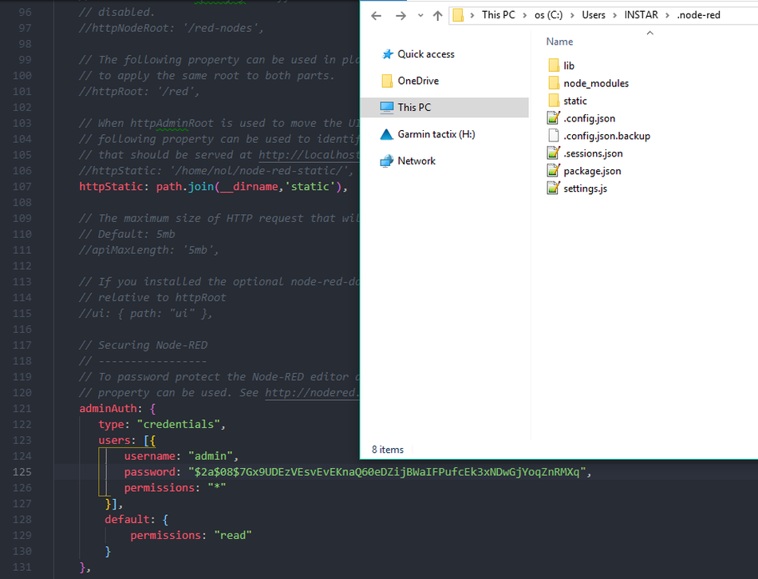


The Admin password is securely hashed using the bcrypt algorithm. To generate a suitable password hash, you can use the node-red-admin command-line tool:

```bash
npm install -g node-red-admin

node-red-admin hash-pw
```

The tool will prompt you for the password you wish to use and then print out the hash that can be copied into the settings file.


You can now use the `node-red` command to start the application:


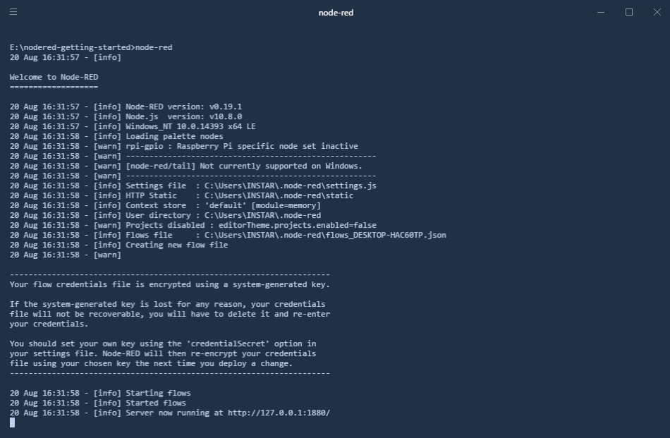


The Node-RED can now be accessed via `http://127.0.0.1:1880/` - login with the created Admin account:


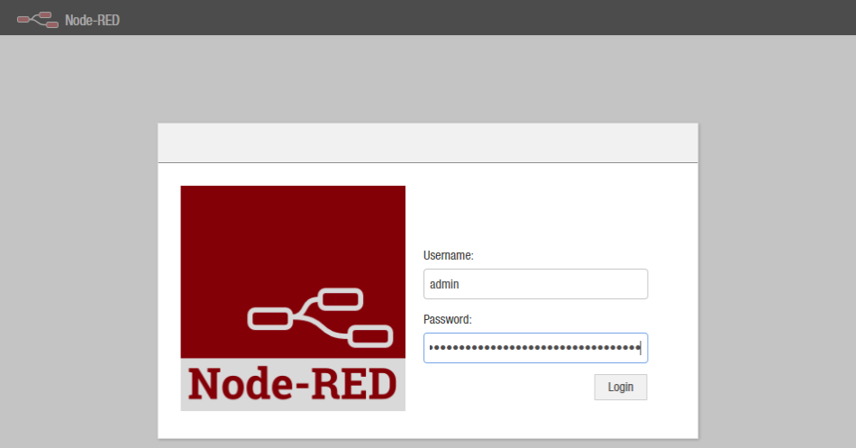


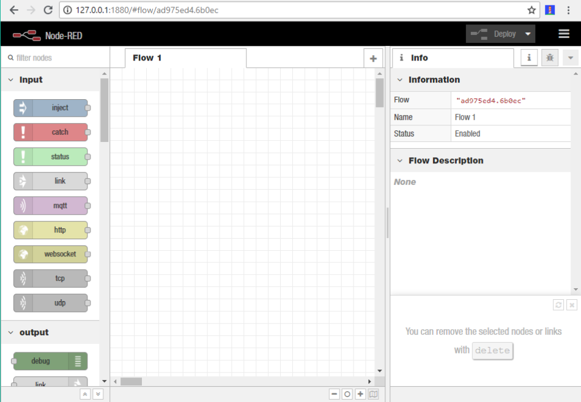


## Adding Nodes

Node-RED comes with a core set of useful nodes, but there are a growing number of additional nodes available for install from both the Node-RED project as well as the wider community.

You can search for available nodes in the [Node-RED library](http://flows.nodered.org/).

You can install nodes directly using the editor. To do this select Manage Palette from the menu (top right), and then select the install tab in the palette. You can now search for new nodes to install, update, and enable and disable existing nodes.


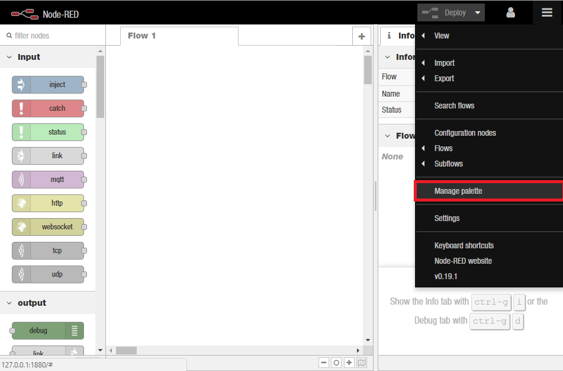


## Creating a flow

### Add an Inject node

> The __Inject__ node allows you to inject messages into a flow, either by clicking the button on the node, or setting a time interval between injects. Drag one onto the workspace from the palette.

### Add a Debug node

> The __Debug__ node causes any message to be displayed in the Debug sidebar. By default, it just displays the payload of the message, but it is possible to display the entire message object.

### Wire the two together

> Connect the Inject and Debug nodes together by dragging between the output port of one to the input port of the other.

### Deploy

> At this point, the nodes only exist in the editor and must be deployed to the server. Click the __Deploy button__. With the Debug sidebar tab selected, click the Inject button. You should see numbers appear in the sidebar. By default, the Inject node uses the number of milliseconds since January 1st, 1970 as its payload.


### Add a Function node

> The Function node allows you to pass each message though a JavaScript function.
> 
> Wire the Function node in between the Inject and Debug nodes. You may need to delete the existing wire (select it and hit delete on the keyboard).
> 
> Double-click on the Function node to bring up the edit dialog. Copy the follow code into the function field:

```js
var date = new Date(msg.payload);
// Change the payload to be a formatted Date string
msg.payload = date.toString();
// Return the message so it can be sent on
return msg;
```

> Click Ok to close the edit dialog and then click the deploy button.
> 
> Now when you click the Inject button, the messages in the sidebar will be more readable time stamps.


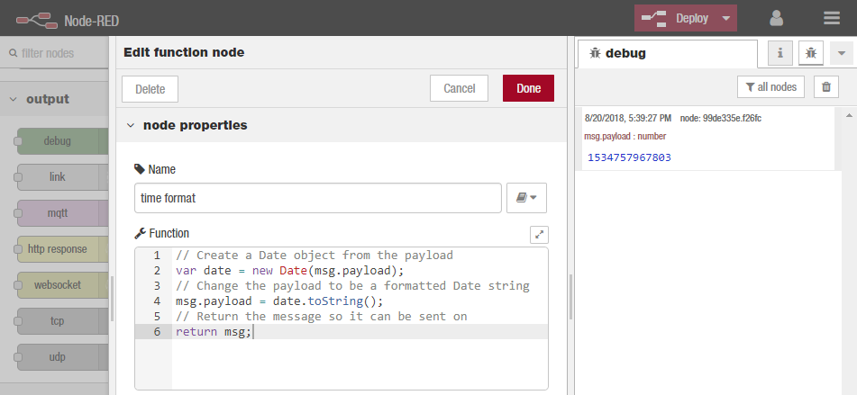


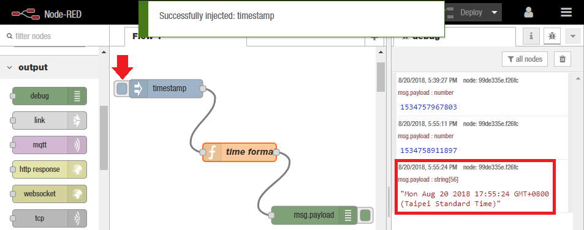


### Source Export / Import

> The flow created in this example is represented by the following json. It can be imported straight into the editor by pasting the json into the Import dialog (Ctrl-I or via the dropdown menu):


```json
[[{"id":"aafc0f94.6fc66","type":"tab","label":"Flow 1","disabled":false,"info":""},{"id":"43533492.9531bc","type":"inject","z":"aafc0f94.6fc66","name":"","topic":"","payload":"","payloadType":"date","repeat":"","crontab":"","once":false,"onceDelay":0.1,"x":89,"y":67,"wires":[[]]},{"id":"6cee6953.f69478","type":"inject","z":"aafc0f94.6fc66","name":"","topic":"","payload":"","payloadType":"date","repeat":"","crontab":"","once":false,"onceDelay":0.1,"x":92,"y":169,"wires":[["f2173234.8ac2"]]},{"id":"99de335e.f26fc","type":"debug","z":"aafc0f94.6fc66","name":"","active":true,"tosidebar":true,"console":false,"tostatus":false,"complete":"false","x":334,"y":376,"wires":[]},{"id":"f2173234.8ac2","type":"function","z":"aafc0f94.6fc66","name":"time format","func":"// Create a Date object from the payload\nvar date = new Date(msg.payload);\n// Change the payload to be a formatted Date string\nmsg.payload = date.toString();\n// Return the message so it can be sent on\nreturn msg;","outputs":1,"noerr":0,"x":212,"y":273,"wires":[["99de335e.f26fc"]]}]]
```


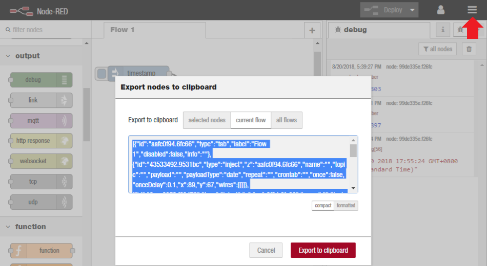


## Creating a flow that does an HTTP Request

> This example is slightly more complex and starts to bring in data from external sources to do something useful locally.
> 
> * It will go out to an external web site
> * grab some information
> * read and convert that into a useful form


### Add an Inject node

> For this example, the Inject node will be configured to trigger the flow at a regular interval.
> 
> Drag an Inject node onto the workspace from the palette.
> 
> Double click the node to bring up the edit dialog. Set the repeat interval to every 5 minutes.
> 
> Click Ok to close the dialog.


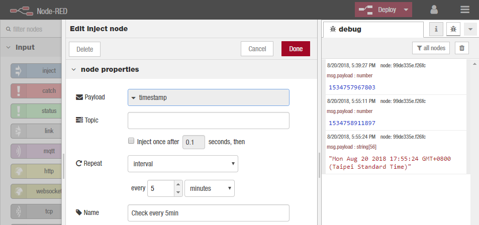


### Add an HttpRequest node

> The HttpRequest node can be used to retrieve a web-page when triggered.
>
> After adding one to the workspace, edit it to set the URL property to `https://earthquake.usgs.gov/earthquakes/feed/v1.0/summary/significant_week.csv`:


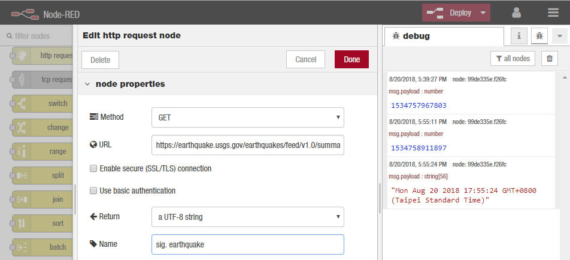


### Add a CSV node

> Add a CSV node and edit the properties, and tick the `Input - [x] First row contains column names`:


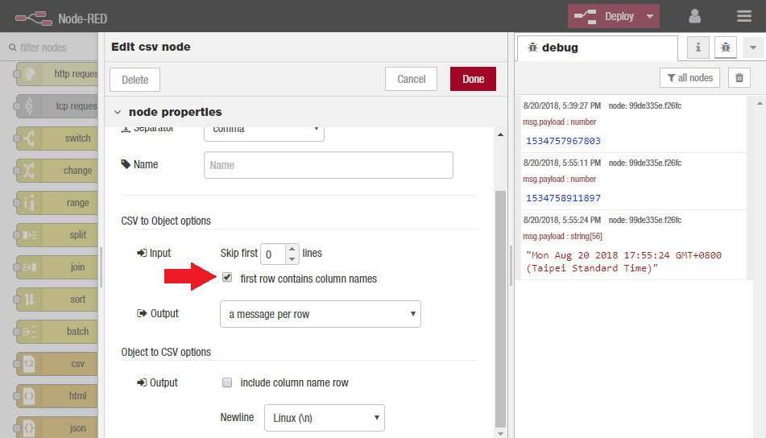


### Add a Debug node

> Add a Debug node to the output.


### Wire them all together

> * Wire the Inject node output to the HttpRequest node input.
> * Wire the HttpRequest node output to the CSV node input.
> * Wire the CSV node output to the Debug node input.


### Add a Switch node

> * Wire a Switch node to the output of the CSV node.
> * Configure the property to be `msg.payload.mag`
> * Configure the test to be >= and the value to be `7`


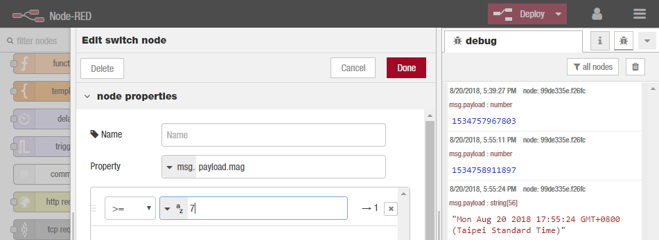


### Add a Change node

> * Wire a Change node to the output of the Switch node.
> * Configure the node to Set, `msg.payload` to be `PANIC!`.


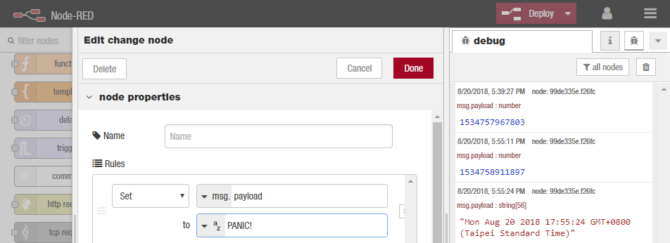


### Add a Debug node

> * Wire a Debug node to the output of the Change node


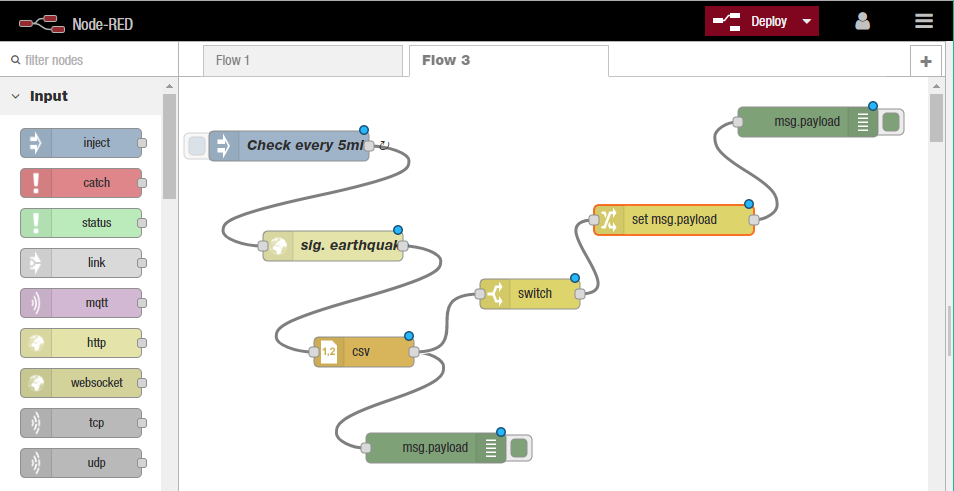


### Deploy

> Click the Deploy button.
>
> With the Debug sidebar tab selected (Ctrl-Space, or via the dropdown menu, then click the Debug tab), click the Inject button. You should see a list of entries with some contents that look like:


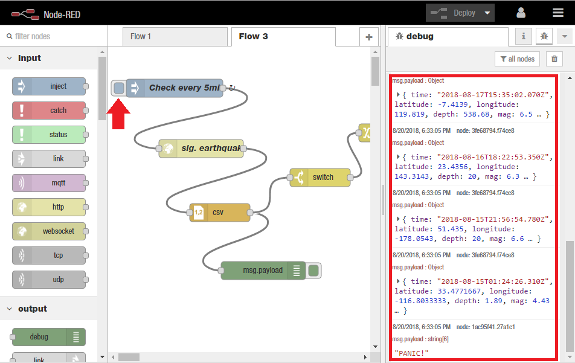


> You can now click on the little arrow to the left of each property to expand them and examine the contents
>
> If there were any quakes with a magnitude greater than 7 you will also see some output like:

```
msg.payload : string(6)
PANIC!
```

> You can use the green buttons to the right of each debug node to turn on and off that particular debug node - for example deactivate the first debug node to only be notified if there was an earthquake with mag 7 or higher.


### Export

```json
[{"id":"79a02957.897548","type":"tab","label":"Flow 3","disabled":false,"info":""},{"id":"843d22f1.0f3db","type":"inject","z":"79a02957.897548","name":"Check every 5min","topic":"","payload":"","payloadType":"date","repeat":"300","crontab":"","once":false,"onceDelay":0.1,"x":110,"y":69,"wires":[["9bfe934.885317"]]},{"id":"9bfe934.885317","type":"http request","z":"79a02957.897548","name":"sig. earthquake","method":"GET","ret":"txt","url":"https://earthquake.usgs.gov/earthquakes/feed/v1.0/summary/significant_week.csv","tls":"","x":154,"y":169,"wires":[["3553ec48.07f1d4"]]},{"id":"3553ec48.07f1d4","type":"csv","z":"79a02957.897548","name":"","sep":",","hdrin":true,"hdrout":"","multi":"one","ret":"\\n","temp":"","skip":"0","x":185,"y":275,"wires":[["3fe68794.f74ce8","38ac2b9d.22ded4"]]},{"id":"3fe68794.f74ce8","type":"debug","z":"79a02957.897548","name":"","active":true,"tosidebar":true,"console":false,"tostatus":false,"complete":"false","x":257,"y":371,"wires":[]},{"id":"38ac2b9d.22ded4","type":"switch","z":"79a02957.897548","name":"","property":"payload.mag","propertyType":"msg","rules":[{"t":"gte","v":"7","vt":"str"}],"checkall":"true","repair":false,"outputs":1,"x":351,"y":217,"wires":[["a59b3ed8.5c641"]]},{"id":"a59b3ed8.5c641","type":"change","z":"79a02957.897548","name":"","rules":[{"t":"set","p":"payload","pt":"msg","to":"PANIC!","tot":"str"}],"action":"","property":"","from":"","to":"","reg":false,"x":495,"y":143,"wires":[["1ac95f41.27a1c1"]]},{"id":"1ac95f41.27a1c1","type":"debug","z":"79a02957.897548","name":"","active":true,"tosidebar":true,"console":false,"tostatus":false,"complete":"false","x":629,"y":45,"wires":[]}]
```