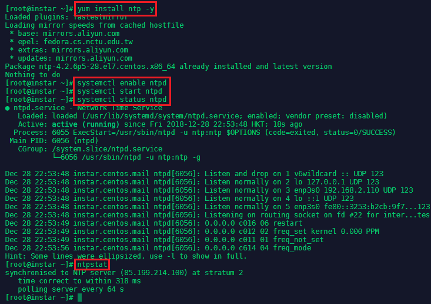
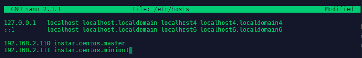
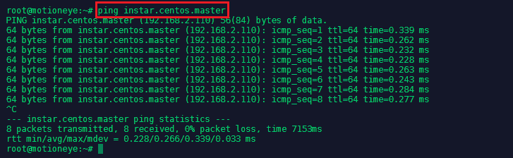
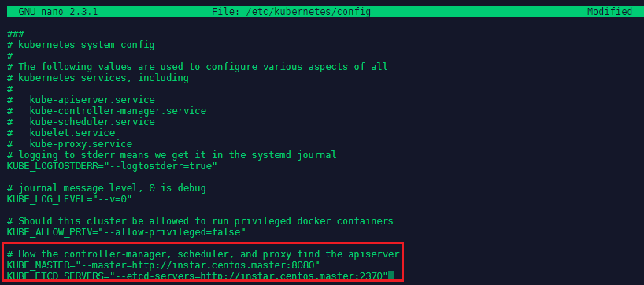
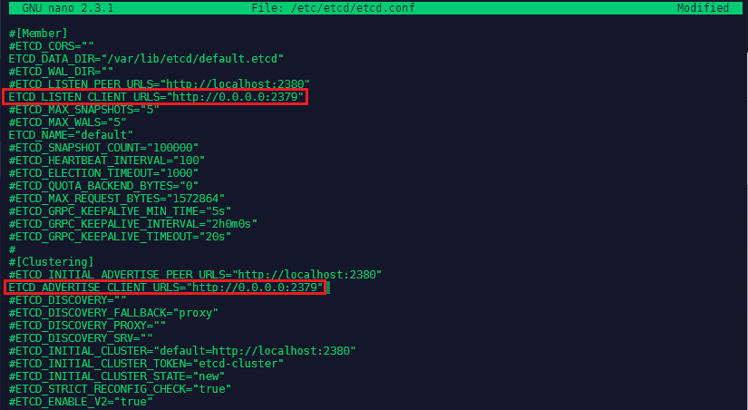
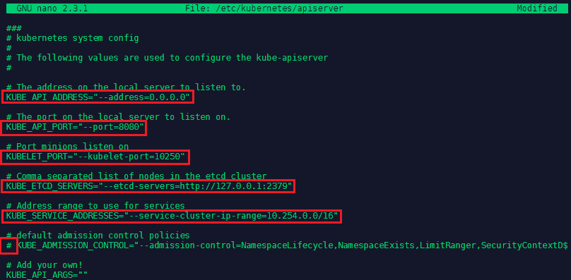
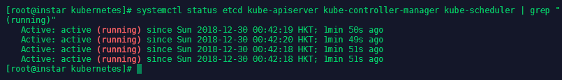

This exam and the exam objectives provided here are based on the Red Hat® Enterprise Linux® 7.0 version of the exam.

An IT professional who is a Red Hat Certified Specialist in Containerized Application Development is capable of performing the following tasks:

* Implementing new container images by extending existing images
* Manage images including pulling and pushing images from a private registry
* Manually run and link containers in a development environment

[Red Hat Website](https://www.redhat.com/en/services/training/ex300-red-hat-certified-engineer-rhce-exam)


<!-- TOC -->

- [Network Time Protocol Service](#network-time-protocol-service)
- [Setting a Hostname](#setting-a-hostname)
- [FirewallD](#firewalld)
  - [On Master Node](#on-master-node)
  - [On Worker Nodes](#on-worker-nodes)
- [Install Docker & Kuberenetes on CentOS](#install-docker--kuberenetes-on-centos)
  - [Configuring the Master Server](#configuring-the-master-server)
  - [Configuring the Slave Server](#configuring-the-slave-server)
  - [Install Docker & Kuberenetes on Debian](#install-docker--kuberenetes-on-debian)

<!-- /TOC -->

## Network Time Protocol Service

NTP- is a protocol which runs over port 123 UDP at Transport Layer and allows computers to synchronize time over networks for an accurate time. This service - by default - is handled by __Chrony.d__ on CentOS 7 and higher. But we are going to use the __ntp__ package instead.


You can check if __Chrony.d__ is active on your system with the command `systemctl status chronyd.service`, stopping and disabling it with `systemctl stop chronyd.service`, `systemctl disable chronyd.service`.


To install __ntp__ run `yum install ntp -y`. Run `systemctl enable ntpd` and `systemctl start ntpd` to activate the NTP service. You can verify that the service is working with `systemctl status ntpd` and `ntpstat`:


---



---


## Setting a Hostname

We now need to make sure that all of our CentOS server can talk to each other via a hostname that is bound to their internal IP address. This can be set in `nano /etc/hosts`:


---



---


Add all server that you want to connect by their local IP and assign a host name, by which you want to call them - add those lines to all your server's host files:


```
192.168.2.110 instar.centos.master
192.168.2.111 instar.centos.minion1
```

You can test if the hostname is used by pinging it:


---



---

## FirewallD

Configure FirewallD for Kubernetes to work correctly:

### On Master Node

```bash
firewall-cmd --permanent --add-port=2370/tcp
firewall-cmd --permanent --add-port=6443/tcp
firewall-cmd --permanent --add-port=2379-2380/tcp
firewall-cmd --permanent --add-port=10250/tcp
firewall-cmd --permanent --add-port=10251/tcp
firewall-cmd --permanent --add-port=10252/tcp
firewall-cmd --permanent --add-port=10255/tcp
firewall-cmd --reload
```

### On Worker Nodes

```bash
firewall-cmd --permanent --add-port=2379/tcp
firewall-cmd --permanent --add-port=2370/tcp
firewall-cmd --permanent --add-port=10251/tcp
firewall-cmd --permanent --add-port=10255/tcp
firewall-cmd --reload
```


## Install Docker & Kuberenetes on CentOS

First we need to add the repository to pull the Docker code from - type `nano /etc/yum.repos.d/virt7-docker-common-release.repo` and add:

```
[virt7-docker-common-release]
name=virt7-docker-common-release
baseurl=http://cbs.centos.org/repos/virt7-docker-common-release/x86_64/os/
gpgcheck=0
```

Then install [Docker](https://www.docker.com/), [Kubernetes](https://kubernetes.io) and [etcd](https://coreos.com/etcd/docs/latest/):

```bash
yum -y install docker kubernetes etcd
systemctl enable docker 
systemctl start docker
```

Now we need to edit  (on the __master server__) the __Kubernetes config__ `nano /etc/kubernetes/config` and add the following lines:

```
# How the controller-manager, scheduler, and proxy find the apiserver
KUBE_MASTER="--master=http://instar.centos.master:8080"
KUBE_ETCD_SERVERS="--etcd-servers=http://instar.centos.master:2370"
```


---



---


### Configuring the Master Server

We continue with configuring __etcd__ - etcd is a distributed key value store that provides a reliable way to store data across a cluster of machines. The configuration only needs to be added to the __master server__ and can be found under `nano /etc/etcd/etcd.conf`. Here we need to change two URLs from __localhost__ to __0.0.0.0__ to listen to use all available network interfaces.

```
ETCD_LISTEN_CLIENT_URLS="http://0.0.0.0:2379"
ETCD_ADVERTISE_CLIENT_URLS="http://0.0.0.0:2379"
```

---



---


Now we can edit (on the __master server__) the __Kubernetes API Server__ configuration under `nano /etc/kubernetes/apiserver`:

```
# The address on the local server to listen to.
KUBE_API_ADDRESS="--address=0.0.0.0"

# The port on the local server to listen on.
KUBE_API_PORT="--port=8080"

# Port minions listen on
KUBELET_PORT="--kubelet-port=10250"

# default admission control policies
# KUBE_ADMISSION_CONTROL="--admission-control=NamespaceLifecycle,NamespaceExists,LimitRanger,SecurityContextD$
```


---



---


We now have to make sure that the services on the __master server__ are started in a particular order:

```bash
systemctl enable etcd kube-apiserver kube-controller-manager kube-scheduler
systemctl start etcd kube-apiserver kube-controller-manager kube-scheduler
systemctl status etcd kube-apiserver kube-controller-manager kube-scheduler | grep "(running)"
```


---



---


### Configuring the Slave Server


### Install Docker & Kuberenetes on Debian

Kubernetes:

```
apt-get update && apt-get install -y apt-transport-https ca-certificates curl gnupg2 software-properties-common
echo "deb https://apt.kubernetes.io/ kubernetes-xenial main" | sudo tee -a /etc/apt/sources.list.d/kubernetes.list
apt-get update
apt-get install -y kubelet kubeadm kubectl
apt-mark hold kubelet kubeadm kubectl
```

Kubernetes (Chinese Mirror):

```
apt-get update && apt-get install -y apt-transport-https
curl -s https://mirrors.aliyun.com/kubernetes/apt/doc/apt-key.gpg | apt-key add -
cat <<EOF >/etc/apt/sources.list.d/kubernetes.list
deb https://mirrors.aliyun.com/kubernetes/apt/ kubernetes-xenial main
EOF
apt-get update
apt-get install -y kubelet kubeadm kubectl
```


Docker:

```
apt-get remove docker docker-engine docker.io
curl -fsSL https://download.docker.com/linux/debian/gpg | sudo apt-key add -
add-apt-repository "deb [arch=amd64] https://download.docker.com/linux/debian $(lsb_release -cs) stable"
apt-get update
apt-get install docker-ce
systemctl enable docker 
systemctl start docker
systemctl status docker
```


