This exam and the exam objectives provided here are based on the Red Hat® Enterprise Linux® 7.0 version of the exam.

An IT professional who is a Red Hat Certified Specialist in Containerized Application Development is capable of performing the following tasks:

* Implementing new container images by extending existing images
* Manage images including pulling and pushing images from a private registry
* Manually run and link containers in a development environment

[Red Hat Website](https://www.redhat.com/en/services/training/ex300-red-hat-certified-engineer-rhce-exam)


Technologies used:

* __Kubernetes__: Kubernetes is a manager for cluster of containerized applications. It automates container deployment and scaling containers across clusters of hosts. A Kubernetes cluster is made up of __Nodes__ (server instances to which pods are deployed), __Pods__ (containers are coupled into pods in which they can share resources and reach each other via localhost) and __Containers__ (containerized applications/services executed by the docker runtime).

* __Docker__: Docker is the container runtime that we are going to use to run our containerized applications on.

* __ectd__: etcd is a distributed key value store that provides a reliable way to store data across a cluster of machines.


<!-- TOC -->

- [Network Time Protocol Service](#network-time-protocol-service)
- [Setting a Hostname](#setting-a-hostname)
- [FirewallD](#firewalld)
    - [Disable SELinux Enforcement](#disable-selinux-enforcement)
    - [Add a FirewallD Service](#add-a-firewalld-service)
- [Install Docker & Kuberenetes on CentOS](#install-docker--kuberenetes-on-centos)
    - [Configuring the Master Server](#configuring-the-master-server)
    - [Configuring Nodes](#configuring-nodes)
        - [Install Docker & Kuberenetes on Debian](#install-docker--kuberenetes-on-debian)
- [Working with Containers](#working-with-containers)
    - [Provisioning a MySQL Database](#provisioning-a-mysql-database)
    - [Connecting to your MySQL Database](#connecting-to-your-mysql-database)
- [Linking Containers](#linking-containers)
- [Accessing a Container](#accessing-a-container)
- [Container Logs](#container-logs)
- [Listening to Docker Events](#listening-to-docker-events)
- [Inspect Docker Container](#inspect-docker-container)
- [Exposing Containers](#exposing-containers)
- [Persistent Storage for Containers](#persistent-storage-for-containers)
    - [Shared persistent Storage Volumes](#shared-persistent-storage-volumes)
- [Host and Container Basic Security](#host-and-container-basic-security)
- [Orchestrating Containers Using Kubernetes](#orchestrating-containers-using-kubernetes)
- [Working with Images](#working-with-images)
    - [Build a Custom Image Container](#build-a-custom-image-container)
- [Managing Images](#managing-images)
    - [Image Lifecycle](#image-lifecycle)
    - [Application Workflow](#application-workflow)
- [Multiple Container Application Deployment](#multiple-container-application-deployment)
    - [Database Installation](#database-installation)
    - [Wordpress Configuration](#wordpress-configuration)
    - [Creating the Dockerfile](#creating-the-dockerfile)

<!-- /TOC -->

## Network Time Protocol Service

NTP- is a protocol which runs over port 123 UDP at Transport Layer and allows computers to synchronize time over networks for an accurate time. This service - by default - is handled by __Chrony.d__ on CentOS 7 and higher. But we are going to use the __ntp__ package instead.


You can check if __Chrony.d__ is active on your system with the command `systemctl status chronyd.service`, stopping and disabling it with `systemctl stop chronyd.service`, `systemctl disable chronyd.service`.


To install __ntp__ run `yum install ntp -y`. Run `systemctl enable ntpd` and `systemctl start ntpd` to activate the NTP service. You can verify that the service is working with `systemctl status ntpd` and `ntpstat`:


---


---


## Setting a Hostname

We now need to make sure that all of our CentOS server can talk to each other via a hostname that is bound to their internal IP address. This can be set in `nano /etc/hosts`:


---


---


Add all server that you want to connect by their local IP and assign a host name, by which you want to call them - add those lines to all your server's host files:


```
192.168.2.110 instar.centos.master
192.168.2.111 instar.centos.minion1
```

You can test if the hostname is used by pinging it:


---


---

## FirewallD

### Disable SELinux Enforcement

Edit `nano /etc/selinux/config` and set `SELINUX=permissive` on both the master and minion servers - then reboot the servers.


### Add a FirewallD Service

Configure FirewallD for Kubernetes to work correctly. First download the k8s-master.xml and k8s-worker.xml files to `cd /etc/firewalld/services` on your master and minion server:

```bash
wget https://raw.githubusercontent.com/mpolinowski/k8s-firewalld/master/k8s-master.xml

wget https://raw.githubusercontent.com/mpolinowski/k8s-firewalld/master/k8s-worker.xml

firewall-cmd --reload
```


__On Master Node__

```bash
firewall-cmd --add-service=k8s-master --zone=public --permanent
```

<!-- ```bash
firewall-cmd --permanent --add-port=2370/tcp
firewall-cmd --permanent --add-port=2379-2380/tcp
firewall-cmd --permanent --add-port=6443/tcp
firewall-cmd --permanent --add-port=8472/udp
firewall-cmd --permanent --add-port=10250/tcp
firewall-cmd --permanent --add-port=10251/tcp
firewall-cmd --permanent --add-port=10252/tcp
firewall-cmd --permanent --add-port=10255/tcp
firewall-cmd --reload
``` -->

__On Minion Nodes__

```bash
firewall-cmd --add-service=k8s-worker --zone=public --permanent
```

<!-- ```bash
firewall-cmd --add-masquerade --permanent
firewall-cmd --permanent --add-port=2379/tcp
firewall-cmd --permanent --add-port=2370/tcp
firewall-cmd --permanent --add-port=8472/udp
firewall-cmd --permanent --add-port=10250/tcp
firewall-cmd --permanent --add-port=10251/tcp
firewall-cmd --permanent --add-port=10255/tcp
firewall-cmd --reload
``` -->


## Install Docker & Kuberenetes on CentOS

First we need to add the repository to pull the Docker code from - type `nano /etc/yum.repos.d/virt7-docker-common-release.repo` and add:

```
[virt7-docker-common-release]
name=virt7-docker-common-release
baseurl=http://cbs.centos.org/repos/virt7-docker-common-release/x86_64/os/
gpgcheck=0
```

Then install [Docker](https://www.docker.com/), [Kubernetes](https://kubernetes.io) and [etcd](https://coreos.com/etcd/docs/latest/):

```bash
yum -y install docker kubernetes etcd
systemctl enable docker 
systemctl start docker
```


### Configuring the Master Server

Now we need to edit the __Kubernetes config__ `nano /etc/kubernetes/config` and add the following lines:

```
# How the controller-manager, scheduler, and proxy find the apiserver
KUBE_MASTER="--master=http://instar.centos.master:8080"
KUBE_ETCD_SERVERS="--etcd-servers=http://instar.centos.master:2379"
```


---


---

We continue with configuring __etcd__ - The configuration only needs to be added to the __master server__ and can be found under `nano /etc/etcd/etcd.conf`. Here we need to change two URLs from __localhost__ to __0.0.0.0__ to listen to use all available network interfaces.

```
ETCD_LISTEN_CLIENT_URLS="http://0.0.0.0:2379"
ETCD_ADVERTISE_CLIENT_URLS="http://0.0.0.0:2379"
```

---


---


Now we can edit the __Kubernetes API Server__ configuration under `nano /etc/kubernetes/apiserver`:

```
# The address on the local server to listen to.
KUBE_API_ADDRESS="--address=0.0.0.0"

# The port on the local server to listen on.
KUBE_API_PORT="--port=8080"

# Port minions listen on
KUBELET_PORT="--kubelet-port=10250"

# default admission control policies
# KUBE_ADMISSION_CONTROL="--admission-control=NamespaceLifecycle,NamespaceExists,LimitRanger,SecurityContextD$
```


---


---


We now have to make sure that the services on the __master server__ are started in a particular order:

```bash
systemctl enable etcd kube-apiserver kube-controller-manager kube-scheduler
systemctl start etcd kube-apiserver kube-controller-manager kube-scheduler
systemctl status etcd kube-apiserver kube-controller-manager kube-scheduler | grep "(running)"
```


---


---


### Configuring Nodes

Now we need to set up the slave server configuration. We will start with __Kubernetes__ by editing `nano /etc/kubernetes/kubelet`:

```
# kubernetes kubelet (minion) config

# The address for the info server to serve on (set to 0.0.0.0 or "" for all interfaces)
KUBELET_ADDRESS="--address=0.0.0.0"

# The port for the info server to serve on
KUBELET_PORT="--port=10250"

# You may leave this blank to use the actual hostname
KUBELET_HOSTNAME="--hostname-override=instar.centos.minion1"

# location of the api-server
KUBELET_API_SERVER="--api-servers=http://instar.centos.master:8080"

# pod infrastructure container
# KUBELET_POD_INFRA_CONTAINER="--pod-infra-container-image=registry.access.redhat.com/rhel7/pod-infrastructur$
```


---


---


And `nano /etc/kubernetes/config`:

```
# How the controller-manager, scheduler, and proxy find the apiserver
KUBE_MASTER="--master=http://instar.centos.master:8080"
KUBE_ETCD_SERVERS="--etcd-servers=http://instar.centos.master:2379"
```


---


---


Wit the configuration done, we can now start up the services on the minion server(s) with `systemctl enable kube-proxy kubelet docker` and `systemctl start kube-proxy kubelet docker`. Going back to your master server, you can now list all the configured nodes with `kubectl top node`:


---


---

__Troubleshooting__: If your node is not listed, try stopping FirewallD - `systemctl stop firewalld`


#### Install Docker & Kuberenetes on Debian

_Kubernetes_:

```
apt-get update && apt-get install -y apt-transport-https ca-certificates curl gnupg2 software-properties-common
echo "deb https://apt.kubernetes.io/ kubernetes-xenial main" | sudo tee -a /etc/apt/sources.list.d/kubernetes.list
apt-get update
apt-get install -y kubelet kubeadm kubectl
apt-mark hold kubelet kubeadm kubectl
```

_Kubernetes (Chinese Mirror)_:

```
apt-get update && apt-get install -y apt-transport-https
curl -s https://mirrors.aliyun.com/kubernetes/apt/doc/apt-key.gpg | apt-key add -
cat <<EOF >/etc/apt/sources.list.d/kubernetes.list
deb https://mirrors.aliyun.com/kubernetes/apt/ kubernetes-xenial main
EOF
apt-get update
apt-get install -y kubelet kubeadm kubectl
```


_Docker_:

```
apt-get remove docker docker-engine docker.io
curl -fsSL https://download.docker.com/linux/debian/gpg | sudo apt-key add -
add-apt-repository "deb [arch=amd64] https://download.docker.com/linux/debian $(lsb_release -cs) stable"
apt-get update
apt-get install docker-ce
systemctl enable docker 
systemctl start docker
systemctl status docker
```


## Working with Containers

### Provisioning a MySQL Database

We installed __Docker__ in the previous step - make sure that the service is running by `docker ps` (you should see an empty list). Let's then fill this list by adding a container. We want to run a MySQL database like `docker run mysql` - but we need to provide first a name under which this container should be listed and passwords for the mysql database:


```
docker run --name=test1-mysql --env="MYSQL_ROOT_PASSWORD=12345678" mysql
```

This will run the process attached to the active terminal - the following line tells you that the database is up and running:


---


---


You can stop the process by typing `docker stop test1-mysql` inside a secondary console on your minion server. You can check all - running and inactive containers - with `docker ps -a` and check the log for a specific container with `docker logs <container name>`:


---


---


To remove a the container type `docker rm test1-mysql`. And to run the container in the background add the flag `--detach`:


```
docker run --detach --name=test1-mysql --env="MYSQL_ROOT_PASSWORD=12345678" mysql
```


You might see a `WARNING: IPv4 forwarding is disabled. Networking will not work.` -> In this case `nano /etc/sysctl.conf` and add the line `net.ipv4.ip_forward=1`. Restart the network service `systemctl restart network` and check `sysctl net.ipv4.ip_forward`:


---


---


Afterwards `docker stop test1-mysql` and `docker rm test1-mysql` - then run it again in detached mode. The error should now be gone.


### Connecting to your MySQL Database

To communicate with the database we first have to install the MySQL Client via `yum install mysql`. And when the container is running in the background, use `docker inspect test1-mysql` to find out the IP address assigned to your MySQL database:


---


---


You can use this IP to connect to your MySQL Databases with `mysql -h 172.17.0.2 -p` (the h-flag is adding the host address and the p-flag signifies that we have set a password that needs to be given to access the database). After typing in your password, you might be confronted by an error message `Authentication plugin 'caching_sha2_password' cannot be loaded` - in this case stop and remove the container and restart it with the flag `--default-authentication-plugin=mysql_native_password`:


```
docker run --detach --name=test1-mysql --env="MYSQL_ROOT_PASSWORD=12345678" mysql --default-authentication-plugin=mysql_native_password
```

You should now be able to establish the connection:


---


---

To clean out the test container with `docker stop test1-mysql` and `docker rm test1-mysql` - but you can keep them for the next step.


## Linking Containers

We now want to run a Wordpress container that has access to the MySQL Database. First run the MySql container:

```
docker run --detach --name=test1-mysql --env="MYSQL_ROOT_PASSWORD=12345678" mysql --default-authentication-plugin=mysql_native_password
```

Then add a Wordpress container and link it with the flag `--link test1-mysql:mysql`:

```
docker run --detach --name=test1-wordpress --link test1-mysql:mysql -e="WORDPRESS_DB_PASSWORD=12345678" -e="WORDPRESS_DB_USER=root" wordpress
```


---


---


## Accessing a Container

We can now access the Wordpress container and run a bash terminal to configure the Wordpress installation with `docker exec -it test1-wordpress bash`:


---


---


Check the host file `cat /etc/hosts` to see that the MySQL instance is linked to the Wordpress installation. We also see that the IP address of the wordpress container is __172.17.0.3__ - `exit` the container and run `elinks http://172.17.0.3` (you might have to install elinks first `yum -y install elinks` - it is a text based browser for Linux) - you can see that Wordpress is actually running: 


---


---


We can verify that Wordpress is using the MySQL Database by running `mysql -h 172.17.0.2 -p` again and `show databases;`:


---


---


You can also go back into the Wordpress container `docker exec -ti -t test1-wordpress bash` and use the `set` command to see all the MySQL variables that have been set by linking both containers:


---


---


## Container Logs

To access the [log outputs](https://docs.docker.com/engine/reference/commandline/logs/) of detached containers run `docker logs <container name>`:

```bash
docker logs test1-wordpress //full logs
docker logs -f test1-wordpress  //follow log - live streaming
docker logs --tail 5 test1-wordpress  //only the last five lines
```


## Listening to Docker Events

Get real time [events](https://docs.docker.com/engine/reference/commandline/events/) from the server with the following command `docker events [OPTIONS]`:


---


---


```bash
docker events --since '2018-12-31T13:23:37'  //Show logs since timestamp
docker events --until '42m'  //Show logs before a timestamp
docker events --filter "name=test1-wordpress" --until '10m'  //filter by image name
docker events --filter "image=mysql" --until '10m'  //filter by image type
```


## Inspect Docker Container

Return low-level [information on Docker objects](https://docs.docker.com/engine/reference/commandline/inspect/) with `docker inspect [OPTIONS] NAME|ID [NAME|ID...]`. To get the full information simply run `docker inspect test1-mysql` - to get a specific line, just query a value out of the JSON array:


```bash
docker inspect --format='{{range .NetworkSettings.Networks}}{{.IPAddress}}{{end}}' test1-mysql  //Get an instance’s IP address
docker inspect --format='{{range .NetworkSettings.Networks}}{{.MacAddress}}{{end}}' test1-mysql  //Get an instance’s MAC address
docker inspect --format='{{.LogPath}}' test1-mysql  //Get an instance’s log path
docker inspect --format='{{.Id}}' test1-mysql  //Get Image ID
```


## Exposing Containers

You can use the publish option to expose ports from the container to the outside world - this is one method to share data between containers:


```
docker run --detach --name=test1-mysql --env="MYSQL_ROOT_PASSWORD=12345678" --publish 6603:3306 mysql --default-authentication-plugin=mysql_native_password
```

This will expose the internal port 3306 of the MySQL container to be reachable over port 6603 on the network. You are now able to connect to your MySQL database with `mysql -h 192.168.2.111 -p -P6603` with `-h` host=local IP of your Centos Server and `-P` port=exposed port of your docker container:


---


---


## Persistent Storage for Containers

You can us the [volume command to create](https://docs.docker.com/engine/reference/commandline/volume_create/) a volume that holds data for attached containers:


```bash
docker volume create [OPTIONS] [VOLUME]     //create volumes
docker volume inspect [OPTIONS] VOLUME [VOLUME...]      //Inspect volumes
docker volume ls [OPTIONS]      //List volumes
docker volume prune [OPTIONS]       //Remove all unused local volumes
docker volume rm [OPTIONS] VOLUME [VOLUME...]       //Remove one or more volumes
```

We can now create a volume with the name __ShareVol1__ and extend an Ubuntu container with it:

```bash
docker volume create --name ShareVol1
docker run -ti -v ShareVol1:/sharevol1 ubuntu
```

You now inside the Ubuntu image and can use the `df -h` command to check if the `/sharevol1` was successfully mounted:


---


---


We can now create a file inside the shared space and exit the container:

```bash
cd /sharevol1
touch test1
echo "hello world" > test1
exit
```

To find out where the data inside the volume was stored, we can use the `docker volume inspect` command and verify that the __test1__ file was actually stored in that directory:


```bash
docker volume inspect ShareVol1
cd /var/lib/docker/volumes/ShareVol1/_data
cat test1
```


---


---


### Shared persistent Storage Volumes

A volume can extend more than one Docker container, enabling shared usage of data. First create an new volume and an Ubuntu container that uses it:


```bash
docker volume create --name NewVol1
docker run -ti -v NewVol1:/newvol1 --name=UbuntuOne ubuntu
```

Then open a second terminal on the same host and mount that volume from __UbuntuOne__ into a second Ubuntu container:

```bash
docker run -ti --volumes-from UbuntuOne --name=UbuntuTwo ubuntu
```

Create a file inside the shared volume on __UbuntuTwo__:

```bash
cd /newvol1
touch test1
```


---


---


And this file will show up inside the shared volume inside the __UbuntuOne__ container:

```bash
cd /newvol1
ll
```


---


---


## Host and Container Basic Security

* Docker always runs as root - when you are in a docker group, you effectively have root access to everything. To secure your server, you should run Docker inside a VM and limit the number of active processes inside a container with `docker run --pids-limit=64`.

* You can also use [apparmor](https://docs.docker.com/engine/security/apparmor/), [seccomp](https://docs.docker.com/engine/security/seccomp/) or [SELinux](https://access.redhat.com/documentation/en-us/red_hat_enterprise_linux_atomic_host/7/html/container_security_guide/docker_selinux_security_policy) to secure your application.

<!-- https://cloud.google.com/container-optimized-os/docs/how-to/secure-apparmor
https://medium.com/lucjuggery/docker-apparmor-30-000-foot-view-60c5a5deb7b
https://medium.com/lucjuggery/docker-selinux-30-000-foot-view-30f6ef7f621 -->

* Control privileges of new processes with `docker run --security-opt=no-new-privileges`

* Turn of the inter-process communication with `docker --ipc=false`

* Disable iptables changes with `docker --iptables=false`

* Run Docker as read-only `docker run --read-only`

* Mount Volumes as read-only `docker run -v $(pwd)/secrets:/secrets:ro ubuntu`

* Use a hash to pull images `docker pull debian@sha265:a35465875...`

* Limit memory and CPU sharing `docker -c 512 -mem 512m`

* Define and run a user in your Dockerfile, so you are not running as root inside the container `RUN groupadd -r user && useradd -r -g user user`


## Orchestrating Containers Using Kubernetes

We now want to run two containers on our node server - the minion that provides the docker runtime environment for the containers - and manage them in pods from our Kubernetes master server. Go to your master server and use Kubernetes to run a Wordpress container:

```bash
kubectl run wordpress --image=wordpress --port=80 --hostport=81
kubectl get pods
```


---


---

__tbc...__


## Working with Images

So far we only worked with containers from the Docker Hub. Lets build our own Docker Container from a custom Image file - or Dockerfile. Create the following folder structure inside your home dir `~/docker/build/test1` and enter it. Now create the following file `nano Dockerfile`:

```dockerfile
# a test file
FROM ubuntu
RUN apt-get update

ADD files* /mydir1/
ADD test/ /test2/

WORKDIR /path
USER administrator

CMD "Echo" "Hello from your Docker Container!"

ENTRYPOINT echo

ONBUILD ADD . /app/src
ONBUILD RUN /usr/local/bin/python-build --dir /app/src

EXPOSE 8080

ENV NAME_FOR_FILE "foo bar"
ENV SERVER_NO 4
ENV NEW_WORK_DIR /folder1

WORKDIR ${new_work_dir}
# Or just WORKDIR $new_work_dir

ENV abc=hello
ENV abc=bye def=$abc
ENV ghi=$abc
# this results in def=hello and ghi=bye
```

* The __FROM__ statement has to be on top of the _Dockerfile_ to signify the image we want our container to be based on.

* The next line starts with __RUN__, which gives a command that is executed during the build process.

* The __ADD__ command gets a source and a destination argument and allows you to copy files from a source onto the container file system. If the source is an URL, the content will be downloaded during build. If it is a local folder, the content of the folder will be copied - the path has to be relative to the location of the dockerfile in this case. The command also accepts archives that will be unpacked during build.

* The __COPY__ instruction is similar to the ADD command and copies new files from the source to the container fs. If you have multiple steps that use COPY, use the instruction individually so that each build steps cache is only invalidated if those files change.
    * The __difference to the ADD command__ is that you cannot use COPY for sources on remote URLs and for archive extractions. You should use copy over ADD when possible.

* __WORKDIR__ is a directive that is used to set where the command defined with CMD is to be used. It can also set the destination of a following COPY command. Multiple working directories can be used - if a relative path is used, the path will be set in relation to the previous WORKDIR.

* The __USER__ directive is used to set the UID or username which is to run the container based on the image file.

* __CMD__ is similar to RUN and can be used to execute a specific command. But the command is __run after the build__ when the container is instantiated.

* The __ENTRYPOINT__ sets the default application that is started when the container is run. Both the CMD and ENTRYPOINT command allow you to specify a startup command for an image.
  *  CMD can be overwritten with the `docker run` command - to overwrite the ENTRYPOINT you will have to add the `--entrypoint` flag to do that. Use the ENTRYPOINT when you are building a container that is exclusively used to run a specific application.

* __ONBUILD__ adds a trigger instruction to be executed when the image is used as a base for another build and _does not affect the current build_. Any build instruction can be registered as a trigger.

* __EXPOSE__ is used to a specific port and enables networking from inside the container, as well as netwroking between containers on the docker host. You can also use the `-p` flag with the `docker run` command - but it adds transparency when you use EXPOSE inside your image file instead.

* __ENV__ is used to set environment variables and is formatted as a key=value pair. The variable can be accessed by scripts from inside the container.

* __VOLUME__ creates a mount point inside the container for externally mounted volumes from the docker host or containers. The value can be a JSON array or plain string with multiple arguments. (see below)


```dockerfile
FROM ubuntu
RUN mkdir /myvol
RUN echo "hello world" > /myvol/greeting
VOLUME /myvol
```

Put this Dockerfile into the __test1__ folder and build it and run the container with the following commands:

```bash
docker build -t testvol1 /root/docker/builds/test1
docker run -ti testvol1 /bin/bash
```

You can verify that the greeting was written by `cat /myvol/greeting`:


---

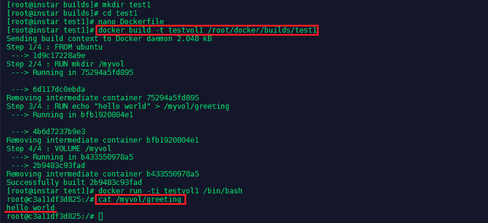

---


The volume also exist on the host system under `/var/lib/docker/volumes` and all data in it will persist, even if the container that created it is purged.


---

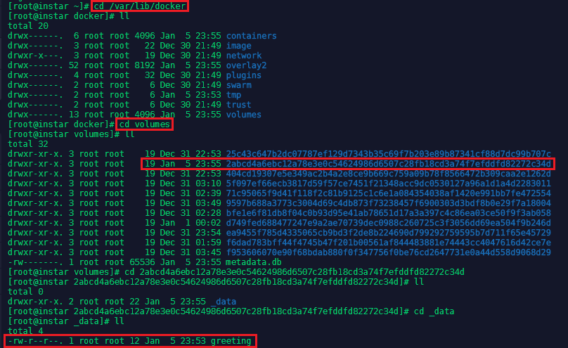

---


### Build a Custom Image Container

* We will create a _tar.gz_ file to use as content for apache.
* Write a Dockerfile based on the _ubuntu image_:
  * Add Apache to the image
  * Extract the content from our archive to the Apache folder
  * Expose a port to serve the content
  * Set Apache to start when the container starts

Lets start by creating a folder `mkdir apachewebsite` and adding another folder inside that holds our web content `src` with `nano /root/docker/builds/apachewebsite/src/index.html`:

```html
<!doctype html>
<html class="no-js" lang="en">

<head>
  <meta charset="utf-8">
  <meta http-equiv="x-ua-compatible" content="ie=edge">
  <title>Page Title</title>
  <meta name="description" content="page description">
  <meta name="viewport" content="width=device-width, initial-scale=1">
  <link rel="apple-touch-icon" href="icon.png">
  <!-- Place favicon.ico in the root directory -->
</head>

<body>
  <!--[if lte IE 9]>
    <p class="browserupgrade">You are using an <strong>outdated</strong> browser. Please <a href="https://browsehappy.com/">upgrade your browser</a> to improve your experience and security.</p>
  <![endif]-->

  <!-- Add your site or application content here -->
  <p>Hello world! This is HTML5 Boilerplate.</p>
  <script src="https://cdnjs.cloudflare.com/ajax/libs/modernizr/2.8.3/modernizr.min.js"></script>
  <script
  src="http://code.jquery.com/jquery-3.3.1.min.js"
  integrity="sha256-FgpCb/KJQlLNfOu91ta32o/NMZxltwRo8QtmkMRdAu8="
  crossorigin="anonymous"></script>
</body>

</html>
```

To compress our website content we can run `tar -czf websitesrc.tar.gz index.html`


Now we can add a our docker file `nano Dockerfile` inside the __apachewebsite__ folder `nano /root/docker/builds/apachewebsite/Dockerfile`:


```dockerfile
# This is a template for an httpd hosted static website
FROM centos

MAINTAINER mpolinowski@gmail.com

RUN yum -y install httpd elinks

ADD ./src/websitesrc.tar.gz /var/www/html

EXPOSE 80

ENTRYPOINT ["/usr/sbin/httpd", "-D", "FOREGROUND"]
```

To build the image we can now type:


```
docker build -t apachewebsite /root/docker/builds/apachewebsite/
```


And run the docker container with:


```
docker run -tid apachewebsite
```


---

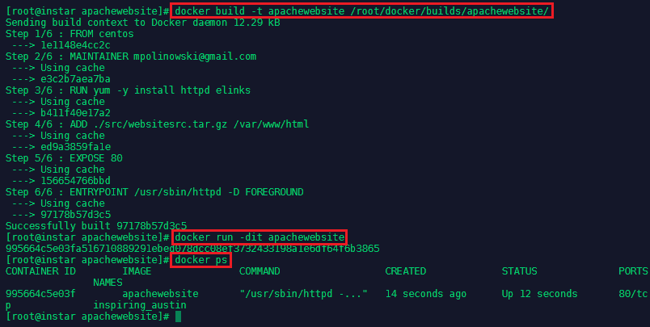

---


By using `docker ps` we can see the container was assigned a name of `inspiring_austin`. We can now use `docker inspect inspiring_austin | grep IP` to find out the IP address the container was given:


---

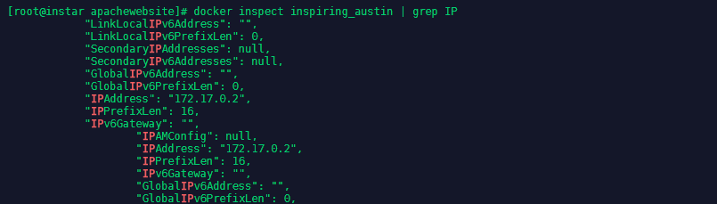

---


In this case it is the __172.17.0.2__ which we can use with __elinks__ to check if our website is now hosted - `elinks http://172.17.0.2`:


---

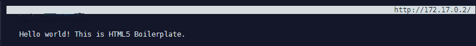

---


To stop and remove the container run the following commands:

```bash
docker stop inspiring_austin
docker rm inspiring_austin
```


## Managing Images

### Image Lifecycle

* A need for an image occcurs
* An Dockerfile is created
* The docker image is built
* The docker container is run from it and tested
* The image is modified where needed
* The now approved image is moved to production
* In case of problems the image is send back to be modified
* An image that is no longer needed is stopped
* Old unused images are deleted


To remove all images and containers on your server run:

```bash
docker rm `docker ps --no-trunc -aq`
docker rmi $(docker images -q)
```

### Application Workflow

* Image Creation
* Image Tags
* Push to Registry
* Pull from Registry

Let's use the centos7-apache image from the last chapter to learn how to add release tags and to publish our image on the Docker Hub:


```dockerfile
# This is a template for an httpd hosted static website
FROM centos

MAINTAINER mpolinowski@gmail.com

RUN yum -y install httpd elinks

ADD ./src/websitesrc.tar.gz /var/www/html

EXPOSE 80

ENTRYPOINT ["/usr/sbin/httpd", "-D", "FOREGROUND"]
```


I rebuild the image under a different name and with a tag for the Docker Hub repository that I want to push it to as well as giving it a version tag:


```bash
docker build -t mpolinowski/centos7-apache:beta .
```


---

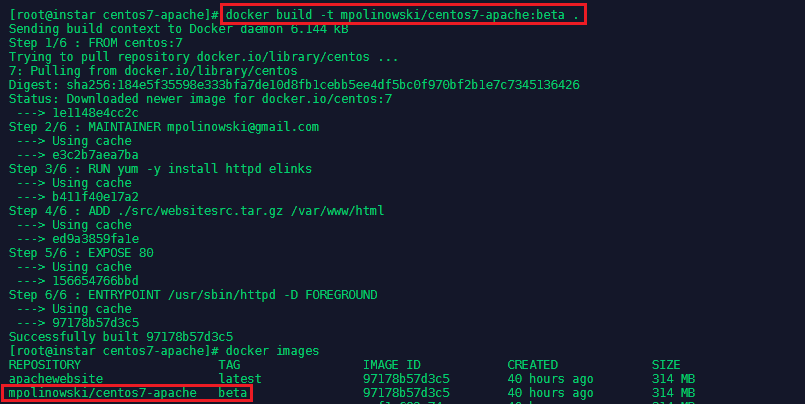

---


To upload the image to the [Docker Hub](https://hub.docker.com/) you first need to create an account there. You can then login to your account from your console and push the image:


```
docker login
docker push mpolinowski/centos7-apache
```


---

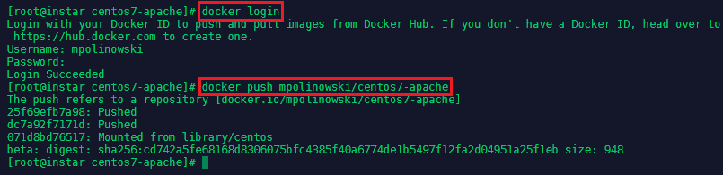

---


The image should now show up in your in your Docker Hub repository list:


---

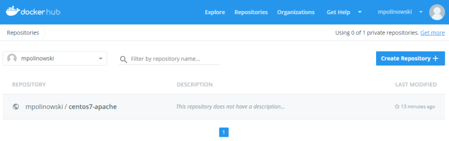

---


We can then bump the version to v1 and latest with a rebuild + push:


```bash
docker build -t mpolinowski/centos7-apache:v1 -t mpolinowski/centos7-apache .
docker push mpolinowski/centos7-apache
```


---

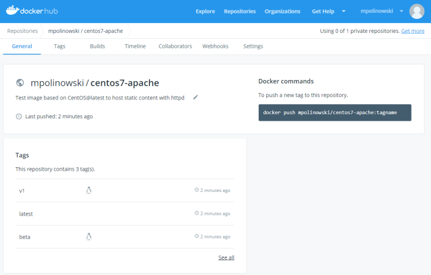

---


To pull an image from Docker Hub use the pull command - not adding a tag will always pull the latest version:


```
docker pull mpolinowski/centos7-apache
```


---

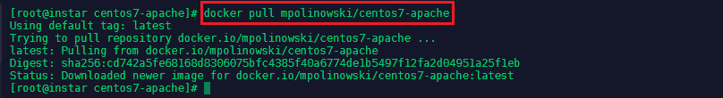

---


## Multiple Container Application Deployment

I need to build a custom container image for the deployment of an application over multiple containers - this will be a customized Wordpress application hosted with Apache with an MySQL database connection.


### Database Installation

Let's first run the MySQL Container on the Minion Server:


```bash
docker run --detach --name=test1-mysql --env="MYSQL_ROOT_PASSWORD=12345678" mysql --default-authentication-plugin=mysql_native_password
```


If we want to allow access to our database from another server, we also need to configure FirewallD:


```bash
firewall-cmd --zone=public --add-service=mysql --permanent
firewall-cmd --reload
firewall-cmd --list-services
```


To connect to your database, you first have tp find out the IP address of the mysql container with `docker inspect <name of the container>` (the name can be found with `docker ps`). Then use the mysql client (`yum install -y mysql`) to connect (the password is the root password we set when we ran the container):


```sql
mysql -h 172.17.0.2 -p
create database wordpress;
show databases;
```


---


---


We now need to create a user for the Wordpress application and exit the container:


```sql
CREATE USER 'wordpress'@'%' IDENTIFIED BY 'newpassword';
GRANT ALL PRIVILEGES ON wordpress.* TO 'wordpress'@'%';
```


---

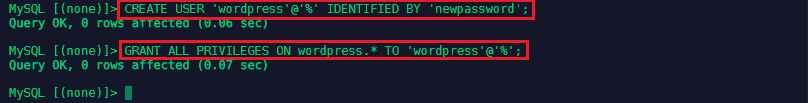

---


### Wordpress Configuration

We now need to download Wordpress to configure it. We are going to use the configuration file later to modify the default Wordpress Image from Docker Hub:


```bash
mkdir /root/docker/builds/centos7-wordpress-shared
cd /root/docker/builds/centos7-wordpress-shared
wget http://wordpress.org/latest.tar.gz
tar -xvf latest.tar.gz
cd wordpress
cp wp-config-sample.php ../
cd ..
mv wp-config-sample.php wp-config.php
```

We now have a copy of the sample configuration file inside the project folder - let's edit it to suit our database setup `nano wp-config.php`:


```php
// ** MySQL settings - You can get this info from your web host ** //
/** The name of the database for WordPress */
define('DB_NAME', 'wordpress');

/** MySQL database username */
define('DB_USER', 'wordpress');

/** MySQL database password */
define('DB_PASSWORD', 'newpassword');

/** MySQL hostname */
define('DB_HOST', '172.17.0.2');
```

The second part we need to change are the unique keys and salts that wordpress uses for it's authentication. You can autogenerate them with the [Wordpress API](https://api.wordpress.org/secret-key/1.1/salt/) - copy and paste them to replace the following block in the config file:


```php
/**#@+
 * Authentication Unique Keys and Salts.
 *
 * Change these to different unique phrases!
 * You can generate these using the {@link https://api.wordpress.org/secret-key/1.1/salt/ WordPress.org secre$
 * You can change these at any point in time to invalidate all existing cookies. This will force all users to$
 *
 * @since 2.6.0
 */
define('AUTH_KEY',         'put your unique phrase here');
define('SECURE_AUTH_KEY',  'put your unique phrase here');
define('LOGGED_IN_KEY',    'put your unique phrase here');
define('NONCE_KEY',        'put your unique phrase here');
define('AUTH_SALT',        'put your unique phrase here');
define('SECURE_AUTH_SALT', 'put your unique phrase here');
define('LOGGED_IN_SALT',   'put your unique phrase here');
define('NONCE_SALT',       'put your unique phrase here');

/**#@-*/
```


### Creating the Dockerfile

```dockerfile
# Docker file for the centos7-wordpress-shared image

FROM centos:7
MAINTAINER mpolinowski@gmail.com

# Install our Apache and PHP
RUN yum -y install httpd elinks php php-mysql

# Get & Unzip Wordpress files
ADD latest.tar.gz /var/www

# Remove the Apache default page      
RUN ["rm", "-rf", "/var/www/html"]

# Replace it with Wordpress
RUN ["cp", "-r", "/var/www/wordpress","/var/www/html"]

# Replace the Wordpress default Congfig
ADD wp-config.php /var/www/html

# Remove the Wordpress Sample Config
RUN ["rm", "/var/www/html/wp-config-sample.php"]

# Expose the Web Port
EXPOSE 80

# Run Apache when container starts
ENTRYPOINT ["/usr/sbin/httpd", "-D", "FOREGROUND"]
```

We can test the Dockerfile by building the image locally:


```bash
docker build -t centos7-wordpress-shared .
```


---

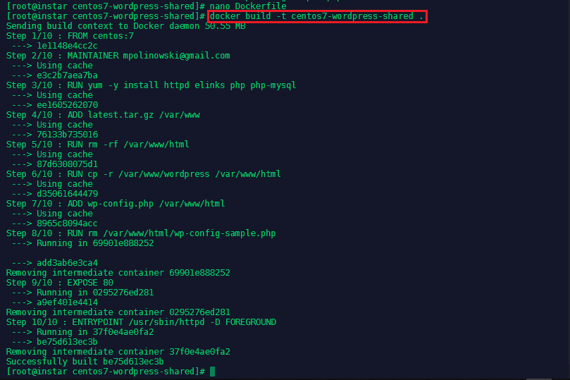

---


Now we can test the image with


```bash
docker run -tid --name=test1-wordpress centos7-wordpress-shared
```


---

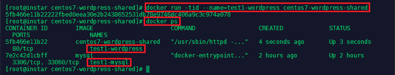

---


We can test that Apache and Wordpress are running and connected to our MySQL database by connecting to it:


```bash
docker exec -ti test1-wordpress /bin/bash
ps -ef
cd /var/www/html
```


---

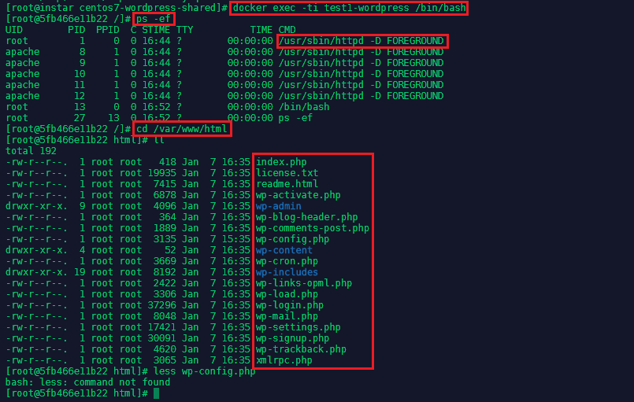

---


Apache was started and all the Wordpress files have been copied over - you can also check if the default config file was replaced with `cat wp-config.php`. And to see if Wordpress Web frontend is running, we need to check the Container IP `docker inspect test1-wordpress` and use __elinks__ to access it on port 80:


```bash
elinks http://172.17.0.3
```


You should see the following welcome screen if the MySQL connection was found:


---

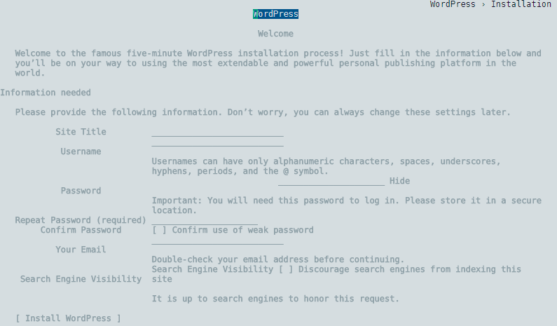

---