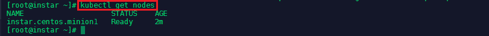

This exam and the exam objectives provided here are based on the Red Hat® Enterprise Linux® 7.0 version of the exam.

An IT professional who is a Red Hat Certified Specialist in Containerized Application Development is capable of performing the following tasks:

* Implementing new container images by extending existing images
* Manage images including pulling and pushing images from a private registry
* Manually run and link containers in a development environment

[Red Hat Website](https://www.redhat.com/en/services/training/ex300-red-hat-certified-engineer-rhce-exam)


Technologies used:

* __Kubernetes__: Kubernetes is a manager for cluster of containerized applications. It automates container deployment and scaling containers across clusters of hosts. A Kubernetes cluster is made up of __Nodes__ (server instances to which pods are deployed), __Pods__ (containers are coupled into pods in which they can share resources and reach each other via localhost) and __Containers__ (containerized applications/services executed by the docker runtime).

* __Docker__: Docker is the container runtime that we are going to use to run our containerized applications on.

* __ectd__: etcd is a distributed key value store that provides a reliable way to store data across a cluster of machines.


<!-- TOC -->

- [Network Time Protocol Service](#network-time-protocol-service)
- [Setting a Hostname](#setting-a-hostname)
- [FirewallD](#firewalld)
  - [On Master Node](#on-master-node)
  - [On Worker Nodes](#on-worker-nodes)
- [Install Docker & Kuberenetes on CentOS](#install-docker--kuberenetes-on-centos)
  - [Configuring the Master Server](#configuring-the-master-server)
  - [Configuring Nodes](#configuring-nodes)
    - [Install Docker & Kuberenetes on Debian](#install-docker--kuberenetes-on-debian)
- [Working with Containers](#working-with-containers)
  - [Provisioning a MySQL Database](#provisioning-a-mysql-database)
  - [Connecting to your MySQL Database](#connecting-to-your-mysql-database)
- [Linking Containers](#linking-containers)
  - [Accessing a Container](#accessing-a-container)

<!-- /TOC -->

## Network Time Protocol Service

NTP- is a protocol which runs over port 123 UDP at Transport Layer and allows computers to synchronize time over networks for an accurate time. This service - by default - is handled by __Chrony.d__ on CentOS 7 and higher. But we are going to use the __ntp__ package instead.


You can check if __Chrony.d__ is active on your system with the command `systemctl status chronyd.service`, stopping and disabling it with `systemctl stop chronyd.service`, `systemctl disable chronyd.service`.


To install __ntp__ run `yum install ntp -y`. Run `systemctl enable ntpd` and `systemctl start ntpd` to activate the NTP service. You can verify that the service is working with `systemctl status ntpd` and `ntpstat`:


---


---


## Setting a Hostname

We now need to make sure that all of our CentOS server can talk to each other via a hostname that is bound to their internal IP address. This can be set in `nano /etc/hosts`:


---


---


Add all server that you want to connect by their local IP and assign a host name, by which you want to call them - add those lines to all your server's host files:


```
192.168.2.110 instar.centos.master
192.168.2.111 instar.centos.minion1
```

You can test if the hostname is used by pinging it:


---


---

## FirewallD

Configure FirewallD for Kubernetes to work correctly:

### On Master Node

```bash
firewall-cmd --permanent --add-port=2370/tcp
firewall-cmd --permanent --add-port=6443/tcp
firewall-cmd --permanent --add-port=2379-2380/tcp
firewall-cmd --permanent --add-port=10250/tcp
firewall-cmd --permanent --add-port=10251/tcp
firewall-cmd --permanent --add-port=10252/tcp
firewall-cmd --permanent --add-port=10255/tcp
firewall-cmd --reload
```

### On Worker Nodes

```bash
firewall-cmd --permanent --add-port=2379/tcp
firewall-cmd --permanent --add-port=2370/tcp
firewall-cmd --permanent --add-port=10251/tcp
firewall-cmd --permanent --add-port=10255/tcp
firewall-cmd --reload
```


## Install Docker & Kuberenetes on CentOS

First we need to add the repository to pull the Docker code from - type `nano /etc/yum.repos.d/virt7-docker-common-release.repo` and add:

```
[virt7-docker-common-release]
name=virt7-docker-common-release
baseurl=http://cbs.centos.org/repos/virt7-docker-common-release/x86_64/os/
gpgcheck=0
```

Then install [Docker](https://www.docker.com/), [Kubernetes](https://kubernetes.io) and [etcd](https://coreos.com/etcd/docs/latest/):

```bash
yum -y install docker kubernetes etcd
systemctl enable docker 
systemctl start docker
```


### Configuring the Master Server

Now we need to edit the __Kubernetes config__ `nano /etc/kubernetes/config` and add the following lines:

```
# How the controller-manager, scheduler, and proxy find the apiserver
KUBE_MASTER="--master=http://instar.centos.master:8080"
KUBE_ETCD_SERVERS="--etcd-servers=http://instar.centos.master:2370"
```


---


---

We continue with configuring __etcd__ - The configuration only needs to be added to the __master server__ and can be found under `nano /etc/etcd/etcd.conf`. Here we need to change two URLs from __localhost__ to __0.0.0.0__ to listen to use all available network interfaces.

```
ETCD_LISTEN_CLIENT_URLS="http://0.0.0.0:2379"
ETCD_ADVERTISE_CLIENT_URLS="http://0.0.0.0:2379"
```

---


---


Now we can edit the __Kubernetes API Server__ configuration under `nano /etc/kubernetes/apiserver`:

```
# The address on the local server to listen to.
KUBE_API_ADDRESS="--address=0.0.0.0"

# The port on the local server to listen on.
KUBE_API_PORT="--port=8080"

# Port minions listen on
KUBELET_PORT="--kubelet-port=10250"

# default admission control policies
# KUBE_ADMISSION_CONTROL="--admission-control=NamespaceLifecycle,NamespaceExists,LimitRanger,SecurityContextD$
```


---


---


We now have to make sure that the services on the __master server__ are started in a particular order:

```bash
systemctl enable etcd kube-apiserver kube-controller-manager kube-scheduler
systemctl start etcd kube-apiserver kube-controller-manager kube-scheduler
systemctl status etcd kube-apiserver kube-controller-manager kube-scheduler | grep "(running)"
```


---


---


### Configuring Nodes

Now we need to set up the slave server configuration. We will start with __Kubernetes__ by editing `nano /etc/kubernetes/kubelet`:

```
# kubernetes kubelet (minion) config

# The address for the info server to serve on (set to 0.0.0.0 or "" for all interfaces)
KUBELET_ADDRESS="--address=0.0.0.0"

# The port for the info server to serve on
KUBELET_PORT="--port=10250"

# You may leave this blank to use the actual hostname
KUBELET_HOSTNAME="--hostname-override=instar.centos.minion1"

# location of the api-server
KUBELET_API_SERVER="--api-servers=http://instar.centos.master:8080"

# pod infrastructure container
# KUBELET_POD_INFRA_CONTAINER="--pod-infra-container-image=registry.access.redhat.com/rhel7/pod-infrastructur$
```


---


---


And `nano /etc/kubernetes/config`:

```
# How the controller-manager, scheduler, and proxy find the apiserver
KUBE_MASTER="--master=http://instar.centos.master:8080"
KUBE_ETCD_SERVERS="--etcd-servers=http://instar.centos.master:2379"
```


---


---


Wit the configuration done, we can now start up the services on the minion server(s) with `systemctl enable kube-proxy kubelet docker` and `systemctl start kube-proxy kubelet docker`. Going back to your master server, you can now list all the configured nodes with `kubectl top node`:


---



---

__Troubleshooting__: If your node is not listed, try stopping FirewallD - `systemctl stop firewalld`


#### Install Docker & Kuberenetes on Debian

_Kubernetes_:

```
apt-get update && apt-get install -y apt-transport-https ca-certificates curl gnupg2 software-properties-common
echo "deb https://apt.kubernetes.io/ kubernetes-xenial main" | sudo tee -a /etc/apt/sources.list.d/kubernetes.list
apt-get update
apt-get install -y kubelet kubeadm kubectl
apt-mark hold kubelet kubeadm kubectl
```

_Kubernetes (Chinese Mirror)_:

```
apt-get update && apt-get install -y apt-transport-https
curl -s https://mirrors.aliyun.com/kubernetes/apt/doc/apt-key.gpg | apt-key add -
cat <<EOF >/etc/apt/sources.list.d/kubernetes.list
deb https://mirrors.aliyun.com/kubernetes/apt/ kubernetes-xenial main
EOF
apt-get update
apt-get install -y kubelet kubeadm kubectl
```


_Docker_:

```
apt-get remove docker docker-engine docker.io
curl -fsSL https://download.docker.com/linux/debian/gpg | sudo apt-key add -
add-apt-repository "deb [arch=amd64] https://download.docker.com/linux/debian $(lsb_release -cs) stable"
apt-get update
apt-get install docker-ce
systemctl enable docker 
systemctl start docker
systemctl status docker
```


## Working with Containers

### Provisioning a MySQL Database

We installed __Docker__ in the previous step - make sure that the service is running by `docker ps` (you should see an empty list). Let's then fill this list by adding a container. We want to run a MySQL database like `docker run mysql` - but we need to provide first a name under which this container should be listed and passwords for the mysql database:


```
docker run --name=test1-mysql --env="MYSQL_ROOT_PASSWORD=12345678" mysql
```

This will run the process attached to the active terminal - the following line tells you that the database is up and running:


---


---


You can stop the process by typing `docker stop test1-mysql` inside a secondary console on your minion server. You can check all - running and inactive containers - with `docker ps -a` and check the log for a specific container with `docker logs <container name>`:


---


---


To remove a the container type `docker rm test1-mysql`. And to run the container in the background add the flag `--detach`:


```
docker run --detach --name=test1-mysql --env="MYSQL_ROOT_PASSWORD=12345678" mysql
```


You might see a `WARNING: IPv4 forwarding is disabled. Networking will not work.` -> In this case `nano /etc/sysctl.conf` and add the line `net.ipv4.ip_forward=1`. Restart the network service `systemctl restart network` and check `sysctl net.ipv4.ip_forward`:


---


---


Afterwards `docker stop test1-mysql` and `docker rm test1-mysql` - then run it again in detached mode. The error should now be gone.


### Connecting to your MySQL Database

To communicate with the database we first have to install the MySQL Client via `yum install mysql`. And when the container is running in the background, use `docker inspect test1-mysql` to find out the IP address assigned to your MySQL database:


---


---


You can use this IP to connect to your MySQL Databases with `mysql -h 172.17.0.2 -p` (the h-flag is adding the host address and the p-flag signifies that we have set a password that needs to be given to access the database). After typing in your password, you might be confronted by an error message `Authentication plugin 'caching_sha2_password' cannot be loaded` - in this case stop and remove the container and restart it with the flag `--default-authentication-plugin=mysql_native_password`:


```
docker run --detach --name=test1-mysql --env="MYSQL_ROOT_PASSWORD=12345678" mysql --default-authentication-plugin=mysql_native_password
```

You should now be able to establish the connection:


---


---

To clean out the test container with `docker stop test1-mysql` and `docker rm test1-mysql` - but you can keep them for the next step.


## Linking Containers

We now want to run a Wordpress container that has access to the MySQL Database. First run the MySql container:

```
docker run --detach --name=test1-mysql --env="MYSQL_ROOT_PASSWORD=12345678" mysql --default-authentication-plugin=mysql_native_password
```

Then add a Wordpress container and link it with the flag `--link test1-mysql:mysql`:

```
docker run --detach --name=test1-wordpress --link test1-mysql:mysql -e="WORDPRESS_DB_PASSWORD=12345678" -e="WORDPRESS_DB_USER=root" wordpress
```


---


---


### Accessing a Container

We can now access the Wordpress container and run a bash terminal to configure the Wordpress installation with `docker exec -it test1-wordpress bash`:


---


---


Check the host file `cat /etc/hosts` to see that the MySQL instance is linked to the Wordpress installation. We also see that the IP address of the wordpress container is __172.17.0.3__ - `exit` the container and run `elinks http://172.17.0.3` (you might have to install elinks first `yum -y install elinks` - it is a text based browser for Linux) - you can see that Wordpress is actually running: 


---


---


We can verify that Wordpress is using the MySQL Database by running `mysql -h 172.17.0.2 -p` again and `show databases;`:


---


---


You can also go back into the Wordpress container `docker exec -ti -t test1-wordpress bash` and use the `set` command to see all the MySQL variables that have been set by linking both containers:


---


---

