Kubernetes, the open-source system for deploying, managing, and scaling containerized apps, is at the heart of Google Kubernetes Engine. This integration is totally natural. Google developed Kubernetes in-house, and uses it to run its own most popular, global apps. Gmail, YouTube, and even Search run in Kubernetes Engine.

[Kubernetes Docs](https://kubernetes.io/docs/home/)


Technologies used:

* __Kubernetes__: Kubernetes is a manager for cluster of containerized applications. It automates container deployment and scaling containers across clusters of hosts. A Kubernetes cluster is made up of __Nodes__ or __Minions__ (server instances to which pods are deployed), __Pods__ (Pods consist of one or more containers. Those containers are located on the same host machine to facilitate sharing of resources. Pods are assigned unique IPs within each cluster.), __Labels__ (key-value-pairs) can be assigned to Pods or Minions to group them, __Selectors__ represent queries that are made against labels to resolve matching objects, __Controllers__ manage a set of pods and enforce a configuration state and __Containers__ (containerized applications/services executed by the docker runtime).

* __Docker__: Docker is the container runtime that we are going to use to run our containerized applications on.

* __ectd__: etcd is a distributed key value store that provides a reliable way to store data across a cluster of machines. Kubernetes uses etcd to exchange messages between master and minion server and reporting on the cluster status.


<!-- TOC -->

- [Network Time Protocol Service](#network-time-protocol-service)
- [Setting a Hostname](#setting-a-hostname)
- [Install Docker & Kuberenetes on CentOS](#install-docker--kuberenetes-on-centos)
- [Install and Configure Master Controller](#install-and-configure-master-controller)
  - [Kubernetes](#kubernetes)
  - [etcd](#etcd)
  - [API Server](#api-server)
- [Install and Configure the Minions](#install-and-configure-the-minions)
  - [Kubernetes](#kubernetes-1)
  - [Kubelet](#kubelet)
- [Testing Kubectl](#testing-kubectl)
- [Working with Docker](#working-with-docker)
  - [Running Containers](#running-containers)
  - [Docker Files](#docker-files)
  - [Managing Ports](#managing-ports)
- [Working with Kubernetes](#working-with-kubernetes)
  - [Pod Definitions](#pod-definitions)

<!-- /TOC -->

## Network Time Protocol Service

NTP- is a protocol which runs over port 123 UDP at Transport Layer and allows computers to synchronize time over networks for an accurate time. This service - by default - is handled by __Chrony.d__ on CentOS 7 and higher. But we are going to use the __ntp__ package instead. Using the same service everywhere makes sure that every node inside the cluster is set to the same time - or as close as possible.


You can check if __Chrony.d__ is active on your system with the command `systemctl status chronyd.service`, stopping and disabling it with `systemctl stop chronyd.service`, `systemctl disable chronyd.service`.


To install __ntp__ run `yum install ntp -y`. Run `systemctl enable ntpd && systemctl start ntpd` to activate the NTP service. You can verify that the service is working with `systemctl status ntpd` and `ntpstat`:


---


---


## Setting a Hostname

We now need to make sure that all of our CentOS server can talk to each other via a hostname that is bound to their internal IP address. This can be set in `nano /etc/hosts`:


---

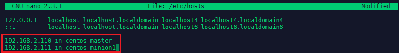

---


Add all server that you want to connect by their local IP and assign a host name, by which you want to call them - add those lines to all your server's host files:


```yaml
192.168.2.110 in-centos-master
192.168.2.111 in-centos-minion1
```

You can test if the hostname is used by pinging it:


---

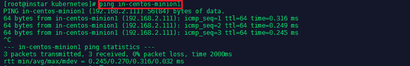

---


## Install Docker & Kuberenetes on CentOS

First we need to add the repository to pull the Docker code from - type `nano /etc/yum.repos.d/virt7-docker-common-release.repo` and add:

```yaml
[virt7-docker-common-release]
name=virt7-docker-common-release
baseurl=http://cbs.centos.org/repos/virt7-docker-common-release/x86_64/os/
gpgcheck=0
```

Then install [Docker](https://www.docker.com/), [Kubernetes](https://kubernetes.io) and [etcd](https://coreos.com/etcd/docs/latest/) on the master server as well as all your hosts:


```bash
yum update
yum -y install --enablerepo=virt7-docker-common-release kubernetes docker etcd
systemctl enable docker 
systemctl start docker
```


## Install and Configure Master Controller

### Kubernetes

Let's start with editing the configuration file for Kubernetes in `nano /etc/kubernetes/config`. We need to add two information:

```yaml
KUBE_MASTER="--master=http://in-centos-master:8080"

KUBE_ETCD_SERVERS="--etcd-servers=http://in-centos-master:2379"
```

The address / hostname of our master server and the etcd server - which, in our case, also resides on the master server.


---

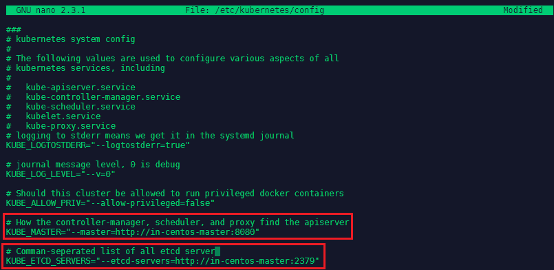

---


### etcd

The etcd configuration can be found in `nano /etc/etcd/etcd.conf`. Here we need to change the following lines:

```yaml
ETCD_LISTEN_CLIENT_URLS="http://0.0.0.0:2379"
ETCD_ADVERTISE_CLIENT_URLS="http://0.0.0.0:2379"
```

Changing those lines from `http://localhost:2379` to `http://0.0.0.0:2379` so we accept messages from every network interface.


---

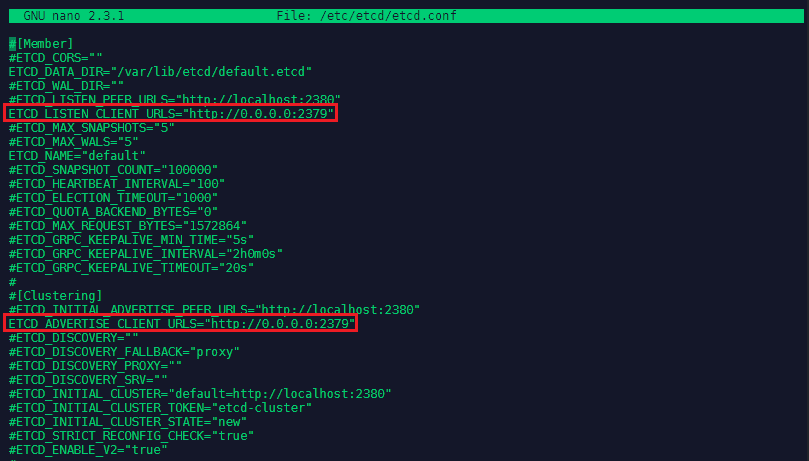

---


### API Server

The Kubernetes API Server configuration can be found in `nano /etc/kubernetes/apiserver` - the following lines need to be changed:

```yaml
KUBE_API_ADDRESS="--address=0.0.0.0"
KUBE_API_PORT="--port=8080"
KUBELET_PORT="--kubelet-port=10250"
# KUBE_ADMISSION_CONTROL="--admission-control=NamespaceLifecycle,NamespaceExists,LimitRanger,SecurityContextD$
```


---

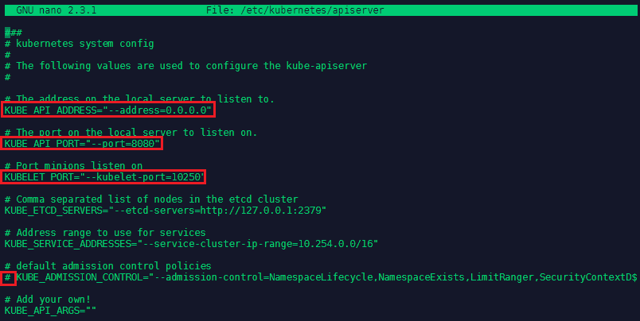

---


We now have to make sure that the services on the __Master Server__ are started in a particular order:

```bash
systemctl enable etcd kube-apiserver kube-controller-manager kube-scheduler
systemctl start etcd kube-apiserver kube-controller-manager kube-scheduler
systemctl status etcd kube-apiserver kube-controller-manager kube-scheduler | grep "(running)" | wc -l
```

The output of the last command should be 4 - as we wanted to start four services in total.


## Install and Configure the Minions

### Kubernetes

Let's start with editing the configuration file for Kubernetes in `nano /etc/kubernetes/config`. As before we need to add two lines:

```yaml
KUBE_MASTER="--master=http://in-centos-master:8080"

KUBE_ETCD_SERVERS="--etcd-servers=http://in-centos-master:2379"
```

The address / hostname of our master server and the etcd server - which, in our case, also resides on the master server.


### Kubelet

The Kubelet configuration can be found in `nano /etc/kubernetes/kubelet` - the following lines need to be changed:

```yaml
KUBELET_ADDRESS="--address=0.0.0.0"
KUBELET_PORT="--port=10250"
KUBELET_HOSTNAME="--hostname-override=in-centos-minion1"
KUBELET_API_SERVER="--api-servers=http://in-centos-master:8080"
# KUBELET_POD_INFRA_CONTAINER="--pod-infra-container-image=registry.access.redhat.com/rhel7/pod-infrastructur$
```


---

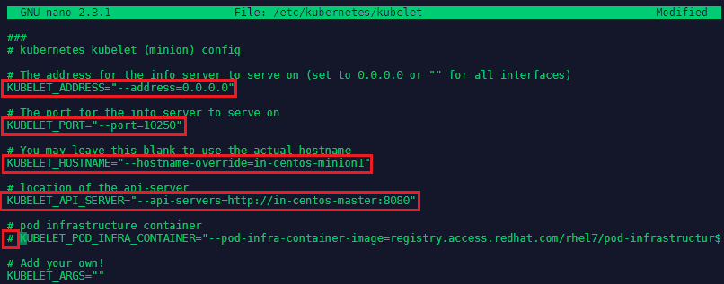

---


We now have to make sure that the services on the __Minion Server__ are started in this particular order:

```bash
systemctl enable kube-proxy kubelet docker
systemctl start kube-proxy kubelet docker
systemctl status kube-proxy kubelet docker | grep "(running)" | wc -l
```

The output of the last command should be 3 - as we wanted to start three services in total. You can verify that docker is running with `docker --version` or `docker images`. To verify that docker is working, let's pull and run the `hello-world` image:

```bash
docker pull hello-world
docker run hello-world
```

The image will run, print it's hello world to your console and exit again - that means everything is in perfect order:


---

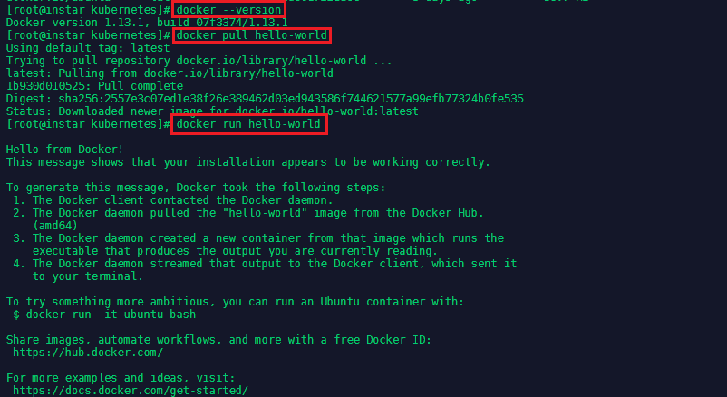

---


## Testing Kubectl

kubectl is the control function for Kubernetes. A list of commands that you can try on your master server:

```bash
kubectl get nodes  //this should list all your minions
kubectl describe node in-centos-minion  //get info for a specific node
```


## Working with Docker

Get information about your Docker installation with `docker version` and `docker info` - the latter can tell you how many images you downloaded, how many of the are running and how much space and memory you have left on your host system. Further information - e.g. on containers and volumes - can be found in `cd /var/lib/docker`.


### Running Containers

Ready-build containers can be downloaded from the [DockerHub](https://hub.docker.com/) - an example is the official image for [Ubuntu](https://hub.docker.com/_/ubuntu). Requests for specific versions can be added to the pull command. E.g. the following command pulls the Ubuntu 18.04 Bionic image:


```bash
docker pull ubuntu:bionic
```


All available versions of the selected image are listed on the corresponding DockerHub page. Running this command will then build the image according to a [Docker File](https://github.com/tianon/docker-brew-ubuntu-core/blob/185c5e23efaa8c7c857683e6dcf4d886acda3cba/bionic/Dockerfile). Alternatively, you can also use the search command to find all available versions:


```bash
docker search ubuntu
```


To build an container using that image the following command:


```bash
docker run -t -i ubuntu:bionic /bin/bash
```

The `-i` makes it interactive and the `-t` runs the output on your terminal - to run the image in the background instead use `-d` for detached mode. A full list of the [command options](https://docs.docker.com/engine/reference/commandline/run/#options) can be found in the docker docs. Adding `/bin/bash` is the command you want Docker to run inside the image, which in this case will attach you as root user to the Ubuntu OS - you can verify with `dh -f` or `ps aux`.

Typing `exit` will both exit you out of the container and stop it as well. You can verify with `docker ps` that no image is running anymore.

To restart the container run `docker ps -a` to find out the name that was given to the container - in this case it was __suspicious_lovelace__ - then type `docker restart suspicious_lovelace` to run it in detached mode. And `docker attach suspicious_lovelace` when you need to reconnect your terminal.


---

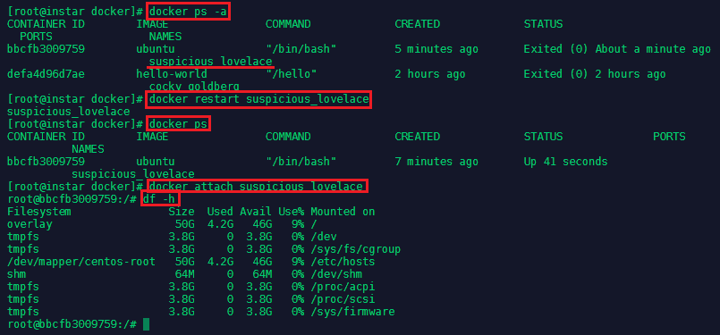

---


To start a new container directly in detached mode run:

```bash
docker run -tid ubuntu:bionic /bin/bash
```

You can see that this spun up a second container from the same image:


---

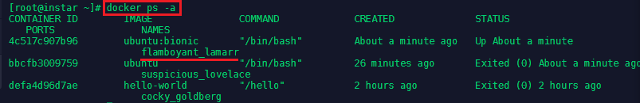

---


You can get more information about the container with the inspect command followed by the name of the container you want to inspect:

```bash
docker inspect flamboyant_lamarr
docker inspect flamboyant_lamarr | grep IP
```

The second command will only show you information related to the IP configuration of the container:


---

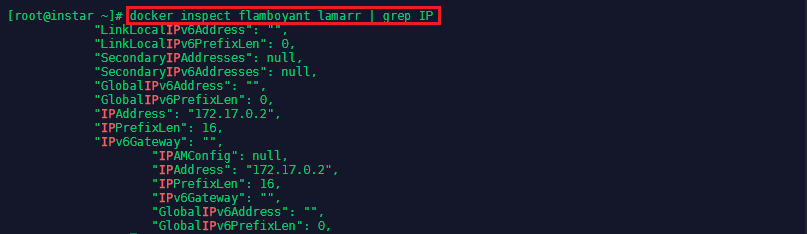

---


### Docker Files

A Docker File is a recipe for an Docker image. So far we only pulled predefined images from the DockerHub - writing our own Dockerfile allows us to make changes to those images. Lets start by creating a folder in your home directory named __RunAsUser__ and add a Dockerfile `nano Dockerfile` with the following content:

```dockerfile
# Dockerfile based on the latest CentOS 7 image - non-privileged user entry

FROM centos:latest

MAINTAINER mpolinowski@gmail.com

RUN useradd -ms /bin/bash user 

USER user
```


---

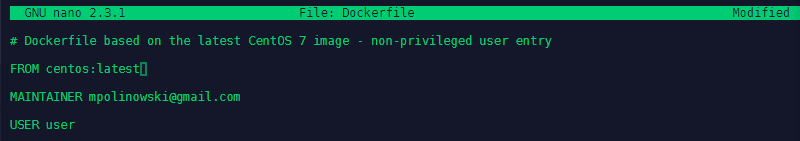

---


The Dockerfile can now be used to build a Docker image with the following command:

```bash
docker build -t centos7/nonroot:v1 /root/docker/builds/RunAsUser
docker run -ti centos7/nonroot:v1 /bin/bash
```


---

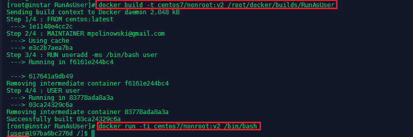

---


The container is build, the user __user__ created and you are connected to the container with the non-privileged account. But we can still connect as the root user. First exit the container and run `docker ps -a` to find out the name that was assigned to it - in this case it was __optimistic\_swirles__. Then start the container up again with `docker start optimistic_swirles`. Then run:


```
docker exec -u 0 -it optimistic_swirles /bin/bash
```

This command connects to the referenced container with the user with id=0 (root) and starts the bash terminal:


---

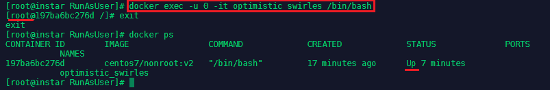

---


Another advantage is, that you can now exit the container without stoping it - it will continue running with the default non-privileged __user__.


### Managing Ports

Docker allows us to expose ports to access services provided by applications inside the container. Let's pull the [NGINX](https://hub.docker.com/_/nginx) image and try to access the default landing page:


```bash
docker pull nginx
docker run -d nginx:latest
```

We can now run `docker ps` to find out the assigned container name (__lucid_lichterman__) and run `docker inspect lucid_lichterman` to find out the IP address the container is using (__172.17.0.2__). If you have the [elinks text browser](http://elinks.or.cz/) istalled, you can run `elinks http://172.17.0.2` to see the NGINX greeting page:


---

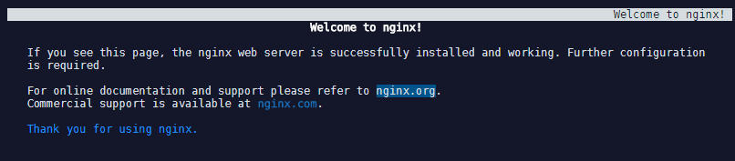

---


But you cannot reach the page over `elinks http://localhost` because the internal port 80 was not exposed to be reachable from outside the Docker network. Let's stop the container `docker stop lucid_lichterman` and run it again - but this time we are going to forward the internal port 80 to the external port 8081:


```bash
docker run -d -p 8081:80 nginx:latest
```

The website is no reachable via `elinks http://localhost:8081` on our host machine as well as on the local IP address on the local network - e.g. over _http://192.168.2.111:8081_.


## Working with Kubernetes

### Pod Definitions

Create a folder in your home directory on your master server and add `nano nginx.yaml` inside. This file is going to create a pod with a single container that runs the NGINX image v1.7.9:

```yaml
apiVersion: v1
kind: Pod
metadata:
 name: nginx
spec:
 containers:
 - name: nginx
   image: nginx:1.7.9
   ports:
   - containerPort: 80
```

We can now use __kubectl__ to create the pod based on our configuration file:


```bash
kubectl create -f /root/docker/builds/nginx.yaml
```