<!-- TOC -->

- [ZigBee Communication without a proprietary Hub](#zigbee-communication-without-a-proprietary-hub)
  - [Setting up the bridge](#setting-up-the-bridge)
  - [Running the bridge](#running-the-bridge)
    - [Determine location of CC2531 USB sniffer and checking user permissions](#determine-location-of-cc2531-usb-sniffer-and-checking-user-permissions)
    - [Installation](#installation)
    - [Configuration](#configuration)
    - [Running ZigBee2MQTT](#running-zigbee2mqtt)
    - [Running ZigBee2MQTT as a Daemon](#running-zigbee2mqtt-as-a-daemon)
    - [Update zigbee2mqtt to the latest version](#update-zigbee2mqtt-to-the-latest-version)
  - [Pairing Devices](#pairing-devices)
- [Adding our Sensors to FHEM](#adding-our-sensors-to-fhem)
- [Adding SQL Logging](#adding-sql-logging)
  - [Installing MariaDB on our Raspberry Pi](#installing-mariadb-on-our-raspberry-pi)
  - [Configuring MariaDB for FHEM](#configuring-mariadb-for-fhem)
  - [Log Filter](#log-filter)
  - [Average / Reduce](#average--reduce)
- [Compare with Data from Web-APIs](#compare-with-data-from-web-apis)
  - [Visualize Logs](#visualize-logs)
  - [Add the MQTT input to an existing Flow](#add-the-mqtt-input-to-an-existing-flow)

<!-- /TOC -->


## ZigBee Communication without a proprietary Hub

Zigbee is a specification for a suite of high-level communication protocols used to create personal area networks with small, low-power digital radios, such as for home automation, medical device data collection, and other low-power low-bandwidth needs, designed for small scale projects which need wireless connection. Hence, Zigbee is a low-power, low data rate, and close proximity wireless ad hoc network.

The [Zigbee2MQTT](https://github.com/Koenkk/zigbee2mqtt) bridge enables you to use selected [supported ZigBee devices](https://www.zigbee2mqtt.io/information/supported_devices.html) __without the otherwise mandatory Hub and Vendor Cloud__ connection. Among the devices that you can control are smart (ZigBee) light bulbs from Belkin, IKEA, OSRAM and Philips as well as smart sensors from SmartThings and Xiaomi.

The ZigBee bridge consists of a __ZigBee Sniffer Module__ and a controlling software written in __Node.js__. It bridges events and allows you to control your Zigbee devices via __MQTT__. In this way you can integrate your Zigbee devices with whatever smart home infrastructure you are using.

[Needed Hardware](https://www.zigbee2mqtt.io/getting_started/what_do_i_need.html):

* CC debugger
* CC2531 USB sniffer
* Downloader cable CC2531
* PC or Raspberry Pi to run bridge	


The Debugger, Sniffer and connecting cable can be ordered directly through [online shops like AliExpress](https://community.home-assistant.io/t/zigbee2mqtt-getting-rid-of-your-proprietary-zigbee-bridges-xiaomi-hue-tradfri/52108/193).

The debugger and cable are only used once to flash the firmware onto the stick. There is alternative way to do that [using an Arduino board instead](https://www.zigbee2mqtt.io/information/alternative_flashing_methods.html).

### Setting up the bridge

1. Install [SmartRF Flash programmer](http://www.ti.com/tool/FLASH-PROGRAMMER) (__NOT V2__). This software is free but requires a Texas Instruments account in order to download.


---
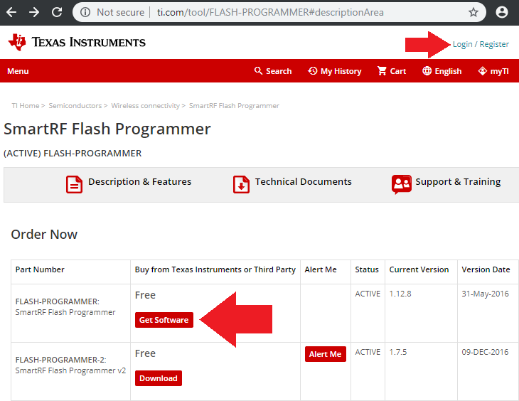

---


2. Install the [CC debugger driver](http://www.ti.com/general/docs/lit/getliterature.tsp?baseLiteratureNumber=swrc212&fileType=zip) on your PC (Windows only). Before continuing, verify that the CC Debugger driver has been installed correctly. In case the CC Debugger is not recognized correctly [install the driver manually](https://www.youtube.com/watch?v=jyKrxxXOvQY).


---
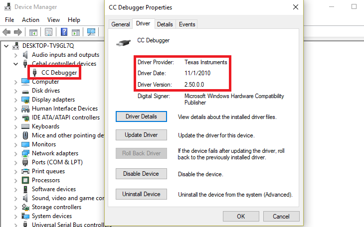

---


3. Connect `CC debugger` --> `Downloader cable CC2531` --> `CC2531 USB sniffer`.


---
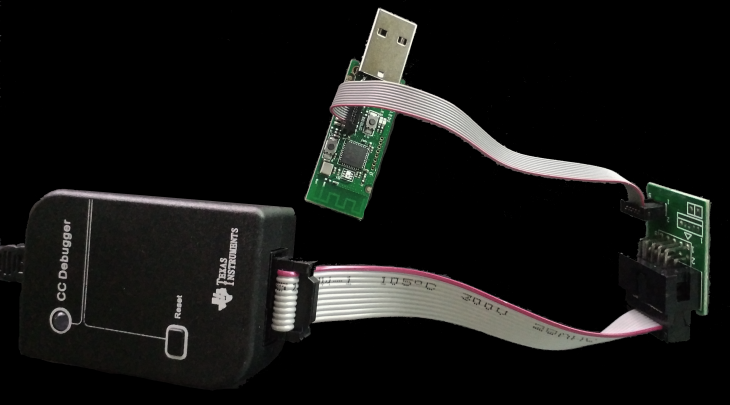

---


4. Connect __BOTH__ the `CC2531 USB sniffer` and the `CC debugger` to your PC using USB.
5. If the light on the CC debugger is RED press set reset button on the CC debugger. The light on the CC debugger should now turn GREEN. If not use [CC debugger user guide](http://www.ti.com/lit/ug/swru197h/swru197h.pdf) to troubleshoot your problem. 
6. Download and unzip the firmware [CC2531ZNP-Prod.hex](https://github.com/Koenkk/Z-Stack-firmware/tree/master/coordinator/default/CC2531)
7. Start SmartRF Flash Programmer, setup as shown below and press `Perform actions`. 


---
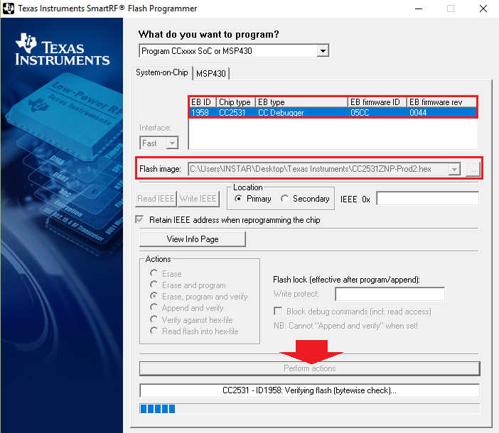

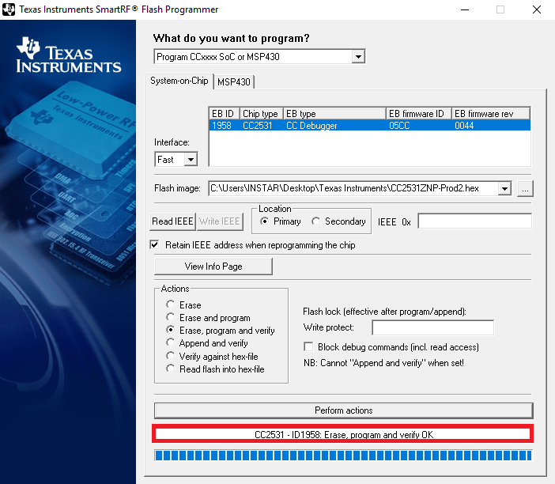

---


### Running the bridge

After flashing your CC2531 USB sniffer with CC2531ZNP-Prod.hex firmware we can remove the CC Debugger and connecting cable and plug the Sniffer into our Linux computer you can use a __Raspberry Pi 3__ with __Raspbian Stretch Lite__, but will work on any Linux machine.


#### Determine location of CC2531 USB sniffer and checking user permissions

We first need to determine the location of the CC2531 USB sniffer. Connect the CC2531 USB to your Raspberry Pi. Most of the times the location of the CC2531 is `/dev/ttyACM0`. This can be verified by:

```bash
ls -l /dev/ttyACM0
crw-rw---- 1 root dialout 166, 0 Apr 21 13:14 /dev/ttyACM0  # <-- CC2531 on /dev/ttyACM0
```


---


---


As an alternative, the device can also be mapped by an ID. This can be handy if you have multiple serial devices connected to your pi. In the example below the device location is: `/dev/serial/by-id/usb-Texas_Instruments_TI_CC2531_USB_CDC___0X00124B0018E32D5B-if00`


```bash
ls -l /dev/serial/by-id
total 0
lrwxrwxrwx 1 root root 13 Apr 21 13:14 usb-Texas_Instruments_TI_CC2531_USB_CDC___0X00124B0018ED113B-if00 -> ../../ttyACM0
```


---
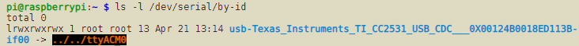

---


#### Installation

To use ZigBee2MQTT we first need to install Node.js and Git:

```bash
sudo apt update
sudo apt install git
```

You can confirm that you have installed Git and Node correctly by running the following commands:

```bash
git --version
node -v
```


---
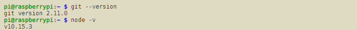

---


Then clone [ZigBee2MQTT from Github](https://github.com/Koenkk/zigbee2mqtt) and change the owner of the `/opt/zigbee2mqtt` directory to your default Linux user - in our case this is `nodeadmin`:

```bash
sudo git clone https://github.com/Koenkk/zigbee2mqtt.git /opt/zigbee2mqtt
sudo chown -R pi:pi /opt/zigbee2mqtt
```

Then change into the directory and use `npm` to install all dependencies:

```bash
cd /opt/zigbee2mqtt
npm install
```


---
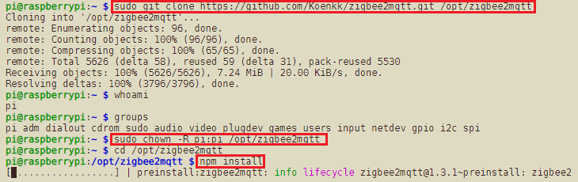

---


#### Configuration

Before we can start zigbee2mqtt we need to edit the configuration.yaml file. This file contains the configuration which will be used by zigbee2mqtt. Open the configuration file:

```bash
nano /opt/zigbee2mqtt/data/configuration.yaml
```


---
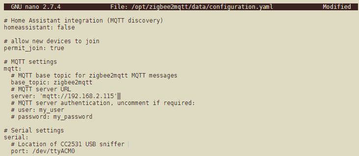

---


I am going to use a local Mosquitto MQTT server running on a INSTAR Full HD Camera on _192.168.2.115_. Alternatively, you can install a [local Mosquitto Server](https://wiki.instar.com/Software/Linux/Node-RED/#installing-mosquitto) on your Raspberry Pi and add it via `server: 'mqtt://localhost'` in the config file.


```yaml
# Home Assistant integration (MQTT discovery)
homeassistant: false

# allow new devices to join
permit_join: true

# MQTT settings
mqtt:
  # MQTT base topic for zigbee2mqtt MQTT messages
  base_topic: zigbee2mqtt
  # MQTT server URL
  server: 'mqtt://192.168.2.115'
  # MQTT server authentication, uncomment if required:
  # user: my_user
  # password: my_password

# Serial settings
serial:
  # Location of CC2531 USB sniffer
  port: /dev/ttyACM0
```

I am not sure if Zigbee2MQTT offer TLS support - I will have to look into that. Also, I deactivated the user authentication on my MQTT server for now to have an easier time debugging - user name and password have to be added here before reactivating it.

Make sure that `permit_join` is set to `true`, to allow new devices to be added. It can be set to `false` once all your Zigbee devices are integrated.

For the serial port you can use the [location of CC2531 USB sniffer](#determine-location-of-cc2531-usb-sniffer-and-checking-user-permissions) that we determined to be either `/dev/ttyACM0` or `/dev/serial/by-id/usb-Texas_Instruments_TI_CC2531_USB_CDC___0X00124B0018ED113B-if00` - both can be used interchangeably (the location might differ in your case!).


#### Running ZigBee2MQTT

Now that we have setup everything correctly we can start zigbee2mqtt directly from our console to see if there are any error messages:

```bash
cd /opt/zigbee2mqtt
npm start
```

You should see the status LED on your CC2531 light up green and hopefully a friendly console log like this:


---
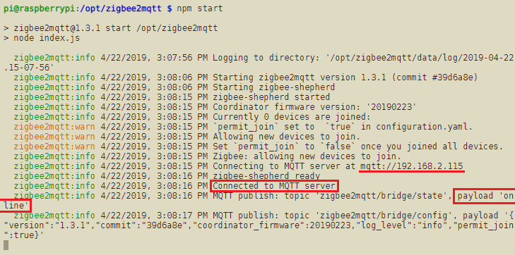

---


You can see that the service is running, connected to the local MQTT server and published a message to `zigbee2mqtt/bridge/state` with the payload `online`. We can use the program [MQTT Explorer](https://github.com/thomasnordquist/MQTT-Explorer) to verify that the message was received by our Mosquitto server:


---
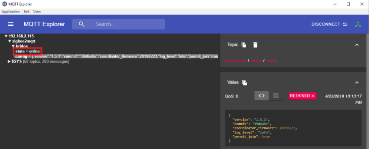

---


Looks like we were successful!


#### Running ZigBee2MQTT as a Daemon

To run zigbee2mqtt as a service and start it automatically on boot we will run zigbee2mqtt with `systemctl`:

```bash
sudo nano /etc/systemd/system/zigbee2mqtt.service
```

Add the following to this file to automatically run the `index.js` file from the `zigbee2mqtt` bridge inside the Node runtime:

```
[Unit]
Description=zigbee2mqtt
After=network.target

[Service]
ExecStart=/usr/bin/node /opt/zigbee2mqtt/index.js
StandardOutput=syslog
StandardError=syslog
SyslogIdentifier=zigbee2mqtt
Restart=always
 # Restart service after 10 seconds if node service crashes
 RestartSec=10

[Install]
WantedBy=multi-user.target
```


---
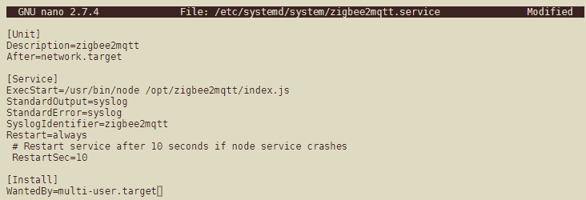

---


Save the file, exit and verify that the configuration works:

```bash
sudo systemctl daemon-reload
sudo systemctl start zigbee2mqtt
systemctl status zigbee2mqtt.service
```


---
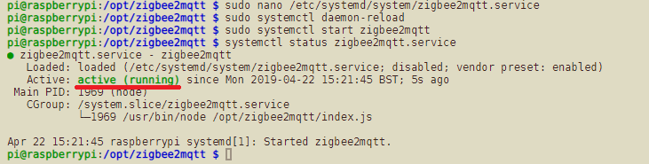

---


Now that everything works, we want `systemctl` to start `zigbee2mqtt` automatically on boot, this can be done by executing:

```
sudo systemctl enable zigbee2mqtt.service
```


---
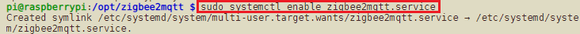

---


To stop, restart or check the log of our service run the following commands:


```bash
# Stopping zigbee2mqtt
sudo systemctl stop zigbee2mqtt

# Starting zigbee2mqtt
sudo systemctl start zigbee2mqtt

# View the log of zigbee2mqtt
sudo journalctl -u zigbee2mqtt.service -f
```


#### Update zigbee2mqtt to the latest version

```bash
# Stop zigbee2mqtt and go to directory
sudo systemctl stop zigbee2mqtt
cd /opt/zigbee2mqtt

# Backup configuration
cp -R data data-backup

# Update
git checkout HEAD -- npm-shrinkwrap.json
git pull
rm -rf node_modules
npm install

# Restore configuration
cp -R data-backup/* data
rm -rf data-backup

# Start zigbee2mqtt
sudo systemctl start zigbee2mqtt
```


### Pairing Devices

The [number of devices that you can use with the zigbee2mqtt bridge](https://www.zigbee2mqtt.io/information/supported_devices.html) is steadily growing (there are alternative [pairing instructions available here](https://www.zigbee2mqtt.io/getting_started/pairing_devices.html)). In this tutorial we are going to add 3 [XiaoMi Mi Home](https://xiaomi-mi.com/sockets-and-sensors/) sensors - a [Temperature & Humidity Sensor](https://xiaomi-mi.com/sockets-and-sensors/xiaomi-mi-temperature-humidity-sensor/), a [Wireless Switch](https://xiaomi-mi.com/sockets-and-sensors/xiaomi-mi-wireless-switch/) and a [Home Occupancy Sensor](https://xiaomi-mi.com/sockets-and-sensors/xiaomi-mi-occupancy-sensor/).


__IMPORTANT__: Before you start, make sure that [permit_join: true](#configuration) is set in your `configuration.yaml`. Otherwise new devices cannot join the network! Also verify that the [ZigBee2MQTT Bridge is running](#running-zigbee2mqtt-as-a-daemon).


We first start with the __Temperature & Humidity Sensor__ that has a pairing button on its side. Press the button for about 5 seconds - the __blue LED will start to blink__: in my case it started to blink slowly in 3-time sequences. After a few seconds the blinking sped up and stopped and the device was paired with the ZigBee Bridge.


The pairing can be found inside a log file in `/opt/zigbee2mqtt/data/log/`:

```yaml
4/22/2019, 3:34:17 PM - info: New device 'undefined' with address 0x00158d00023a21c8 connected!
4/22/2019, 3:34:17 PM - info: MQTT publish: topic 'zigbee2mqtt/bridge/log', payload '{"type":"device_connected","message":"0x00158d00023a21c8","meta":{}}'
4/22/2019, 3:34:17 PM - warn: Device with modelID 'undefined' is not supported.
4/22/2019, 3:34:17 PM - warn: Please see: https://www.zigbee2mqtt.io/how_tos/how_to_support_new_devices.html
4/22/2019, 3:34:17 PM - info: MQTT publish: topic 'zigbee2mqtt/0x00158d00023a21c8', payload '{"temperature":29.63,"linkquality":134}'
4/22/2019, 3:34:17 PM - info: MQTT publish: topic 'zigbee2mqtt/0x00158d00023a21c8', payload '{"temperature":29.63,"linkquality":134,"humidity":60.12}'
4/22/2019, 3:35:05 PM - info: MQTT publish: topic 'zigbee2mqtt/0x00158d00023a21c8', payload '{"temperature":29.12,"linkquality":134,"humidity":60.12}'
4/22/2019, 3:35:05 PM - info: MQTT publish: topic 'zigbee2mqtt/0x00158d00023a21c8', payload '{"temperature":29.12,"linkquality":134,"humidity":57.13}'
4/22/2019, 3:35:08 PM - info: Device incoming...
4/22/2019, 3:35:08 PM - info: MQTT publish: topic 'zigbee2mqtt/bridge/log', payload '{"type":"pairing","message":"device incoming"}'
```

Shortly afterwards the sensor data started coming in:


---
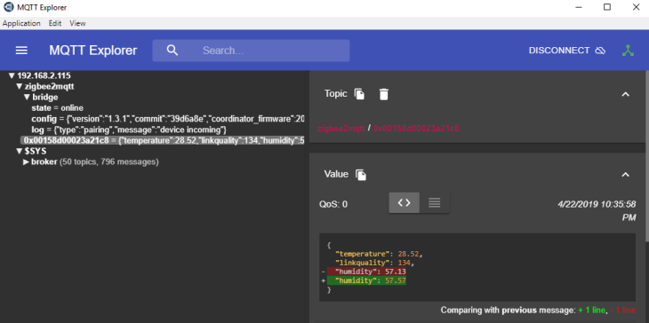

---


So far so good. But the __device ID__ was a bit hard to read and memorize: `0x00158d00023a21c8`. Luckily this can be adjusted in `/opt/zigbee2mqtt/data/configuration.yaml`:


---
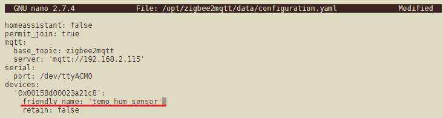

---


All paired devices will be listed at the bottom of the configuration file - just change the `friendly_name` to something human-readable. Remember that this will also change the MQTT topic the Zigbee bridge is using to publish the sensor readouts:


```yaml
info: MQTT publish, topic: 'zigbee2mqtt/temp_hum_sensor', payload: '{"temperature":26.33,"linkquality":78,"humidity":54.32,"battery":99,"voltage":3005}'
```

The topic changed from `zigbee2mqtt/0x00158d00023a21c8` to `zigbee2mqtt/temp_hum_sensor`! __Note__: I thought I remembered that this worked without restarting the service - but this time it was necessary to do that ¯\\_(ツ)_\/¯


But pairing both the __Wireless Switch__ and __Home Occupancy Sensor__ turned out to be more difficult. Holding the pairing button - that here could only be reached with a metal pin - gave the same pattern. The __blue LED started flashing__ - first slowly, then fast. But I kept getting timeouts for both devices - that identified as `0x00158d00023d229c` and `0x00158d00020b3dff` - for the pairing process inside the `/opt/zigbee2mqtt/data/log/`


```yaml
error: Cannot get the Node Descriptor of the Device: 0x00158d00023d229c (Error: Timed out after 10000 ms)
error: Cannot get the Node Descriptor of the Device: 0x00158d00020b3dff (Error: Timed out after 10000 ms)
```


You can [find an instruction](https://www.zigbee2mqtt.io/getting_started/pairing_devices.html) that you need to press and hold the pairing button for 5 seconds (until the blue LED starts flashing), then release and keep pressing the button repeatedly (1s interval) afterwards - which feels a little bit counter-intuitive. But it actually works. Checking the log file shows that a __Occupancy Sensor__ with the ID `0x00158d00020b3dff` was connected:


```yaml
4/22/2019, 3:55:03 PM - warn: Device with modelID 'undefined' is not supported.
4/22/2019, 3:55:03 PM - warn: Please see: https://www.zigbee2mqtt.io/how_tos/how_to_support_new_devices.html
4/22/2019, 3:55:41 PM - info: Device incoming...
4/22/2019, 3:55:41 PM - info: MQTT publish: topic 'zigbee2mqtt/bridge/log', payload '{"type":"pairing","message":"device incoming"}'
4/22/2019, 3:55:49 PM - info: MQTT publish: topic 'zigbee2mqtt/0x00158d00020b3dff', payload '{"occupancy":true,"linkquality":110}'
```


Repeating the same for the __Wireless Switch__ and a new device with ID `0x00158d00023d229c` showed up - excellent!


```yaml
4/22/2019, 3:50:57 PM - info: New device 'undefined' with address 0x00158d00023d229c connected!
4/22/2019, 3:50:57 PM - info: MQTT publish: topic 'zigbee2mqtt/bridge/log', payload '{"type":"device_connected","message":"0x00158d00023d229c","meta":{}}'
4/22/2019, 3:50:57 PM - warn: Device with modelID 'undefined' is not supported.
4/22/2019, 3:50:57 PM - warn: Please see: https://www.zigbee2mqtt.io/how_tos/how_to_support_new_devices.html
4/22/2019, 3:50:58 PM - warn: Device with modelID 'undefined' is not supported.
4/22/2019, 3:50:58 PM - warn: Please see: https://www.zigbee2mqtt.io/how_tos/how_to_support_new_devices.html
4/22/2019, 3:51:28 PM - info: MQTT publish: topic 'zigbee2mqtt/0x00158d00023d229c', payload '{"click":"single","linkquality":102}'
```

 Again, we can adjust that a human-readable name is displayed instead of the ID in `/opt/zigbee2mqtt/data/configuration.yaml`:


```yaml
devices:
  '0x00158d00023a21c8':
    friendly_name: 'temp_hum_sensor'
    retain: false
  '0x00158d00023d229c':
    friendly_name: 'smart_button'
    retain: false
  '0x00158d00020b3dff':
    friendly_name: 'motion_pir_sensor'
    retain: false
```


The new names will now be used for the corresponding MQTT topics:


```yaml
4/22/2019, 3:55:49 PM - info: MQTT publish: topic 'zigbee2mqtt/motion_pir_sensor', payload '{"occupancy":true,"linkquality":110}'
4/22/2019, 3:57:19 PM - info: MQTT publish: topic 'zigbee2mqtt/motion_pir_sensor', payload '{"occupancy":false,"linkquality":110}'
4/22/2019, 3:59:11 PM - info: MQTT publish: topic 'zigbee2mqtt/temp_hum_sensor', payload '{"temperature":26.55,"linkquality":141,"humidity":60.77}'
4/22/2019, 3:59:12 PM - info: MQTT publish: topic 'zigbee2mqtt/temp_hum_sensor', payload '{"temperature":26.55,"linkquality":141,"humidity":54.63}'
4/22/2019, 4:00:10 PM - info: MQTT publish: topic 'zigbee2mqtt/smart_button', payload '{"linkquality":110,"duration":835,"click":"single"}'
4/22/2019, 4:00:17 PM - info: MQTT publish: topic 'zigbee2mqtt/smart_button', payload '{"linkquality":102,"duration":835,"click":"double"}'
4/22/2019, 4:00:19 PM - info: MQTT publish: topic 'zigbee2mqtt/smart_button', payload '{"linkquality":99,"duration":835,"click":"triple"}'
4/22/2019, 4:00:20 PM - info: MQTT publish: topic 'zigbee2mqtt/smart_button', payload '{"linkquality":102,"duration":835,"click":"quadruple"}'
4/22/2019, 4:00:23 PM - info: MQTT publish: topic 'zigbee2mqtt/smart_button', payload '{"linkquality":99,"duration":835,"click":"long"}'
4/22/2019, 4:00:24 PM - info: MQTT publish: topic 'zigbee2mqtt/smart_button', payload '{"linkquality":99,"duration":1094,"click":"long_release"}'
4/22/2019, 4:00:30 PM - info: MQTT publish: topic 'zigbee2mqtt/motion_pir_sensor', payload '{"occupancy":true,"linkquality":97}'
4/22/2019, 4:00:30 PM - info: MQTT publish: topic 'zigbee2mqtt/temp_hum_sensor', payload '{"temperature":27.73,"linkquality":141,"humidity":54.63}'
4/22/2019, 4:00:30 PM - info: MQTT publish: topic 'zigbee2mqtt/temp_hum_sensor', payload '{"temperature":27.73,"linkquality":141,"humidity":69.32}'
```


Note that the __Occupancy Sensor__ sends a `true` or `false` payload depending on if motion was detected or not. The __Temperature & Humidity Sensor__ just sends number values for temperature and humidity. And the __Wireless Button__ sends click events and can discern between `single`, `double`, `triple`, `quadruple` and `long / long_release` clicks.


---
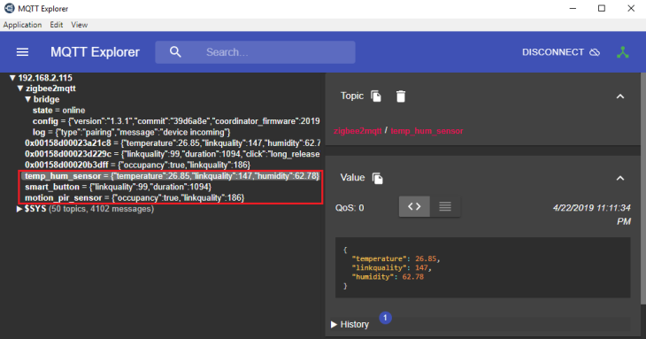

---


## Adding our Sensors to FHEM

First we need to add a [new module](https://github.com/oskarn97/fhem-xiaomi-mqtt) to FHEM that allows us to communicate with our Zigbee2MQTT Bridge:


```bash
update add https://raw.githubusercontent.com/oskarn97/fhem-xiaomi-mqtt/master/controls_xiaomi-zb2mqtt.txt
update check xiaomi-zb2mqtt
update all xiaomi-zb2mqtt
shutdown restart
```


---
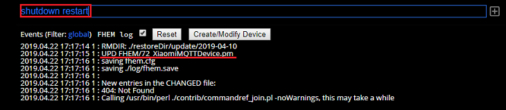

---


Once FHEM is back up we can define the bridge module that will handle the communication for us:


```
define ZigbeeBridge XiaomiMQTTDevice bridge
```


Just a few seconds later we already start seeing readings coming in:


---
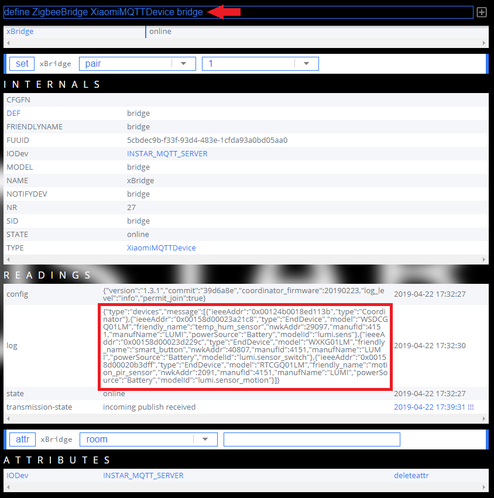

---


```json
{
    "type": "devices",
    "message": [{
        "ieeeAddr": "0x00124b0018ed113b",
        "type": "Coordinator"
    }, {
        "ieeeAddr": "0x00158d00023a21c8",
        "type": "EndDevice",
        "model": "WSDCGQ01LM",
        "friendly_name": "temp_hum_sensor",
        "nwkAddr": 29097,
        "manufId": 4151,
        "manufName": "LUMI",
        "powerSource": "Battery",
        "modelId": "lumi.sens"
    }, {
        "ieeeAddr": "0x00158d00023d229c",
        "type": "EndDevice",
        "model": "WXKG01LM",
        "friendly_name": "smart_button",
        "nwkAddr": 40807,
        "manufId": 4151,
        "manufName": "LUMI",
        "powerSource": "Battery",
        "modelId": "lumi.sensor_switch"
    }, {
        "ieeeAddr": "0x00158d00020b3dff",
        "type": "EndDevice",
        "model": "RTCGQ01LM",
        "friendly_name": "motion_pir_sensor",
        "nwkAddr": 2091,
        "manufId": 4151,
        "manufName": "LUMI",
        "powerSource": "Battery",
        "modelId": "lumi.sensor_motion"
    }]
}
```


Our sensors have been recognized through the FHEM connector - nice! And we have a new _Room_ in our list called __XiaoMiMQTTDevice__ holding all our sensors:


---
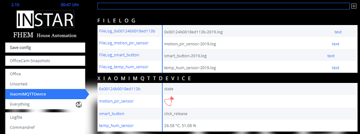

---


## Adding SQL Logging

### Installing MariaDB on our Raspberry Pi

We will start by installing the MariaDB (_MySQL_) Client and Server. Additionally, we need two Perl packages to be able to connect FHEM to the DB Client:


```bash
sudo apt-get update
sudo apt-get install mysql-server mysql-client
sudo apt-get install libdbi-perl libclass-dbi-mysql-perl
```


This should install and start your MariaDB instance. We can now continue to configure our database. By default the database can only be accessed by localhost - this might be perfectly fine (and is the secure option), but if you want to be able to access data on your Raspberry Pi from different computers we have to comment out the line `bind-address = 127.0.0.1` inside:


```bash
sudo nano /etc/mysql/mariadb.conf.d/50-server.cnf
```


---
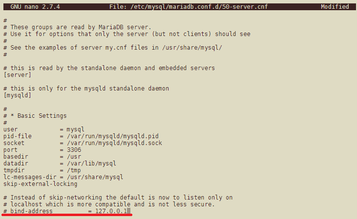

---


We can now enter our database with the following command (just press enter when asked for a password):


```
sudo mysql -u root -p
```


We will assign a new root password with the first line (see below - change the 'instar' string with your real password):


```sql
GRANT ALL PRIVILEGES ON *.* TO 'root'@'%' IDENTIFIED BY 'instar';
GRANT USAGE ON *.* TO 'root'@'%' WITH GRANT OPTION;
exit
```

For those change to take affect we now need to restart our SQL server `sudo service mysql restart`.


---
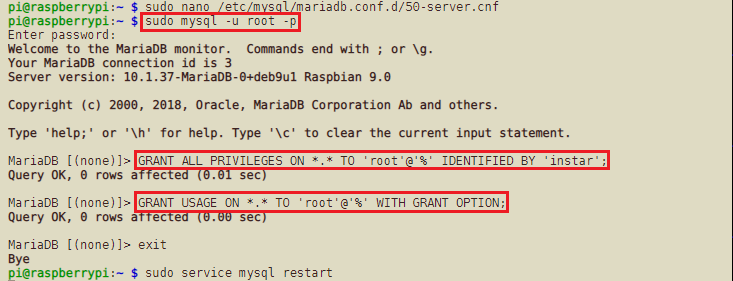

---


### Configuring MariaDB for FHEM

We can now use a SQL Client, e.g. [SQLElectron-GUI](https://sqlectron.github.io/#gui) to further configure our database.


---
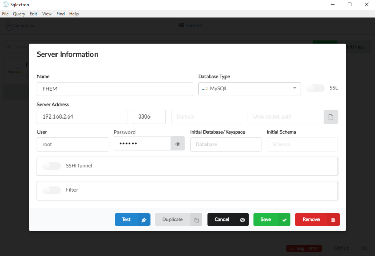

---


We are going to create a database called `fhem` as well as a user `fhemuser` with the login `instar` (change all of those at will) that will be used for our FHEM-generated data:


```sql
CREATE DATABASE `fhem` DEFAULT CHARACTER SET = `utf8`;

CREATE USER 'fhemuser'@'%' IDENTIFIED BY 'instar';

REVOKE CREATE ROUTINE, CREATE VIEW, CREATE USER, ALTER, SHOW VIEW, CREATE, ALTER ROUTINE, EVENT, SUPER, INSERT, RELOAD, SELECT, DELETE, FILE, SHOW DATABASES, TRIGGER, SHUTDOWN, REPLICATION CLIENT, GRANT OPTION, PROCESS, REFERENCES, UPDATE, DROP, REPLICATION SLAVE, EXECUTE, LOCK TABLES, CREATE TEMPORARY TABLES, INDEX ON *.* FROM 'fhemuser'@'%';

UPDATE mysql.user SET max_questions = 0, max_updates = 0, max_connections = 0 WHERE User = 'fhemuser' AND Host = '%';

GRANT CREATE ROUTINE, CREATE VIEW, ALTER, SHOW VIEW, CREATE, ALTER ROUTINE, EVENT, INSERT, SELECT, DELETE, TRIGGER, GRANT OPTION, REFERENCES, UPDATE, DROP, EXECUTE, LOCK TABLES, CREATE TEMPORARY TABLES, INDEX ON `fhem`.* TO 'fhemuser'@'%';

USE `fhem`;

CREATE TABLE `history` (
    `TIMESTAMP` timestamp NOT NULL DEFAULT CURRENT_TIMESTAMP ON UPDATE CURRENT_TIMESTAMP,
    `DEVICE` varchar(64) DEFAULT NULL,
    `TYPE` varchar(64) DEFAULT NULL,
    `EVENT` varchar(512) DEFAULT NULL,
    `READING` varchar(64) DEFAULT NULL,
    `VALUE` varchar(255) DEFAULT NULL,
    `UNIT` varchar(32) DEFAULT NULL,
    KEY `IDX_HISTORY` (`DEVICE`,`READING`,`TIMESTAMP`,`VALUE`),
    KEY `DEVICE` (`DEVICE`,`READING`)
);

CREATE TABLE `current` (
  `TIMESTAMP` timestamp NOT NULL DEFAULT CURRENT_TIMESTAMP ON UPDATE CURRENT_TIMESTAMP,
  `DEVICE` varchar(64) DEFAULT NULL,
  `TYPE` varchar(64) DEFAULT NULL,
  `EVENT` varchar(512) DEFAULT NULL,
  `READING` varchar(64) DEFAULT NULL,
  `VALUE` varchar(255) DEFAULT NULL,
  `UNIT` varchar(32) DEFAULT NULL
);
```


---
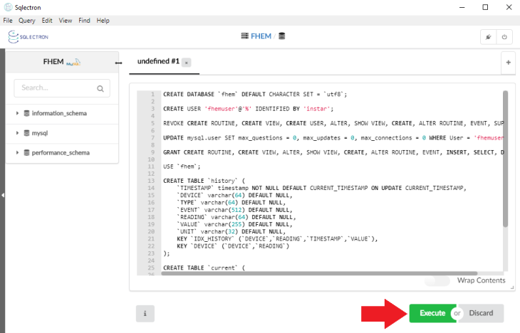

---


When successful, this will have created a database with the name `fhem` and two tables called `current` and `history` (For me the new table did not show up in SQLElecton right away after it was created. I disconnected, edited the database entry - see 2 screenshots up - and set the `Initial Database` to `fhem`. After reconnecting everything looked as it should):


---
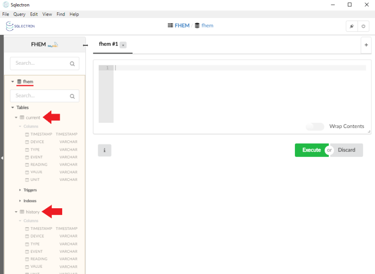

---


Let's now add our database to FHEM. We do this by copying the `db.conf` template to the FHEM root directory and editing the MySQL section:


```bash
sudo cp /opt/fhem/contrib/dblog/db.conf /opt/fhem/db.conf
sudo chown fhem:dialout /opt/fhem/db.conf
sudo nano /opt/fhem/db.conf
```


---
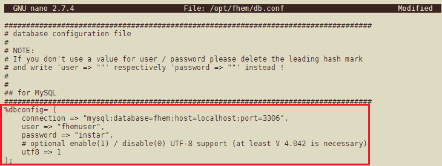

---


```perl
%dbconfig= (
    connection => "mysql:database=fhem;host=localhost;port=3306",
    user => "fhemuser",
    password => "instar",
    # optional enable(1) / disable(0) UTF-8 support (at least V 4.042 is necessary)
    utf8 => 1
);
```


Now all we have to do is to tell FHEM to read the configuration file and start using our database setup to store all events:


```bash
define DBLogging DbLog /opt/fhem/db.conf .*:.*
```


---
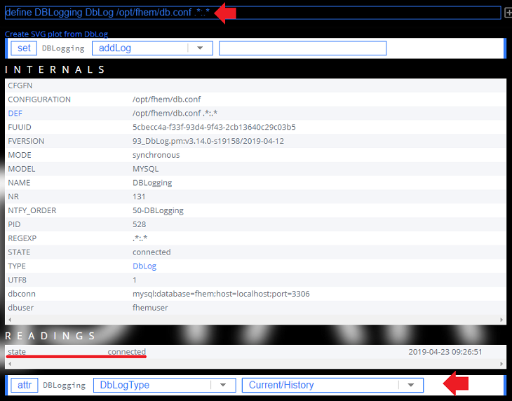

---


And don't forget to the set the __DBLogType__ to `Current/History` (see bottom of the screenshot above). We can verify that the logging has started by querying the content of our __Current Table__:


```sql
SELECT * FROM current;
```


---
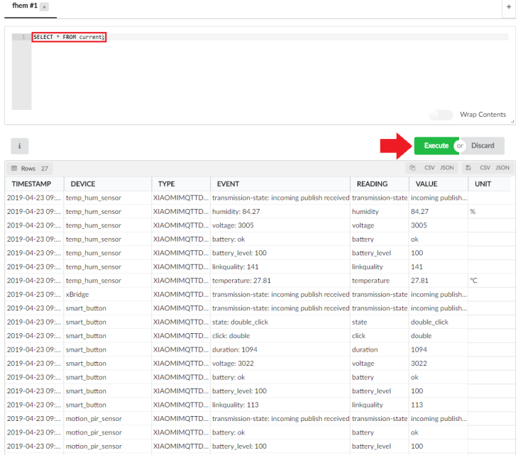

---


To make sure that the connection with your database is re-established if for whatever reason it fails, run the following command in FHEM: `define DBLogging_Reopen at +*00:15:00 set DBLogging reopen`.


### Log Filter

We set up FHEM to log every event, which quickly leads to a huge pile of - mostly useless - data. You can check your current history with the followinf command:


```bash
SELECT DEVICE, COUNT(*) FROM history GROUP BY DEVICE ORDER BY 2 DESC;
```


---
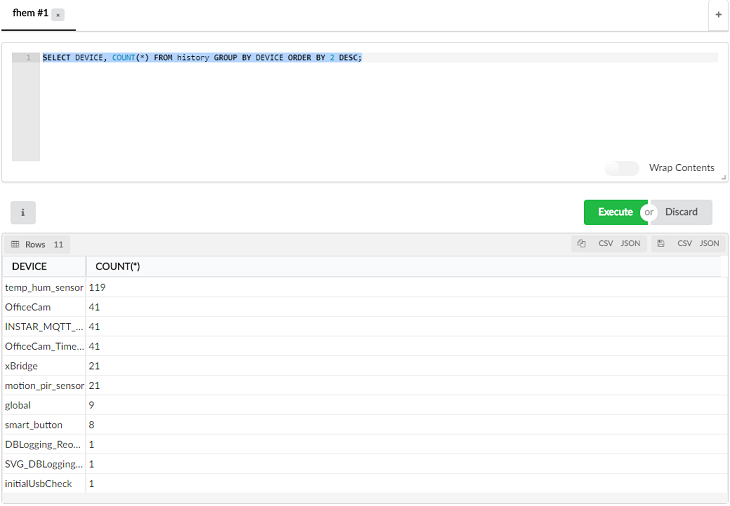

---


In my case only the temperature/humidity sensor and motion detector generates data that I want to use in later projects - the rest should be excluded. For this, we can go back to our DBLogging device in FHEM - `http://<RaspiIP>:8083/fhem?detail=DBLogging` and change the default __DbLogSelectionMode__ to `Exclude/Include`:


---
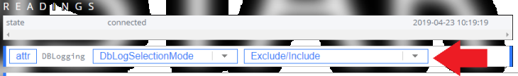

---


* __Exclude__: DbLog behaves just as usual. This means everything specified in the regex in DEF will be logged by default and anything excluded via the DbLogExclude attribute will not be logged
* __Include__: Nothing will be logged, except the readings specified via regex in the DbLogInclude attribute (in source devices). Neither the Regex set in DEF will be considered nor the device name of the source device itself.
* __Exclude/Include__: Just almost the same as Exclude, but if the reading matches the DbLogExclude attribute, then it will further be checked against the regex in DbLogInclude whicht may possibly re-include the already excluded reading.


That means with `Exclude/Include` selected for our logging service we can now edit every device that is generating log entries and `set attr <name> DbLogExclude .*`:


---
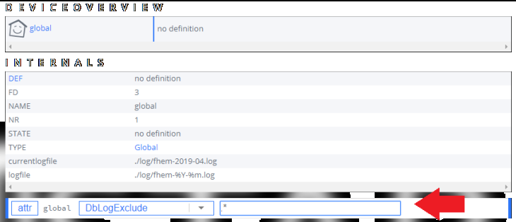

---


The regular expression `.*` includes everything and so nothing is logged anymore. __Note__: If you already have many devices included, simply use the following command to set this attribute for all your devices: `attr .* DbLogExclude .*`. To automate this for future devices use the following _notify_ function:


```bash
define n_DbLogExclude notify global:DEFINED.* attr $EVTPART1 DbLogExclude .*
```


In a second step we can go in and use `set attr <name> DbLogInclude <variable>` to include selected variables for our log:


---
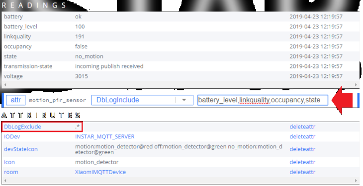

---


### Average / Reduce

Additionally FHEM offers a Log reduction function that allows us to average every event that is older then n-days to only 1 event per hour:


```bash
set <name> reduceLogNbl <n> average
```


If we want to keep our data for 3 months this would be `set DBLogging reduceLogNbl 90 average`:


---
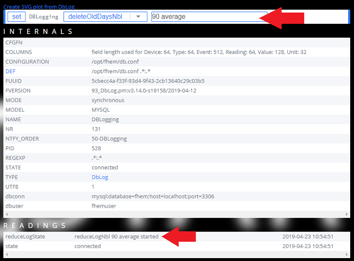

---


We can automate this in FHEM with:


```bash
define at_DbLoggingReduce at *04:30:00 set DBLogging reduceLogNbl 90 average
```


---
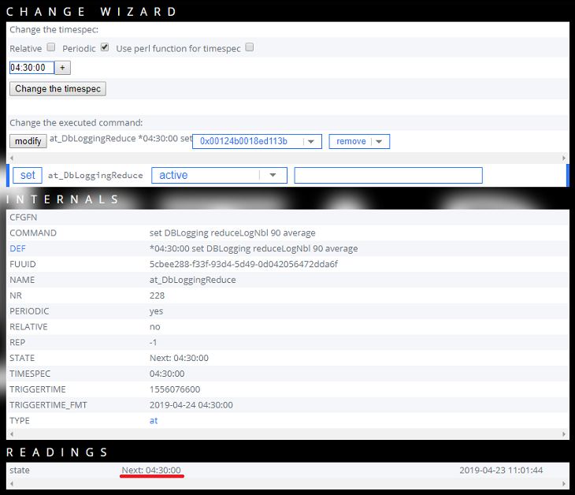

---


You can further reduce your data logs for entries older then 24hrs:


```bash
define DBLogging_Reduce at +*24:00:00 set DBLogging reduceLog 1
```


## Compare with Data from Web-APIs


I now have a reading for the temperature inside my office - and might add a few more temperature sensors in the future. But it would be interesting to see how well the temperatures I measure fit the temperatures I can get from an online weather services like [DarkSky.net](https://darksky.net/forecast/22.5446,114.0545/si12/en). Click the link and select your city - you will find the coordinates that DarkSky assigns to your location inside the URL - in case of Shenzhen, China this is `22.5446,114.0545`:


---
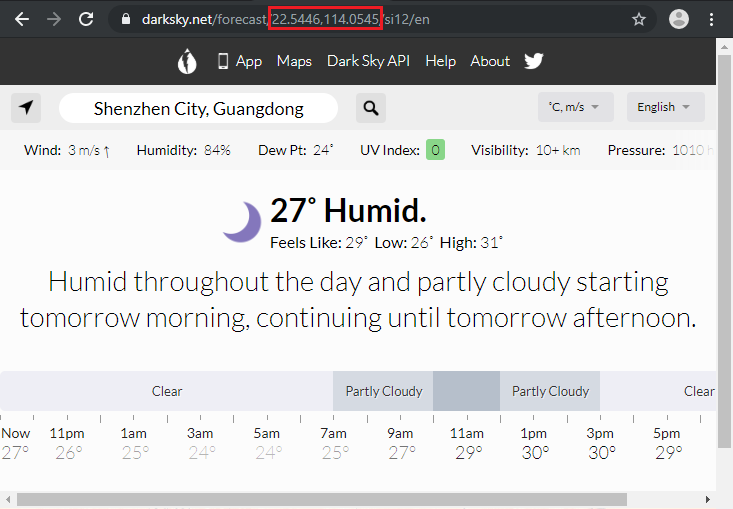

---


Once we know our ID we can start using the integrated weather module in FHEM to query the corresponding information for our location. Just make sure that your Raspberry Pi has the following Perl libraries installed so FHEM knows how to handle the API's JSON response (`shutdown restart` FHEM after the installation was successful):


```bash
sudo apt -y install libjson-perl libdatetime-format-strptime-perl
```


The command to add a weather device in FHEM then looks like this:


```bash
define <name> Weather [API=<API>[,<apioptions>]] [apikey=<apikey>] [location=<location>] [interval=<interval>] [lang=<lang>]
```


For me this results to `define ShenZhenWeather Weather API=DarkSkyAPI,cachemaxage:600 apikey=09878945fdskv876 location=22.5446,114.0545 interval=3600 lang=en`. __Note__: the API key inside this command does not work - you have to get your own free key by [registering with DarkSky](https://darksky.net/dev).


You should see your first reading coming in a few seconds later:


---
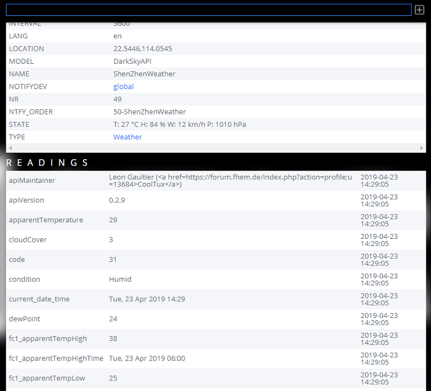

---


We can also output the data for a 7 day forecast on our FHEM interface by defining an HTML output:


```bash
define ShenZhenWeatherHtml weblink htmlCode {WeatherAsHtml("ShenZhenWeatherHtml",7)}
```


---
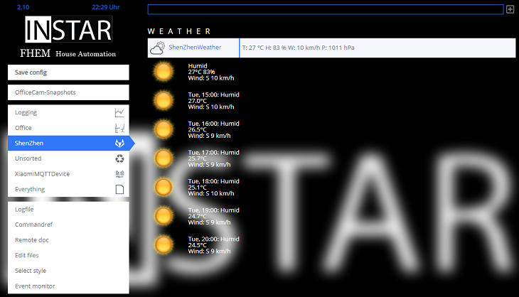

---


We can now reduce the amount of variables that we record by using `event-on-update-reading`, so by the next update I only receive (and log - see `DbLogInclude`) the following:


---
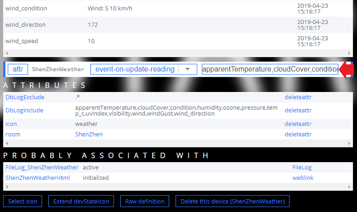

---


```
apparentTemperature,cloudCover,condition,humidity,ozone,pressure,temp_c,uvIndex,visibility,wind,windGust,wind_direction
```


---
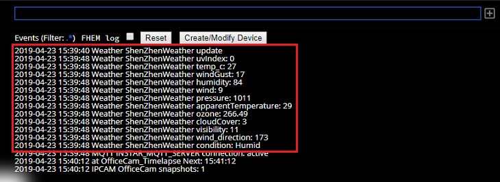

---


### Visualize Logs


We can quickly write the API response to a log file:


```
define FileLog_ShenZhenWeather FileLog ./log/ShenZhenWeather-%Y.log ShenZhenWeather
```

You can check that the file is written with `cat /opt/fhem/log/ShenZhenWeather-2019.log`.


---
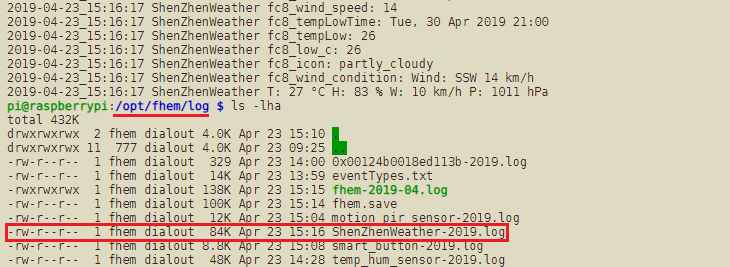

---


We can now use the integrated plot function to create a little SVG plot for our log:


---
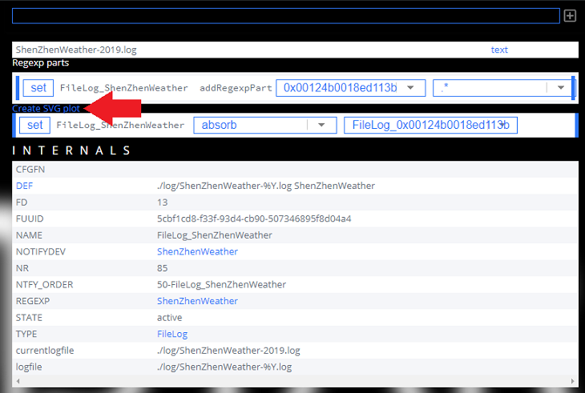

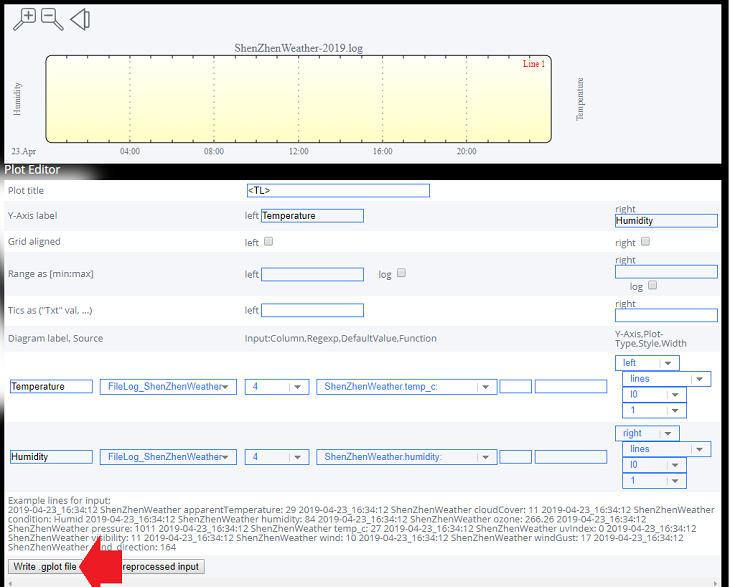

---


Generating the plot will add received data points to your plot. You can adjust the axis range and highlight colours to your need.


Going back to the __ShenZhenWeather__ log definition, we can now also add the temperature and humidity reading from our XiaoMi sensor to the same log file:


---
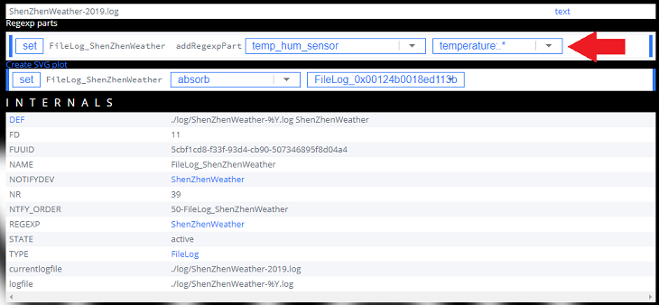

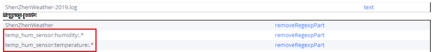

---


And then go and add it to our plot - voilá :


---
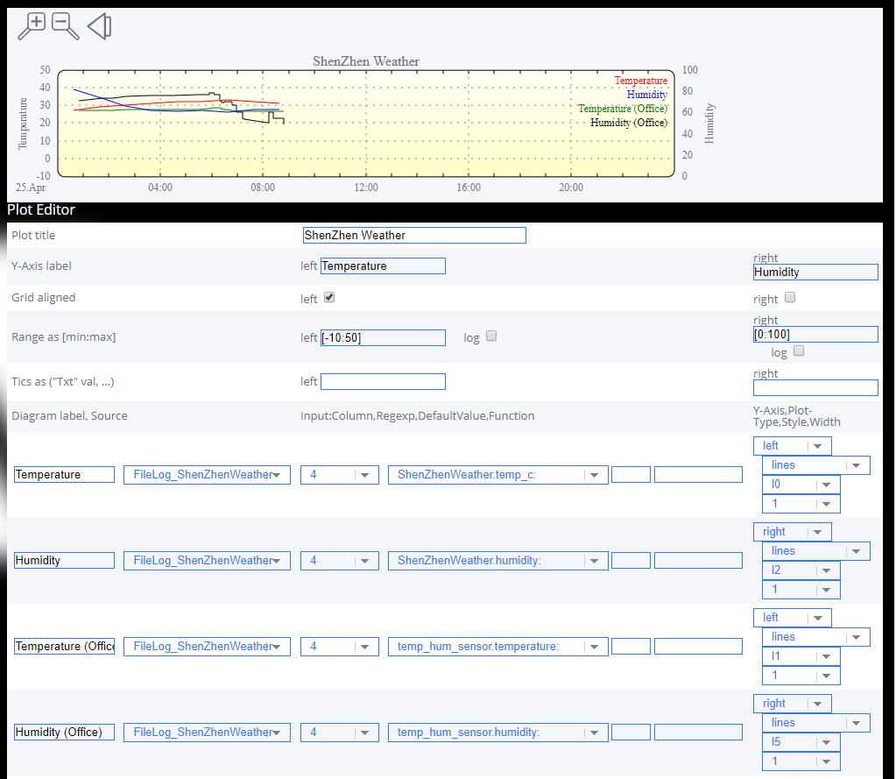

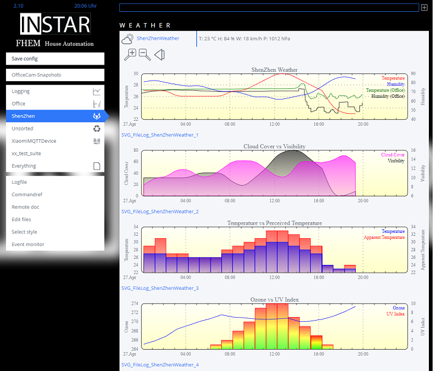

---


<!-- ## Using Zigbee Devices to control INSTAR IP Cameras in Node-RED

We now set up the Zigbee Bridge, connected Zigbee sensors and made sure that the messages are send to our Mosquitto MQTT server. We also found out the topics that our bridge uses for each sensors to publish its messages - `zigbee2mqtt/motion_pir_sensor`, `zigbee2mqtt/temp_hum_sensor` and `zigbee2mqtt/smart_button` - and what kind of payload to expect.

Now we can use the program [MQTT.fx](/Advanced_User/OpenHAB_Home_Automation/Mosquitto_Installation_on_Windows/#testing-the-mqtt-server-with-mqttfx) to verify that the message was received by our Mosquitto server:


---
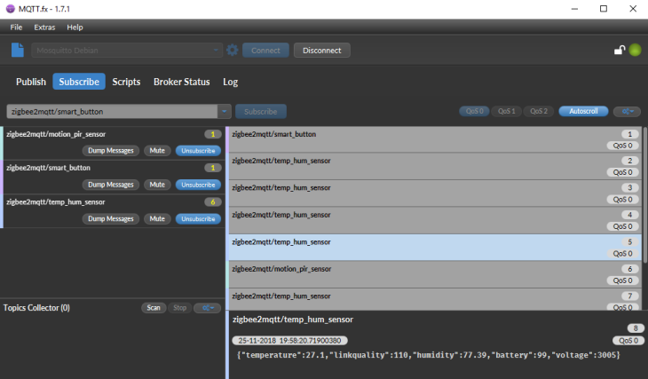

---


Every time the state changes the sensor will send a Zigbee message to our Bridge, which then forwards its payload to our Mosquitto server - perfect!

We can now start our [Node-RED](https://nodered.org/) - that we either installed under [Windows 10](/Advanced_User/Node-RED_and_MQTT/), on a [Raspberry Pi](/Advanced_User/openHABian_on_Raspberry_Pi/Node-RED_Setup/) or a [Debian Linux Server](/Software/Linux/Node-RED/), add __MQTT Nodes__ and subscribe to all 3 MQTT topics:


---
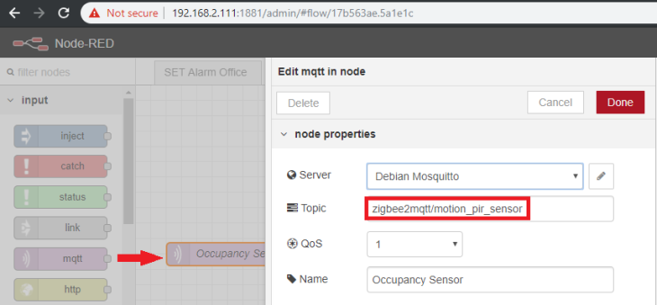

---


Connect all 3 of them to a __Debug Node__ and deploy the flow. Click the button, warm up the temp sensor and trigger the motion detection - the MQTT messages will show up in the debug pane in Node-RED:


---


---


### Add the MQTT input to an existing Flow

In the following sequence we are using the input for the wireless button to switch __Alarm Areas__ on our cameras - we already used the same sequence for the [Amazon Alexa Integration](/Advanced_User/Alexa_Voice_Control_without_Cloud/) (the complete flow can be found in the [Home Assistant Tutorial](/Software/Linux/Home_Assistant/)):


---
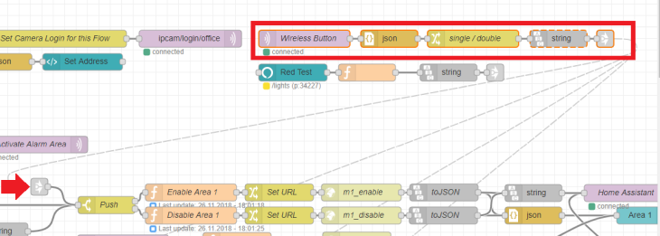

---


You can copy the following JSON code and import it into Node-RED ([How do I import flows to Node-RED?](/Software/Linux/Node-RED/#using-node-red-to-communicate-with-your-camera)):


```json
[{"id":"ebde9a4c.90efe8","type":"link out","z":"17b43655.05bd3a","name":"","links":["57b22bf7.0e2874","5eb0d369.b3b15c","b5ce97db.b3f4f8","f335d7f4.4bbe18"],"x":1308,"y":100,"wires":[]},{"id":"accb31dd.a130c","type":"mqtt in","z":"17b43655.05bd3a","name":"Wireless Button","topic":"zigbee2mqtt/smart_button","qos":"1","broker":"40415d07.67dd94","x":780,"y":100,"wires":[["2537690e.6230d6"]]},{"id":"2537690e.6230d6","type":"json","z":"17b43655.05bd3a","name":"","property":"payload","action":"","pretty":false,"x":929,"y":100,"wires":[["17df313d.2e7aff"]]},{"id":"17df313d.2e7aff","type":"change","z":"17b43655.05bd3a","name":"single / double","rules":[{"t":"set","p":"payload","pt":"msg","to":"payload.click","tot":"msg"}],"action":"","property":"","from":"","to":"","reg":false,"x":1076,"y":100,"wires":[["1f97ee5b.dfc642"]]},{"id":"1f97ee5b.dfc642","type":"string","z":"17b43655.05bd3a","name":"","methods":[{"name":"replaceAll","params":[{"type":"str","value":"single"},{"type":"str","value":"{\"val\" : \"on\"}"}]},{"name":"replaceAll","params":[{"type":"str","value":"double"},{"type":"str","value":"{\"val\" : \"off\"}"}]}],"prop":"payload","propout":"payload","object":"msg","objectout":"msg","x":1226,"y":100,"wires":[["ebde9a4c.90efe8"]]},{"id":"40415d07.67dd94","type":"mqtt-broker","z":"","name":"Debian Mosquitto","broker":"localhost","port":"1883","clientid":"","usetls":false,"compatmode":true,"keepalive":"60","cleansession":true,"birthTopic":"","birthQos":"0","birthPayload":"","closeTopic":"","closePayload":"","willTopic":"","willQos":"0","willPayload":""}]
```


The __MQTT Node__ outputs the message from our button as a string. We first have to turn it into a JavaScript Object with a __JSON Node__.


Next follows a __Change Node__ that changes the Message Payload to the value of __Click__ - as we learnt above, this value can either be `single`, `double`, `triple`, `quadruple`, `long` or `release`:


---
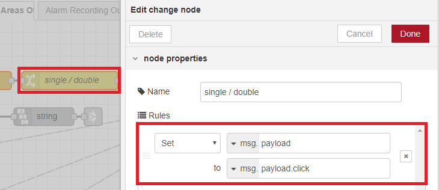

---


After that follows a __String Node__ (this node type [has to be installed manually](/Software/Linux/Node-RED/#the-node-red-admin-panel) - it is called `node-red-contrib-string`) that searches for the payload `single` or `double` and replaces them with something that we need to trigger the Flow below - in this case we need a JSON expression that either sets a value to `on` or `off`: `{"val" : "on"}` / `{"val" : "off"}`:


---
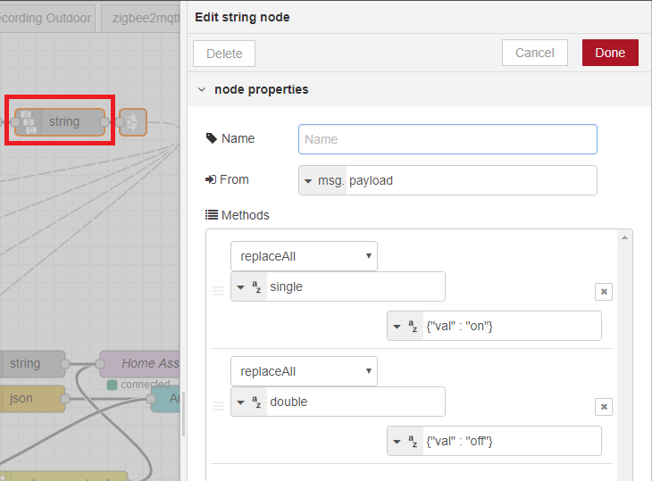

---


And last but not least we add a __Link Node__ to plug it in to all 4 sequences for the for the 4 alarm areas. Now every time we single-click the Wireless Button all areas are activated. A double-click deactivates them:


---
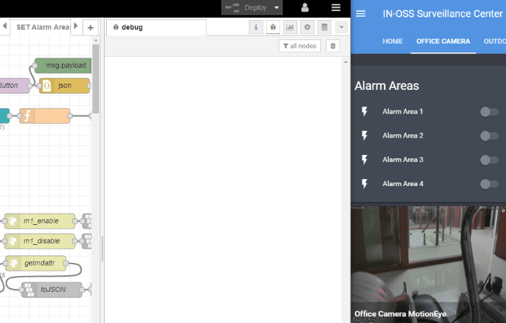

---


We attached a __Debug Node__ to the MQTT input to visualize the input given by the Wireless Button - __Note__ that only the `single` and `double` click trigger the Alarm Area Sequences - the rest of the input options can be used for other functions. -->


<!-- attr WEB roomIcons Office:scene_office Logging:time_graph Unsorted:recycling XiaomiMQTTDevice:mqtt Everything:file_unknown ShenZhen:gitlab -->