<!-- TOC -->

- [Installing Grafana](#installing-grafana)

<!-- /TOC -->


[Grafana](https://grafana.com/grafana) allows you to query, visualize, alert on and understand your metrics no matter where they are stored. Create, explore, and share dashboards with your team and foster a data driven culture. The Grafana project can also be found on [Github](https://github.com/grafana/grafana).


## Installing Grafana

Since I am working on a Raspberry Pi 2 (the same would be true for a v3) with Raspbian installed I will grab the [download link](https://grafana.com/grafana/download?platform=arm) for Grafana for [Ubuntu & Debian(ARMv7)](https://grafana.com/docs/installation/debian/):


__Correction I seemed to be using a single core version of the Raspberry Pi 2 that requires the ARMv6 build - see below__


```bash
wget https://dl.grafana.com/oss/release/grafana_6.1.6_armhf.deb
sudo apt-get install -y adduser libfontconfig1
sudo dpkg -i grafana_6.1.6_armhf.deb 
```

In my case _libfontconfig1_ was missing dependencies after the installation and and the installation of Grafana failed - I was able to fix this issue by running `sudo apt --fix-broken install` and restart the Grafana installation.


We can use SystemD to start the Grafana Service:


```bash
sudo systemctl daemon-reload
sudo systemctl start grafana-server
sudo systemctl status grafana-server
```


Unfortunately I am seeing error messages here - and as stated above, I was [using the wrong build of Grafana](https://community.grafana.com/t/grafana-wont-start-on-raspberry-pi/8525/3)...


```bash
09:11:51 raspberrypi systemd[1]: Stopped Grafana instance.
09:11:51 raspberrypi systemd[1]: grafana-server.service: Start request repeated too quickly.
09:11:51 raspberrypi systemd[1]: Failed to start Grafana instance.
09:11:51 raspberrypi systemd[1]: grafana-server.service: Unit entered failed state.
09:11:51 raspberrypi systemd[1]: grafana-server.service: Failed with result ‘signal’.
```


So once again, with more feeling (and the correct version [Ubuntu & Debian(ARMv6)](https://grafana.com/grafana/download?platform=arm)):


```bash
sudo systemctl stop grafana-server
sudo apt-get remove --auto-remove grafana

wget https://dl.grafana.com/oss/release/grafana-rpi_6.1.6_armhf.deb
sudo apt-get install -y adduser libfontconfig1
sudo dpkg -i grafana-rpi_6.1.6_armhf.deb

sudo /bin/systemctl daemon-reload
sudo /bin/systemctl enable grafana-server
sudo /bin/systemctl start grafana-server
```


This time everything worked as planned:


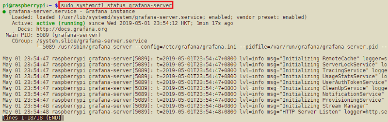


I had to wait for a few minutes for the service to come online - on a RasPi v3 this should be less of an issue... I am now able to access the Grafana frontend on the IP address of my Pi and the port 3000 - `http://192.168.2.64:3000/login`. The default login is __user = admin__ and __password = admin__ - but you will be asked to change this right away:


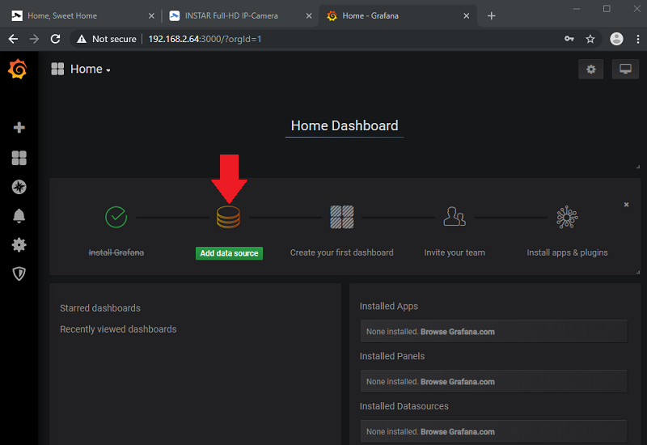


We are greeted by a wizard that leads us through the initial set up process - we have to start by adding a data source. I am going to use the data I started storing inside a [MariaDB database in another article](/zigbee2mqtt-xiaomi-fhem/#adding-sql-logging) and choose MySQL:


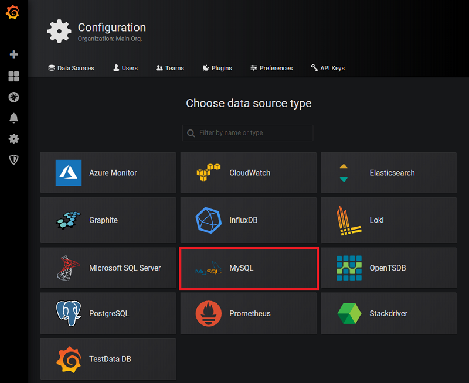


For this project I created a database called `fhem`. MariaDB is running on the same Pi and can be accessed over `localhost:3306` by the user `fhemuser` with the password `instar`. Clicking on __Save & Test__ at the bottom of the page tells me that the __Database Connection is OK__:


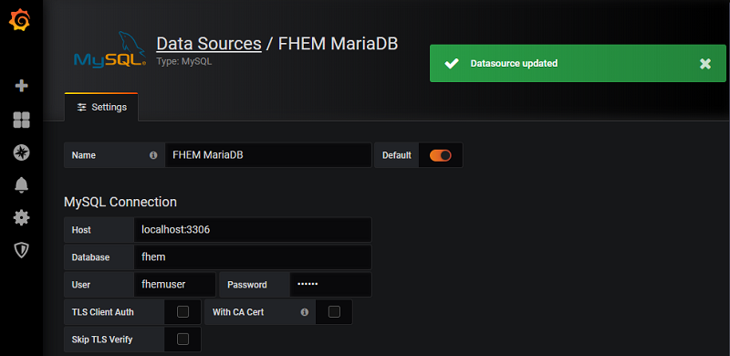


Back to the __Home Screen__ I now click on __New Dashboard__:


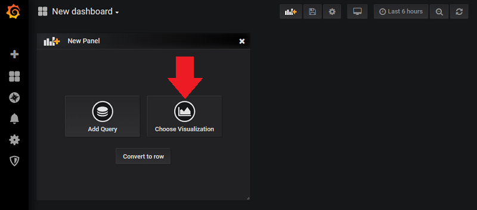


Here I can choose a __Visualization__ and select a __Graph__. On the empty coordinate system I can click on the __Panel Title__ to add a data source for the graph:


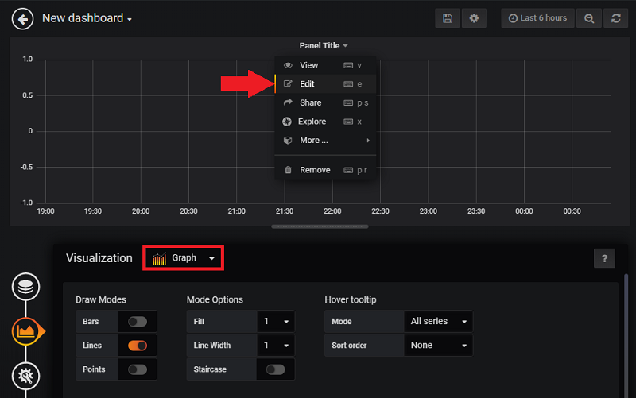


My [database has two tables](/zigbee2mqtt-xiaomi-fhem/#adding-sql-logging) - one with the __current values__ and one table that collects the __historic values__ for all readings. And both have 7 rows - `TIMESTAMP`, `DEVICE`, `TYPE`, `EVENT`, `READING`, `VALUE`, `UNIT`:


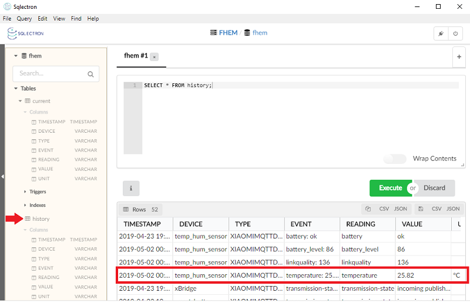


For my graph I am interested in the __history table__ and I want to begin to create a plot of the _Temperature Sensor Reading_ from the `temp_hum_sensor` device. Grafana helps with creating the corresponding SQL query. But I am receiving an error because the numeric reading is stored as _type string_:


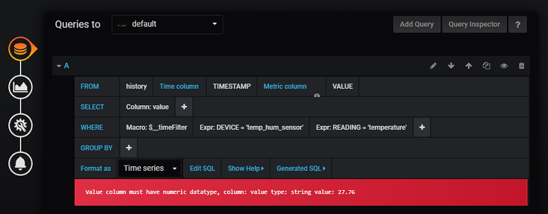


But we can re-write the SQL query using __CAST__ to convert the data type of our `VALUES` to `DECIMAL`:


```sql
SELECT
  UNIX_TIMESTAMP(`TIMESTAMP`) as time_sec,
  CAST(`VALUE` AS DECIMAL(10, 6)) as value,
  'temperature' as metric
FROM `history`
WHERE $__timeFilter(`TIMESTAMP`) AND `DEVICE` = 'temp_hum_sensor' AND `READING` = 'temperature'
ORDER BY `TIMESTAMP` ASC
```


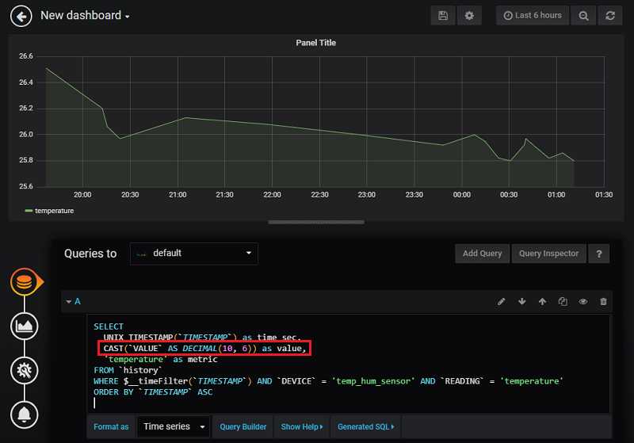


Continuing through the wizard on the left allows me to further customize the graph:


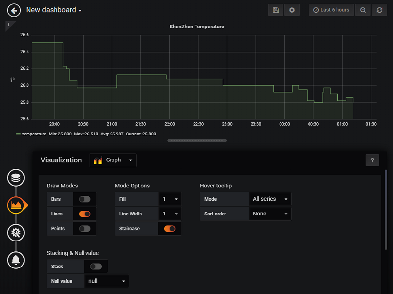


Now we can return to the home screen and save our first dashboard:


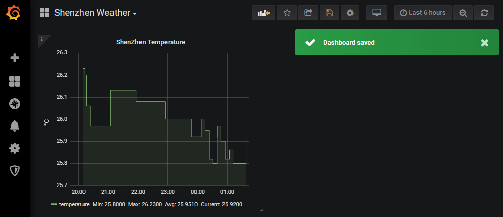