In this hands-on lab from [Linux Academy](https://linuxacademy.com/cp), we will install and configure a Kubernetes cluster consisting of 1 master and 2 nodes for the pods. Once the installation and configuration are complete, we will have a 3-node Kubernetes cluster that uses Flannel as the network overlay.


<!-- TOC -->

- [Instructions](#instructions)
  - [Objectives](#objectives)
- [Install Docker and Kubernetes](#install-docker-and-kubernetes)
  - [Prerequisites](#prerequisites)
  - [Install Docker CE](#install-docker-ce)
  - [Install Kubernetes](#install-kubernetes)
  - [Start Docker and Kublet](#start-docker-and-kublet)
- [Cluster Initialization](#cluster-initialization)
  - [Networking details](#networking-details)
  - [Check the cluster state.](#check-the-cluster-state)
- [Create and scale a deployment using kubectl](#create-and-scale-a-deployment-using-kubectl)
  - [Kubernetes stuck on ContainerCreating](#kubernetes-stuck-on-containercreating)
  - [Scaling](#scaling)
- [Pod Deployment](#pod-deployment)
- [Kubernetes Services](#kubernetes-services)
- [Updating the Pod](#updating-the-pod)
- [Adding a Queue Server](#adding-a-queue-server)
- [Replication (not recommended)](#replication-not-recommended)
  - [ReplicaSets](#replicasets)
- [Deployment (recommended)](#deployment-recommended)
  - [Rolling Update and Rollback](#rolling-update-and-rollback)
- [Networking and Service Discovery](#networking-and-service-discovery)
  - [Creating a Database Pod](#creating-a-database-pod)
- [Kubernetes + Compose = Kompose](#kubernetes--compose--kompose)
  - [Use Kompose](#use-kompose)

<!-- /TOC -->


## Instructions

In this learning activity, we will create a Kubernetes cluster. The commands we will use for this process can be found in the task list by clicking on the orange question mark buttons.

Once you have completed the lab, leave your cluster in its final state. Do not delete the deployment:


### Objectives

* Install Docker and Kubernetes on all servers.
* Create and scale a deployment using kubectl.


## Install Docker and Kubernetes

### Prerequisites

1. You first need to login as your root user or elevate your users privileges via sudo on your master and two minion servers:

```bash
sudo su
```

1. This next step is not recommended in production ([How do you create a SE Linux policy?](https://docs.docker.com/engine/security/seccomp/)) - but we are going to disable SE Linux on all 3 servers:


```
setenforce 0
sed -i --follow-symlinks 's/SELINUX=enforcing/SELINUX=disabled/g' /etc/sysconfig/selinux
```

3. Now we need to enable the `br_netfilter` module on all servers to allow our cluster to communicate:


```bash
modprobe br_netfilter
echo '1' > /proc/sys/net/bridge/bridge-nf-call-iptables
```


---


---


4. Make sure that swap has been turned off:


---


---

> To turn off swap on centos type `swapoff -a` and check that the swap was removed with `free -h`. Edit the `/etc/fstab` file, search for the swap line and comment the entire line by adding a `#` in front of the line:


---


---


> Now delete the remaining swap file - check the location `blkid` and remove it `rm /dev/mapper/centos-swap`:


---


---


1. Add a FirewallD Service

Configure FirewallD for Kubernetes to work correctly. First download the k8s-master.xml and k8s-worker.xml files to `cd /etc/firewalld/services` on your master and minion server:

```bash
wget https://raw.githubusercontent.com/mpolinowski/k8s-firewalld/master/k8s-master.xml

wget https://raw.githubusercontent.com/mpolinowski/k8s-firewalld/master/k8s-worker.xml

firewall-cmd --reload
```


__On Master Node__

```bash
firewall-cmd --add-service=k8s-master --zone=public --permanent
```

__On Minion Nodes__

```bash
firewall-cmd --add-service=k8s-worker --zone=public --permanent
```

__TODO__: I have to add `firewall-cmd --add-service=dns --zone=public --permanent` ?

<!--
systemctl stop firewalld && systemctl disable firewalld
systemctl start firewalld && systemctl enable firewalld
-->

### Install Docker CE


1. Ensure that all Docker dependencies are installed:


```bash
yum install -y yum-utils device-mapper-persistent-data lvm2
```


---


---


2. Now we can add the Docker repository and install it:


```bash
yum-config-manager --add-repo https://download.docker.com/linux/centos/docker-ce.repo
yum install -y docker-ce
```


---


---


### Install Kubernetes


First we need to add the Kubernetes repository all servers:


```bash
cat << EOF > /etc/yum.repos.d/kubernetes.repo  
[kubernetes]  
name=Kubernetes  
baseurl=https://packages.cloud.google.com/yum/repos/kubernetes-el7-x86_64  
enabled=1  
gpgcheck=0  
repo_gpgcheck=0  
gpgkey=https://packages.cloud.google.com/yum/doc/yum-key.gpg  
 https://packages.cloud.google.com/yum/doc/rpm-package-key.gpg  
EOF
```


---


---


Now we can install Kubernetes on all servers via yum:


```bash
yum install -y kubelet kubeadm kubectl
```


---


---


### Start Docker and Kublet


```bash
systemctl enable docker
systemctl enable kubelet
systemctl start docker
systemctl start kubelet
```


---


---


To check in what Group Docker is running, run `docker info | grep -i cgroup`:


---


---


In this case it is `cgroupfs` - we can now make sure that Kubernetes is added to this group:


```bash
sed -i 's/cgroup-driver=systemd/cgroup-driver=cgroupfs/g' /etc/systemd/system/kubelet.service.d/10-kubeadm.conf
systemctl daemon-reload
systemctl restart kubelet
```


## Cluster Initialization

So far we did the basic setup for all our servers - now we will initialize our cluster from the __MASTER SERVER__ using the IP range for Flannel. Kubeadm is a tool built to provide [kubeadm init](https://kubernetes.io/docs/reference/setup-tools/kubeadm/kubeadm-init/) and [kubeadm join](https://kubernetes.io/docs/reference/setup-tools/kubeadm/kubeadm-join/) as best-practice _fast paths_ for creating Kubernetes clusters. The __init command__ executes the following phases:


```bash
kubeadm init --pod-network-cidr=10.244.0.0/16
```

<!-- kubeadm init --pod-network-cidr=10.244.0.0/16 --ignore-preflight-errors=NumCPU -->

Your Kubernetes master has initialized successfully! You can now join any number of machines by running the following on each node as root:


---


---


```bash
kubeadm join X.X.X.X:6443 --token XXXXXXXXXXXXXXX --discovery-token-ca-cert-hash sha256:XXXXXXXXXXXXXXXXXXXXXXXXXXXXXXXXXXXXXXXXXXXXXXXXXXXXXXXXXXXXXXXXXXXXX
```


Copy the `kubeadmin join` command that is in the output and past it into your minion server terminals:


---


---


To start using your cluster, you need to run the following as a regular user:


```bash
mkdir -p $HOME/.kube
sudo cp -i /etc/kubernetes/admin.conf $HOME/.kube/config
sudo chown $(id -u):$(id -g) $HOME/.kube/config
```


We will use [Flannel](https://github.com/coreos/flannel) as a simple and easy way to configure a layer 3 network fabric designed for Kubernetes. Flannel runs a small, single binary agent called flanneld on each host, and is responsible for allocating a subnet lease to each host out of a larger, preconfigured address space. Flannel uses either the Kubernetes API or etcd directly to store the network configuration, the allocated subnets, and any auxiliary data (such as the host's public IP). Packets are forwarded using one of several backend mechanisms including VXLAN and various cloud integrations.

For flannel to work correctly, you must pass `--pod-network-cidr=10.244.0.0/16` to `kubeadm init`.

Set _/proc/sys/net/bridge/bridge-nf-call-iptables_ to 1 by running `sysctl net.bridge.bridge-nf-call-iptables=1` to pass bridged IPv4 traffic to iptables chains. This is a requirement for some CNI plugins to work, for more information please see here.


```bash
kubectl apply -f https://raw.githubusercontent.com/coreos/flannel/master/Documentation/kube-flannel.yml
```


---


---


### Networking details

Platforms like Kubernetes assume that each container (pod) has a unique, routable IP inside the cluster. The advantage of this model is that it removes the port mapping complexities that come from sharing a single host IP.

Flannel is responsible for providing a layer 3 IPv4 network between multiple nodes in a cluster. Flannel does not control how containers are networked to the host, only how the traffic is transported between hosts. However, flannel does provide a CNI plugin for Kubernetes and a guidance on integrating with Docker.


### Check the cluster state.


```bash
kubectl get pods --all-namespaces
```


---


---


Then check your nodes from the master:


```bash
kubectl get nodes
```


---


---


## Create and scale a deployment using kubectl


[Kubectl](https://kubernetes.io/docs/reference/kubectl/overview/) is a command line interface for running commands against Kubernetes clusters. We can run a NGINX container with the following command:


```bash
kubectl create deployment nginx --image=nginx
```


You can verify that the __Pod__ was created by Kubernetes:


```bash
kubectl get pods
```


---


---


### Kubernetes stuck on ContainerCreating

Use `kubectl describe pods` to list all the events associated with the pod, including pulling of images, starting of containers:


```bash
Normal - Scheduled - 13m - default-scheduler - Successfully assigned default/nginx-5c7588df-76mgw to in-centos-minion2

Warning - FailedCreatePodSandBox - 13m - kubelet, in-centos-minion2  Failed create pod sandbox: rpc error: code = Unknown desc = failed to set up sandbox container "8ab7c07633f6170dabd8df9a28680a7b9af79f10374e81df8c85dac609abc209" network for pod "nginx-5c7588df-76mgw": NetworkPlugin cni failed to set up pod "nginx-5c7588df-76mgw_default" network: open /run/flannel/subnet.env: no such file or directory
```


I noticed that - to use Flannel - you need to initialize `kubeadm` with the ` --pod-network-cidr=10.244.0.0/16` flag. You can reset your deployment with:


```bash
kubeadm reset
iptables -F && iptables -t nat -F && iptables -t mangle -F && iptables -X
```


Now back to `kubeadm init --pod-network-cidr=10.244.0.0/16` and rebuild the deployment - success:


---


---


### Scaling

To scale up our web server contingent to __4__, we can use the following `kubectl` command:


```bash
kubectl scale deployment nginx --replicas=4
kubectl get pods
```


---


---


To get rid of those pods you can scale it back down to 0 replicas:


```bash
kubectl scale deployment nginx --replicas=0
```


---


---


If you try to delete the pods by name `kubectl delete pod nginx-5c7588df-lf2pb`, or try to delete all: `kubectl delete pods --all`, Kubernetes will respawn new pods to meet your deployment scale requirement.


## Pod Deployment

Let's deploy an simple Angular app inside a [Kubernetes Pod](https://kubernetes.io/docs/reference/generated/kubernetes-api/v1.13/#pod-v1-core) - we will use the 0 release of [this Docker image](https://hub.docker.com/r/richardchesterwood/k8s-fleetman-webapp-angular/tags) to get started with. To do this we will have to create a Pod Config file for it called `webapp-angular.yaml`:


```yaml
apiVersion: v1
kind: Pod
metadata:
  name: webapp
spec:
  containers:
  - name: webapp
    image: richardchesterwood/k8s-fleetman-webapp-angular:release0
```


---


---


We can now use __kubectl__ to read our configuration file and generate the webapp Pod:


```bash
kubectl apply -f webapp-angular.yaml
```


---


---


You can inspect the pod with:


```bash
kubectl describe pod webapp
```


---


---


Just like in Docker, we can use __kubectl__ to run commands against our containers - e.g. to access the shell inside your container, contact the webserver (that should be serving our Angular app) and printing out index page:


```bash
kubectl -it exec webapp sh
/ # wget http://localhost:80
/ # cat index.html
```


---


---


## Kubernetes Services

We now have a Pod that is serving our Angular frontend. To be able to access this Pod from _the outside_ we need to add a [Kubernetes service](https://kubernetes.io/docs/reference/generated/kubernetes-api/v1.13/#service-v1-core). Let's create a file `webapp-service.yaml`:


```yaml
apiVersion: v1
kind: Service
metadata:
  # Unique key of the Service instance
  name: fleetman-webapp
spec:
  ports:
    # Accept traffic sent to port 80
    - name: http
      port: 80
      targetPort: 80
      # The nodePort is available from outside of the
      # cluster when is set to NodePort. It's value has
      # to be > 30000
      nodePort: 30080
  selector:
    # Define which pods are going to
    # be represented by this service
    # The service makes an network
    # endpoint for our app
    app: webapp
  # Setting the Service type to ClusterIP makes the
  # service only available from inside the cluster
  # To expose a port use NodePort instead
  type: NodePort
```


---


---


We now have to add the __Selector__ `webapp` in form of a label in `webapp-angular.yaml` to our frontend pod to connect it to our service:


```yaml
apiVersion: v1
kind: Pod
metadata:
  name: webapp
  labels:
    app: webapp
spec:
  containers:
  - name: webapp
    image: richardchesterwood/k8s-fleetman-webapp-angular:release0
```


The service can be added to our cluster by the following commands:


```bash
kubectl apply -f webapp-angular.yaml
kubectl apply -f webapp-service.yaml
```


---


---


By applying our changes, we have updated our pod and created our service.


---


---


The webapp is now accessible on your Cluster IP with the Port __30080__!


## Updating the Pod


To Update a Pod in Production with 0 downtime we can use labels. We can define a second pod inside the same file `webapp-angular.yaml`. Right now we are going to use release versions to define our pods. Later we might change this to a __production__ and a __development__ version - both of which can then be run inside the same cluster and be served by different services:


```yaml
apiVersion: v1
kind: Pod
metadata:
  name: webapp
  labels:
    app: webapp
    release: "0"
spec:
  containers:
  - name: webapp
    image: richardchesterwood/k8s-fleetman-webapp-angular:release0

---
apiVersion: v1
kind: Pod
metadata:
  name: webapp-release-0-5
  labels:
    app: webapp
    release: "0-5"
spec:
  containers:
  - name: webapp
    image: richardchesterwood/k8s-fleetman-webapp-angular:release0-5
```


Make sure to surround release version with quotation marks to convert it into a string - __"0"__. Otherwise you end up with the error message `for: "webapp-angular.yaml": cannot convert int64 to string`.


Now we have to modify our service `webapp-service.yaml`: to not only check for the app name label, but also for the release version - we want to only connect to the current version 0. Once the version 0.5 is deployed we then can update the service to connect us to the updated Pod instead - allowing us to deploy the update with 0 downtime:


```yaml
apiVersion: v1
kind: Service
metadata:
  # Unique key of the Service instance
  name: fleetman-webapp
spec:
  ports:
    # Accept traffic sent to port 80
    - name: http
      port: 80
      targetPort: 80
      # The nodePort is available from outside of the
      # cluster when is set to NodePort. It's value has
      # to be > 30000
      nodePort: 30080
  selector:
    # Define which pods are going to
    # be represented by this service
    # The service makes an network
    # endpoint for our app
    app: webapp
    release: "0"
  # Setting the Service type to ClusterIP makes the
  # service only available from inside the cluster
  # To expose a port use NodePort instead
  type: NodePort
```


Now update both our Pod and Service - as well add the new Pod with our updated Angular app:


```
kubectl apply -f webapp-angular.yaml
kubectl apply -f webapp-service.yaml
kubectl get pods --show-labels
```


---


---


Now that both pods are running we can edit our service `webapp-service.yaml` and change the `selector` to `release: "0-5"`. Apply the change with `kubectl apply -f webapp-service.yaml` and verify that the service is now switched to the new release with `kubectl describe service fleetman-webapp`:


---


---


Type in the IP of your __Kybernetes Cluster__ (_WAN IP of your master server_) and add the port __30080__ to access the updated web interface with your browser:


---

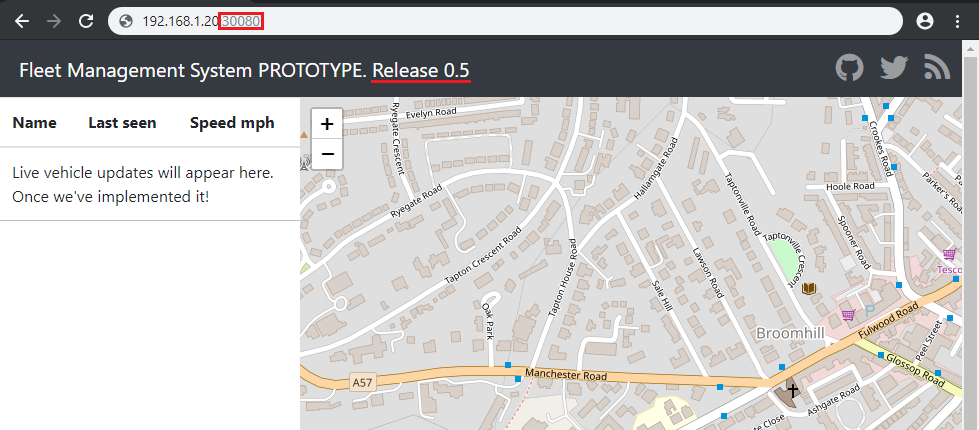

---


## Adding a Queue Server

Our finished WebApp is going to need a message broker to work. We are going to us the [given Docker Image](https://hub.docker.com/r/richardchesterwood/k8s-fleetman-queue/tags) in the __release1__ version to add [Apache ActiveMQ](http://activemq.apache.org) as a queue service for our app. ActiveMQ, or in generall all Message Oriented Middleware (MOM) implementations are designed for the purpose of sending messages between two applications, or two components inside one application.


To add this service in a Pod, we need to create a configuration file for it - this can either be a new file called `webapp-queue.yaml`, or we can simply add it to the end of our existing `webapp-angular.yaml` configuration file to keep everything neat and tidy (this also means that we can simplify the filename to `pods.yaml` -> `mv webapp-angular.yaml pods.yaml`):


```yaml
---
apiVersion: v1
kind: Pod
metadata:
  name: queue
  labels:
    app: queue
spec:
  containers:
  - name: queue
    image: richardchesterwood/k8s-fleetman-queue:release1
```


---

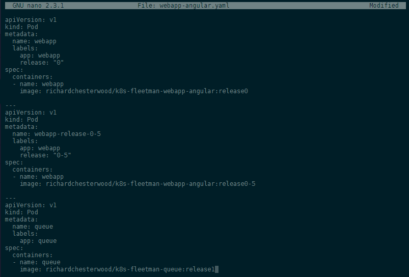

---


Use __kubectl__ to read our configuration file and generate the Queue Pod:


```bash
kubectl apply -f pods.yaml
```


---

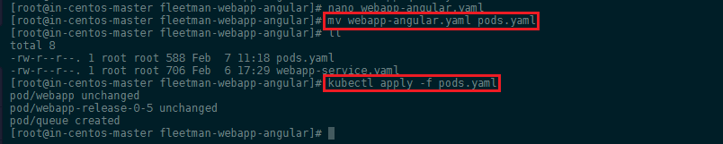

---

To be able to access the Pod, we need to add it to our service configuration `webapp-service.yaml` which we can rename to `services.yaml` -> `mv webapp-service.yaml services.yaml`:


```yaml
---
apiVersion: v1
kind: Service
metadata:
  # Unique key of the Service instance
  name: fleetman-queue
spec:
  ports:
    # Accept traffic sent to port 8161 (default login is admin/admin)
    - name: http
      port: 8161
      targetPort: 8161
      # The nodePort is available from outside of the
      # cluster when is set to NodePort. It's value has
      # to be > 30000
      nodePort: 30010
  selector:
    # Define which pods are going to
    # be represented by this service
    # The service makes an network
    # endpoint for our app
    app: queue
  # Setting the Service type to ClusterIP makes the
  # service only available from inside the cluster
  # To expose a port use NodePort instead
  type: NodePort
```


---

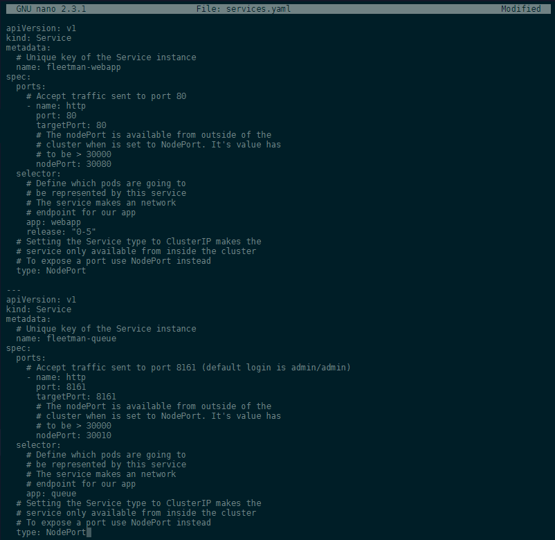

---


We can now apply all changes with:

```bash
kubectl apply -f .
kubectl get all
```


---

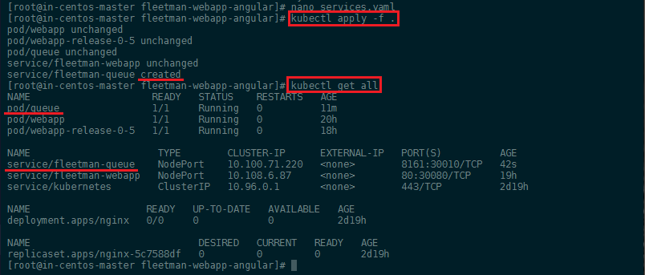

---


You can inspect the pod, in case that something doesn't look right. All events will be logged at the end of the console output:


```bash
kubectl describe pod queue
```


---

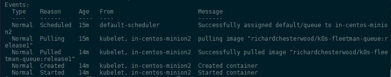

---


Type in the IP of your __Kybernetes Cluster__ (_WAN IP of your master server_) and add the port __30010__ to access the updated web interface with your browser:


---

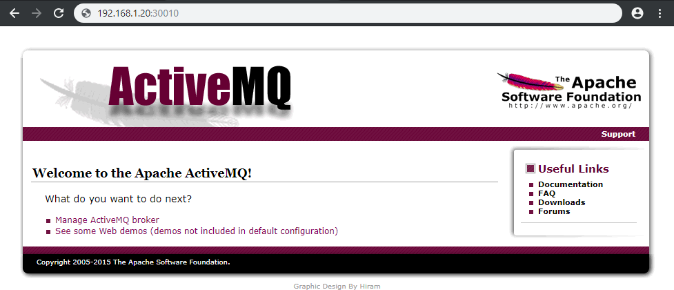

---


## Replication (not recommended)


So far we spawned all our Pods manually using the `kubectl apply` command. This way it is us who is responsible for the complete life-cycle of the pod. That means that you can delete (gracefully shutdown) or force shutdown those Pods with the `kubectl delete` command:


```bash
kubectl delete pod webapp-release-0-5
kubectl delete pod webapp-release-0-5 --force
```


The Pod will just disappear - check with `kubectl get all` - and not be restarted. The same would happen if your app crashes and that is a situation where we want Kubernetes to recover Pods to keep our App running.


### ReplicaSets

The [ReplicaSet](https://kubernetes.io/docs/reference/generated/kubernetes-api/v1.13/#replicaset-v1-apps) is basically just a wrapper around our Pod configuration that defines the number of instances of our Pod we want to be running at all times - if one crashes, it will automatically be replaced by a new version of the same pod.


Let's re-write our Pod definition to a __ReplicaSet__ - below is the original `pods.yaml` file (the webapp with release0 was removed):

```yaml
apiVersion: v1
kind: Pod
metadata:
  name: webapp
  labels:
    app: webapp
    release: "0-5"
spec:
  containers:
  - name: webapp
    image: richardchesterwood/k8s-fleetman-webapp-angular:release0-5

---
apiVersion: v1
kind: Pod
metadata:
  name: queue
  labels:
    app: queue
spec:
  containers:
  - name: queue
    image: richardchesterwood/k8s-fleetman-queue:release1
```


The __ReplicaSet__ just adds a few lines to the top of our Pod configuration:


```yaml
apiVersion: apps/v1
kind: ReplicaSet
metadata:
  # Unique key of the ReplicaSet instance
  name: webapp
spec:
  selector:
    matchLabels:
      # the ReplicaSet manages all Pods
      # where the lable = app: webapp
      app: webapp
  # only 1 Pod should exist atm - if it
  # crashes, a new pod will be spawned.
  replicas: 1
  # Here starts the Pod Definition from b4
  template:
    metadata:
      # name: webapp / now we ReplicaSet name
      labels:
        app: webapp
    spec:
      containers:
      - name: webapp
        image: richardchesterwood/k8s-fleetman-webapp-angular:release0.5

---
apiVersion: v1
kind: Pod
metadata:
  name: queue
  labels:
    app: queue
spec:
  containers:
  - name: queue
    image: richardchesterwood/k8s-fleetman-queue:release1
```


---

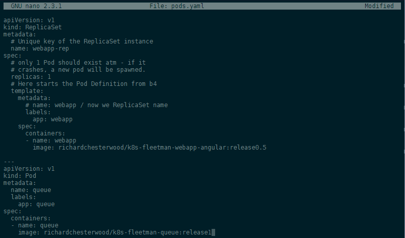

---


Before applying our new __ReplicaSet__ let's first delete all pods we created earlier `kubectl delete pods --all` and then start the new Pods with `kubectl apply -f pods.yaml`. You can verify that everything worked with `kubectl get all` and `kubectl describe replicaset webapp`:


---

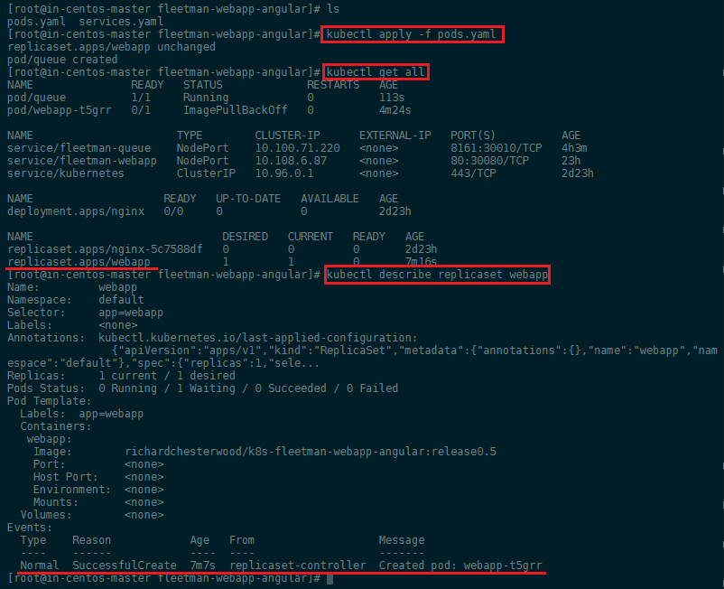

---


We earlier added a release selector to the `services.yaml` that now needs to be removed as we are no longer using it as a label for our Pod - afterwards run `kubectl apply -f services.yaml`:


---

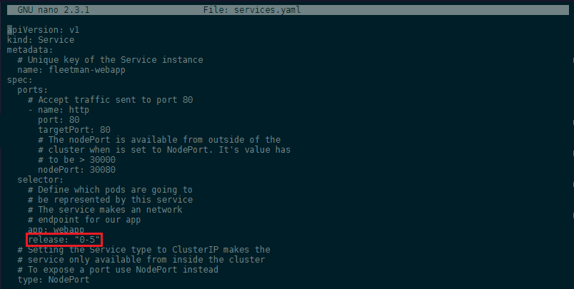

---


If you now delete the Pod manually - simulating a crash - a new pod will be automatically spawned by Kubernetes to replace the Pod you just lost:


---

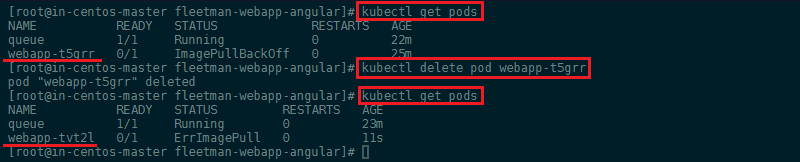

---


In the case above, your web service would have experienced a few seconds of downtime while waiting for the new pod to spin up. To prevent this issue we can go back to `pods.yaml` and set the number of __replicas__ to __2__. Now if the first pod crashes, the second one will replace it right away:


---

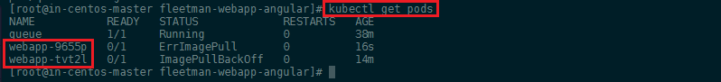

---


## Deployment (recommended)


Unlike [ReplicaSets](https://kubernetes.io/docs/reference/generated/kubernetes-api/v1.13/#replicaset-v1-apps) [Deployments](https://kubernetes.io/docs/reference/generated/kubernetes-api/v1.13/#deployment-v1-apps) enable __rolling updates__ with 0 downtime as well as __roll-backs__ to older versions of your app!


Let's start with deleting our ReplicaSet `kubectl delete replicaset webapp` - this is going to remove both the set and all pods that have been spawned from it:


---

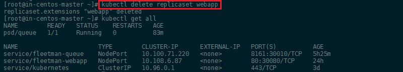

---


To now change our __ReplicaSet__ into a __Deployment__ we only have to change `type: Deploymet` inside our `pods.yaml`:


```yaml
apiVersion: apps/v1
kind: Deployment
metadata:
  # Unique key of the Deployment
  name: webapp
spec:
  selector:
    matchLabels:
      # the Deployment manages all Pods
      # where the lable = app: webapp
      app: webapp
  # only 1 Pod should exist atm - if it
  # crashes, a new pod will be spawned.
  replicas: 1
  # Here starts the Pod Definition from b4
  template:
    metadata:
      # name: webapp / now we Deployment name
      labels:
        app: webapp
    spec:
      containers:
      - name: webapp
        image: richardchesterwood/k8s-fleetman-webapp-angular:release0

---
apiVersion: v1
kind: Pod
metadata:
  name: queue
  labels:
    app: queue
spec:
  containers:
  - name: queue
    image: richardchesterwood/k8s-fleetman-queue:release1
```


We also changed the version of our app back to `release0` so we can later test out the update procedure. Then apply the cahnges you made with `kubectl apply -f pods.yaml`:


---

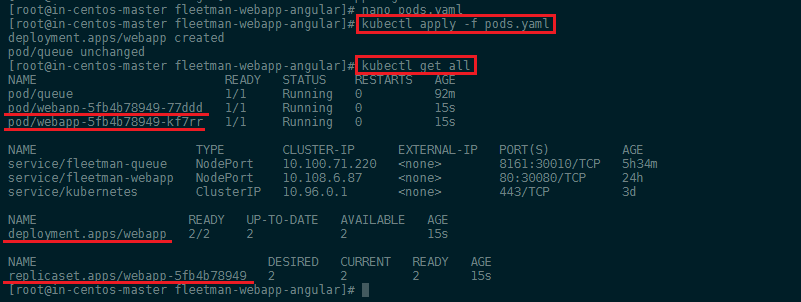

---


As you can see, the __Deployment__ was created and set up a __ReplicaSet__ for us that spawned two __Pods__:


* deployment.apps/webapp   2/2
* replicaset.apps/webapp-5fb4b78949   2
* pod/webapp-5fb4b78949-77ddd   1/1
* pod/webapp-5fb4b78949-kf7rr   1/1


### Rolling Update and Rollback

Now to update our app back to `release0-5` edit `pods.yaml` and set the image to back to the 0.5 release. Afterwards run `kubectl apply -f pods.yaml`. This will start up a new __ReplicaSet__ with the updated pods, but keep the old set alive until the update is ready - resulting in a 0-downtime, rolling update of our app:


---

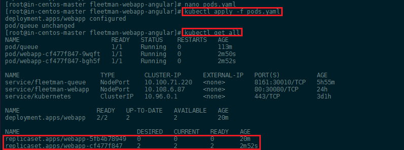

---


As seen above, the new ReplicaSet was successfully deployed - but the old one was __not deleted__. In case that something goes wrong during the update and the new pods never spin up, the old ones will not go down - keeping your app alive. This also allows you to always come back to the old version, if something goes wrong after the update. You can follow the rollout process with the following command:


```bash
kubectl rollout status deployment webapp
```


To roll back to a working version of your app - after a desasterous update - check the __Rollout History__ and run the rollback command to go back to a previous version or specify the revision you need:


```
kubectl rollout history deployment webapp
kubectl rollout undo deployment webapp --to-revision=1
```


---

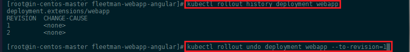

---


## Networking and Service Discovery

We will now create a simple Pod to use as a test environment. Create a file named busybox.yaml with the following contents:


```yaml
apiVersion: v1
kind: Pod
metadata:
  name: busybox
  namespace: default
spec:
  containers:
  - name: busybox
    image: busybox:1.28
    command:
      - sleep
      - "3600"
    imagePullPolicy: IfNotPresent
  restartPolicy: Always
```

Then create a pod using this file and verify its status:


```bash
kubectl create -f busybox.yaml
pod/busybox created

kubectl get pods busybox
NAME      READY     STATUS    RESTARTS   AGE
busybox   1/1       Running   0          12s
```


Once that pod is running, you can `exec nslookup` in that environment. If you see something like the following, DNS is working correctly:


```bash
kubectl exec -ti busybox -- nslookup kubernetes.default
Server:    10.96.0.10
Address 1: 10.96.0.10 kube-dns.kube-system.svc.cluster.local

Name:      kubernetes.default
Address 1: 10.96.0.1 kubernetes.default.svc.cluster.local
```


`nslookup` successfully contacted the internal __CoreDNS server__ on `10.96.0.10` that Kubernetes provides and resolved the corresponding IP address for __kubernetes.default__. If the address resolution fails, try to to bring down __FirewallD__ and test which port is being blocked - don't forget to bring it back up afterwards:


```bash
systemctl stop firewalld && systemctl disable firewalld
systemctl start firewalld && systemctl enable firewalld
```


__What to do if shutting down FirewallD "solves" your Problem?__

There are several threads on Github talking about this issue - [this one](https://github.com/kubernetes/kubeadm/issues/504) solved the issue for me:

* __Problem__: `nslookup` does not resolve any domains when FirewallD is active:

```bash
[root@in-centos-master ~]# kubectl exec -ti webapp-cf477f847-9wqft sh
/ # nslookup database
nslookup: can't resolve '(null)': Name does not resolve

nslookup: can't resolve 'database': Try again
/ # nslookup google.com
nslookup: can't resolve '(null)': Name does not resolve

nslookup: can't resolve 'google.com': Try again
/ # exit
command terminated with exit code 1
```

* __Solution__: Configure `iptables` as follows by [copying this](https://github.com/kubernetes/kubeadm/issues/504#issuecomment-404737675) to all nodes in cluster:

```bash
systemctl stop kubelet
systemctl stop docker
rm -rf /var/lib/cni/
rm -rf /etc/cni/net.d
rm -rf /run/flannel

iptables -t nat -F
iptables -t mangle -F
iptables -F
iptables -X
iptables -P INPUT ACCEPT
iptables -P FORWARD ACCEPT
iptables -P OUTPUT ACCEPT


ip6tables -t nat -F
ip6tables -t mangle -F
ip6tables -F
ip6tables -X
ip6tables -P INPUT ACCEPT
ip6tables -P FORWARD ACCEPT
ip6tables -P OUTPUT ACCEPT

iptables -L -v -n 
iptables -L -v -n -t nat
conntrack -L 
ipset list

lsmod|grep br_netfilter
modprobe br_netfilter
systemctl start docker
systemctl start kubelet
```

`nslookup` should now work:

```bash
/ # nslookup database
nslookup: can't resolve '(null)': Name does not resolve

Name:      database
Address 1: 10.105.73.87 database.default.svc.cluster.local
/ # 
```


Or check the [DNS Debugging](https://kubernetes.io/docs/tasks/administer-cluster/dns-debugging-resolution/) section in the Kubernetes documentation.


To be able to connect applications in different pods - e.g. having a backend container accessing a database in a different pod - Kubernetes has it's own __DNS Service__ and we can assign pods to __Namespaces__ to group them together. When we create a pod without specifying a namespace, it will be assigned the `namespace: default`. The command `kubectl get all` shows us all pods that are inside this specific space. We can run `kubectl get namespaces` to see all available spaces that have been assigned by the DNS service:


---

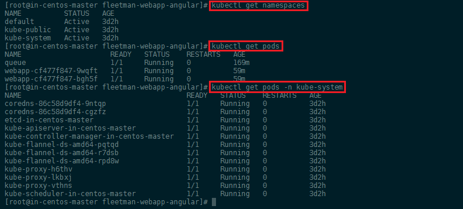

---


If we want to see Pods running in the __kube-system__ namespace we can use the `kubectl get pods -n kube-system` command.


### Creating a Database Pod

We now have a Web Application and a message broker in place. Next we want to a add a MariaDB database and we do so with the following configuration file `networking-tests.yaml`:


```yaml
apiVersion: v1
kind: Pod
metadata:
  name: mysql
  labels:
    app: mysql
spec:
  containers:
   - name: mysql
     image: mysql:5
     env:
      # Use secret in real life
      - name: MYSQL_ROOT_PASSWORD
        value: password
      - name: MYSQL_DATABASE
        value: fleetman

---
apiVersion: v1
kind: Service
metadata:
  name: database
spec:
  selector:
    app: mysql
  ports:
  - port: 3306
  type: ClusterIP

```


We can apply this configuration to our cluster with `kubectl apply -f networking-tests.yaml` and verify that it is running with `kubectl get all`:


---

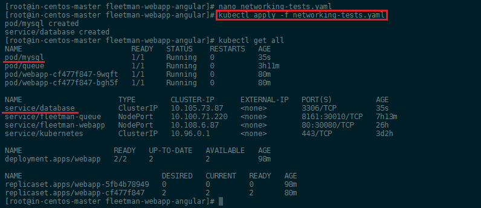

---


We now want to see if we can connect to the database from our webapp container. To do so we need to execute the shell command inside the container and check the DNS configuration file:


```
kubectl exec -it webapp-cf477f847-9wqft sh
/ # cat /etc/resolv.conf
```


---

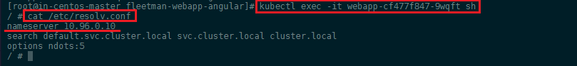

---


In this case the CoreDNS server is registered under `nameserver 10.96.0.10` - that means that every time we need to resolve a domain name, like we did earlier with `kubernetes.default`, this DNS server is contacted to resolve the underlying IP address for us. We can verify this by typing:


```bash
kubectl get services -n kube-system
```


---

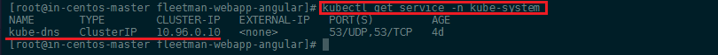

---


That means that if we want to connect to our database server from another pod in our cluster (__Service Discovery__), all we need to do is to connect to the domain name `database` that is provided by the database service. This is very important since the assigned IP address can change all the time!


Going back into the webapp container we can run a `nslookup` to see if the DNS service is working correctly:


---

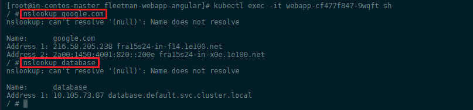

---


As you see, we can not only resolve internal cluster IPs but also internet domains - the CoreDNS service is using `8.8.8.8` and `8.8.4.4` as __Upstream DNS Servers_ [by default](https://kubernetes.io/docs/tasks/administer-cluster/dns-custom-nameservers/#configure-stub-domain-and-upstream-dns-servers).


You can also see that the FQDN (__Fully Qualified Domain Name__) of our database is actually `database.default.svc.cluster.local`. The reason why we can simply use `databse` to get an result, is that the `/etc/resolv.conf` file specifies that if a domain name is not found appened one of the standard strings to it and try again:


```bash
search default.svc.cluster.local svc.cluster.local cluster.local
```

Just using `database` as domain works fine because the pod is inside the __default namespace__. As soon as you start using different namespaces for different type of services, you __have to use the FQDN__ instead - or at least appened the used namespace to it, e.g. `database.mynondefaultnamespace` (the DNS service will then add `svc.cluster.local` to find the FQDN for you).


To check if the webapp container can access the MariaDB database, we can install the __mySQL client__ on the _Alpine image_ that serves our webapp:


```bash
apk update
apk add mysql-client
```

To connect to our database we just have to type `mysql` followed by the host address `-h database` and the login credentials we set inside the configuration file earlier:


```bash
mysql -h database -uroot -ppassword fleetman
MySQL [fleetman]> CREATE TABLE testtable (test varchar (255));
MySQL [fleetman]> SHOW TABLES;
```


---

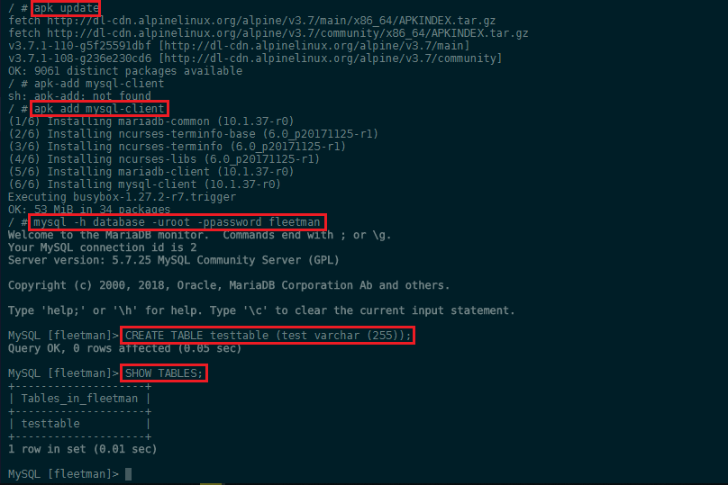

---


## Kubernetes + Compose = Kompose

[Kompose](http://kompose.io) is a conversion tool for Docker Compose to container orchestrators such as Kubernetes (or OpenShift).

* Simplify your development process with Docker Compose and then deploy your containers to a production cluster
* [Convert](https://kubernetes.io/docs/tasks/configure-pod-container/translate-compose-kubernetes/) your _docker-compose.yaml_ with one simple command `kompose convert`
* Immediately bring up your cluster with `kompose up`
* Bring it back down with `kompose down`


Kompose is in EPEL CentOS repository. If you don’t have EPEL repository already installed and enabled you can do it by running `yum install epel-release`:


```bash
yum -y install kompose
```


### Use Kompose

In just a few steps, we’ll take you from Docker Compose to Kubernetes. All you need is an existing `docker-compose.yml` file:


1. Go to the directory containing your _docker-compose.yml_ file. Run the `kompose up` command to deploy to Kubernetes directly.
2. Or convert the _docker-compose.yml_ file to files that you can use with `kubectl`, run `kompose convert`:


---

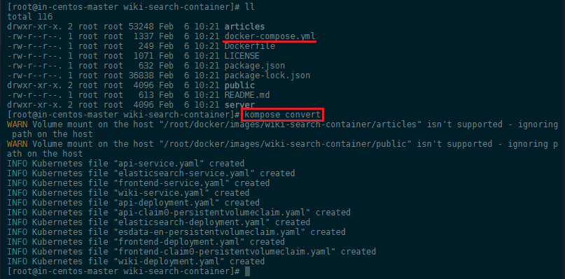

---


And then `kubectl create -f <output files>` - e.g. :
 

```bash
kubectl create -f api-service.yaml,elasticsearch-service.yaml,frontend-service.yaml,wiki-service.yaml,api-deployment.yaml,api-claim0-persistentvolumeclaim.yaml,elasticsearch-deployment.yaml,esdata-en-persistentvolumeclaim.yaml,frontend-deployment.yaml,frontend-claim0-persistentvolumeclaim.yaml,wiki-deployment.yaml
```


---

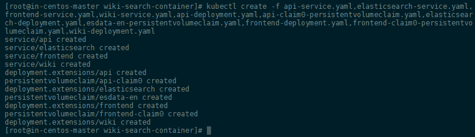

---