In this hands-on lab from [Linux Academy](https://linuxacademy.com/cp), we will install and configure a Kubernetes cluster consisting of 1 master and 2 nodes for the pods. Once the installation and configuration are complete, we will have a 3-node Kubernetes cluster that uses Flannel as the network overlay.


<!-- TOC -->

- [Instructions](#instructions)
  - [Objectives](#objectives)
- [Install Docker and Kubernetes](#install-docker-and-kubernetes)
  - [Prerequisites](#prerequisites)
  - [Install Docker CE](#install-docker-ce)
  - [Install Kubernetes](#install-kubernetes)
  - [Start Docker and Kublet](#start-docker-and-kublet)
- [Cluster Initialization](#cluster-initialization)
  - [Networking details](#networking-details)
  - [Check the cluster state.](#check-the-cluster-state)
- [Create and scale a deployment using kubectl](#create-and-scale-a-deployment-using-kubectl)
  - [Kubernetes stuck on ContainerCreating](#kubernetes-stuck-on-containercreating)
  - [Scaling](#scaling)
- [Pod Deployment](#pod-deployment)
- [Kubernetes Services](#kubernetes-services)
- [Updating the Pod](#updating-the-pod)
- [Kubernetes + Compose = Kompose](#kubernetes--compose--kompose)
  - [Use Kompose](#use-kompose)

<!-- /TOC -->


## Instructions

In this learning activity, we will create a Kubernetes cluster. The commands we will use for this process can be found in the task list by clicking on the orange question mark buttons.

Once you have completed the lab, leave your cluster in its final state. Do not delete the deployment:


### Objectives

* Install Docker and Kubernetes on all servers.
* Create and scale a deployment using kubectl.


## Install Docker and Kubernetes

### Prerequisites

1. You first need to login as your root user or elevate your users privileges via sudo on your master and two minion servers:

```bash
sudo su
```

1. This next step is not recommended in production ([How do you create a SE Linux policy?](https://docs.docker.com/engine/security/seccomp/)) - but we are going to disable SE Linux on all 3 servers:


```
setenforce 0
sed -i --follow-symlinks 's/SELINUX=enforcing/SELINUX=disabled/g' /etc/sysconfig/selinux
```

3. Now we need to enable the `br_netfilter` module on all servers to allow our cluster to communicate:


```bash
modprobe br_netfilter
echo '1' > /proc/sys/net/bridge/bridge-nf-call-iptables
```


---

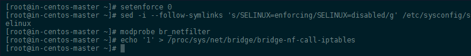

---


4. Make sure that swap has been turned off:


---

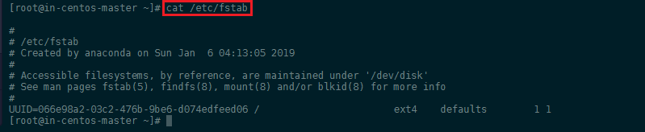

---

> To turn off swap on centos type `swapoff -a` and check that the swap was removed with `free -h`. Edit the `/etc/fstab` file, search for the swap line and comment the entire line by adding a `#` in front of the line:


---

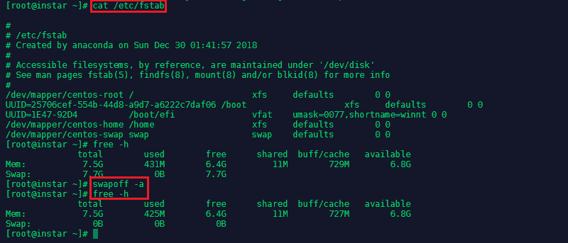

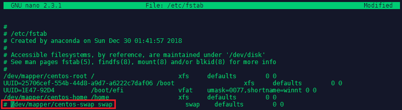

---


> Now delete the remaining swap file - check the location `blkid` and remove it `rm /dev/mapper/centos-swap`:


---

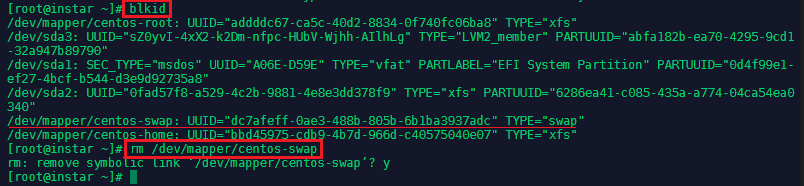

---


1. Add a FirewallD Service

Configure FirewallD for Kubernetes to work correctly. First download the k8s-master.xml and k8s-worker.xml files to `cd /etc/firewalld/services` on your master and minion server:

```bash
wget https://raw.githubusercontent.com/mpolinowski/k8s-firewalld/master/k8s-master.xml

wget https://raw.githubusercontent.com/mpolinowski/k8s-firewalld/master/k8s-worker.xml

firewall-cmd --reload
```


__On Master Node__

```bash
firewall-cmd --add-service=k8s-master --zone=public --permanent
```

__On Minion Nodes__

```bash
firewall-cmd --add-service=k8s-worker --zone=public --permanent
```


### Install Docker CE


1. Ensure that all Docker dependencies are installed:


```bash
yum install -y yum-utils device-mapper-persistent-data lvm2
```


---

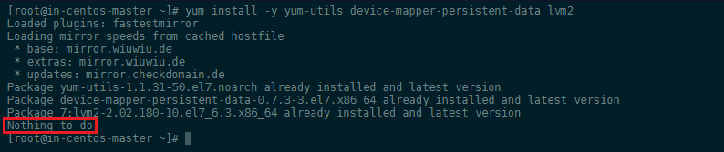

---


2. Now we can add the Docker repository and install it:


```bash
yum-config-manager --add-repo https://download.docker.com/linux/centos/docker-ce.repo
yum install -y docker-ce
```


---

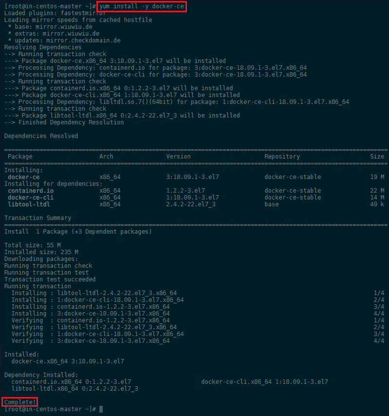

---


### Install Kubernetes


First we need to add the Kubernetes repository all servers:


```bash
cat << EOF > /etc/yum.repos.d/kubernetes.repo  
[kubernetes]  
name=Kubernetes  
baseurl=https://packages.cloud.google.com/yum/repos/kubernetes-el7-x86_64  
enabled=1  
gpgcheck=0  
repo_gpgcheck=0  
gpgkey=https://packages.cloud.google.com/yum/doc/yum-key.gpg  
 https://packages.cloud.google.com/yum/doc/rpm-package-key.gpg  
EOF
```


---

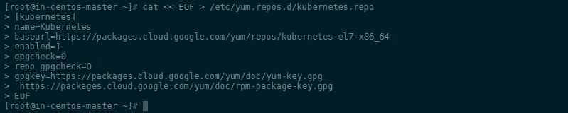

---


Now we can install Kubernetes on all servers via yum:


```bash
yum install -y kubelet kubeadm kubectl
```


---

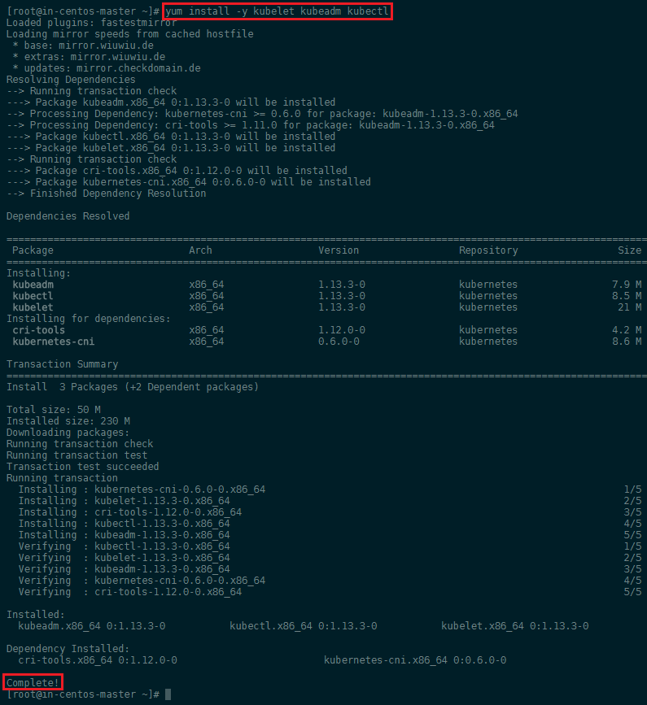

---


### Start Docker and Kublet


```bash
systemctl enable docker
systemctl enable kubelet
systemctl start docker
systemctl start kubelet
```


---

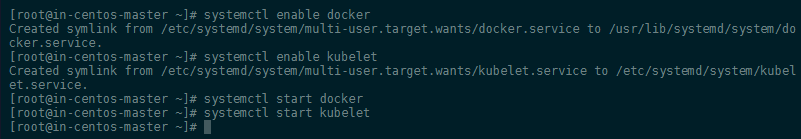

---


To check in what Group Docker is running, run `docker info | grep -i cgroup`:


---


---


In this case it is `cgroupfs` - we can now make sure that Kubernetes is added to this group:


```bash
sed -i 's/cgroup-driver=systemd/cgroup-driver=cgroupfs/g' /etc/systemd/system/kubelet.service.d/10-kubeadm.conf
systemctl daemon-reload
systemctl restart kubelet
```


## Cluster Initialization

So far we did the basic setup for all our servers - now we will initialize our cluster from the __MASTER SERVER__ using the IP range for Flannel. Kubeadm is a tool built to provide [kubeadm init](https://kubernetes.io/docs/reference/setup-tools/kubeadm/kubeadm-init/) and [kubeadm join](https://kubernetes.io/docs/reference/setup-tools/kubeadm/kubeadm-join/) as best-practice _fast paths_ for creating Kubernetes clusters. The __init command__ executes the following phases:


```bash
kubeadm init --pod-network-cidr=10.244.0.0/16
```

<!-- kubeadm init --pod-network-cidr=10.244.0.0/16 --ignore-preflight-errors=NumCPU -->

Your Kubernetes master has initialized successfully! You can now join any number of machines by running the following on each node as root:


---

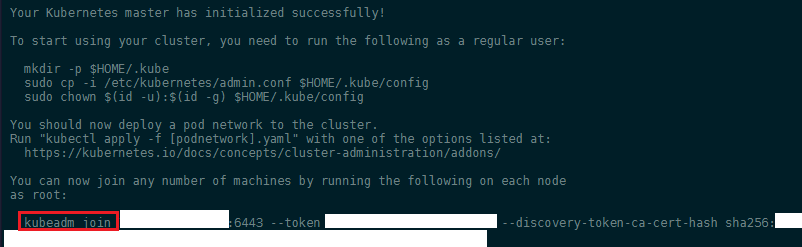

---


```bash
kubeadm join X.X.X.X:6443 --token XXXXXXXXXXXXXXX --discovery-token-ca-cert-hash sha256:XXXXXXXXXXXXXXXXXXXXXXXXXXXXXXXXXXXXXXXXXXXXXXXXXXXXXXXXXXXXXXXXXXXXX
```


Copy the `kubeadmin join` command that is in the output and past it into your minion server terminals:


---

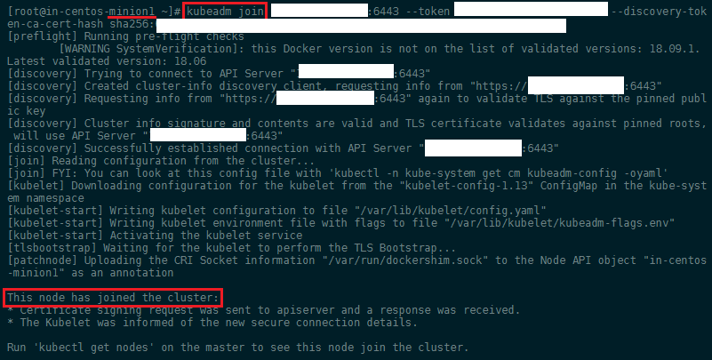

---


To start using your cluster, you need to run the following as a regular user:


```bash
mkdir -p $HOME/.kube
sudo cp -i /etc/kubernetes/admin.conf $HOME/.kube/config
sudo chown $(id -u):$(id -g) $HOME/.kube/config
```


We will use [Flannel](https://github.com/coreos/flannel) as a simple and easy way to configure a layer 3 network fabric designed for Kubernetes. Flannel runs a small, single binary agent called flanneld on each host, and is responsible for allocating a subnet lease to each host out of a larger, preconfigured address space. Flannel uses either the Kubernetes API or etcd directly to store the network configuration, the allocated subnets, and any auxiliary data (such as the host's public IP). Packets are forwarded using one of several backend mechanisms including VXLAN and various cloud integrations:


```bash
kubectl apply -f https://raw.githubusercontent.com/coreos/flannel/master/Documentation/kube-flannel.yml
```


---

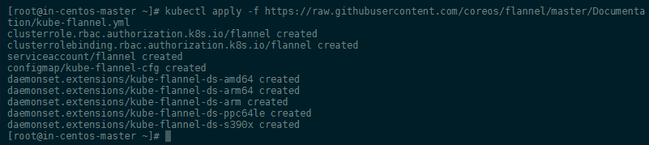

---


### Networking details

Platforms like Kubernetes assume that each container (pod) has a unique, routable IP inside the cluster. The advantage of this model is that it removes the port mapping complexities that come from sharing a single host IP.

Flannel is responsible for providing a layer 3 IPv4 network between multiple nodes in a cluster. Flannel does not control how containers are networked to the host, only how the traffic is transported between hosts. However, flannel does provide a CNI plugin for Kubernetes and a guidance on integrating with Docker.


### Check the cluster state.


```bash
kubectl get pods --all-namespaces
```


---

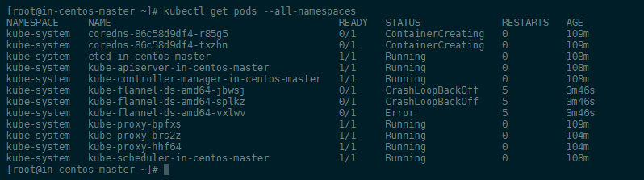

---


Then check your nodes from the master:


```bash
kubectl get nodes
```


---

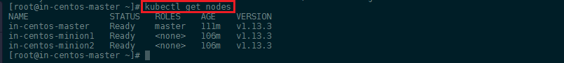

---


## Create and scale a deployment using kubectl


[Kubectl](https://kubernetes.io/docs/reference/kubectl/overview/) is a command line interface for running commands against Kubernetes clusters. We can run a NGINX container with the following command:


```bash
kubectl create deployment nginx --image=nginx
```


You can verify that the __Pod__ was created by Kubernetes:


```bash
kubectl get pods
```


---

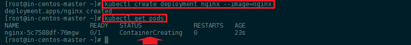

---


### Kubernetes stuck on ContainerCreating

Use `kubectl describe pods` to list all the events associated with the pod, including pulling of images, starting of containers:


```bash
Normal - Scheduled - 13m - default-scheduler - Successfully assigned default/nginx-5c7588df-76mgw to in-centos-minion2

Warning - FailedCreatePodSandBox - 13m - kubelet, in-centos-minion2  Failed create pod sandbox: rpc error: code = Unknown desc = failed to set up sandbox container "8ab7c07633f6170dabd8df9a28680a7b9af79f10374e81df8c85dac609abc209" network for pod "nginx-5c7588df-76mgw": NetworkPlugin cni failed to set up pod "nginx-5c7588df-76mgw_default" network: open /run/flannel/subnet.env: no such file or directory
```


I noticed that - to use Flannel - you need to initialize `kubeadm` with the ` --pod-network-cidr=10.244.0.0/16` flag. You can reset your deployment with:


```bash
kubeadm reset
iptables -F && iptables -t nat -F && iptables -t mangle -F && iptables -X
```


Now back to `kubeadm init --pod-network-cidr=10.244.0.0/16` and rebuild the deployment - success:


---

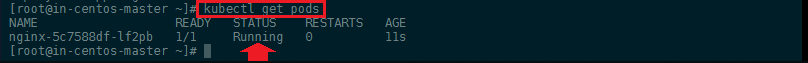

---


### Scaling

To scale up our web server contingent to __4__, we can use the following `kubectl` command:


```bash
kubectl scale deployment nginx --replicas=4
kubectl get pods
```


---

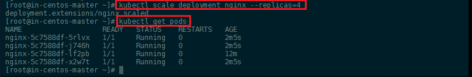

---


To get rid of those pods you can scale it back down to 0 replicas:


```bash
kubectl scale deployment nginx --replicas=0
```


---

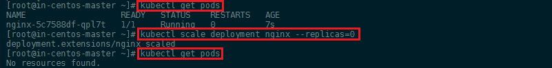

---


If you try to delete the pods by name `kubectl delete pod nginx-5c7588df-lf2pb`, or try to delete all: `kubectl delete pods --all`, Kubernetes will respawn new pods to meet your deployment scale requirement.


## Pod Deployment

Let's deploy an simple Angular app inside a [Kubernetes Pod](https://kubernetes.io/docs/reference/generated/kubernetes-api/v1.13/#pod-v1-core) - we will use the 0 release of [this Docker image](https://hub.docker.com/r/richardchesterwood/k8s-fleetman-webapp-angular/tags) to get started with. To do this we will have to create a Pod Config file for it called `webapp-angular.yaml`:


```yaml
apiVersion: v1
kind: Pod
metadata:
  name: webapp
spec:
  containers:
  - name: webapp
    image: richardchesterwood/k8s-fleetman-webapp-angular:release0
```


---

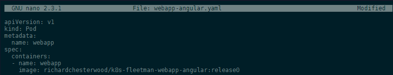

---


We can now use __kubectl__ to read our configuration file and generate the webapp Pod:


```bash
kubectl apply -f webapp-angular.yaml
```


---

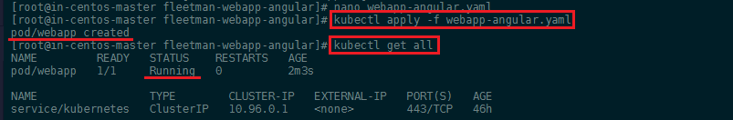

---


You can inspect the pod with:


```bash
kubectl describe pod webapp
```


---

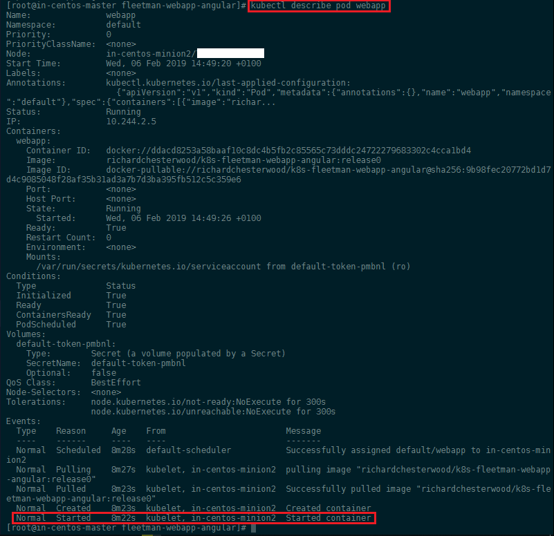

---


Just like in Docker, we can use __kubectl__ to run commands against our containers - e.g. to access the shell inside your container, contact the webserver (that should be serving our Angular app) and printing out index page:


```bash
kubectl -it exec webapp sh
/ # wget http://localhost:80
/ # cat index.html
```


---

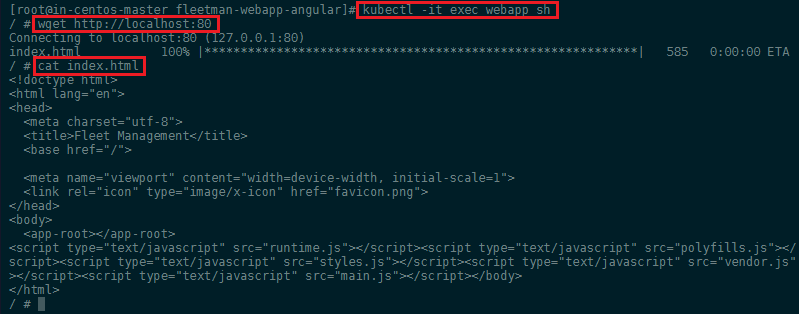

---


## Kubernetes Services

We now have a Pod that is serving our Angular frontend. To be able to access this Pod from _the outside_ we need to add a [Kubernetes service](https://kubernetes.io/docs/reference/generated/kubernetes-api/v1.13/#service-v1-core). Let's create a file `webapp-service.yaml`:


```yaml
apiVersion: v1
kind: Service
metadata:
  # Unique key of the Service instance
  name: fleetman-webapp
spec:
  ports:
    # Accept traffic sent to port 80
    - name: http
      port: 80
      targetPort: 80
      # The nodePort is available from outside of the
      # cluster when is set to NodePort. It's value has
      # to be > 30000
      nodePort: 30080
  selector:
    # Define which pods are going to
    # be represented by this service
    # The service makes an network
    # endpoint for our app
    app: webapp
  # Setting the Service type to ClusterIP makes the
  # service only available from inside the cluster
  # To expose a port use NodePort instead
  type: NodePort
```


---

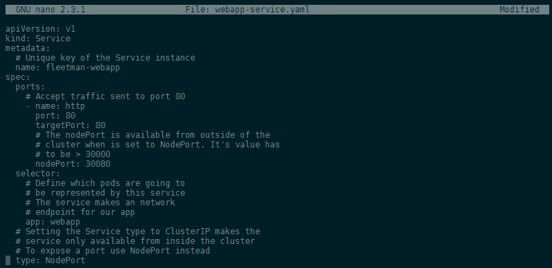

---


We now have to add the __Selector__ `webapp` in form of a label in `webapp-angular.yaml` to our frontend pod to connect it to our service:


```yaml
apiVersion: v1
kind: Pod
metadata:
  name: webapp
  labels:
    app: webapp
spec:
  containers:
  - name: webapp
    image: richardchesterwood/k8s-fleetman-webapp-angular:release0
```


The service can be added to our cluster by the following commands:


```bash
kubectl apply -f webapp-angular.yaml
kubectl apply -f webapp-service.yaml
```


---

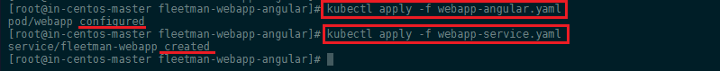

---


By applying our changes, we have updated our pod and created our service.


---

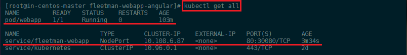

---


## Updating the Pod


To Update a Pod in Production with 0 downtime we can use labels. We can define a second pod inside the same file `webapp-angular.yaml`. Right now we are going to use release versions to define our pods. Later we might change this to a __production__ and a __development__ version - both of which can then be run inside the same cluster and be served by different services:


```yaml
apiVersion: v1
kind: Pod
metadata:
  name: webapp
  labels:
    app: webapp
    release: "0"
spec:
  containers:
  - name: webapp
    image: richardchesterwood/k8s-fleetman-webapp-angular:release0

---
apiVersion: v1
kind: Pod
metadata:
  name: webapp-release-0-5
  labels:
    app: webapp
    release: "0-5"
spec:
  containers:
  - name: webapp
    image: richardchesterwood/k8s-fleetman-webapp-angular:release0-5
```


Make sure to surround release version with quotation marks to convert it into a string - __"0"__. Otherwise you end up with the error message `for: "webapp-angular.yaml": cannot convert int64 to string`


Now we have to modify our service `webapp-service.yaml`: to not only check for the app name label, but also for the release version - we want to only connect to the current version 0. Once the version 0.5 is deployed we then can update the service to connect us to the updated Pod instead - allowing us to deploy the update with 0 downtime:


```yaml
apiVersion: v1
kind: Service
metadata:
  # Unique key of the Service instance
  name: fleetman-webapp
spec:
  ports:
    # Accept traffic sent to port 80
    - name: http
      port: 80
      targetPort: 80
      # The nodePort is available from outside of the
      # cluster when is set to NodePort. It's value has
      # to be > 30000
      nodePort: 30080
  selector:
    # Define which pods are going to
    # be represented by this service
    # The service makes an network
    # endpoint for our app
    app: webapp
    release: "0"
  # Setting the Service type to ClusterIP makes the
  # service only available from inside the cluster
  # To expose a port use NodePort instead
  type: NodePort
```


Now update both our Pod and Service - as well add the new Pod with our updated Angular app:


```
kubectl apply -f webapp-angular.yaml
kubectl apply -f webapp-service.yaml
kubectl get pods --show-labels
```


---

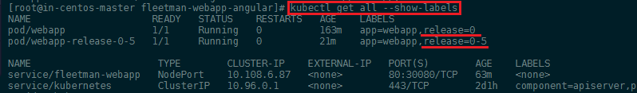

---


Now that both pods are running we can edit our service `webapp-service.yaml` and change the `selector` to `release: "0-5"`. Apply the change with `kubectl apply -f webapp-service.yaml` and verify that the service is now switched to the new release with `kubectl describe service fleetman-webapp`


---

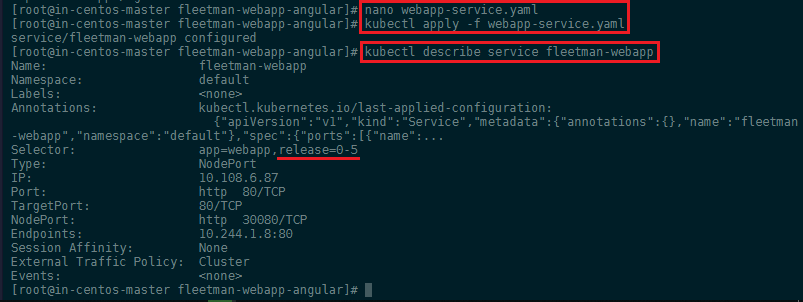

---


## Kubernetes + Compose = Kompose

[Kompose](http://kompose.io) is a conversion tool for Docker Compose to container orchestrators such as Kubernetes (or OpenShift).

* Simplify your development process with Docker Compose and then deploy your containers to a production cluster
* [Convert](https://kubernetes.io/docs/tasks/configure-pod-container/translate-compose-kubernetes/) your _docker-compose.yaml_ with one simple command `kompose convert`
* Immediately bring up your cluster with `kompose up`
* Bring it back down with `kompose down`


Kompose is in EPEL CentOS repository. If you don’t have EPEL repository already installed and enabled you can do it by running `yum install epel-release`:


```bash
yum -y install kompose
```


### Use Kompose

In just a few steps, we’ll take you from Docker Compose to Kubernetes. All you need is an existing `docker-compose.yml` file:


1. Go to the directory containing your _docker-compose.yml_ file. Run the `kompose up` command to deploy to Kubernetes directly.
2. Or convert the _docker-compose.yml_ file to files that you can use with `kubectl`, run `kompose convert`:


---


---


And then `kubectl create -f <output files>` - e.g. :
 

```bash
kubectl create -f api-service.yaml,elasticsearch-service.yaml,frontend-service.yaml,wiki-service.yaml,api-deployment.yaml,api-claim0-persistentvolumeclaim.yaml,elasticsearch-deployment.yaml,esdata-en-persistentvolumeclaim.yaml,frontend-deployment.yaml,frontend-claim0-persistentvolumeclaim.yaml,wiki-deployment.yaml
```


---


---