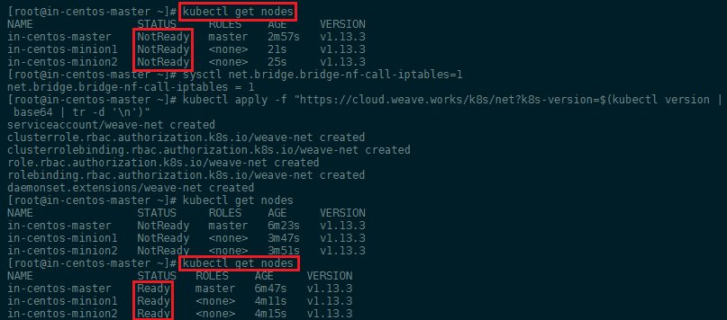

In this hands-on lab from [Linux Academy](https://linuxacademy.com/cp), we will install and configure a Kubernetes cluster consisting of 1 master and 2 nodes for the pods. Once the installation and configuration are complete, we will have a 3-node Kubernetes cluster that uses Flannel as the network overlay.


<!-- TOC -->

- [Instructions](#instructions)
  - [Objectives](#objectives)
- [Install Docker and Kubernetes](#install-docker-and-kubernetes)
  - [Prerequisites](#prerequisites)
  - [Install Docker CE](#install-docker-ce)
  - [Install Kubernetes](#install-kubernetes)
  - [Start Docker and Kublet](#start-docker-and-kublet)
- [Cluster Initialization](#cluster-initialization)
  - [Networking details](#networking-details)
  - [Check the cluster state.](#check-the-cluster-state)
- [Create and scale a deployment using kubectl](#create-and-scale-a-deployment-using-kubectl)
  - [Kubernetes stuck on ContainerCreating](#kubernetes-stuck-on-containercreating)
  - [Scaling](#scaling)

<!-- /TOC -->


## Instructions

In this learning activity, we will create a Kubernetes cluster. The commands we will use for this process can be found in the task list by clicking on the orange question mark buttons.

Once you have completed the lab, leave your cluster in its final state. Do not delete the deployment:


### Objectives

* Install Docker and Kubernetes on all servers.
* Create and scale a deployment using kubectl.


## Install Docker and Kubernetes

### Prerequisites

1. You first need to login as your root user or elevate your users privileges via sudo on your master and two minion servers:

```bash
sudo su
```

2. This next step is not recommended in production (_How do you create a SE Linux policy?_) - but we are going to disable SE Linux on all 3 servers:


```
setenforce 0
sed -i --follow-symlinks 's/SELINUX=enforcing/SELINUX=disabled/g' /etc/sysconfig/selinux
```

3. Now we need to enable the `br_netfilter` module on all servers to allow our cluster to communicate:


```bash
modprobe br_netfilter
echo '1' > /proc/sys/net/bridge/bridge-nf-call-iptables
```


---


---


4. Make sure that swap has been turned off:


---


---


5. Add a FirewallD Service

Configure FirewallD for Kubernetes to work correctly. First download the k8s-master.xml and k8s-worker.xml files to `cd /etc/firewalld/services` on your master and minion server:

```bash
wget https://raw.githubusercontent.com/mpolinowski/k8s-firewalld/master/k8s-master.xml

wget https://raw.githubusercontent.com/mpolinowski/k8s-firewalld/master/k8s-worker.xml

firewall-cmd --reload
```


__On Master Node__

```bash
firewall-cmd --add-service=k8s-master --zone=public --permanent
```

__On Minion Nodes__

```bash
firewall-cmd --add-service=k8s-worker --zone=public --permanent
```


### Install Docker CE


1. Ensure that all Docker dependencies are installed:


```bash
yum install -y yum-utils device-mapper-persistent-data lvm2
```


---


---


2. Now we can add the Docker repository and install it:


```bash
yum-config-manager --add-repo https://download.docker.com/linux/centos/docker-ce.repo
yum install -y docker-ce
```


---


---


### Install Kubernetes


First we need to add the Kubernetes repository all servers:


```bash
cat << EOF > /etc/yum.repos.d/kubernetes.repo  
[kubernetes]  
name=Kubernetes  
baseurl=https://packages.cloud.google.com/yum/repos/kubernetes-el7-x86_64  
enabled=1  
gpgcheck=0  
repo_gpgcheck=0  
gpgkey=https://packages.cloud.google.com/yum/doc/yum-key.gpg  
 https://packages.cloud.google.com/yum/doc/rpm-package-key.gpg  
EOF
```


---


---


Now we can install Kubernetes on all servers via yum:


```bash
yum install -y kubelet kubeadm kubectl
```


---


---


### Start Docker and Kublet


```bash
systemctl enable docker
systemctl enable kubelet
systemctl start docker
systemctl start kubelet
```


---


---


To check in what Group Docker is running, run `docker info | grep -i cgroup`:


---


---


In this case it is `cgroupfs` - we can now make sure that Kubernetes is added to this group:


```bash
sed -i 's/cgroup-driver=systemd/cgroup-driver=cgroupfs/g' /etc/systemd/system/kubelet.service.d/10-kubeadm.conf
systemctl daemon-reload
systemctl restart kubelet
```


## Cluster Initialization

So far we did the basic setup for all our servers - now we will initialize our cluster from the __MASTER SERVER__ using the IP range for Flannel. Kubeadm is a tool built to provide [kubeadm init](https://kubernetes.io/docs/reference/setup-tools/kubeadm/kubeadm-init/) and [kubeadm join](https://kubernetes.io/docs/reference/setup-tools/kubeadm/kubeadm-join/) as best-practice _fast paths_ for creating Kubernetes clusters. The __init command__ executes the following phases:


```bash
kubeadm init --pod-network-cidr=10.244.0.0/16
```

<!-- kubeadm init --pod-network-cidr=10.244.0.0/16 --ignore-preflight-errors=NumCPU -->

Your Kubernetes master has initialized successfully! You can now join any number of machines by running the following on each node as root:


---


---


```bash
kubeadm join X.X.X.X:6443 --token XXXXXXXXXXXXXXX --discovery-token-ca-cert-hash sha256:XXXXXXXXXXXXXXXXXXXXXXXXXXXXXXXXXXXXXXXXXXXXXXXXXXXXXXXXXXXXXXXXXXXXX
```


Copy the `kubeadmin join` command that is in the output and past it into your minion server terminals:


---


---


To start using your cluster, you need to run the following as a regular user:


```bash
mkdir -p $HOME/.kube
sudo cp -i /etc/kubernetes/admin.conf $HOME/.kube/config
sudo chown $(id -u):$(id -g) $HOME/.kube/config
```


We will use [Flannel](https://github.com/coreos/flannel) as a simple and easy way to configure a layer 3 network fabric designed for Kubernetes. Flannel runs a small, single binary agent called flanneld on each host, and is responsible for allocating a subnet lease to each host out of a larger, preconfigured address space. Flannel uses either the Kubernetes API or etcd directly to store the network configuration, the allocated subnets, and any auxiliary data (such as the host's public IP). Packets are forwarded using one of several backend mechanisms including VXLAN and various cloud integrations:


```bash
kubectl apply -f https://raw.githubusercontent.com/coreos/flannel/master/Documentation/kube-flannel.yml
```


---



---


### Networking details

Platforms like Kubernetes assume that each container (pod) has a unique, routable IP inside the cluster. The advantage of this model is that it removes the port mapping complexities that come from sharing a single host IP.

Flannel is responsible for providing a layer 3 IPv4 network between multiple nodes in a cluster. Flannel does not control how containers are networked to the host, only how the traffic is transported between hosts. However, flannel does provide a CNI plugin for Kubernetes and a guidance on integrating with Docker.


### Check the cluster state.


```bash
kubectl get pods --all-namespaces
```


---


---


Then check your nodes from the master:


```bash
kubectl get nodes
```


---


---


## Create and scale a deployment using kubectl


[Kubectl](https://kubernetes.io/docs/reference/kubectl/overview/) is a command line interface for running commands against Kubernetes clusters. We can run a NGINX container with the following command:


```bash
kubectl create deployment nginx --image=nginx
```


You can verify that the __Pod__ was created by Kubernetes:


```bash
kubectl get pods
```


---


---


### Kubernetes stuck on ContainerCreating

Use `kubectl describe pods` to list all the events associated with the pod, including pulling of images, starting of containers:


```bash
Normal - Scheduled - 13m - default-scheduler - Successfully assigned default/nginx-5c7588df-76mgw to in-centos-minion2

Warning - FailedCreatePodSandBox - 13m - kubelet, in-centos-minion2  Failed create pod sandbox: rpc error: code = Unknown desc = failed to set up sandbox container "8ab7c07633f6170dabd8df9a28680a7b9af79f10374e81df8c85dac609abc209" network for pod "nginx-5c7588df-76mgw": NetworkPlugin cni failed to set up pod "nginx-5c7588df-76mgw_default" network: open /run/flannel/subnet.env: no such file or directory
```


I noticed that - to use Flannel - you need to initialize `kubeadm` with the ` --pod-network-cidr=10.244.0.0/16` flag. You can reset your deployment with:


```bash
kubeadm reset
iptables -F && iptables -t nat -F && iptables -t mangle -F && iptables -X
```


Now back to `kubeadm init --pod-network-cidr=10.244.0.0/16` and rebuild the deployment - success:


---


---


### Scaling

To scale up our web server contingent to __4__, we can use the following `kubectl` command:


```bash
kubectl scale deployment nginx --replicas=4
kubectl get pods
```


---


---