<!-- TOC -->

- [Domain Driven Design and boundedContext](#domain-driven-design-and-boundedcontext)
  - [Deploying the Queue](#deploying-the-queue)
  - [Deploying the Position Simulator](#deploying-the-position-simulator)
  - [How to Debug a failed Deployment](#how-to-debug-a-failed-deployment)
  - [Deploying the Position Tracker](#deploying-the-position-tracker)
  - [Deploying the API Gateway](#deploying-the-api-gateway)
  - [Deploying the Angular Frontend](#deploying-the-angular-frontend)
- [Persistence in a Kubernetes Cluster](#persistence-in-a-kubernetes-cluster)
  - [MongoDB Pod](#mongodb-pod)
  - [MongoDB Service](#mongodb-service)
  - [Volume Mounts](#volume-mounts)
  - [Using PersistentVolumeClaims](#using-persistentvolumeclaims)
- [Cloud Deployment](#cloud-deployment)

<!-- /TOC -->


## Domain Driven Design and boundedContext

A Microservice architecture is an implementation of the [Domain Drive Design](https://martinfowler.com/tags/domain%20driven%20design.html) principle and [bounded Context](https://martinfowler.com/bliki/BoundedContext.html) is a central pattern in Domain-Driven Design. It is the focus of DDD's strategic design section which is all about dealing with large models and teams. DDD deals with large models by dividing them into different Bounded Contexts and being explicit about their interrelationships.


The idea behind the principle is to break architectures into small, __cohesive components__ that only fullfil one job (__single responsibility principle__) for one other component (__loosely coupled__). E.g. instead of having one big Integration Database that is build with a single schema and serves all parts of your monolithic application we will add a small, exclusive database to every component that needs data storage.


We are going to continue to build the web application we [started to build earlier](https://mpolinowski.github.io/creating-a-kubernetes-cluster/) - with an ActiveMQ Message broker in the backend and an Angular web frontend that will show us the position of our car fleet on a map. The architecture will consist of 5 pods:


```
Position Simulator -> ActiveMQ -> Position Tracker <- API Gateway <- NGINX Reverse Proxy <-> Web Browser
```


The necessary Docker images can be found on [DockerHUB](https://hub.docker.com/u/richardchesterwood) - their corresponding source code can be found on [Github](https://github.com/DickChesterwood/k8s-fleetman).

* The [Position Simulator](https://hub.docker.com/r/richardchesterwood/k8s-fleetman-position-simulator) will simulate the GPS signal from our cars, reporting in their position every 10s.
* The Position Simulator is then send to our [ActiveMQ](https://hub.docker.com/r/richardchesterwood/k8s-fleetman-queue) service we already deployed earlier.
* This Queue server / Message Broker then forwards the information it received to the [Position Tracker](https://hub.docker.com/r/richardchesterwood/k8s-fleetman-position-tracker) that is storing the information as well as doing some basic calculations on it, like estimating the average speed the car is traveling with.
* To prevent the frontend code to directly contact this backend part of our application, we will add an [API Gateway](https://hub.docker.com/r/richardchesterwood/k8s-fleetman-api-gateway) that will serve as an interface between front- and backend. This way changes in the backend will never directly affect the frontend, or vice versa - see [API Gateway Pattern](https://microservices.io/patterns/apigateway.html).
* The final container will run our [Web Application Frontend](https://hub.docker.com/r/richardchesterwood/k8s-fleetman-webapp-angular) with the help of an NGINX reverse proxy.


### Deploying the Queue

We want to start with a fresh cluster - if you already [followed the earlier steps](https://mpolinowski.github.io/creating-a-kubernetes-cluster/), just enter the directory that contains all your configuration files (services.yaml, pods.yaml, networking-tests.yaml) and force delete everything that was build from them on your cluster:


```bash
kubectl delete -f .
rm networking-tests.yaml
mv pods.yaml workloads.yaml
nano workloads.yaml
```

We are also deleting an unnecessary file from the previous step and renaming another - just if you are following along. We can now add the queue server to the `workloads.yaml` file:


```yaml
apiVersion: apps/v1
kind: Deployment
metadata:
  # Unique key of the ReplicaSet instance
  name: queue
spec:
  selector:
    matchLabels:
      # the ReplicaSet manages all Pods
      # where the label = app: queue
      app: queue
  # only 1 Pod should exist atm - if it
  # crashes, a new pod will be spawned.
  replicas: 1
  template:
    metadata:
      labels:
        app: queue
    spec:
      containers:
      - name: queue
        image: richardchesterwood/k8s-fleetman-queue:release1
```


Secondly, we need to apply a service that exposes our Queue container, which is done in the `services.yaml` file (if you still have the webapp service from the previous step - just leave it in for now):


```yaml
apiVersion: v1
kind: Service
metadata:
  # Unique key of the Service instance
  name: fleetman-queue
spec:
  ports:
    - name: admin-console
      port: 8161
      targetPort: 8161
      # The nodePort is available from outside of the
      # cluster when is set to NodePort. It's value has
      # to be > 30000
      nodePort: 30010
    - name: endpoint
      port: 61616
      targetPort: 61616
  selector:
    # Define which pods are going to
    # be represented by this service
    # The service makes an network
    # endpoint for our app
    app: queue
  # Setting the Service type to ClusterIP makes the
  # service only available from inside the cluster
  # To expose a port use NodePort instead
  type: NodePort
```

The Queue service is going to expose the port __8161__ for the administration console (this should be removed once the app goes into production!) and makes it accessible over the port __30010__ from outside of the Kubernetes cluster. Additionally we need to expose the port __61616__ that ActiveMQ is using to broker messages.


You can now start both the pod as well as the service with:


```bash
kubectl apply -f workloads.yaml
kubectl apply -f services.yaml
kubectl get all
```


---

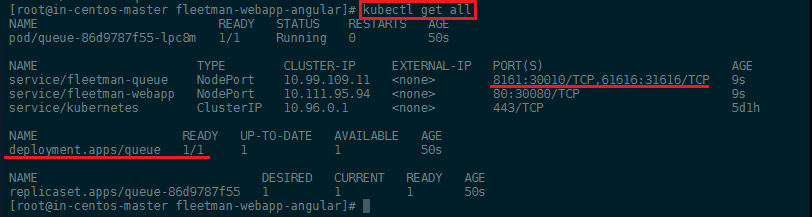

---


The Admin panel should now be accessible over the IP address of your Kubernetes master server with the port __30010__:


---

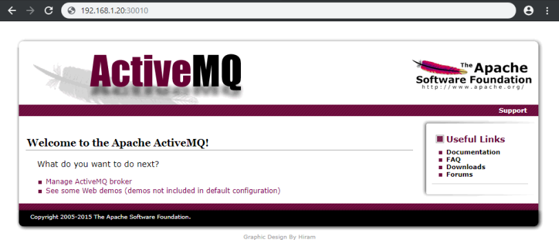

---


### Deploying the Position Simulator

We can now add the Position Simulator to the `workloads.yaml` file - directly under the configuration of our queue server, divided by `---`:


```yaml
---
apiVersion: apps/v1
kind: Deployment
metadata:
  # Unique key of the ReplicaSet instance
  name: position-simulator
spec:
  selector:
    matchLabels:
      app: position-simulator
  # only 1 Pod should exist atm - if it
  # crashes, a new pod will be spawned.
  replicas: 1
  template:
    metadata:
      labels:
        app: position-simulator
    spec:
      containers:
      - name: position-simulator
        image: richardchesterwood/k8s-fleetman-position-simulator:release1
        env:
        - name: SPRING_PROFILES_ACTIVE
          value: production-microservice
```


The configuration for deployment is similar to the ActiveMQ config. We only need to add a __Environment Variable__ that sets the service to _Production Settings_ - `SPRING_PROFILES_ACTIVE: production-microservice` (the service can be started with different profiles, depending if you are in a development or production environment).


We can apply the new workloads configuration, check for the name of the new container (it will be called `position-simulator` + an deployment ID + an replicationSet ID) and check if it is build correctly:


```bash
kubectl apply -f workloads.yaml
kubectl get all
kubectl describe pod position-simulator-68bfc8d6fb-8vxkt
```


---

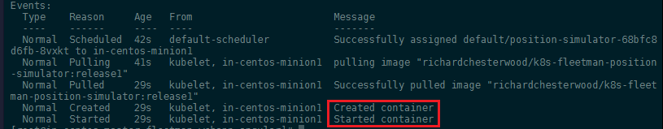

---


This service does not need to be accessed from outside of the Kubernetes cluster - so __we do not need to create a service__ for it.


We can test the deployment by accessing the IP Address followed by the port __30010__, click on _Managing ActiveMQ Broker_, sign in with __admin, admin__ and click on __Queues__:


---

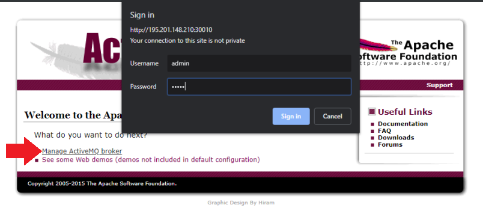

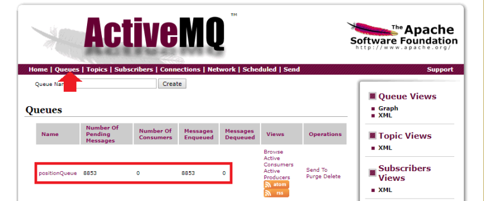

---


You should see a rising number of pending messages, telling you that our __Position Simulator__ is successfully sending GPS coordinates to the message broker.


### How to Debug a failed Deployment

As we have seen above the deployment work and the Position Simulator is up and running - but how would we debug a container that cannot be started for some reason? We can create this circumstance by adding a typo in the environment variable inside the config file we created above, e.g. `SPRING_PROFILES_ACTIVE: production-microservice-typo`:


```bash
kubectl apply -f workloads.yaml
kubectl get all
kubectl describe pod position-simulator-77dcb74d75-dt27n
```


---

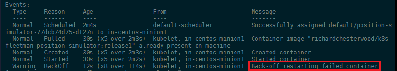

---


We can now see that the deployment is failing and Kubernetes is trying to restart the container in a loop (__CrashLoopBackOff__). To check what is going wrong, we can call the Kubernetes logs for the failing container:


```bash
kubectl logs position-simulator-77dcb74d75-dt27n
```


And the developer of the application should be able to spot the typo inside the selected profile for you:


---

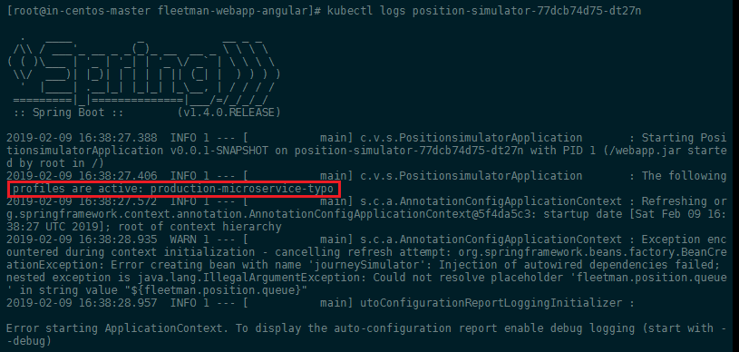

---


Fixing the _typo_ and re-applying the configuration should show you that the "loop-crashing" container is now being discarded and replaced by a working version:


```bash
kubectl apply -f workloads.yaml
kubectl get all
```


---

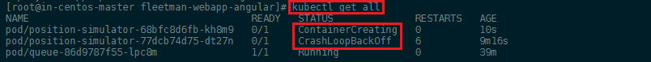

---


### Deploying the Position Tracker

Now we need to start up the position tracker who's job it is take out the message that are send by our position simulator and are currently piling up in our ActiveMQ Server. The position tracked does some calculation on those messages and exposes his results through an REST interface to the API gateway.


We can now add the __Position Tracker__ to the `workloads.yaml` file - directly under the configuration of our position simulator, divided by `---`:


```yaml
---
apiVersion: apps/v1
kind: Deployment
metadata:
  # Unique key of the ReplicaSet instance
  name: position-tracker
spec:
  selector:
    matchLabels:
      app: position-tracker
  # only 1 Pod should exist atm - if it
  # crashes, a new pod will be spawned.
  replicas: 1
  template:
    metadata:
      labels:
        app: position-tracker
    spec:
      containers:
      - name: position-tracker
        image: richardchesterwood/k8s-fleetman-position-tracker:release1
        env:
        - name: SPRING_PROFILES_ACTIVE
          value: production-microservice
```


We can now deploy the position tracker and then take a look at our message queue. We should be able to see that the tracker is working and messages are getting de-queued:


```bash
kubectl apply -f workloads.yaml
```


---

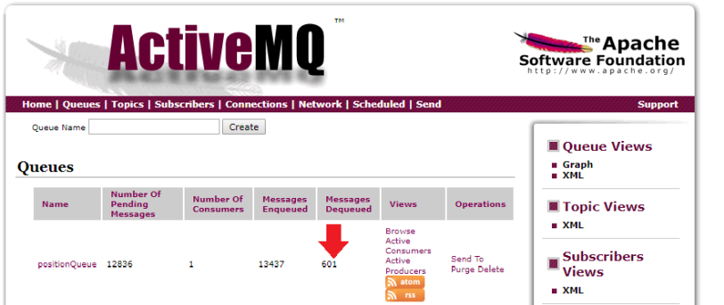

---


We can now add a service for the position tracker to expose the REST interface directly on port __8080__ (_optional - only for testing_). For this we need to add the following lines to our `services.yaml`:


```yaml
---
apiVersion: v1
kind: Service
metadata:
  # Unique key of the Service instance
  name: fleetman-position-tracker
spec:
  ports:
    - name: rest-interface
      port: 8080
      targetPort: 8080
      # The nodePort is available from outside of the
      # cluster when is set to NodePort. It's value has
      # to be > 30000
      nodePort: 30020
  selector:
    app: position-tracker
  # Setting the Service type to ClusterIP makes the
  # service only available from inside the cluster
  # To expose a port use NodePort instead
  type: NodePort
```


Now apply the changes `kubectl apply -f services.yaml` and open the REST interface on your Master server IP address with the port __30020__:


```bash
http://195.201.148.210:30020/vehicles/City%20Truck
```


You should be able to see the current location and speed of the vehicle with the designation __City Truck__:


---

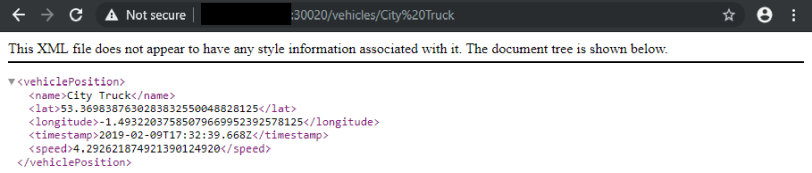

---


Since it would be dangerous to expose the REST API directly to the internet, we will remove the NodePort and have the API be available only from inside our cluster on port 8080:


```yaml
---
apiVersion: v1
kind: Service
metadata:
  # Unique key of the Service instance
  name: fleetman-position-tracker
spec:
  ports:
    - name: rest-interface
      port: 8080
      targetPort: 8080
  selector:
    app: position-tracker
  # Setting the Service type to ClusterIP makes the
  # service only available from inside the cluster
  # To expose a port use NodePort instead
  type: ClusterIP
```


### Deploying the API Gateway


We can now add the __API Gateway__ to the `workloads.yaml` file - directly under the configuration of our position tracker, divided by `---`:


```yaml
---
apiVersion: apps/v1
kind: Deployment
metadata:
  # Unique key of the ReplicaSet instance
  name: api-gateway
spec:
  selector:
    matchLabels:
      app: api-gateway
  # only 1 Pod should exist atm - if it
  # crashes, a new pod will be spawned.
  replicas: 1
  template:
    metadata:
      labels:
        app: api-gateway
    spec:
      containers:
      - name: api-gateway
        image: richardchesterwood/k8s-fleetman-api-gateway:release1
        env:
        - name: SPRING_PROFILES_ACTIVE
          value: production-microservice
```


We can now deploy the gateway with `kubectl apply -f workloads.yaml`. And then expose the port __8080__ to the Kubernetes cluster in `services.yaml`:


```yaml
---
apiVersion: v1
kind: Service
metadata:
  # Unique key of the Service instance
  name: fleetman-api-gateway
spec:
  ports:
    - name: rest-interface
      port: 8080
      targetPort: 8080
  selector:
    app: api-gateway
  # Setting the Service type to ClusterIP makes the
  # service only available from inside the cluster
  # To expose a port use NodePort instead
  type: ClusterIP
```


### Deploying the Angular Frontend


We can now add the __Web APP__ to the `workloads.yaml` file - directly under the configuration of our position tracker, divided by `---`:


```yaml
---
apiVersion: apps/v1
kind: Deployment
metadata:
  # Unique key of the ReplicaSet instance
  name: webapp
spec:
  selector:
    matchLabels:
      app: webapp
  # only 1 Pod should exist atm - if it
  # crashes, a new pod will be spawned.
  replicas: 1
  template:
    metadata:
      labels:
        app: webapp
    spec:
      containers:
      - name: webapp
        image: richardchesterwood/k8s-fleetman-webapp-angular:release1
        env:
        - name: SPRING_PROFILES_ACTIVE
          value: production-microservice
```


We can now deploy the frontend with `kubectl apply -f workloads.yaml`. And then expose the port __80__ to the Kubernetes cluster in `services.yaml`, as well as adding the public port (NodePort) __30080__:


```yaml
apiVersion: v1
kind: Service
metadata:
  # Unique key of the Service instance
  name: fleetman-webapp
spec:
  ports:
    # Accept traffic sent to port 80
    - name: http
      port: 80
      targetPort: 80
      # The nodePort is available from outside of the
      # cluster when is set to NodePort. It's value has
      # to be > 30000
      nodePort: 30080
  selector:
    # Define which pods are going to
    # be represented by this service
    # The service makes an network
    # endpoint for our app
    app: webapp
  # Setting the Service type to ClusterIP makes the
  # service only available from inside the cluster
  # To expose a port use NodePort instead
  type: NodePort
```


Your complete Microservice deployment should now look something like this:


---

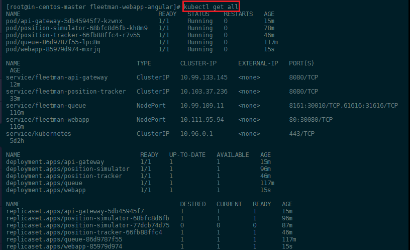

---


And you should be able to access the web interface on port __30080__ on your master server IP address:


---


---


## Persistence in a Kubernetes Cluster

In Docker all data that is generated inside a container is lost when you restart it. So if we, for example, want to store the geo location of our car fleet and calculate a travel path from it, all of that is gone, when the container restarts. Docker offers persistent in external volumes to prevent this from happening.


To add __vehicle tracking__ to our app, we need to update all of our images to the `:release2` in `workloads.yaml`:


```yaml
apiVersion: apps/v1
kind: Deployment
metadata:
  name: queue
spec:
  selector:
    matchLabels:
      app: queue
  replicas: 1
  template:
    metadata:
      labels:
        app: queue
    spec:
      containers:
      - name: queue
        image: richardchesterwood/k8s-fleetman-queue:release2

---
apiVersion: apps/v1
kind: Deployment
metadata:
  name: position-simulator
spec:
  selector:
    matchLabels:
      app: position-simulator
  replicas: 1
  template:
    metadata:
      labels:
        app: position-simulator
    spec:
      containers:
      - name: position-simulator
        image: richardchesterwood/k8s-fleetman-position-simulator:release2
        env:
        - name: SPRING_PROFILES_ACTIVE
          value: production-microservice


---
apiVersion: apps/v1
kind: Deployment
metadata:
  name: position-tracker
spec:
  selector:
    matchLabels:
      app: position-tracker
  replicas: 1
  template:
    metadata:
      labels:
        app: position-tracker
    spec:
      containers:
      - name: position-tracker
        image: richardchesterwood/k8s-fleetman-position-tracker:release2
        env:
        - name: SPRING_PROFILES_ACTIVE
          value: production-microservice


---
apiVersion: apps/v1
kind: Deployment
metadata:
  name: api-gateway
spec:
  selector:
    matchLabels:
      app: api-gateway
  replicas: 1
  template:
    metadata:
      labels:
        app: api-gateway
    spec:
      containers:
      - name: api-gateway
        image: richardchesterwood/k8s-fleetman-api-gateway:release2
        env:
        - name: SPRING_PROFILES_ACTIVE
          value: production-microservice
          
---
apiVersion: apps/v1
kind: Deployment
metadata:
  name: webapp
spec:
  selector:
    matchLabels:
      app: webapp
  replicas: 1
  template:
    metadata:
      labels:
        app: webapp
    spec:
      containers:
      - name: webapp
        image: richardchesterwood/k8s-fleetman-webapp-angular:release2
        env:
        - name: SPRING_PROFILES_ACTIVE
          value: production-microservice
```


Restarting everything with `kubectl apply -f workloads.yaml` now shows us the v2 interface on port __30080__. Clicking on a vehicle name in the list on the left will jump you to the selected truck and highlight the path that vehicle has taken:


---

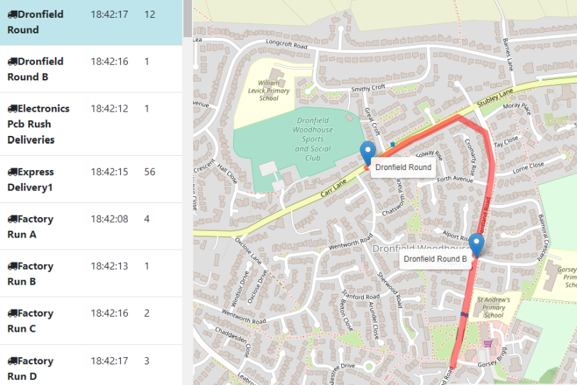

---


This data is stored in an internal data structure inside the __Position Tracker__ container and will be lost if you reload that container. You can get the webapp pod name and delete it:


```
kubectl get all
kubectl delete pod -f pod/position-tracker-684d9d84cb-st8pc
```


Your deployment will take care of restarting the webapp for you - if you reload the web interface you will see that the tracker data has been lost. To prevent this from happening, we now want to add a __MongoDB__ database to our cluster that stores the data tracker produces in a persistent way.


### MongoDB Pod

We have a new release of the app `:release3` that is build, expecting there to be a [MongoDB Database](https://hub.docker.com/_/mongo) (_3.6.10-stretch_) on our cluster to store the tracking data in. We can create a new Kubernetes deployment for this Docker images and we are going to configure it in a file called `mongo-stack.yaml`:


```yaml
apiVersion: apps/v1
kind: Deployment
metadata:
  name: mongodb
spec:
  selector:
    matchLabels:
      app: mongodb
  replicas: 1
  template:
    metadata:
      labels:
        app: mongodb
    spec:
      containers:
      - name: mongodb
        image: mongo:3.6.10-stretch
```


Now update only the __Position Tracker__ image in `workloads.yaml` to v3 (same as before, see above) and apply all changes to the cluster:


```
kubectl apply -f mongo-stack.yaml
kubectl apply -f workloads.yaml
kubectl get all
```


### MongoDB Service

To enable our tracker to use our new database we need to add a Kubernetes service and expose the MongoDB port to the Cluster. And we can define this services inside the `mongo-stack.yaml` file, right under the pod config:


```yaml
apiVersion: apps/v1
kind: Deployment
metadata:
  name: mongodb
spec:
  selector:
    matchLabels:
      app: mongodb
  replicas: 1
  template:
    metadata:
      labels:
        app: mongodb
    spec:
      containers:
      - name: mongodb
        image: mongo:3.6.10-stretch

---
apiVersion: v1
kind: Service
metadata:
  name: fleetman-mongodb
spec:
  ports:
    - name: mongo-default
      port: 27017
      targetPort: 27017
  selector:
    app: mongodb
  type: ClusterIP
```


It is critical to add the metadata name `fleetman-mongodb` as this is going to be the domain name that CoreDNS inside our cluster is using to resolve the pod IP address and our v3 __Production Tracker__ is [configured to search](https://github.com/DickChesterwood/k8s-fleetman/blob/release3/k8s-fleetman-position-tracker/src/main/resources/application-production-microservice.properties) for the MongoDB database on `mongodb.host=fleetman-mongodb.default.svc.cluster.local`!


Also make sure that the service __Selector__ is set to match the __matchLabels__ in the pod config above, as this is used to connect the service. Now re-apply the Mongo stack configuration to start up the service. If you repeat the experiment from earlier and delete the __Position Tracker__ the collected data will persist. 


```
kubectl apply -f mongo-stack.yaml
kubectl get all
kubectl delete pod -f pod/position-tracker-684d9d84cb-st8pc
```


### Volume Mounts

Right now the data is still stored on the filesystem of the MongoDB container. We need to configure the MongoDB container to persist the data outside of the container itself, on our Kubernetes node filesystem in a [Persistent Volume](https://kubernetes.io/docs/concepts/storage/persistent-volumes/) to make it survive a complete reload of our cluster.


To mount an external volume into the MongoDB container, we need to add a few lines to the pod configuration file. If you scroll to the bottom of the  DockerHub page ([Where to Store Data?](https://hub.docker.com/_/mongo)) you can see that the default data storage path inside the MongoDB container is `/data/db`. We now have to link this path inside the container (`mountPath`) to a volume on our host server (or an EBS volume on AWS). You can find all the options for the receiving volume in the [Kubernetes documentation](https://kubernetes.io/docs/reference/generated/kubernetes-api/v1.13/#volume-v1-core). We are going to use a [hostPath](https://kubernetes.io/docs/concepts/storage/volumes/#hostpath) with the type __DirectoryOrCreate__ - meaning that we don't have to go into the host and create the directory first (it will be created if not existing):


```yaml
apiVersion: apps/v1
kind: Deployment
metadata:
  name: mongodb
spec:
  selector:
    matchLabels:
      app: mongodb
  replicas: 1
  template:
    metadata:
      labels:
        app: mongodb
    spec:
      containers:
      - name: mongodb
        image: mongo:3.6.10-stretch
        volumeMounts:
          - name: mongo-persistent-storage
            mountPath: /data/db
      volumes:
        - name: mongo-persistent-storage      
          hostPath:
            # directory location on host
            path: /mnt/kubernetes/mongodb
            # DirectoryOrCreate, Directory, FileOrCreate, File, etc.
            type: DirectoryOrCreate
```


Apply those changes to your cluster and use the `describe` command to check if the mount was successful:


---

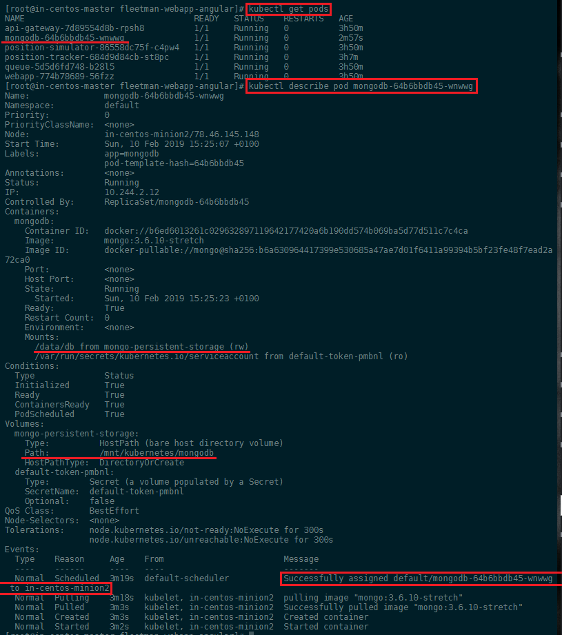

---


From the event log at the bottom we can see that the container was deployed to `in-centos-minion2` (alternatively use `kubectl get pods -o wide` to list the nodes your pods are hosted on) - a quick check confirms that the volume `/mnt/kubernetes/mongodb` was created and MongoDB started to use it:


---

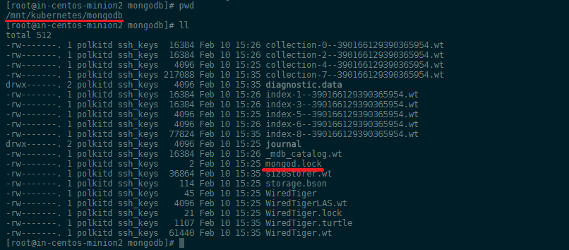

---


### Using PersistentVolumeClaims

A [persistentVolumeClaim](https://kubernetes.io/docs/concepts/storage/volumes/#persistentvolumeclaim) volume is used to mount a PersistentVolume into a Pod. PersistentVolumes are a way for users to “claim” durable storage (such as a GCE PersistentDisk or an iSCSI volume) without knowing the details of the particular cloud environment. This is just a minor change to our `mongo-stack.yaml` file:


```yaml
apiVersion: apps/v1
kind: Deployment
metadata:
  name: mongodb
spec:
  selector:
    matchLabels:
      app: mongodb
  replicas: 1
  template:
    metadata:
      labels:
        app: mongodb
    spec:
      containers:
      - name: mongodb
        image: mongo:3.6.10-stretch
        volumeMounts:
          - name: mongo-persistent-storage
            mountPath: /data/db
      volumes:
        - name: mongo-persistent-storage
          persistentVolumeClaim:
            claimName: mongo-pvc
```


The persistent volume is then configured in a separate configuration file we will call `storage.yaml` - this way, if we have to move our cluster to a new cloud provider we do not have to make any changes to the workload or service file:


```yaml
# What do want?
apiVersion: v1
kind: PersistentVolumeClaim
metadata:
  # has to match the name you used as claimName!
  name: mongo-pvc
spec:
  # linking the claim with the implementation below
  storageClassName: mylocalstorage
  accessModes:
    - ReadWriteOnce
  resources:
    requests:
      # Let Kubernetes find a node that offers at least the amount of storage
      storage: 1Gi

---
# How do we want it implemented
apiVersion: v1
kind: PersistentVolume
metadata:
  name: local-storage
spec:
  storageClassName: mylocalstorage
  capacity:
    # create a storage claim for this amount - e.g. create a EBS volume on AWS
    storage: 1Gi
  accessModes:
    - ReadWriteOnce
  hostPath:
    # directory location on host
    path: "/mnt/kubernetes/mongodb-tracking-data"
    # DirectoryOrCreate, Directory, FileOrCreate, File, etc.
    type: DirectoryOrCreate
```


The `PersistentVolumeClaim` and `PersistentVolume` are matched up by the `storageClassName`. The cloud administrator has to create persistent storages based on available hardware (or cloud storage partitions). The web developer then creates a claim for storage with a certain capacity - so Kubernetes can search for a fitting volume among the available.


We choose the `storageClassName: mylocalstorage` - in production this would be something more useful. E.g. your pods really need very fast storage - so you can set a claim for a __storageClassName__ that refers to high performance _SSD_ storage.


Noteworthy also is the [Access Mode](https://kubernetes.io/docs/concepts/storage/persistent-volumes/#access-modes) that can be:

* ReadWriteOnce – the volume can be mounted as read-write by a single node
* ReadOnlyMany – the volume can be mounted read-only by many nodes
* ReadWriteMany – the volume can be mounted as read-write by many nodes


In the CLI, the access modes are abbreviated to:

* RWO - ReadWriteOnce
* ROX - ReadOnlyMany
* RWX - ReadWriteMany


Once you done with the configuration, apply it and check if the pv (persistent volume) was created and bound to the MongoDB pod:


```bash
kubectl apply -f storage.yaml
kubectl apply -f mongo-stack.yaml
kubectl get pv
kubectl get pvc
```


---


---


## Cloud Deployment


kubectl expose deployment webapp --type=LoadBalancer --name=exposed-webapp


Examples:
  * Create a service for a replicated nginx, which serves on port 80 and connects to the containers on port 8000.
  kubectl expose rc nginx --port=80 --target-port=8000
  
  * Create a service for a replication controller identified by type and name specified in "nginx-controller.yaml",
which serves on port 80 and connects to the containers on port 8000.
  kubectl expose -f nginx-controller.yaml --port=80 --target-port=8000
  
  * Create a service for a pod valid-pod, which serves on port 444 with the name "frontend"
  kubectl expose pod valid-pod --port=444 --name=frontend
  
  * Create a second service based on the above service, exposing the container port 8443 as port 443 with the name
"nginx-https"
  kubectl expose service nginx --port=443 --target-port=8443 --name=nginx-https
  
  * Create a service for a replicated streaming application on port 4100 balancing UDP traffic and named 'video-stream'.
  kubectl expose rc streamer --port=4100 --protocol=udp --name=video-stream
  
  * Create a service for a replicated nginx using replica set, which serves on port 80 and connects to the containers on
port 8000.
  kubectl expose rs nginx --port=80 --target-port=8000
  
  * Create a service for an nginx deployment, which serves on port 80 and connects to the containers on port 8000.
  kubectl expose deployment nginx --port=80 --target-port=8000


