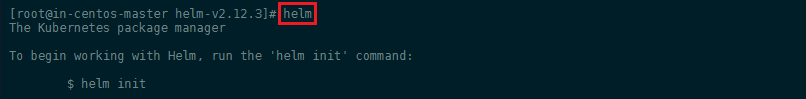
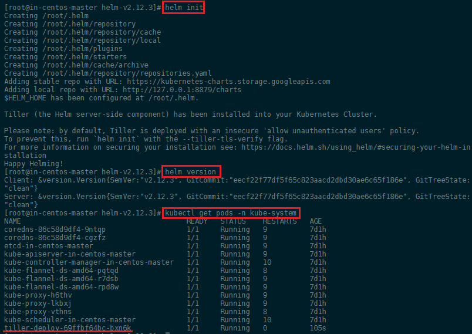
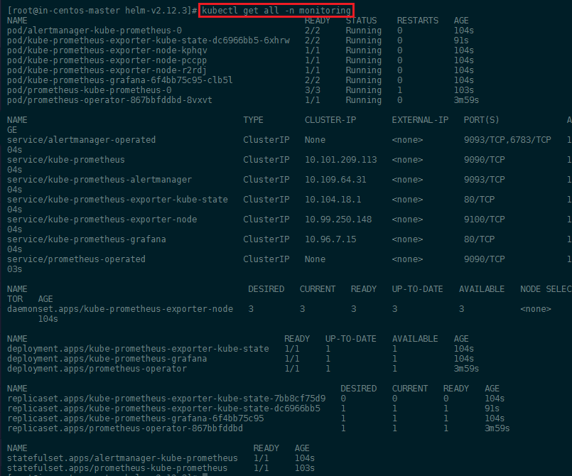
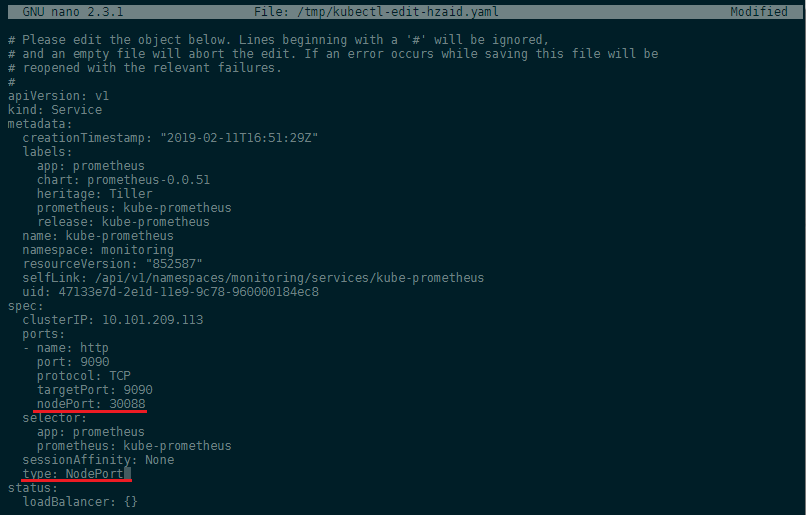
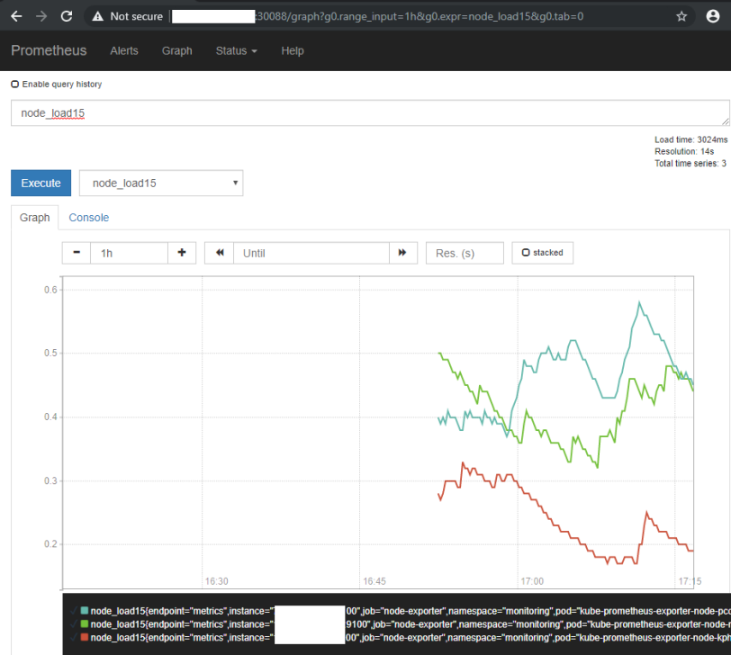
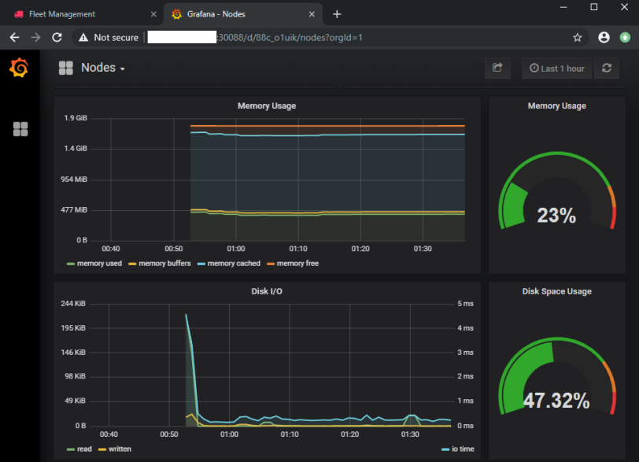
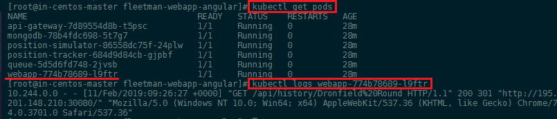
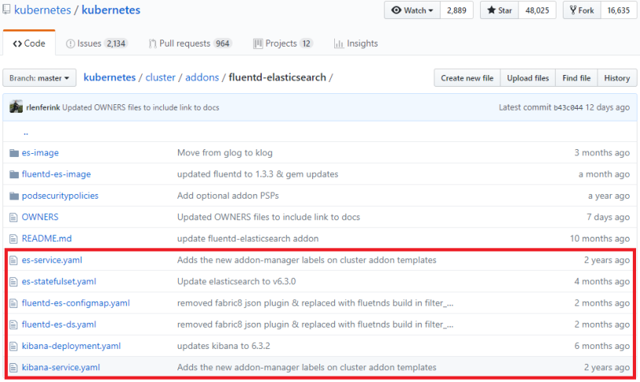
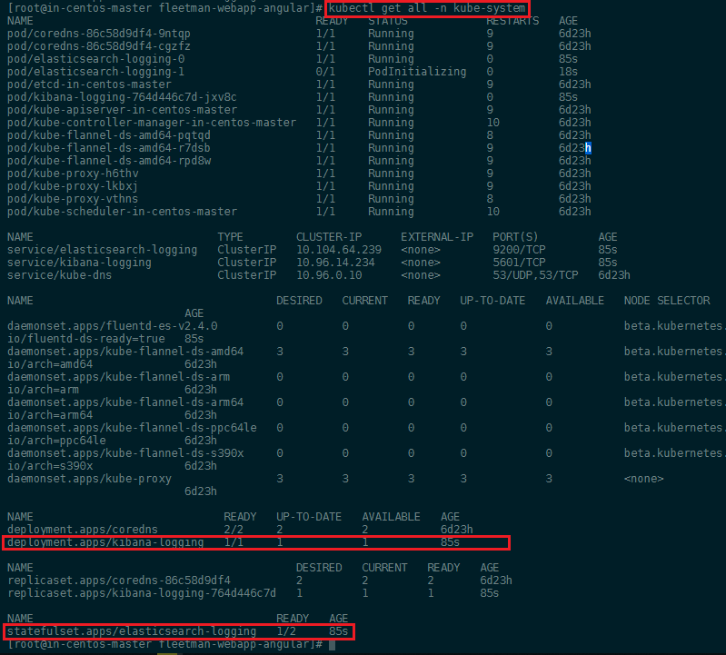

<!-- TOC -->

- [Prometheus and Grafana](#prometheus-and-grafana)
  - [Helm Installation](#helm-installation)
  - [Prometheus Installation](#prometheus-installation)
- [The ELK Stack](#the-elk-stack)
  - [Installation](#installation)

<!-- /TOC -->


## Prometheus and Grafana


[Prometheus](https://prometheus.io) is an open-source monitoring solution that can be used with the visualization frontend [Grafana](https://grafana.com) to display your clusters health status. To install them we are going to use the [Helm Package Manager](https://helm.sh) for Kubernetes.


### Helm Installation

Helm helps you manage Kubernetes applications — Helm Charts helps you define, install, and upgrade even the most complex Kubernetes application. Charts are easy to create, version, share, and publish — so start using Helm and stop the copy-and-paste.


To install Helm, head over to their [Github Page](https://github.com/helm/helm/) and grab the link to the install binaries - in my case the latest version is [Helm v2.12.3](https://github.com/helm/helm/releases/tag/v2.12.3). Use this link to download the binaries to your Centos server:


```bash
wget https://storage.googleapis.com/kubernetes-helm/helm-v2.12.3-linux-amd64.tar.gz
tar zxvf helm-v2.12.3-linux-amd64.tar.gz
```

The unzipped folder contains a file called __helm__ that needs to be copied to `cp helm /usr/local/bin/`. You can type `helm` to verify that it is working:


---



---


We can now type `helm init` to add the __Tiller Pod__ to our cluster. You can verify that Helm is connected by running `helm version` (it should show your Helm client as well as Kubernetes version) and `kubectl get pods -n kube-system`:


---



---


Before we can install package, first run a `helm repo update` to make sure that you are up to date. And to allow Helm/Tiller to install packages to the default namespace in Kubernetes, we first have to run these three commands (__optional__ - the installation below will create a custom namespace _monitoring_ that is not going to cause any issues):


```bash
kubectl create serviceaccount --namespace kube-system tiller
kubectl create clusterrolebinding tiller-cluster-rule --clusterrole=cluster-admin --serviceaccount=kube-system:tiller
kubectl patch deploy --namespace kube-system tiller-deploy -p '{"spec":{"template":{"spec":{"serviceAccount":"tiller"}}}}' 
```


### Prometheus Installation

To install Prometheus we are going to use a repository by CoreOS called [Prometheus Operator](https://github.com/helm/charts/tree/master/stable/prometheus-operator) that provides easy monitoring definitions for Kubernetes services and deployment and management of Prometheus instances.


<!--
__Deprecation Warning__ Check [stable/prometheus-operator](https://github.com/helm/charts/tree/master/stable/prometheus-operator)!

To install it with Helm we need [those 3 commands](https://github.com/coreos/prometheus-operator/tree/master/helm)


```bash
helm repo add coreos https://s3-eu-west-1.amazonaws.com/coreos-charts/stable/
helm install coreos/prometheus-operator --name prometheus-operator --namespace monitoring
helm install coreos/kube-prometheus --name kube-prometheus --namespace monitoring
```

> If you need to uninstall those packages later, you need to use the __purge__ flag: `helm delete --purge  prometheus-operator` and `helm delete --purge  kube-prometheus`
-->


To install the chart with the release name `test-release`:


```bash
helm install --name test-release stable/prometheus-operator --namespace monitoring
```
helm install coreos/grafana --name my-release --set adminUser=bob

The command deploys prometheus-operator on the Kubernetes cluster in the default configuration. The [configuration section](https://github.com/helm/charts/tree/master/stable/prometheus-operator#configuration) lists the parameters that can be configured during installation.

The default installation includes Prometheus Operator, Alertmanager, Grafana, and configuration for scraping Kubernetes infrastructure.


To uninstall/delete the prometheus-operator deployment:


```bash
helm delete --purge test-release
kubectl delete crd prometheuses.monitoring.coreos.com
kubectl delete crd prometheusrules.monitoring.coreos.com
kubectl delete crd servicemonitors.monitoring.coreos.com
kubectl delete crd alertmanagers.monitoring.coreos.com
```


You can verify the successful installation with `kubectl get all -n monitoring`:


---



---


We can also verify that the Prometheus web interface is working - but as you can see above, the service `kube-prometheus` only has an internal port set (__ClusterIP__). We can edit this default configuration with:


```bash
kubectl edit svc kube-prometheus -n monitoring
```


This, by default will open the service configuration in Vim - you can install __Nano__ and run `export EDITOR=nano` to prevent that from happening to you.


---



---


We added a `nodePort: 30088` and set the type from __ClusterIP__ to __NodePort__ to expose the port for us. Saving the file will automatically verify your edit and re-apply the service configuration, if no error was found. You can access the web interface now by typing in your Master Server IP address followed by the port __30088__:


---



---


But we are going to use Grafana as it offers a lot more as a frontend for Prometheus - I am going to revert the changes I made to service file to close the port __30088__ again and let's use it for the Grafana service instead:


```bash
kubectl edit svc kube-prometheus-grafana -n monitoring
```


And you should now be greeted by the beautiful Grafana user interface:


---



---


## The ELK Stack

We build a Kubernetes cluster with a couple of micro services in the previous step and saw that we can get access to Kubernetes logs for each pod by first finding out it's name and then using the `logs` command:


```bash
kubectl get pods
kubectl logs webapp-774b78689-l9ftr
```


---



---


But it is really cumbersome to do when you have a large number of pods running. Also some information might be logged inside the container itself and are ephemeral in nature.


The most common solution for a distributed logging system is the [ElasticStack](https://www.elastic.co) - also called the ELK stack as it is traditionally build on three blocks:


* [Elasticsearch](https://hub.docker.com/_/elasticsearch)
* [Logstash](https://hub.docker.com/_/logstash)
* [Kibana](https://hub.docker.com/_/kibana)


We are going to switch Logstash with [Fluentd](https://www.fluentd.org). __Fluentd__ is an open source data collector, which lets you unify the data collection and consumption for a better use and understanding of data. We are going to use it to connect to our pods, find active logs and collect them and offers a JSON structured downstream that we are going to feed into the Elasticsearch database. FluentD will have to be __installed on every node__ inside our cluster - this is done by configuring it as a [DaemonSet](https://kubernetes.io/docs/concepts/workloads/controllers/daemonset/) instead of a _ReplicaSet_.


__Elasticsearch__ is a distributed, RESTful search and analytics engine and will be used to store the data collected by FluentD in a NoSQL fashion. The distributed nature of Elasticsearch allows us to easily combine one or more instances of the database into a cluster. It is recommended to have __at least 2 instances__ running to ensure fail-over security. The Elasticsearch pod will also be created in a special kind of _ReplicaSet_ called a [StatefulSet](https://kubernetes.io/docs/concepts/workloads/controllers/statefulset/). This ensures that the pods will not be assigned random names, but will always be called by their assigned pod name (__elasticsearch-logging__) followed by an incremental number `-0`, `-1`, etc - this is needed for pods that need to be clustered.


And last we have the __Kibana__ frontend that lets you visualize the Elasticsearch data. So that hopefully we can extract some useful information from it - without having to sift through Gigabytes of hard to read Kubernetes logs. The frontend will only be used when we log in to check our logs. It is therefore sufficient to __only run 1 instance__ as it is not a critical infrastructure.


### Installation

We are going to use a ready-2-go image from Kubernetes to [install FluentD, Kibana and Elasticsearch](https://github.com/kubernetes/kubernetes/tree/master/cluster/addons/fluentd-elasticsearch). This repository contains both the YAML config files for Kubernetes as well as the information for build the required images for the three components. We only need to download the YAML files and download them to the directory where you stored the cluster configuration. When you downloaded all 6 files apply all of them to your cluster:


---



---


```bash
kubectl apply -f .
kubectl get all -n kube-system
```


---



---


__TBC__


https://github.com/helm/charts/tree/master/stable/elastic-stack

https://github.com/kiwigrid/helm-charts/tree/master/charts/fluentd-elasticsearch


