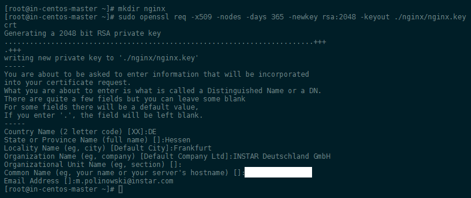
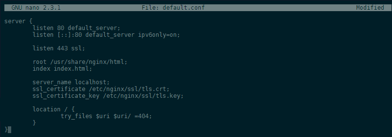
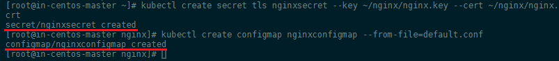
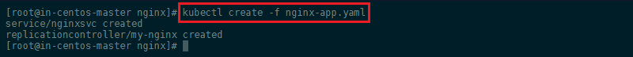
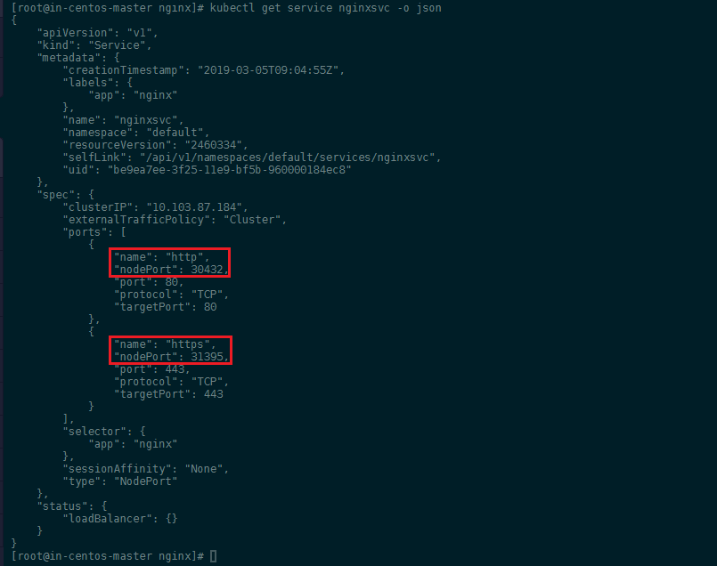
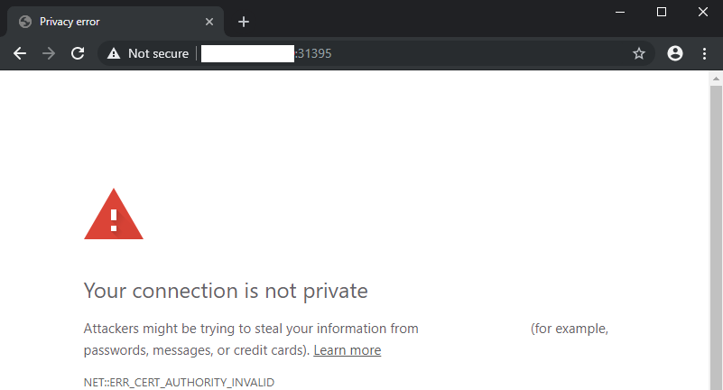
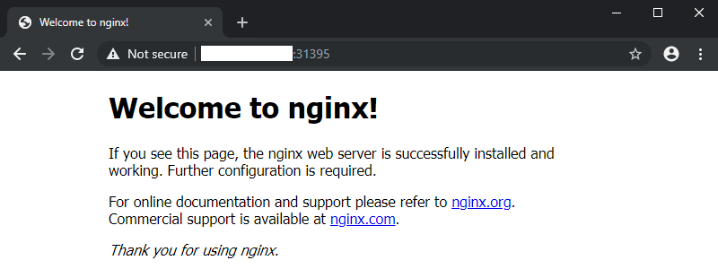
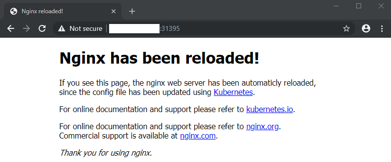

<!-- TOC -->

- [Generate Certificates and NGINX Configuration](#generate-certificates-and-nginx-configuration)
- [Create a https NGINX Application running in a Kubernetes Cluster](#create-a-https-nginx-application-running-in-a-kubernetes-cluster)

<!-- /TOC -->

__Tutorial based on the official [Kubernetes Staging Examples](https://github.com/mpolinowski/examples/tree/master/staging/https-nginx)__

Create a nginx web proxy as end-to-end https service in kubernetes. It uses an nginx server block to serve the index page over both http and https. It will detect changes to nginx's configuration file, default.conf, mounted as a configmap volume and reload nginx automatically.


## Generate Certificates and NGINX Configuration

First generate a self signed rsa key and certificate that the server can use for TLS:


```bash
mkdir ./nginx
sudo openssl req -x509 -nodes -days 365 -newkey rsa:2048 -keyout ./nginx/nginx.key -out ./nginx/nginx.crt
```

Fill out the certificate form - you can use your servers domain name, it's WAN IP or local IP address as __Common Name__. This will be the address that the certificate is valid for.





Then create your NGINX server configuration file - we are going to use this default file:

```js
server {
    listen 80 default_server;
    listen [::]:80 default_server ipv6only=on;

    listen 443 ssl;

    root /usr/share/nginx/html;
    index index.html;

    server_name localhost;
    ssl_certificate /etc/nginx/ssl/tls.crt;
    ssl_certificate_key /etc/nginx/ssl/tls.key;

    location / {
            try_files $uri $uri/ =404;
    }
}
```





## Create a https NGINX Application running in a Kubernetes Cluster

The first thing we’ll do is define our endpoint by creating a ConfigMap that stores our Nginx configuration as well as creating a secret from the SSL certs we just created:


```bash
kubectl create secret tls nginxsecret --key ~/nginx/nginx.key --cert ~/nginx/nginx.crt
kubectl create configmap nginxconfigmap --from-file=default.conf
```





Create a Dockerfile for the NGINX container:


```Dockerfile
FROM nginx


COPY index2.html /usr/share/nginx/html/index2.html
RUN chmod +r /usr/share/nginx/html/index2.html
COPY auto-reload-nginx.sh /home/auto-reload-nginx.sh
RUN chmod +x /home/auto-reload-nginx.sh

# install inotify
RUN apt-get update && apt-get install -y inotify-tools
```


This file relies on __two supporting files__:

1. The HTML page that we want to host:


```html
<!DOCTYPE html>
<html>
<head>
<title>Nginx reloaded!</title>
<style>
    body {
        width: 35em;
        margin: 0 auto;
        font-family: Tahoma, Verdana, Arial, sans-serif;
    }
</style>
</head>
<body>
<h1>Nginx has been reloaded!</h1>
<p>If you see this page, the nginx web server has been automatically reloaded, since the config file has been updated using <a href="https://github.com/kubernetes/kubernetes">Kubernetes</a>.</p>


<p>For online documentation and support please refer to
<a href="http://kubernetes.io/">kubernetes.io</a>.<br/></p>

<p>For online documentation and support please refer to
<a href="http://nginx.org/">nginx.org</a>.<br/>
Commercial support is available at
<a href="http://nginx.com/">nginx.com</a>.</p>

<p><em>Thank you for using nginx.</em></p>
</body>
</html>
```


2. And the [shell script](https://github.com/mpolinowski/examples/blob/master/staging/https-nginx/auto-reload-nginx.sh) that we need to automatically reload NGINX whenever the configuration file is changed:


```js
nginx "$@"
oldcksum=`cksum /etc/nginx/conf.d/default.conf`

inotifywait -e modify,move,create,delete -mr --timefmt '%d/%m/%y %H:%M' --format '%T' \
/etc/nginx/conf.d/ | while read date time; do

	newcksum=`cksum /etc/nginx/conf.d/default.conf`
	if [ "$newcksum" != "$oldcksum" ]; then
		echo "At ${time} on ${date}, config file update detected."
		oldcksum=$newcksum
		nginx -s reload
	fi

done
```


Then create a __Service__ and a __Replication Controller__ using the configuration in `nginx-app.yaml`:


```yaml
apiVersion: v1
kind: Service
metadata:
  name: nginx
  labels:
    app: nginx
spec:
  type: NodePort
  ports:
  - port: 80
    protocol: TCP
    name: http
  - port: 443
    protocol: TCP
    name: https
  selector:
    app: nginx


---
apiVersion: v1
kind: ReplicationController
metadata:
  name: nginx
spec:
  replicas: 1
  template:
    metadata:
      labels:
        app: nginx
    spec:
      volumes:
      - name: secret-volume
        secret:
          secretName: nginxsecret
      - name: configmap-volume
        configMap:
          name: nginxconfigmap
      containers:
      - name: nginxhttps
        image: ymqytw/nginxhttps:1.5
        command: ["/home/auto-reload-nginx.sh"]
        ports:
        - containerPort: 443
        - containerPort: 80
        livenessProbe:
          httpGet:
            path: /index.html
            port: 80
          initialDelaySeconds: 30
          timeoutSeconds: 1
        volumeMounts:
        - mountPath: /etc/nginx/ssl
          name: secret-volume
        - mountPath: /etc/nginx/conf.d
          name: configmap-volume
```


By running the following Kubernetes command:





```bash
kubectl create -f nginx-app.yaml
```


Then, find the node port that Kubernetes is using for http and https traffic.


```bash
kubectl get service nginxsvc -o json
```





You can test that the service is up and running by accessing your external cluster IP address followed by the port from above:





If everything worked, you will see the default NGINX start page after accepting the self-signed certificate above:





Then we will update the configmap by changing `index.html` to `index2.html`:


```bash
kubectl create configmap nginxconfigmap --from-file=default.conf -o yaml --dry-run\
| sed 's/index.html/index2.html/g' | kubectl apply -f -
```

Wait a few seconds to let the change propagate and verify that Nginx has been reloaded with new configuration.


