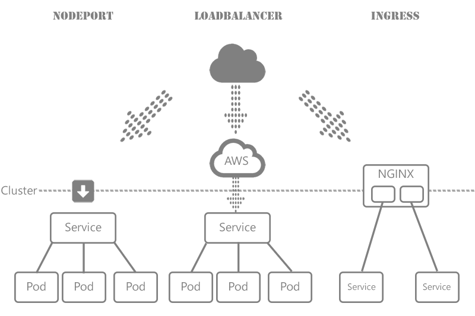
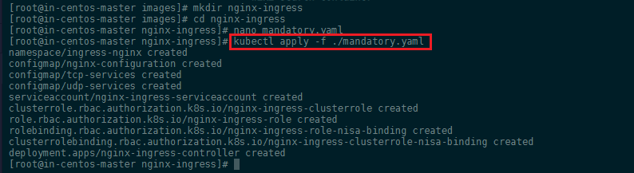
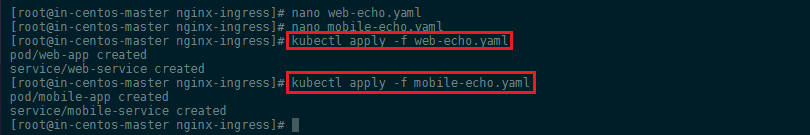
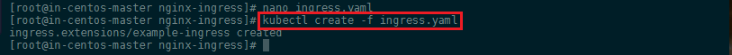
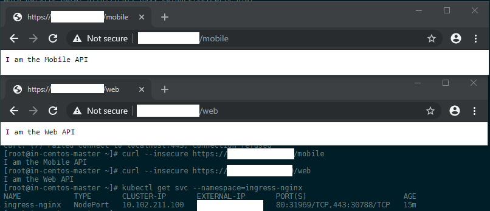

<!-- TOC -->

- [How to Use Nginx Ingress Controller](#how-to-use-nginx-ingress-controller)
  - [Creating the resources for Nginx Ingress](#creating-the-resources-for-nginx-ingress)
  - [Creating the Load Balancing Service](#creating-the-load-balancing-service)
  - [Create two Web Apps to Respond to the incoming Traffic](#create-two-web-apps-to-respond-to-the-incoming-traffic)
  - [Creating the Ingress](#creating-the-ingress)

<!-- /TOC -->


An [Ingress](https://kubernetes.github.io/ingress-nginx/deploy/#generic-deployment) is an application that allows you to access your Kubernetes services from outside the Kubernetes cluster. This lets you consolidate your routing rules into a single resource, e.g.:

* mydomain.com/api/web/ leads to an api service for your web application
* mydomain.com/api/mobile/ leads to an api-v2 service for the mobile access
  
The __Ingress__ enables you make your services available __without__ having to use [LoadBalancers](https://kubernetes.io/docs/tasks/access-application-cluster/create-external-load-balancer/) (only available on Cloud solutions like AWS, GCE, Azure...) or exposing each service on the Node ([NodePort](https://kubernetes.io/docs/concepts/services-networking/service/#nodeport)). Making this the ideal solution for an on-premise hosting of an Kubernetes Cluster.





## How to Use Nginx Ingress Controller


### Creating the resources for Nginx Ingress


```bash
kubectl apply -f https://raw.githubusercontent.com/kubernetes/ingress-nginx/master/deploy/mandatory.yaml
```


Or create the __mandatory.yaml__ file locally and create the prerequisites with `kubectl apply -f mandatory.yaml`:


```yaml
apiVersion: v1
kind: Namespace
metadata:
  name: ingress-nginx
  labels:
    app.kubernetes.io/name: ingress-nginx
    app.kubernetes.io/part-of: ingress-nginx

---

kind: ConfigMap
apiVersion: v1
metadata:
  name: nginx-configuration
  namespace: ingress-nginx
  labels:
    app.kubernetes.io/name: ingress-nginx
    app.kubernetes.io/part-of: ingress-nginx

---
kind: ConfigMap
apiVersion: v1
metadata:
  name: tcp-services
  namespace: ingress-nginx
  labels:
    app.kubernetes.io/name: ingress-nginx
    app.kubernetes.io/part-of: ingress-nginx

---
kind: ConfigMap
apiVersion: v1
metadata:
  name: udp-services
  namespace: ingress-nginx
  labels:
    app.kubernetes.io/name: ingress-nginx
    app.kubernetes.io/part-of: ingress-nginx

---
apiVersion: v1
kind: ServiceAccount
metadata:
  name: nginx-ingress-serviceaccount
  namespace: ingress-nginx
  labels:
    app.kubernetes.io/name: ingress-nginx
    app.kubernetes.io/part-of: ingress-nginx

---
apiVersion: rbac.authorization.k8s.io/v1beta1
kind: ClusterRole
metadata:
  name: nginx-ingress-clusterrole
  labels:
    app.kubernetes.io/name: ingress-nginx
    app.kubernetes.io/part-of: ingress-nginx
rules:
  - apiGroups:
      - ""
    resources:
      - configmaps
      - endpoints
      - nodes
      - pods
      - secrets
    verbs:
      - list
      - watch
  - apiGroups:
      - ""
    resources:
      - nodes
    verbs:
      - get
  - apiGroups:
      - ""
    resources:
      - services
    verbs:
      - get
      - list
      - watch
  - apiGroups:
      - "extensions"
    resources:
      - ingresses
    verbs:
      - get
      - list
      - watch
  - apiGroups:
      - ""
    resources:
      - events
    verbs:
      - create
      - patch
  - apiGroups:
      - "extensions"
    resources:
      - ingresses/status
    verbs:
      - update

---
apiVersion: rbac.authorization.k8s.io/v1beta1
kind: Role
metadata:
  name: nginx-ingress-role
  namespace: ingress-nginx
  labels:
    app.kubernetes.io/name: ingress-nginx
    app.kubernetes.io/part-of: ingress-nginx
rules:
  - apiGroups:
      - ""
    resources:
      - configmaps
      - pods
      - secrets
      - namespaces
    verbs:
      - get
  - apiGroups:
      - ""
    resources:
      - configmaps
    resourceNames:
      # Defaults to "<election-id>-<ingress-class>"
      # Here: "<ingress-controller-leader>-<nginx>"
      # This has to be adapted if you change either parameter
      # when launching the nginx-ingress-controller.
      - "ingress-controller-leader-nginx"
    verbs:
      - get
      - update
  - apiGroups:
      - ""
    resources:
      - configmaps
    verbs:
      - create
  - apiGroups:
      - ""
    resources:
      - endpoints
    verbs:
      - get

---
apiVersion: rbac.authorization.k8s.io/v1beta1
kind: RoleBinding
metadata:
  name: nginx-ingress-role-nisa-binding
  namespace: ingress-nginx
  labels:
    app.kubernetes.io/name: ingress-nginx
    app.kubernetes.io/part-of: ingress-nginx
roleRef:
  apiGroup: rbac.authorization.k8s.io
  kind: Role
  name: nginx-ingress-role
subjects:
  - kind: ServiceAccount
    name: nginx-ingress-serviceaccount
    namespace: ingress-nginx

---
apiVersion: rbac.authorization.k8s.io/v1beta1
kind: ClusterRoleBinding
metadata:
  name: nginx-ingress-clusterrole-nisa-binding
  labels:
    app.kubernetes.io/name: ingress-nginx
    app.kubernetes.io/part-of: ingress-nginx
roleRef:
  apiGroup: rbac.authorization.k8s.io
  kind: ClusterRole
  name: nginx-ingress-clusterrole
subjects:
  - kind: ServiceAccount
    name: nginx-ingress-serviceaccount
    namespace: ingress-nginx

---

apiVersion: apps/v1
kind: Deployment
metadata:
  name: nginx-ingress-controller
  namespace: ingress-nginx
  labels:
    app.kubernetes.io/name: ingress-nginx
    app.kubernetes.io/part-of: ingress-nginx
spec:
  replicas: 1
  selector:
    matchLabels:
      app.kubernetes.io/name: ingress-nginx
      app.kubernetes.io/part-of: ingress-nginx
  template:
    metadata:
      labels:
        app.kubernetes.io/name: ingress-nginx
        app.kubernetes.io/part-of: ingress-nginx
      annotations:
        prometheus.io/port: "10254"
        prometheus.io/scrape: "true"
    spec:
      serviceAccountName: nginx-ingress-serviceaccount
      containers:
        - name: nginx-ingress-controller
          image: quay.io/kubernetes-ingress-controller/nginx-ingress-controller:0.23.0
          args:
            - /nginx-ingress-controller
            - --configmap=$(POD_NAMESPACE)/nginx-configuration
            - --tcp-services-configmap=$(POD_NAMESPACE)/tcp-services
            - --udp-services-configmap=$(POD_NAMESPACE)/udp-services
            - --publish-service=$(POD_NAMESPACE)/ingress-nginx
            - --annotations-prefix=nginx.ingress.kubernetes.io
          securityContext:
            allowPrivilegeEscalation: true
            capabilities:
              drop:
                - ALL
              add:
                - NET_BIND_SERVICE
            # www-data -> 33
            runAsUser: 33
          env:
            - name: POD_NAME
              valueFrom:
                fieldRef:
                  fieldPath: metadata.name
            - name: POD_NAMESPACE
              valueFrom:
                fieldRef:
                  fieldPath: metadata.namespace
          ports:
            - name: http
              containerPort: 80
            - name: https
              containerPort: 443
          livenessProbe:
            failureThreshold: 3
            httpGet:
              path: /healthz
              port: 10254
              scheme: HTTP
            initialDelaySeconds: 10
            periodSeconds: 10
            successThreshold: 1
            timeoutSeconds: 10
          readinessProbe:
            failureThreshold: 3
            httpGet:
              path: /healthz
              port: 10254
              scheme: HTTP
            periodSeconds: 10
            successThreshold: 1
            timeoutSeconds: 10

---
```





### Creating the Load Balancing Service


```bash
https://raw.githubusercontent.com/kubernetes/ingress-nginx/master/deploy/provider/baremetal/service-nodeport.yaml
```

Or again, create the __nodeport-ingress-service.yaml__ file locally and create the Ingress service with `kubectl apply -f nodeport-ingress-service.yaml`:


```yaml
apiVersion: v1
kind: Service
metadata:
  name: ingress-nginx
  namespace: ingress-nginx
  labels:
    app.kubernetes.io/name: ingress-nginx
    app.kubernetes.io/part-of: ingress-nginx
spec:
  type: NodePort
  ports:
    - name: http
      port: 80
      targetPort: 80
      protocol: TCP
    - name: https
      port: 443
      targetPort: 443
      protocol: TCP
  selector:
    app.kubernetes.io/name: ingress-nginx
    app.kubernetes.io/part-of: ingress-nginx
  externalIPs:
    - <add the IP address of your Kubernetes Master here>
---
```

> I am using the Kubernetes cluster on an on-premise cloud service that does not provide a LoadBalancer. The [Bare-Metal](https://kubernetes.github.io/ingress-nginx/deploy/baremetal/) solution is something I am working towards, but did implement yet. So this is an old-school DIY cluster and for some reasons the [official documentation](https://kubernetes.github.io/ingress-nginx/deploy/#docker-for-mac) lead me to a situation where I did not get an IP address on my Ingress service. [The solution](https://qiita.com/soumi/items/c6358e5e859004c2961c) that I found was to add my external IP (this is the WAN IP of my Kubernetes Master - e.g. `externalIPs: 172.56.4.112` - if you install another server in-front of your cluster on the local area network, you should also be able to use the LAN address of your Master here instead - avoiding exposing your cluster directly to the internet) to the service configuration above. Afterwards I was able to access the apps behind this service through this IP address - see below.


This has set up the Nginx Ingress Controller - you can check that it is running with the following command:


```bash
kubectl get pods --namespace ingress-nginx
```


### Create two Web Apps to Respond to the incoming Traffic

Now, we can create Ingress resources in our Kubernetes cluster and route external requests to our services. For this we need two services that represent the Ingress routes for our requests. To test this, we can use two web applications that just echo a string, when they receive an HTTP GET command:

__web-echo.yaml__


```yaml
kind: Pod
apiVersion: v1
metadata:
  name: web-app
  labels:
    app: web
spec:
  containers:
    - name: web-app
      image: hashicorp/http-echo
      args:
        - "-text=I am the Web API"

---

kind: Service
apiVersion: v1
metadata:
  name: web-service
spec:
  selector:
    app: web
  ports:
    - port: 5678
```


__mobile-echo.yaml__


```yaml
kind: Pod
apiVersion: v1
metadata:
  name: mobile-app
  labels:
    app: mobile
spec:
  containers:
    - name: mobile-app
      image: hashicorp/http-echo
      args:
        - "-text=I am the Mobile API"

---

kind: Service
apiVersion: v1
metadata:
  name: mobile-service
spec:
  selector:
    app: mobile
  ports:
    - port: 5678
```

Create those two YAML files and create those apps in Kubernetes:


```bash
kubectl apply -f web-echo.yaml
kubectl apply -f mobile-echo.yaml
```





### Creating the Ingress

Now we need to declare an Ingress to route requests to `/web` to the first service, and requests to `/mobile` to second:

__nginx-ingress.yaml__

```yaml
apiVersion: extensions/v1beta1
kind: Ingress
metadata:
  name: nginx-ingress
  annotations:
    ingress.kubernetes.io/rewrite-target: /
spec:
  rules:
  - http:
      paths:
        - path: /web
          backend:
            serviceName: web-service
            servicePort: 5678
        - path: /mobile
          backend:
            serviceName: mobile-service
            servicePort: 5678
```

Create the Ingress using the Kubernetes command:


```bash
kubectl create -f nginx-ingress.yaml
```





You should now be able to see that the service was created with `kubectl get svc --namespace=ingress-nginx` and access your two apps via the WAN IP of your Kubernetes Master (see remark above about the `externalIP`):


