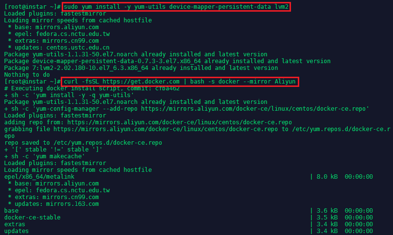
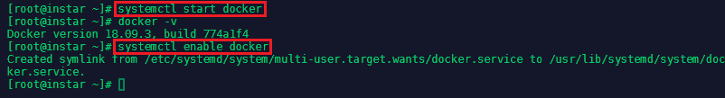
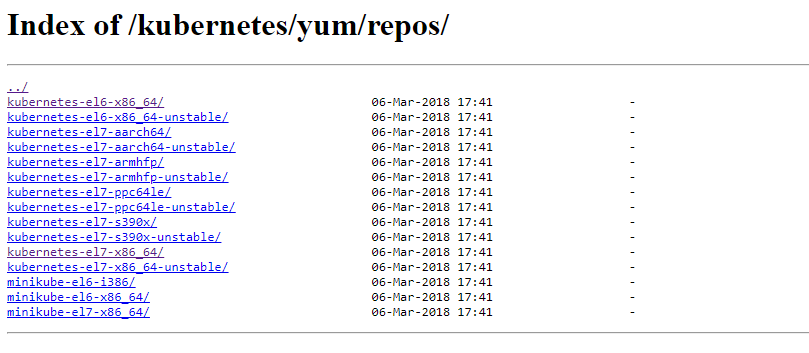
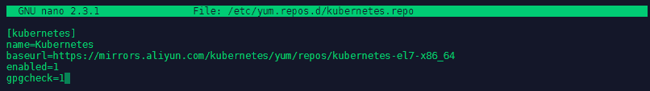
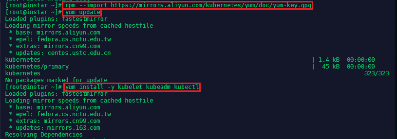
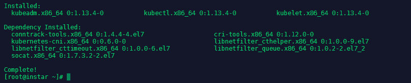

<!-- TOC -->

- [Prerequisites](#prerequisites)
- [Installing Docker](#installing-docker)
- [Installing Kubernetes](#installing-kubernetes)

<!-- /TOC -->


When trying to run a Kubernetes cluster in China you quickly realize that 404s will take away the fun from it. This tutorial is based on a [Github repository](https://github.com/mpolinowski/kubernetes-for-china) but re-written to cater for CentOS servers.


## Prerequisites

Install required packages. yum-utils provides the yum-config-manager utility, and device-mapper-persistent-data and lvm2 are required by the device mapper storage driver:


```bash
sudo yum install -y yum-utils device-mapper-persistent-data lvm2
swapoff -a
setenforce 0
```

Edit the following file to disable `nano /etc/sysconfig/selinux` SELinux - `SELINUX=disabled`.


And for __iptables__ create the following file `nano /etc/sysctl.d/k8s.conf` with the content below:

```bash
net.bridge.bridge-nf-call-ip6tables = 1

net.bridge.bridge-nf-call-iptables = 1
```

And apply those changes with the following command `sysctl --system`.


## Installing Docker

Now we can [install DockerCE](https://docs.docker.com/install/linux/docker-ce/centos/) using the Aliyun cloud mirror.


```bash
curl -fsSL https://get.docker.com | bash -s docker --mirror Aliyun
```





Now you can start and enable the Docker service, to have it automatically run in the background when you start your server:


```bash
systemctl start docker
systemctl enable docker
```





## Installing Kubernetes

Kubernetes can be installed from the [Alibaba Mirror](https://opsx.alibaba.com/mirror) which holds both a [Debian/Ubuntu (apt)](https://mirrors.aliyun.com/kubernetes/apt/) as well as a [RHEL/CentOS (yum)](https://mirrors.aliyun.com/kubernetes/yum/) version. For CentOS their currently [two versions hosted](https://mirrors.aliyun.com/kubernetes/yum/repos/), el6 and el7, for RHEL6/CentOS6 and REHL7/CentOS7, respectively:





On CentOS 7 we have to install the el7 version by adding the repository `nano /etc/yum.repos.d/kubernetes.repo`:


```yaml
[kubernetes]
name=Kubernetes
baseurl=https://mirrors.aliyun.com/kubernetes/yum/repos/kubernetes-el7-x86_64
enabled=1
gpgcheck=0
```

> __NOTE__: The following installation fails when you activate the _gpgcheck_. Re-running the installation after setting _gpgcheck=0_ "solved" this. I find this slightly troublesome, but will proceed for now - since this is just a local test server environment.





```bash
rpm --import https://mirrors.aliyun.com/kubernetes/yum/doc/yum-key.gpg
yum update
yum install -y kubelet kubeadm kubectl
```





As described above - this install failed du to the active key check. Going back to `nano /etc/yum.repos.d/kubernetes.repo` and setting `gpgcheck=0` solved this for now:





<!--


本来打算搭建istio环境，然后默置安装了kubernetes1.5.2集群，结果RBAC模式不被支持，然后切换到kubernetes1.7.5。

祝你好运吧！

一、基础环境配置，以下环境基于Docker

master和slave的kubernetes yum源必须都修改

vi /etc/yum.repos.d/kubernetes.repo

[kubernetes]
name=Kubernetes
baseurl=https://mirrors.aliyun.com/kubernetes/yum/repos/kubernetes-el7-x86_64
enabled=1
gpgcheck=0

(1)关闭swap

swapoff -a

(2)关闭SELinux，修改SELINUX属性

setenforce 0

vi /etc/sysconfig/selinux

SELINUX=disabled    

(3)设置iptables

vi /etc/sysctl.d/k8s.conf

net.bridge.bridge-nf-call-ip6tables = 1

net.bridge.bridge-nf-call-iptables = 1

同iptables

sysctl --system

[1]以防在kubeadm init时出现如下错误

[kubeadm] WARNING: kubeadm is in beta, please do not use it for production clusters.
[init] Using Kubernetes version: v1.7.5
[init] Using Authorization modes: [Node RBAC]
[preflight] Running pre-flight checks
[preflight] WARNING: kubelet service is not enabled, please run 'systemctl enable kubelet.service'
[preflight] WARNING: docker service is not enabled, please run 'systemctl enable docker.service'
[preflight] Some fatal errors occurred:
    /proc/sys/net/bridge/bridge-nf-call-iptables contents are not set to 1

(4)安装socat

yum install -y socat

rpm -qa|grep socat

systemctl enable socat


二、安装kubernetes集群

Master:安装master

1、检查docker，如果没有安装docker,请看前面docker系列

docker version

2、安装kubectl、kubelet、kubeadm [yum源的问题使用阿里云的可以获取]

yum install -y kubelet kubeadm kubectl

(2)启动kubelet

systemctl start kubelet

systemctl status kubelet #查看是否启动成功

注意：[有人说要先修改/etc/systemd/system/kubelet.service.d/10-kubeadm.conf下参数，我修改后发现kubelet无法启动]

(3)初始化master

kubeadm init --apiserver-advertise-address=192.168.117.132 --pod-network-cidr=192.168.0.0/16 --kubernetes-version=v1.7.5 --skip-preflight-checks

参数说明：

[1]--kubernetes-version=v1.7.5，如果不加版本号会导致报错

[kubeadm] WARNING: kubeadm is in beta, please do not use it for production clusters.unable to get URL "https://storage.googleapis.com/kubernetes-release/release/stable-1.7.txt": Get https://storage.googleapis.com/kubernetes-release/release/stable-1.7.txt: net/http: TLS handshake timeout

或者

[kubeadm] WARNING: kubeadm is in beta, please do not use it for production clusters.
unable to get URL "https://storage.googleapis.com/kubernetes-release/release/stable-1.7.txt": Get https://storage.googleapis.com/kubernetes-release/release/stable-1.7.txt: dial tcp 172.217.160.112:443: getsockopt: connection refused
[2]--skip-preflight-checks，可以防止每次初始化都去检查配置文件，否则可能在多次init后报错[etcd在使用、kubelet在使

用，因为每次init，kubeadm其实都会去启动etcd/kubelet]

[3]还有可能出现的错误是镜像错误

初始化一直卡在[apiclient] Created API client, waiting for the control plane to become ready

或者

Unfortunately, an error has occurred:
    timed out waiting for the condition

This error is likely caused by that:
    - The kubelet is not running
    - The kubelet is unhealthy due to a misconfiguration of the node in some way (required cgroups disabled)
    - There is no internet connection; so the kubelet can't pull the following control plane images:
        - gcr.io/google_containers/kube-apiserver-amd64:v1.8.4
        - gcr.io/google_containers/kube-controller-manager-amd64:v1.8.4
        - gcr.io/google_containers/kube-scheduler-amd64:v1.8.4

You can troubleshoot this for example with the following commands if you're on a systemd-powered system:
    - 'systemctl status kubelet'
    - 'journalctl -xeu kubelet'
couldn't initialize a Kubernetes cluster

{网上有人提出了一个很好的方法，就是先把需要的镜像下载下来改tag名，但是可能导致镜像不匹配问题}

docker pull docker.io/sylzd/etcd-amd64-3.0.17
docker tag docker.io/sylzd/etcd-amd64-3.0.17:latest gcr.io/google_containers/etcd-amd64:3.0.17
docker pull registry.cn-hangzhou.aliyuncs.com/google-containers/kube-apiserver-amd64:v1.7.5
docker tag registry.cn-hangzhou.aliyuncs.com/google-containers/kube-apiserver-amd64:v1.7.5 gcr.io/google_containers/kube-apiserver-amd64:v1.7.5
docker pull registry.cn-hangzhou.aliyuncs.com/google-containers/kube-controller-manager-amd64:v1.7.5
docker tag registry.cn-hangzhou.aliyuncs.com/google-containers/kube-controller-manager-amd64:v1.7.5 gcr.io/google_containers/kube-controller-manager-amd64:v1.7.5
docker pull registry.cn-hangzhou.aliyuncs.com/google-containers/kube-scheduler-amd64:v1.7.5
docker tag registry.cn-hangzhou.aliyuncs.com/google-containers/kube-scheduler-amd64:v1.7.5 gcr.io/google_containers/kube-scheduler-amd64:v1.7.5

docker pull visenzek8s/pause-amd64:3.0
docker tag visenzek8s/pause-amd64:3.0 gcr.io/google_containers/pause-amd64:3.0

docker pull mirrorgooglecontainers/kube-proxy-amd64:v1.7.5
docker tag mirrorgooglecontainers/kube-proxy-amd64:v1.7.5 gcr.io/google_containers/kube-proxy-amd64:v1.7.5

docker pull registry.cn-hangzhou.aliyuncs.com/google-containers/k8s-dns-kube-dns-amd64:1.14.4
docker tag registry.cn-hangzhou.aliyuncs.com/google-containers/k8s-dns-kube-dns-amd64:1.14.4 gcr.io/google_containers/k8s-dns-kube-dns-amd64:1.14.4

docker pull registry.cn-hangzhou.aliyuncs.com/google-containers/k8s-dns-sidecar-amd64:1.14.4
docker tag registry.cn-hangzhou.aliyuncs.com/google-containers/k8s-dns-sidecar-amd64:1.14.4 gcr.io/google_containers/k8s-dns-sidecar-amd64:1.14.4

docker pull mirrorgooglecontainers/k8s-dns-dnsmasq-nanny-amd64:1.14.4
docker tag mirrorgooglecontainers/k8s-dns-dnsmasq-nanny-amd64:1.14.4 gcr.io/google_containers/k8s-dns-dnsmasq-nanny-amd64:1.14.4

docker pull quay.io/coreos/flannel  #失败
docker pull quay.io/coreos/flannel:v0.9.1-amd64

注意：只有出现以下提示才是搭建成功（记住提示kubeadm join --token xxxxxxx命令，在slave从服务器上会使用）

kubeadm token list命令也可以查看token，但是可能会有多条记录

Your Kubernetes master has initialized successfully!To start using your cluster, you need to run (as a regular user): mkdir -p $HOME/.kube sudo cp -i /etc/kubernetes/admin.conf $HOME/.kube/config sudo chown $(id -u):$(id -g) $HOME/.kube/configYou should now deploy a pod network to the cluster.Run "kubectl apply -f [podnetwork].yaml" with one of the options listed at: http://kubernetes.io/docs/admin/addons/You can now join any number of machines by running the following on each nodeas root: kubeadm join --token xxxxxxxxx

(4)配置root用户/非root用户模式管理集群

root模式：

vi /etc/profile
export KUBECONFIG=/etc/kubernetes/admin.conf
source /etc/profile

普通用户模式：

mkdir -p $HOME/.kube 
cp -i /etc/kubernetes/admin.conf $HOME/.kube/config 
chown $(id -u):$(id -g) $HOME/.kube/config

这一步很关键，否则kubectl监控会报错

(5)网络配置，可以选择Calico、Canal、Flannel、Weave网络模式（有人说Flannel最好用，但是我感觉坑好多），两种配置方式如下：

a、先将kube-flannel.yml下载到本地，或者自己创建一个和官网一样的kube-flannel.yml文件，在当前目录执行

kubectl apply -f kube-flannel.yml

b、通过网络执行

kubectl apply -f https://raw.githubusercontent.com/coreos/flannel/v0.9.1/Documentation/kube-flannel.yml

检查flannel是否正常安装启动

kubectl get pods --all-namespaces

注意：如果出现Error、Pending、ImagePullBackOff、CrashLoopBackOff都属于启动失败的Pod，原因需要仔细排除

a、查看 /var/log/messages系统日志

b、kubectl describe pod kube-flannel-ds-2wk55 --namespace=kube-system

c、kubectl logs -f kube-dns-2425271678-37lf7 -n kube-system kubedns

(6)默认情况下pod不会被schedule到master节点上

kubectl taint nodes --all node-role.kubernetes.io/master-

报错

node "master" untainted

或者

error: taint "node-role.kubernetes.io/master:" not found

错误

[1]因为我第一次安装的1.5.2没有卸载干净

Transaction check error:
  file /usr/bin/kubectl from install of kubectl-1.7.5-0.x86_64 conflicts with file from package kubernetes-client-1.5.2-0.7.git269f928.el7.x86_64

Slave:安装slave从服务器

1、操作和以上基础操作(1)、(2)、(3)一样

2、将master中一些镜像导出，然后导入到slave中

docker save -o /opt/kube-pause.tar gcr.io/google_containers/pause-amd64:3.0
docker save -o /opt/kube-proxy.tar gcr.io/google_containers/kube-proxy-amd64:v1.7.5
docker save -o /opt/kube-flannel.tar quay.io/coreos/flannel:v0.9.1-amd64
docker load -i /opt/kube-flannel.tar
docker load -i /opt/kube-proxy.tar
docker load -i /opt/kube-pause.tar

3、在slave上安装kubeadm，然后执行master init后提示的kubeadm join --token

kubeadm join --token 04c77a.416fb2c7971328af 192.168.117.132:6443

4、切换到master检查子节点是否连接正常

kubectl get nodes

错误

[1][discovery] Failed to request cluster info, will try again: [Get https://192.168.117.132:6443/api/v1/namespaces/kube-public/configmaps/cluster-info: dial tcp 192.168.117.132:6443: getsockopt: no route to host]

原因是master开着防火墙，把防火墙关掉就行了

[2]failed to check server version: Get https://192.168.117.132:6443/version: x509: certificate has expired or is not yet valid

原因是master和slave的时间不同步，这一点和Elasticsearch/Kibana一样，必须时间同步，所以安装ntp就可以了


{***坎坎坷坷这一周内，从各种VPN到github，每天晚上回来搭到十二点，终于可以告一段落了，参考了很多文章，回头有时间再详细列出来，各位有什么问题的欢迎指正、交流***}


 -->