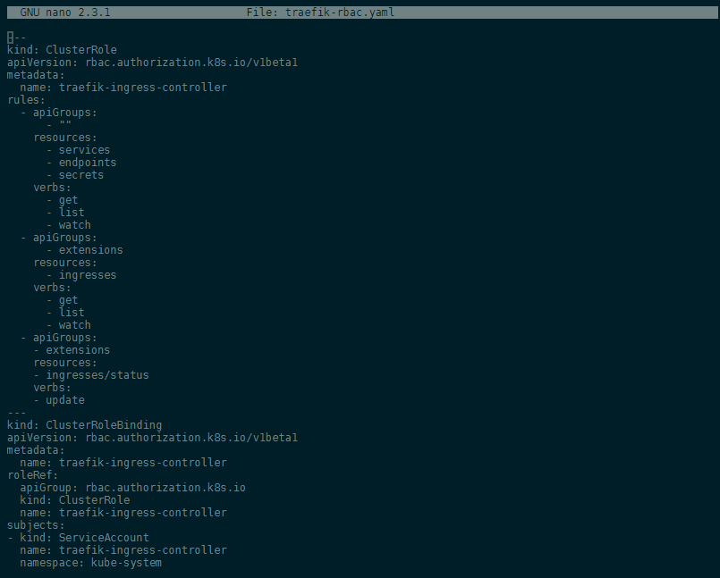
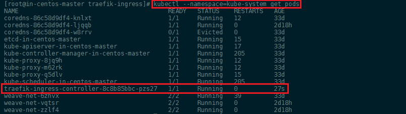
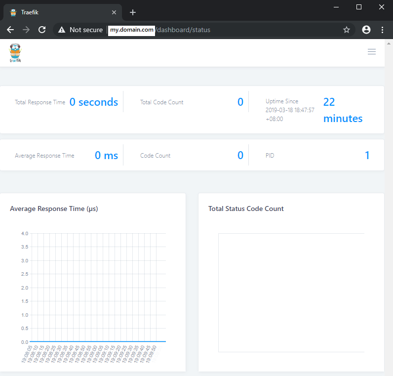
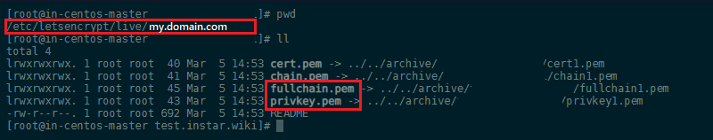

<!-- TOC -->

- [Getting Started with the Traefik Reverse Proxy](#getting-started-with-the-traefik-reverse-proxy)
- [Prerequisites](#prerequisites)
- [Deploy Traefik using a Deployment or DaemonSet](#deploy-traefik-using-a-deployment-or-daemonset)
- [Submitting an Ingress to the Cluster](#submitting-an-ingress-to-the-cluster)
- [Path-based Routing](#path-based-routing)
- [User Authentication](#user-authentication)
  - [Creating the Secret](#creating-the-secret)
- [Add a TLS Certificate to the Ingress](#add-a-tls-certificate-to-the-ingress)
- [Name-based Routing](#name-based-routing)

<!-- /TOC -->


__This article is still WIP - better check out the [NGINX Ingress](/kubernetes-nginx-ingress/) instead...__


Before we explored the [NGINX Ingress](/kubernetes-nginx-ingress/) to route traffic onto Services inside our Kubernetes Cluster. But there are a couple of options that we can choose from here:


* [Nginx](https://github.com/kubernetes/ingress-nginx/blob/master/README.md)
* [Contour](https://github.com/heptio/contour) 
* [HAProxy](https://www.haproxy.com/blog/haproxy_ingress_controller_for_kubernetes/)
  * [Voyager](https://appscode.com/products/voyager/)
* [Traefik](https://docs.traefik.io)


## Getting Started with the Traefik Reverse Proxy
  
[Traefik](https://github.com/containous/traefik) is a modern HTTP reverse proxy and load balancer that makes deploying microservices easy. Traefik integrates with your existing infrastructure components and configures itself automatically and dynamically. Pointing Traefik at your orchestrator - e.g. [Kubernetes](/creating-a-kubernetes-cluster/) should be the only configuration step you need.

Traditional reverse-proxies require that you configure each route that will connect paths and subdomains to each microservice. Traefik listens to your service registry/orchestrator API ([etcd](https://docs.traefik.io/configuration/backends/etcd/) / [Kubernetes](https://docs.traefik.io/configuration/backends/kubernetes/)) and instantly generates the routes so your microservices are connected to the outside world -- without further intervention from your part.


The example configuration files that we are working with are available in the [Traefik Github repository](https://github.com/containous/traefik/tree/v1.7/examples/k8s).


## Prerequisites

Kubernetes introduces [Role Based Access Control (RBAC)](https://kubernetes.io/docs/reference/access-authn-authz/rbac/) in 1.6+ to allow fine-grained control of Kubernetes resources and API.


If your cluster is configured with RBAC, you will need to authorize Traefik to use the Kubernetes API. There are two ways to set up the proper permission: Via __namespace-specific RoleBindings__ or a single, global __ClusterRoleBinding__.


RoleBindings per namespace enable to restrict granted permissions to the very namespaces only that Traefik is watching over, thereby following the least-privileges principle. This is the preferred approach if Traefik is not supposed to watch all namespaces, and the set of namespaces does not change dynamically. Otherwise, a single __ClusterRoleBinding__ must be employed.


But for the sake of simplicity, this guide will use a __ClusterRoleBinding__ with the following [YAML file](https://github.com/containous/traefik/blob/v1.7/examples/k8s/traefik-rbac.yaml):


__traefik-rbac.yaml__

```yaml
---
kind: ClusterRole
apiVersion: rbac.authorization.k8s.io/v1beta1
metadata:
  name: traefik-ingress-controller
rules:
  - apiGroups:
      - ""
    resources:
      - services
      - endpoints
      - secrets
    verbs:
      - get
      - list
      - watch
  - apiGroups:
      - extensions
    resources:
      - ingresses
    verbs:
      - get
      - list
      - watch
  - apiGroups:
    - extensions
    resources:
    - ingresses/status
    verbs:
    - update
---
kind: ClusterRoleBinding
apiVersion: rbac.authorization.k8s.io/v1beta1
metadata:
  name: traefik-ingress-controller
roleRef:
  apiGroup: rbac.authorization.k8s.io
  kind: ClusterRole
  name: traefik-ingress-controller
subjects:
- kind: ServiceAccount
  name: traefik-ingress-controller
  namespace: monitoring
```





Apply the configuration with the following Kubernete command (change the URL to the local path, if you decided to store the file above locally):


```bash
kubectl apply -f https://raw.githubusercontent.com/containous/traefik/v1.7/examples/k8s/traefik-rbac.yaml
```

## Deploy Traefik using a Deployment or DaemonSet

It is possible to use Traefik with a [Deployment](https://kubernetes.io/docs/concepts/workloads/controllers/deployment/) or a [DaemonSet](https://kubernetes.io/docs/concepts/workloads/controllers/daemonset/) object, whereas both options have their own pros and cons:

* The scalability can be much better when using a Deployment, because you will have a Single-Pod-per-Node model when using a DaemonSet, whereas you may need less replicas based on your environment when using a Deployment.
* DaemonSets automatically scale to new nodes, when the nodes join the cluster, whereas Deployment pods are only scheduled on new nodes if required.
* DaemonSets ensure that only one replica of pods run on any single node. Deployments require affinity settings if you want to ensure that two pods don't end up on the same node.
* DaemonSets can be run with the _NET\_BIND\_SERVICE_ capability, which will allow it to bind to port 80/443/etc on each host. This will allow bypassing the kube-proxy, and reduce traffic hops. Note that this is against the Kubernetes [Best Practices Guidelines](https://kubernetes.io/docs/concepts/configuration/overview/#services), and raises the potential for scheduling/scaling issues. Despite potential issues, this remains the choice for most ingress controllers.


I am going to use the Deployment here - but the configuration file for the DemonSet does not look s different and can be [downloaded here](https://github.com/containous/traefik/tree/v1.7/examples/k8s/traefik-ds.yaml).


The Deployment objects looks like this (see below) and can be [downloaded here](https://github.com/containous/traefik/tree/v1.7/examples/k8s/traefik-deployment.yaml):


__traefik-deployment.yaml__

```yaml
---
apiVersion: v1
kind: ServiceAccount
metadata:
  name: traefik-ingress-controller
  namespace: monitoring
  
---
kind: Deployment
apiVersion: extensions/v1beta1
metadata:
  name: traefik-ingress-controller
  namespace: monitoring
  labels:
    k8s-app: traefik-ingress-lb
spec:
  replicas: 1
  selector:
    matchLabels:
      k8s-app: traefik-ingress-lb
  template:
    metadata:
      labels:
        k8s-app: traefik-ingress-lb
        name: traefik-ingress-lb
    spec:
      serviceAccountName: traefik-ingress-controller
      terminationGracePeriodSeconds: 60
      containers:
      - image: traefik
        name: traefik-ingress-lb
        ports:
        - name: http
          containerPort: 80
          hostPort: 8080
        - name: admin
          containerPort: 8080
        args:
        - --api
        - --kubernetes
        - --logLevel=INFO
        - --defaultentrypoints=http
        - --entrypoints=Name:http Address::80
        
---
kind: Service
apiVersion: v1
metadata:
  name: traefik-ingress-service
  namespace: monitoring
spec:
  selector:
    k8s-app: traefik-ingress-lb
  ports:
    - protocol: TCP
      port: 80
      name: http
    - protocol: TCP
      port: 8080
      name: admin
  externalIPs:
    - 172.56.4.112
```


To deploy Traefik to your cluster start by applying the YAML files with kubectl:


```bash
kubectl apply -f https://raw.githubusercontent.com/containous/traefik/v1.7/examples/k8s/traefik-deployment.yaml
```


You can verify that the Ingress pod was started with:


```bash
kubectl --namespace=kube-system get pods
```





## Submitting an Ingress to the Cluster

Lets start by creating a Service and an Ingress that will expose the [Traefik Web UI](https://github.com/containous/traefik#web-ui) (the configuration file can be [downloaded here](https://github.com/containous/traefik/tree/v1.7/examples/k8s/ui.yaml)):


__ui.yaml__

```yaml
---
apiVersion: v1
kind: Service
metadata:
  name: traefik-web-ui
  namespace: monitoring
spec:
  selector:
    k8s-app: traefik-ingress-lb
  ports:
  - name: http
    port: 80
    targetPort: 8080
---
apiVersion: extensions/v1beta1
kind: Ingress
metadata:
  name: traefik-web-ui
  namespace: monitoring
spec:
  rules:
    http:
      paths:
      - path: /
        backend:
          serviceName: traefik-web-ui
          servicePort: http
```


Apply the service to your cluster with:


```bash
kubectl apply -f https://raw.githubusercontent.com/containous/traefik/v1.7/examples/k8s/ui.yaml
```

> This setup assigns a host domain `traefik-ui.minikube` to your cluster ingress you can add an entry in our `/etc/hosts` file to route `traefik-ui.minikube` to our cluster. In production you would want to add your real DNS entries here!


> [As seen before](/kubernetes-nginx-ingress/#creating-the-load-balancing-service), we can add the Kubernetes Master WAN IP address, e.g. `externalIPs: 172.56.4.112`, to the service configuration to be able to access the service over the internet


Adding these two modifications, we end up with a YAML file looking like this:


```yaml
---
---
apiVersion: v1
kind: Service
metadata:
  name: traefik-web-ui
  namespace: monitoring
spec:
  selector:
    k8s-app: traefik-ingress-lb
  ports:
  - name: http
    port: 80
    targetPort: 8080
  externalIPs:
    - 172.56.4.112
---
apiVersion: extensions/v1beta1
kind: Ingress
metadata:
  name: traefik-web-ui
  namespace: monitoring
spec:
  rules:
  - host: traefik-ui.minikube
    http:
      paths:
      - path: /
        backend:
          serviceName: traefik-web-ui
          servicePort: http
```


When you access the URL with your browser, you should now be greeted by the [Traefik Dashboard](https://github.com/containous/traefik#web-ui):





## Path-based Routing

First lets start by launching the pods for three websites. __Note__: I am using 3 Node.js apps, that are more less build the way [described here](/express-generator-dockerrized/) - that means they are Node.js/Express.js servers that host web content on a specific port. In my case those ports are `7777`, `7778` and `7779`. They were uploaded to Dockerhub and can be accessed by referencing `- image: your-docker-hub-account/your-docker-image-name-on-docker-hub`:


__app1.yaml__


```yaml
---
kind: Deployment
apiVersion: extensions/v1beta1
metadata:
  name: wiki-de
  labels:
    app: wiki-frontend
spec:
  replicas: 1
  selector:
    matchLabels:
      app: wiki-frontend
  template:
    metadata:
      labels:
        app: wiki-frontend
        version: v2.1.0
    spec:
      containers:
      - image: mpolinowski/my-docker-image:latest
        imagePullPolicy: Always
        name: wiki-de
        ports:
        - containerPort: 7779
      restartPolicy: Always

---
apiVersion: v1
kind: Service
metadata:
  name: wiki-de
spec:
  ports:
  - name: http
    targetPort: 7779
    port: 7779
  selector:
    app: wiki-frontend
```


__app2.yaml__


```yaml
---
kind: Deployment
apiVersion: extensions/v1beta1
metadata:
  name: wiki-en
  labels:
    app: wiki-frontend
spec:
  replicas: 1
  selector:
    matchLabels:
      app: wiki-frontend
  template:
    metadata:
      labels:
        app: wiki-frontend
        version: v2.1.0
    spec:
      containers:
      - image: mpolinowski/my-docker-image-en:latest
        imagePullPolicy: Always
        name: wiki-en
        ports:
        - containerPort: 7777
      restartPolicy: Always

---
apiVersion: v1
kind: Service
metadata:
  name: wiki-en
spec:
  ports:
  - name: http
    targetPort: 7777
    port: 7777
  selector:
    app: wiki-frontend
```


__app3.yaml__


```yaml
---
kind: Deployment
apiVersion: extensions/v1beta1
metadata:
  name: wiki-fr
  labels:
    app: wiki-frontend
spec:
  replicas: 1
  selector:
    matchLabels:
      app: wiki-frontend
  template:
    metadata:
      labels:
        app: wiki-frontend
        version: v2.1.0
    spec:
      containers:
      - image: mpolinowski/my-docker-image-fr:latest
        imagePullPolicy: Always
        name: wiki-frontend
        ports:
        - containerPort: 7778
      restartPolicy: Always

---
apiVersion: v1
kind: Service
metadata:
  name: wiki-fr
spec:
  ports:
  - name: http
    targetPort: 7778
    port: 7778
  selector:
    app: wiki-frontend
```

Now we can submit an ingress for the 3 web apps:


```yaml
apiVersion: extensions/v1beta1
kind: Ingress
metadata:
  name: wiki-frontend
  annotations:
    kubernetes.io/ingress.class: traefik
    traefik.frontend.rule.type: PathPrefixStrip
spec:
  rules:
  - host: my.domain.com
    http:
      paths:
      - path: /de
        backend:
          serviceName: wiki-de
          servicePort: http
      - path: /en
        backend:
          serviceName: wiki-en
          servicePort: http
      - path: /fr
        backend:
          serviceName: wiki-fr
          servicePort: http
```


## User Authentication

It's possible to protect access to Traefik through basic authentication. See the [Kubernetes Ingress](https://docs.traefik.io/configuration/backends/kubernetes) configuration page for syntactical details and restrictions.


### Creating the Secret

1. Use `htpasswd` to create a file containing the username and the MD5-encoded password (on Centos you might have to install it first `yum install -y httpd-tools`). You will be prompted for a password which you will have to enter twice:


```bash
htpasswd -c ./auth myusername
```


2. Now use `kubectl` to create a secret in the `monitoring` namespace using the file created by `htpasswd`:


```bash
kubectl create namespace monitoring
kubectl create secret generic mysecret --from-file auth --namespace=monitoring
```

You have to swap the __kube-system__ with the __monitoring__ namespace in the config files (see below)

3. Attach the following annotations to the Ingress object:

* `traefik.ingress.kubernetes.io/auth-type: "basic"`
* `traefik.ingress.kubernetes.io/auth-secret: "mysecret"`

They specify basic authentication and reference the Secret `mysecret` containing the credentials.

__HOW DO YOU CONFIGURE THE THE BASIC AUTHENTICATION? WIP__


## Add a TLS Certificate to the Ingress

To setup an HTTPS-protected ingress, you can leverage the TLS feature of the ingress resource:


```yaml
apiVersion: extensions/v1beta1
kind: Ingress
metadata:
  name: traefik-web-ui
  namespace: monitoring
  annotations:
    traefik.ingress.kubernetes.io/auth-type: "basic"
    traefik.ingress.kubernetes.io/auth-secret: "mysecret"
spec:
  rules:
  - host: my.domain.com
    http:
      paths:
      - path: /
        backend:
          serviceName: traefik-web-ui
          servicePort: https
  tls:
   - secretName: traefik-ui-tls-cert
```


We now need to provide the TLS certificate via a Kubernetes secret in the same namespace as the ingress. The following two commands will generate a new certificate and create a secret containing the key and cert files:


```bash
openssl req -x509 -nodes -days 365 -newkey rsa:2048 -keyout tls.key -out tls.crt -subj "/CN=traefik-ui.minikube"
kubectl -n kube-system create secret tls traefik-ui-tls-cert --key=tls.key --cert=tls.crt
```

Since I am already using fully qualified Domain - and I have used [Certbot](https://certbot.eff.org/lets-encrypt/centosrhel7-other) to generate an TLS certificate - I can use those files for my domain inside the ingress. 


__Note__: that the certificate that you generated with Certbot can be found in `/etc/letsencrypt/live/my.domain.com` - where _my.domain.com_ is the domain you created the certificate for. Furthermore, Certbot generates a couple of _*.pem_ files instead of a _*.key_ and _*.crt_. In the kubectl command above use `privkey.pem` as the __key__ file and `fullchain.pem` as your __crt__ file (see [Stackoverflow](https://stackoverflow.com/questions/50389883/generate-crt-key-ssl-files-from-lets-encrypt-from-scratch) for details):





The resulting command will look something like this:


```bash
kubectl -n kube-system create secret tls traefik-ui-tls-cert --key=/etc/letsencrypt/live/my.domain.com/privkey.pem --cert=/etc/letsencrypt/live/my.domain.com/fullchain.pem
```

You receive a reply `secret/traefik-ui-tls-cert created`!

<!-- 
kubectl -n kube-system create secret tls traefik-ui-tls-cert --key=/etc/letsencrypt/live/my.domain.com/privkey.pem --cert=/etc/letsencrypt/live/my.domain.com/fullchain.pem
-->

__HOW DO YOU CONFIGURE THE SERVICE FOR HTTPS? WIP__


You can add a TLS entrypoint by adding the following args to the container spec:


```yaml
--defaultentrypoints=http,https
--entrypoints=Name:https Address::443 TLS
--entrypoints=Name:http Address::80
```


__traefik-deployment.yaml__

```yaml
---
apiVersion: v1
kind: ServiceAccount
metadata:
  name: traefik-ingress-controller
  namespace: monitoring
  annotations:
    traefik.ingress.kubernetes.io/auth-type: "basic"
    traefik.ingress.kubernetes.io/auth-secret: "mysecret"
  
---
kind: Deployment
apiVersion: extensions/v1beta1
metadata:
  name: traefik-ingress-controller
  namespace: monitoring
  annotations:
    traefik.ingress.kubernetes.io/auth-type: "basic"
    traefik.ingress.kubernetes.io/auth-secret: "mysecret"
  labels:
    k8s-app: traefik-ingress-lb
spec:
  replicas: 1
  selector:
    matchLabels:
      k8s-app: traefik-ingress-lb
  template:
    metadata:
      labels:
        k8s-app: traefik-ingress-lb
        name: traefik-ingress-lb
    spec:
      serviceAccountName: traefik-ingress-controller
      terminationGracePeriodSeconds: 60
      containers:
      - image: traefik
        name: traefik-ingress-lb
        ports:
        - name: http
          containerPort: 80
          hostPort: 8080
        - name: https
          containerPort: 443
          hostPort: 443
        - name: admin
          containerPort: 8080
        args:
        - --api
        - --kubernetes
        - --logLevel=INFO
        - --defaultentrypoints=https,http
        - --entrypoints=Name:https Address::443 TLS
        - --entrypoints=Name:http Address::80
        
---
kind: Service
apiVersion: v1
metadata:
  name: traefik-ingress-service
  namespace: monitoring
  annotations:
    traefik.ingress.kubernetes.io/auth-type: "basic"
    traefik.ingress.kubernetes.io/auth-secret: "mysecret"
spec:
  selector:
    k8s-app: traefik-ingress-lb
  ports:
    - protocol: TCP
      port: 80
      name: http
    - protocol: TCP
      port: 443
      name: https
    - protocol: TCP
      port: 8080
      name: admin
  type: NodePort
```


__ui.yaml__

```yaml
---
apiVersion: v1
kind: Service
metadata:
  name: traefik-web-ui
  namespace: monitoring
  annotations:
    traefik.ingress.kubernetes.io/auth-type: "basic"
    traefik.ingress.kubernetes.io/auth-secret: "mysecret"
spec:
  selector:
    k8s-app: traefik-ingress-lb
  ports:
  - name: http
    port: 80
    targetPort: 8080
  - name: https
    protocol: TCP
    port: 443
    targetPort: 443
  externalIPs:
    - 172.56.4.112
---
apiVersion: extensions/v1beta1
kind: Ingress
metadata:
  name: traefik-web-ui
  namespace: monitoring
  annotations:
    traefik.ingress.kubernetes.io/auth-type: "basic"
    traefik.ingress.kubernetes.io/auth-secret: "mysecret"
spec:
  rules:
  - host: my.domain.com
    http:
      paths:
      - path: /
        backend:
          serviceName: traefik-web-ui
          servicePort: https
  tls:
   - secretName: traefik-ui-tls-cert
```


## Name-based Routing


