<!-- TOC -->

- [Creating the Ingress Controller](#creating-the-ingress-controller)
- [Creating the Ingress](#creating-the-ingress)
- [Setting up Cert-Manager](#setting-up-cert-manager)
  - [Installing via Helm](#installing-via-helm)
  - [Manual Installation](#manual-installation)
  - [Verifying the installation](#verifying-the-installation)
- [Setting up ACME Test Issuers](#setting-up-acme-test-issuers)
  - [Creating Certificate Resources](#creating-certificate-resources)
  - [Updating the Ingress](#updating-the-ingress)
  - [Testing the TLS Access](#testing-the-tls-access)
  - [Going into Production](#going-into-production)

<!-- /TOC -->


The goal of this adventure is to add an [NGINX Ingress](https://github.com/kubernetes/ingress-nginx) to our Kubernetes cluster that routes HTTPS traffic to cluster internal services. I want to use [cert-manager](https://github.com/jetstack/cert-manager) to provision and manage TLS certificates for encrypting HTTP traffic to the Ingress.


I already have several apps and services running - all I need now is an Ingress that allows me to assign a domain name and TLS certificate to them and start routing traffic.


## Creating the Ingress Controller

To create these mandatory resources, use `kubectl apply` and the `-f` flag to specify the manifest file hosted on GitHub (or download it and apply it locally - `kubectl apply -f nginx-ingress-mandatory.yaml`):


```bash
kubectl apply -f https://raw.githubusercontent.com/kubernetes/ingress-nginx/master/deploy/mandatory.yaml
```


We use apply instead of create here so that in the future we can incrementally apply changes to the Ingress Controller objects instead of completely overwriting them. 


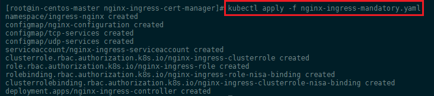


Since I am not using a Cloud provider like AWS, GCE or Azure I cannot rely on an external load-balancer to spin on once I provide a service for my Ingress. Instead, I am going to add my __WAN IP address__ - e.g. `172.111.3.1` - of the Master server to expose my Cluster through it directly. Also I am planing to use the same namespace for the ingress and all pods/services that are going to be served by it - `my-apps`. Create the following file `nano  nginx-ingress-service.yaml`


__nginx-ingress-service.yaml__

```yaml
apiVersion: v1
kind: Service
metadata:
  name: ingress-nginx
  namespace: default
  labels:
    app.kubernetes.io/name: ingress-nginx
    app.kubernetes.io/part-of: ingress-nginx
spec:
  type: NodePort
  ports:
    - name: http
      port: 80
      targetPort: 80
      protocol: TCP
    - name: https
      port: 443
      targetPort: 443
      protocol: TCP
  selector:
    app.kubernetes.io/name: ingress-nginx
    app.kubernetes.io/part-of: ingress-nginx
  externalIPs:
    - 172.111.3.1
---
```


I can apply the service with `kubectl apply -f nginx-ingress-service.yaml`:


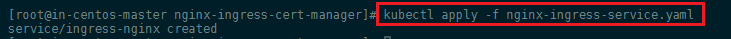


We can check that the service was created and the external IP assigned with the following command `kubectl get service ingress-nginx -n my-apps`:


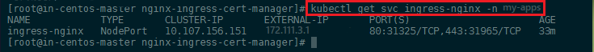


We now created an endpoint that can receive traffic over HTTP and HTTPS ports 80 and 443, and forwards it to the Ingress Controller Pod. The Ingress Controller will then route the traffic to the appropriate backend Service. We can now point our DNS records at this WAN IP address of our cluster and create the Ingress to implement routing rules.


## Creating the Ingress

Now we can create the Ingress to route traffic directed at two domains to a corresponding backend service. I'll create a rule to route traffic directed at my.domain.com to the my-app1 backend service. Those two apps can be set up according to a [previous Tutorial](/kubernetes-nginx-ingress/#create-two-web-apps-to-respond-to-the-incoming-traffic) - if you don't have anyhting running on your cluster yet.

The Ingress configuration for this looks like this:


__nginx-ingress.yaml__

```yaml
apiVersion: extensions/v1beta1
kind: Ingress
metadata:
  name: nginx-ingress
  namespace: default
  annotations:
    kubernetes.io/ingress.class: nginx
    nginx.ingress.kubernetes.io/app-root: "/"
spec:
  rules:
  - host: my.domain.com
    http:
      paths:
      - backend:
          serviceName: my-app1
          servicePort: 80
        path: /
```


An HTTP request Host header specifies the domain name of the target server. Requests with host my.domain.com will be directed to the my-app1 backend. Note that it is very likely that your service doesn't use the port 80 - e.g. you have a container that hosts a website on port 3000 and a service that exposes it - just add the port here as `servicePort` and your website will be exposed by the Ingress on port 80 (http).


Apply the ingress with `kubectl apply -f nginx-ingress.yaml` and check if it was created with `kubectl get ingress -n my-apps`.


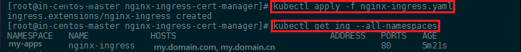


To verify that the Ingress is working, open the page URLs inside your browser or run a curl command on your server:

```bash
curl my.domain.com
```


## Setting up Cert-Manager

I want to try using [Helm](https://helm.sh) to install [cert-manager](https://docs.cert-manager.io/en/venafi/tutorials/quick-start/index.html) into the Kubernetes cluster. cert-manager is a Kubernetes service that provisions TLS certificates from [Let's Encrypt](https://letsencrypt.org/) and other certificate authorities and manages their lifecycles.


### Installing via Helm

> __Note__: I ran into a lot of difficulties using this setup and I could not find the error. [Troubleshooting](https://docs.cert-manager.io/en/latest/getting-started/troubleshooting.html) led me back to the [Installation Page](https://docs.cert-manager.io/en/latest/getting-started/install.html) - so I ended up abandoning Helm and did the [manual installation](#manual-installation). If you are an Helm expert and spot my error - please let me know. My assumption is that it might be namespace related as I tried to move everything into a custom namespace instead of going with the default `cert-manager` ? I will opt for all-default with the manual installation.


Before using Helm to install cert-manager into our cluster, we need to create the cert-manager [Custom Resource Definitions (CRDs)](https://kubernetes.io/docs/concepts/extend-kubernetes/api-extension/custom-resources/). Create these by applying them directly from the cert-manager [GitHub repository](https://github.com/jetstack/cert-manager/):


```bash
kubectl apply -f https://raw.githubusercontent.com/jetstack/cert-manager/release-0.7/deploy/manifests/00-crds.yaml
```


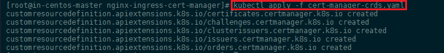


In order to provide advanced resource validation, cert-manager includes a `ValidatingWebhookConfiguration` which is deployed into the cluster as its own pod:


```bash
kubectl label namespace kube-system certmanager.k8s.io/disable-validation="true"
```


Helm now has an installer script that will automatically grab the latest version of the Helm client and [install it locally](https://raw.githubusercontent.com/helm/helm/master/scripts/get). You can fetch that script, and then execute it locally:


```bash
curl https://raw.githubusercontent.com/helm/helm/master/scripts/get > get_helm.sh
chmod 700 get_helm.sh
./get_helm.sh
```


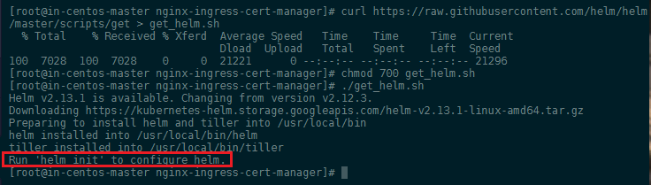


__INSTALLING TILLER__

Tiller, the server portion of Helm, typically runs inside of your Kubernetes cluster. But for development, it can also be run locally, and configured to talk to a remote Kubernetes cluster.

The easiest way to install __tiller__ into the cluster is simply to run `helm init`. This will validate that helm’s local environment is set up correctly (and set it up if necessary). Then it will connect to whatever cluster kubectl connects to by default `kubectl config view`. Once it connects, it will install tiller into the `kube-system` namespace.

After `helm init`, you should be able to run `kubectl get pods --namespace kube-system` and see Tiller running:


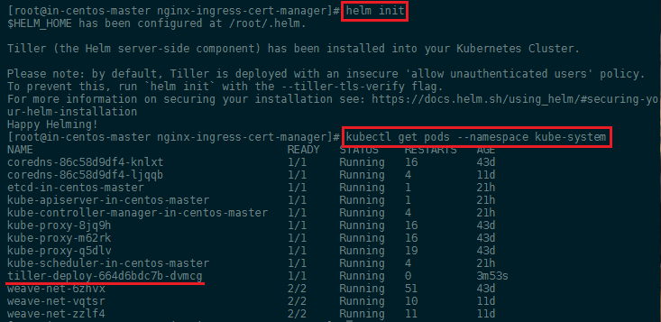


Finally, we can install the [cert-manager Helm chart](https://github.com/helm/charts/tree/master/stable/cert-manager) into the `kube-system` namespace:


```bash
helm install --name cert-manager --namespace kube-system stable/cert-manager
```

__Note__ : if you get the following __ERROR__:

```bash
Error: release cert-manager failed: namespaces "kube-system" is forbidden: User "system:serviceaccount:kube-system:default" cannot get resource "namespaces" in API group "" in the namespace "kube-system"
```

Run the following command (see [Github Issue](https://github.com/fnproject/fn-helm/issues/21)) and rerun the `helm install`:


```bash
kubectl patch deploy --namespace kube-system tiller-deploy -p '{"spec":{"template":{"spec":{"serviceAccount":"tiller"}}}}'
```


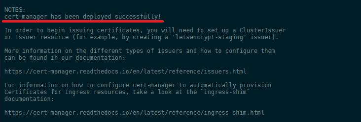


This indicates that the cert-manager installation succeeded.


### Manual Installation

It is deployed using regular YAML manifests, like any other applications on Kubernetes.


In order to install cert-manager, we must first create a namespace to run it within. This guide will install cert-manager into the cert-manager namespace. It is possible to run `cert-manager` in a different namespace, although you will need to make modifications to the deployment manifests.


```bash
kubectl create namespace cert-manager
```

As part of the installation, cert-manager also deploys a __ValidatingWebhookConfiguration__ resource in order to validate that the Issuer, ClusterIssuer and Certificate resources we will create after installation are valid.


In order to deploy the __ValidatingWebhookConfiguration__, cert-manager creates a number of internal Issuer and Certificate resources in its own namespace. This creates a chicken-and-egg problem, where cert-manager requires the webhook in order to create the resources, and the webhook requires cert-manager in order to run. This problem is avoided by disabling resource validation on the namespace that cert-manager runs in:


```bash
kubectl label namespace cert-manager certmanager.k8s.io/disable-validation=true
```

We can now go ahead and install cert-manager. All resources (the CustomResourceDefinitions, cert-manager, and the webhook component) are included in a single YAML manifest file:


```
kubectl apply -f https://raw.githubusercontent.com/jetstack/cert-manager/release-0.7/deploy/manifests/cert-manager.yaml
```


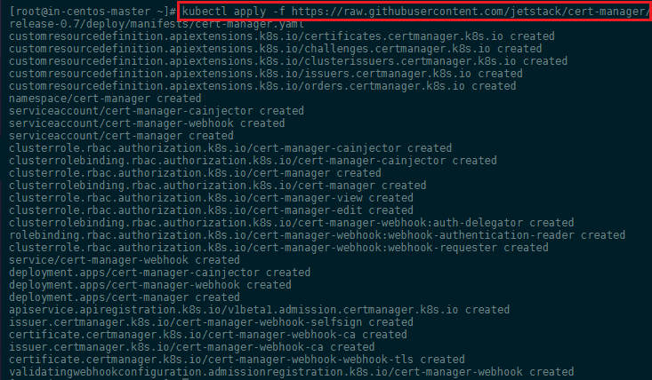


### Verifying the installation


Once you’ve installed cert-manager, you can verify it is deployed correctly by checking the `cert-manager` namespace for running pods:


```bash
kubectl get pods --namespace cert-manager
```


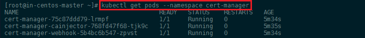


You should see both the cert-manager and webhook component in a Running state, and the ca-sync pod is Completed. If the webhook has not Completed but the cert-manager pod has recently started, wait a few minutes for the ca-sync pod to be retried. If you experience problems, please check the [troubleshooting guide](https://docs.cert-manager.io/en/latest/getting-started/troubleshooting.html).


The following steps will confirm that cert-manager is set up correctly and able to issue basic certificate types:


```bash
# Create a ClusterIssuer to test the webhook works okay
cat <<EOF > test-resources.yaml
apiVersion: v1
kind: Namespace
metadata:
  name: cert-manager-test
---
apiVersion: certmanager.k8s.io/v1alpha1
kind: Issuer
metadata:
  name: test-selfsigned
  namespace: cert-manager-test
spec:
  selfSigned: {}
---
apiVersion: certmanager.k8s.io/v1alpha1
kind: Certificate
metadata:
  name: selfsigned-cert
  namespace: cert-manager-test
spec:
  commonName: example.com
  secretName: selfsigned-cert-tls
  issuerRef:
    name: test-selfsigned
EOF

# Create the test resources
kubectl apply -f test-resources.yaml

# Check the status of the newly created certificate
# You may need to wait a few seconds before cert-manager processes the
# certificate request
kubectl describe certificate -n cert-manager-test
...
Name:         selfsigned-cert
Namespace:    cert-manager-test
Labels:       <none>
Annotations:  kubectl.kubernetes.io/last-applied-configuration:
                {"apiVersion":"certmanager.k8s.io/v1alpha1","kind":"Certificate","metadata":{"annotations":{},"name":"selfsigned-cert","namespace":"cert-m...
API Version:  certmanager.k8s.io/v1alpha1
Kind:         Certificate
Metadata:
  Creation Timestamp:  2019-03-29T08:52:04Z
  Generation:          3
  Resource Version:    5871553
  Self Link:           /apis/certmanager.k8s.io/v1alpha1/namespaces/cert-manager-test/certificates/selfsigned-cert
  UID:                 ed15e107-51ff-11e9-b7a0-960000184ec8
Spec:
  Common Name:  example.com
  Issuer Ref:
    Name:       test-selfsigned
  Secret Name:  selfsigned-cert-tls
Status:
  Conditions:
    Last Transition Time:  2019-03-29T08:52:05Z
    Message:               Certificate is up to date and has not expired
    Reason:                Ready
    Status:                True
    Type:                  Ready
  Not After:               2019-06-27T08:52:05Z
Events:
  Type    Reason      Age   From          Message
  ----    ------      ----  ----          -------
  Normal  CertIssued  31s   cert-manager  Certificate issued successfully

# Clean up the test resources
kubectl delete -f test-resources.yaml
```

If all the above steps have completed without error, you are good to go!


## Setting up ACME Test Issuers

When you create a new ACME Issuer, cert-manager will generate a private key which is used to identify you with the ACME server. To set up a basic ACME issuer, you should create a new Issuer (bound to a namespace) or ClusterIssuer (can be referenced over all namespaces) resource. In this example, we will create a non-namespaced ClusterIssuer resource for the [Let’s Encrypt staging endpoint](https://letsencrypt.org/docs/staging-environment/) that has only the [HTTP01 Challenge Provider](https://docs.cert-manager.io/en/latest/tasks/acme/configuring-http01.html) enabled.


You should read the guides linked at the bottom of this page to learn more about the ACME challenge validation mechanisms that cert-manager supports and how to configure the various DNS01 provider implementations.


Let's create a test Issuer to make sure the certificate provisioning mechanism is functioning correctly. Open a file named staging_issuer.yaml in your favorite text editor no cert-staging_issuer.yaml`:


__cert-staging_issuer.yaml__

```yaml
apiVersion: certmanager.k8s.io/v1alpha1
kind: ClusterIssuer
metadata:
 name: letsencrypt-staging
spec:
 acme:
   # The ACME server URL
   server: https://acme-staging-v02.api.letsencrypt.org/directory
   # Email address used for ACME registration
   email: your_email_address_here
   # Name of a secret used to store the ACME account private key
   privateKeySecretRef:
     name: letsencrypt-staging-secret
   # Enable the HTTP-01 challenge provider
   http01: {}
```


Here we specify that we'd like to create a `ClusterIssuer` object called `letsencrypt-staging`, and use the Let's Encrypt staging server. We'll later use the production server to roll out our certificates. We then specify an email address to register the certificate, and create a Kubernetes Secret called `letsencrypt-staging-secret` to store the ACME account's private key. We also enable the __HTTP-01 challenge mechanism__. To learn more about these parameters, consult the [official cert-manager documentation](https://cert-manager.readthedocs.io/en/latest/reference/issuers.html). Go on and create the Issuer:


```bash
kubectl apply -f cert-staging-issuer.yaml
```


To verify that the account has been registered successfully, you can run `kubectl describe` and check the `Ready` condition:


```bash
kubectl describe clusterissuer letsencrypt-staging
```


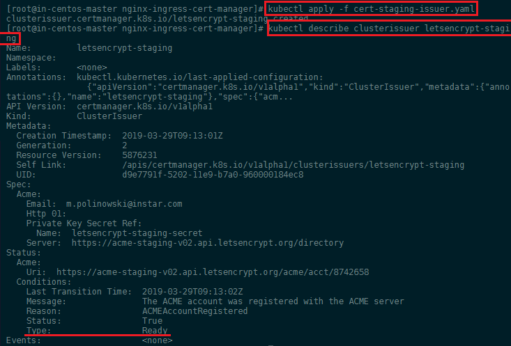


### Creating Certificate Resources

The [Certificate resource](https://docs.cert-manager.io/en/latest/tasks/acme/issuing-certificates.html) type is used to request certificates from different Issuers. A Certificate resource specifies fields that are used to generated certificate signing requests which are then fulfilled by the issuer type you have referenced.


Certificates specify which issuer they want to obtain the certificate from by specifying the `certificate.spec.issuerRef` field. A basic Certificate resource, for the example.com and www.example.com DNS names. We must configure our Certificate resource with the `ingress class` that will be used to solve the __ACME HTTP01__ challenges:


__cert-staging.yaml__

```yaml
apiVersion: certmanager.k8s.io/v1alpha1
kind: Certificate
metadata:
  name: my-domain-com
  namespace: default
spec:
  secretName: my-domain-com-tls
  commonName: my.domain.com
  dnsNames:
  - my.domain.com
  - www.my.domain.com
  issuerRef:
    name: letsencrypt-staging
    # We can reference ClusterIssuers by changing the kind here.
    # The default value is Issuer (i.e. a locally namespaced Issuer)
    kind: ClusterIssuer
  acme:
    config:
    - http01:
        ingressClass: nginx
      domains:
      - my.domain.com
      - www.my.domain.com
```


The signed certificate will be stored in a Secret resource named `my-domain-com-tls` once the issuer has successfully issued the requested certificate. The Certificate will be issued using the __ClusterIssuer__ named `letsencrypt-staging` in the `default` namespace (the same namespace as the Certificate resource).


### Updating the Ingress

We can now modify our Ingress and enable TLS encryption for the my.domain.com path - `nano nginx-ingress.yaml`:


__nginx-ingress.yaml__

```yaml
apiVersion: extensions/v1beta1
kind: Ingress
metadata:
  name: nginx-ingress
  namespace: default
  annotations:
    kubernetes.io/ingress.class: nginx
    certmanager.k8s.io/cluster-issuer: letsencrypt-staging
    nginx.ingress.kubernetes.io/app-root: /
spec:
  tls:
  - hosts:
    - my.domain.com
    secretName: my-domain-com-tls
  rules:
  - host: my.domain.com
    http:
      paths:
      - backend:
          serviceName: my-app1
          servicePort: 80
```


Here we add the annotations to specify an `ingress.class`, which determines the Ingress Controller. In addition, we define the cluster-issuer to be `letsencrypt-staging`. Finally, we add a tls block to specify the hosts for which we want to acquire certificates, and specify a secretName. This secret will contain the TLS private key and issued certificate. Apply your edits with `kubectl apply -f nginx-ingress.yaml`.


### Testing the TLS Access


Run `kubectl describe ingress -n default` to see that the certificate has been successfully created:


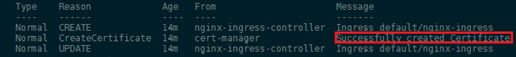


Once the certificate has been successfully created, you can run an additional `kubectl describe certificate -n default` on it to further confirm its successful creation. You should see the following output in the Events section:


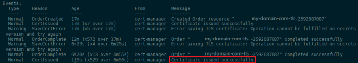


I am seeing some error messages that the TLS certificate could not be saved after the order comes through. But the problem seems to goes away and the certificate is successfully issued. The same happens again when I restart the service - I am not sure right now if this is a bigger problem.


We're now ready to send a request to our backend server to test that HTTPS is functioning correctly. Run the following __wget command__ to send a request to _my.domain.com_:


```bash
wget --save-headers -O- my.domain.com
```

You should see the following output:


```bash
wget --save-headers -O- my.domain.com
--2019-03-28 11:26:30--  http://my.domain.com
Resolving my.domain.com (my.domain.com)... 172.111.3.1
Connecting to my.domain.com (my.domain.com)|172.111.3.1|:80... connected.
HTTP request sent, awaiting response... 308 Permanent Redirect
2019-03-28 11:26:30 ERROR 308: Permanent Redirect.
```

Accessing our backend over __http / port 80__ no longer works - the ingress now tries to redirect us to use __https / port 443__.


```bash
wget --save-headers -O- https://my.domain.com
```


We can prefix the request with https to see the response header for an TLS encrypted request:


```bash
--2019-03-29 11:27:00--  https://my.domain.com/
Resolving my.domain.com (my.domain.com)... 172.111.3.1
Connecting to my.domain.com (my.domain.com)|172.111.3.1|:443... connected.
ERROR: cannot verify my.domain.com's certificate, issued by ‘/CN=Fake LE Intermediate X1’:
  Unable to locally verify the issuer's authority.
To connect to my.domain.com insecurely, use `--no-check-certificate'.
```

This indicates that HTTPS has successfully been enabled, but the certificate cannot be verified as it's a fake temporary certificate issued by the Let's Encrypt staging server. Now that we've tested that everything works using this temporary fake certificate, we can roll out production certificates for the host `my.domain.com`.


__Note__: As mentioned earlier, I tried to install cert manager using Helm - and at this point I saw the first Problem that the installation wasn't working. Instead of the `Intermediate X1` certificate, I was seeing the default __Kubernetes Ingress Controller Fake Certificate__ - telling me that the whole thing wasn't working:


```bash
wget --save-headers -O- https://my.domain.com
--2019-03-28 11:26:41--  https://my.domain.com
Resolving my.domain.com (my.domain.com)... 172.111.3.1
Connecting to my.domain.com (my.domain.com)|172.111.3.1|:443... connected.
ERROR: cannot verify my.domain.com's certificate, issued by ‘/O=Acme Co/CN=Kubernetes Ingress Controller Fake Certificate’:
  Unable to locally verify the issuer's authority.
ERROR: no certificate subject alternative name matches
        requested host name ‘my.domain.com’.
To connect to my.domain.com insecurely, use `--no-check-certificate'.
```


### Going into Production

In this step we’ll modify the procedure used to provision staging certificates, and generate a valid, verifiable production certificate for our Ingress hosts.

To begin, we'll first create a production certificate ClusterIssuer `nano cert-production-issuer.yaml`:


__cert-production-issuer.yaml__

```yaml
apiVersion: certmanager.k8s.io/v1alpha1
kind: ClusterIssuer
metadata:
  name: letsencrypt-production
spec:
  acme:
    # The ACME server URL
    server: https://acme-v02.api.letsencrypt.org/directory
    # Email address used for ACME registration
    email: your_email_address_here
    # Name of a secret used to store the ACME account private key
    privateKeySecretRef:
      name: letsencrypt-production-secret
    # Enable the HTTP-01 challenge provider
    http01: {}
```

We are changing the server address to receive an production ready certificate and store it inside the secret `letsencrypt-production`. To make use of our new production issuer we now have to edit our Ingress and add both the new issuer and the secret - `nano nginx-ingress.yaml`:


__nginx-ingress.yaml__

```yaml
apiVersion: extensions/v1beta1
kind: Ingress
metadata:
  name: nginx-ingress
  namespace: default
  annotations:
    kubernetes.io/ingress.class: nginx
    certmanager.k8s.io/cluster-issuer: letsencrypt-production
spec:
  tls:
  - hosts:
    - my.domain.com
    secretName: my-domain-com-tls
  rules:
  - host: my.domain.com
    http:
      paths:
      - backend:
          serviceName: my-app1
          servicePort: 80
```


> Because I already used my domain for the staging environment, I am first going to delete the prior certificate resource `kubectl delete -f cert-staging.yaml` and then apply the following production cert definition `kubectl apply -f cert-production.yaml.yaml`:


__cert-production.yaml__

```yaml
apiVersion: certmanager.k8s.io/v1alpha1
kind: Certificate
metadata:
  name: my-domain-com
  namespace: default
spec:
  secretName: my-domain-com-tls
  commonName: my.domain.com
  dnsNames:
  - my.domain.com
  - www.my.domain.com
  issuerRef:
    name: letsencrypt-production
    # We can reference ClusterIssuers by changing the kind here.
    # The default value is Issuer (i.e. a locally namespaced Issuer)
    kind: ClusterIssuer
  acme:
    config:
    - http01:
        ingressClass: nginx
      domains:
      - my.domain.com
      - www.my.domain.com
```


Then apply both changes with `kubectl apply -f cert-production-issuer.yaml` and `kubectl apply -f nginx-ingress.yaml`. We can re-test the access and see if we now receive a valid certificate from our server:


```bash
wget --save-headers -O- https://my.domain.com
```


And you should now see the expected response from your application that you bound to the Ingress (the exact output here will vary accordingly):


```bash
--2019-03-29 12:09:28--  https://my.domain.com/en
Resolving my.domain.com (my.domain.com)... 172.111.3.1
Connecting to my.domain.com (my.domain.com)|172.111.3.1|:443... connected.
HTTP request sent, awaiting response... 301 Moved Permanently
Location: /en/ [following]
--2019-03-29 12:09:28--  https://my.domain.com/en/
Reusing existing connection to my.domain.com:443.
HTTP request sent, awaiting response... 200 OK
Length: 170474 (166K) [text/html]
Saving to: ‘STDOUT’
HTTP/1.1 200 OK
Server: nginx/1.15.9
Date: Fri, 29 Mar 2019 11:09:28 GMT
Content-Type: text/html; charset=UTF-8
Content-Length: 170474
Connection: keep-alive
Vary: Accept-Encoding
X-DNS-Prefetch-Control: off
X-Frame-Options: SAMEORIGIN
Strict-Transport-Security: max-age=15724800; includeSubDomains
X-Download-Options: noopen
X-Content-Type-Options: nosniff
X-XSS-Protection: 1; mode=block
Accept-Ranges: bytes
Cache-Control: public, max-age=0
Last-Modified: Tue, 26 Mar 2019 08:55:34 GMT
ETag: W/"299ea-169b9363f70"
Vary: Accept-Encoding
```